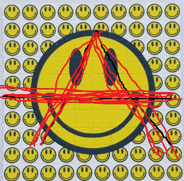

## 3.	 The twins will be happy on their birthday when they receive your present!

Click to reveal answer

3.
**will be, receive**
The first verb, will be, links a state of being — happy — to the twins. The second is an action verb, receive.

.

### happy = adjective

## 6.	 The screaming figure at the left of the painting represents a mother’s grief.

Click to reveal answer

 6.
**represents**
Although screaming and painting refer to actions, screaming functions as a description and painting as an object (a thing) in this sentence. The only verb in this sentence is **represents**.

Screaming 😱 = description

.

Painting 🖼️ = Object 

- 

## 7.	 Glenn has always carried the sizzling pizza in a special, heat-proof box.

Click to reveal answer

7.
**has carried**
The action in this sentence is expressed by two words, has carried, which together make one verb. The word sizzling resembles a verb but serves as a description, not the action in the sentence. Are you surprised that always isn’t included in the verb? It’s an adverb, telling when the action happens.

-------

auxiliary verb "**has**" and the past participle "**carried**." The main verb is "carried," which shows the action being performed.

- 

## 8.	 The puppies, along with the kittens, were displayed in the shop window for all to see.

Click to reveal answer

8.
**were displayed**
What happened to the puppies? They were displayed, the action verb in this sentence. Did "to see" trip you up? That’s an infinitive, the “head” of the verb family that never functions as the verb in a sentence.

TO = infinitive 

- 