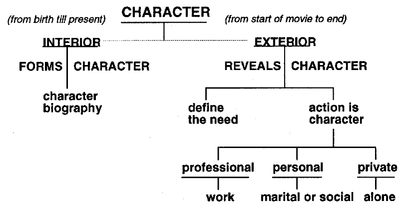

Create a goal for the character and have the story unfold to make the hero deal with their deep weakness.
If you do that the plot comes from the deep source of the character.
Character Motivation and Action.
Intention and Motivation
We want them to succeed but there has to be a struggle

And put them in situations where they have to make a choice

TD example: Marty’s anger causes him to kill the killer and thus all the information he had, which could have lead them to the real killer.
This satisfies the need for plot, without betraying the character.
This ability to disguise plot progression as organic development of a character's motivations really is the mark of a great writer and a great story.

Dramatic situations 
https://en.m.wikipedia.org/wiki/The_Thirty-Six_Dramatic_Situations 

“Film is a visual medium. You must find ways to reveal your 
character's conflicts visually. You cannot reveal what you don't know”

Who is your main character? 

Who is your story about?

Phrase your creative questions to begin with the word what, not why. What implies a specific response; if you ask yourself a question beginning with the word why, you can get many different answers, and they may all be correct. So try to phrase any questions using the word what: What causes my character to react in this manner?

What is the purpose of this scene? It may take a while to phrase the question, and the answer may not appear as soon as you would like it to, but trust the process; it's bigger than you are. That's why I call writing a character biography creative research.

character
Chinatown writer: what are the characters afraid of?

# INTERIOR
(birth up until the time your story begins)

Gender:

Age:

Residency:

Place of birth:

Siblings / only child: 

# Emotional Life
(forms character) 

What kind of childhood did he have? Happy? Sad?

Physically or medically challenging? 

What was his relationship to his parents? 

Did he get into a lot of trouble as a kid? 

Was he mischievous? 

What kind of a child was he? 

Outgoing, an extrovert; or studious, an introvert?

Pursue his/her life through the first ten years; include his/her preschool and school years, relationships with friends and family and teachers. 

Did a single parent raise your character? 

Mother or father? 

Aunt or uncle? 

How did they get along? 

Is your character streetwise or sheltered? 

What kind of jobs did the parent(s) have to make ends meet? 

Move into the second ten years of your character's life, ages ten to twenty. 

That means middle and high school. 

What kind of influences did your character have while growing up? 

Friends? 

What kind of interests? School, athletics, social, political? 

Did your character take an interest in extracurricular or after-school activities, like a debating club? 

What about sexual experiences? 

Relationships with peers? 

Did your character have to work part-time during high school? 

What about any sibling relationships? 

Any envy or hostility present? 

What about relationships with teachers? 

What kind of relationship did your character have with his/her parents during these years? 

Did any major traumatic event happen that may have emotionally influenced your character? 

In high school, what kind of experience did he/she have? 

Did he/she have many friends or just a few friends? 

Did he/she feel like an outsider?

### Move into the college years. 

Did your character go to college, or even consider college? 

What college or university did he or she go to? 

What was his or her major? 

Was your character active politically? 

Did he or she join clubs or student body organizations? 

Did your character have a significant relationship while in college? 

What happened in this relationship? 

How long were they together? Did they get married? 

When the story begins, is your character married, widowed, single, separated, or divorced?

If married, for how long and to whom?

# EXTERIOR
(Film beginning to film conclusion) 

 separate your characters' lives into three basic components—their **professional life**, their **personal life**, and their **private life**

(see table below)

Physical life 
(reveals character)

| Define the need | Action is character | 
| :----: | :---: |
|     |     | 
|        |    | 
|       |       | 

Space

|  🏢 Professional life     |    🏠 Personal life   | 📺 Private life |
| :----: | :---: |:---: |

# 🏢 Professional life

What does your main character do for a living?

Where does he or she work? 

Is she the vice president of a bank? 

A construction worker? 

A doctor? 

A sound technician? 

A scientist? 

A professor? 

Are they sad or happy with their lives? Do they wish their lives were different—another job, or another wife, or possibly another self?

Go into your character's workplace and start defining the people that he or she interacts with on a daily basis:

His/her boss, the various assistants, secretaries, salesmen, corporate heads, and so on.

Define the relationships with coworkers. Are the relationships good, bad, supportive, happy, or sad; are there any conflicts in the relationships? If so, what are they about? 
Professional jealousy, anger, different personality types? 

How does your character deal with it? With argument and discussion? Or by silence and withdrawal? By launching personal attacks?

If your character works in an office environment, what is his/her job description? 

Who is his/her strongest supporter? How well do the two of them get along? 

Do they confide in each other? 

Socialize with each other during off hours? 

How does she get along with her boss? 

Is it a good relationship, or is there some resentment because of the way things are going in the office, or pending mergers or buy-outs, or possible looming salary cutbacks and layoffs?

# 🏠 Personal life

Is your main character married, single, widowed, divorced, or separated? 

Is your character in a relationship when the story begins? 

If so, who is he/she with and how long have they been together? 

If your character is married, whom did he or she marry?

Someone he met at school, or dated, or was fixed up with? 

Is the person your character is with when the story begins from the same background as she or do they come from "different sides of the tracks"? 

Above or below him/her in terms of education or profession? 

Childhood sweethearts? 

College lovers? 

How long have they been married? 

What does the marriage look like? Here's where the length of the marriage comes in. If they have recently married, their relationship is different from that of a couple who have been married for several years. 

Do they go places, do things together?

Or do they take each other for granted?

Do they have many friends and participate in social functions, or do they have only a few friends? 

Is the marriage strong, or is your character thinking about, or participating in, extramarital affairs?

Think about conflicts; he may want one thing, she another. It may be as important as whether or not to have children, or simply that he likes sporting events and she likes the theater. Go into this marriage and write it out. You can do this as it applies to your individual screenplay, either as a background relationship or in the foreground, as part of the action.

 If your character is single, what is his/her single life like? 

Dating many people, or getting somewhat serious about someone? 

If he or she is alone when the story begins, when was his/her last relationship? 

Was it serious or just a three-month/Hing? 

What are his/her likes or dislikes? If your character is seeing someone when the story begins, how long have they been together? 

Any conflicts in the relationship? 

What do they disagree about? 

What do they have in common? 

Any ex-girlfriends or ex-boyfriends in the equation?

How do they work it out?

Any other areas they have conflicts in? In terms of a relationship, is she/he ready to move into some kind of commitment? 

Is she divorced? If yes, how long was she married? To whom? What really happened that caused the breakup? 
How long were they together? 

Any children? If yes, how often does she see the kids? 

And how do the children feel about the divorce or someone new that one of their parents might be seeing?

# 📺 Private life

What does your character do when he or she is alone?

Watch a lot of TV?

Exercise—training for a triathlon competition? 

Is he into sports, and goes to the gym three times a week? 

Does she jog, do yoga, or take spinning classes? 

Take a creative writing class one night a week? 

Does she have any pets? 

What kind? 

What hobbies does your character have? 

Does he/she collect stamps, garden, or take cooking classes? 

The private aspect covers the area of your character's life when he/she is alone.

