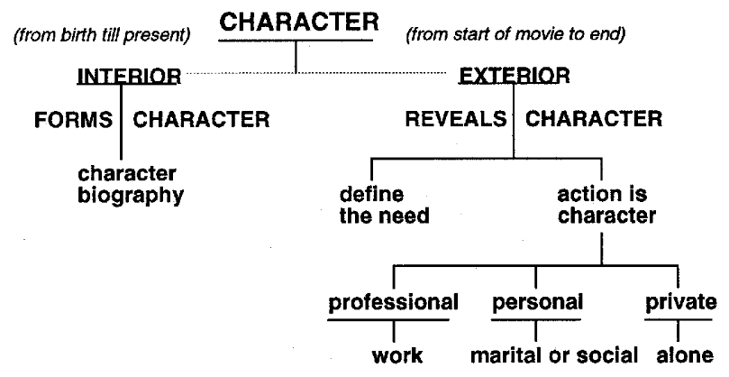
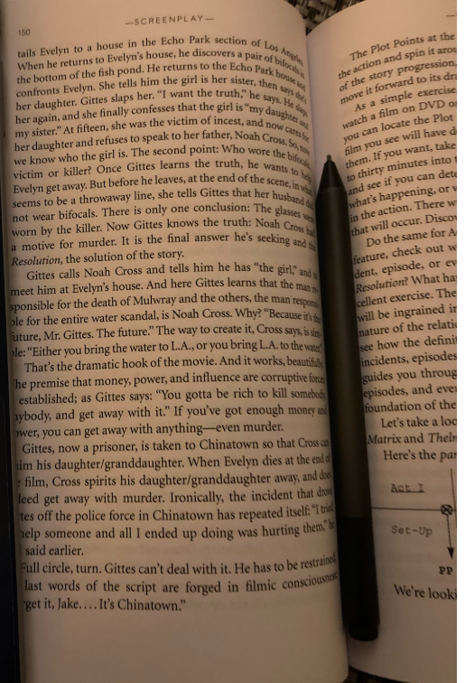

Character template _ copy this 

Create a goal for the character and have the story unfold to make the hero deal with their deep weakness.
If you do that the plot comes from the deep source of the character.
Character Motivation and Action.
Intention and Motivation
We want them to succeed but there has to be a struggle

And put them in situations where they have to make a choice

TD example: Marty’s anger causes him to kill the killer and thus all the information he had, which could have lead them to the real killer.
This satisfies the need for plot, without betraying the character.
This ability to disguise plot progression as organic development of a character's motivations really is the mark of a great writer and a great story.

Dramatic situations 
https://en.m.wikipedia.org/wiki/The_Thirty-Six_Dramatic_Situations 

“Film is a visual medium. You must find ways to reveal your 
character's conflicts visually. You cannot reveal what you don't know”

Who is your main character? 

Who is your story about?

Phrase your creative questions to begin with the word what, not why. What implies a specific response; if you ask yourself a question beginning with the word why, you can get many different answers, and they may all be correct. So try to phrase any questions using the word what: What causes my character to react in this manner?

What is the purpose of this scene? It may take a while to phrase the question, and the answer may not appear as soon as you would like it to, but trust the process; it's bigger than you are. That's why I call writing a character biography creative research.

character
Chinatown writer: what are the characters afraid of?

# INTERIOR
(birth up until the time your story begins)

Gender:

Age:

Residency:

Place of birth:

Siblings / only child: 

# Emotional Life
(forms character) 

What kind of childhood did he have? Happy? Sad?

Physically or medically challenging? 

What was his relationship to his parents? 

Did he get into a lot of trouble as a kid? 

Was he mischievous? 

What kind of a child was he? 

Outgoing, an extrovert; or studious, an introvert?

Pursue his/her life through the first ten years; include his/her preschool and school years, relationships with friends and family and teachers. 

Did a single parent raise your character? 

Mother or father? 

Aunt or uncle? 

How did they get along? 

Is your character streetwise or sheltered? 

What kind of jobs did the parent(s) have to make ends meet? 

Move into the second ten years of your character's life, ages ten to twenty. 

That means middle and high school. 

What kind of influences did your character have while growing up? 

Friends? 

What kind of interests? School, athletics, social, political? 

Did your character take an interest in extracurricular or after-school activities, like a debating club? 

What about sexual experiences? 

Relationships with peers? 

Did your character have to work part-time during high school? 

What about any sibling relationships? 

Any envy or hostility present? 

What about relationships with teachers? 

What kind of relationship did your character have with his/her parents during these years? 

Did any major traumatic event happen that may have emotionally influenced your character? 

In high school, what kind of experience did he/she have? 

Did he/she have many friends or just a few friends? 

Did he/she feel like an outsider?

### Move into the college years. 

Did your character go to college, or even consider college? 

What college or university did he or she go to? 

What was his or her major? 

Was your character active politically? 

Did he or she join clubs or student body organizations? 

Did your character have a significant relationship while in college? 

What happened in this relationship? 

How long were they together? Did they get married? 

When the story begins, is your character married, widowed, single, separated, or divorced?

If married, for how long and to whom?

# EXTERIOR
(Film beggining to film conclusion) 

 separate your characters' lives into three basic components—their **professional life**, their **personal life**, and their **private life**

(see table below)

Physical life 
(reveals character)

| Define the need | Action is character | 
| :----: | :---: |
|     |     | 
|        |    | 
|       |       | 

Space

|  🏢 Professional life     |    🏠 Personal life   | 📺 Private life |
| :----: | :---: |:---: |

# 🏢 Professional life

What does your main character do for a living?

Where does he or she work? 

Is she the vice president of a bank? 

A construction worker? 

A doctor? 

A sound technician? 

A scientist? 

A professor? 

Are they sad or happy with their lives? Do they wish their lives were different—another job, or another wife, or possibly another self?

Go into your character's workplace and start defining the people that he or she interacts with on a daily basis:

His/her boss, the various assistants, secretaries, salesmen, corporate heads, and so on.

Define the relationships with coworkers. Are the relationships good, bad, supportive, happy, or sad; are there any conflicts in the relationships? If so, what are they about? 
Professional jealousy, anger, different personality types? 

How does your character deal with it? With argument and discussion? Or by silence and withdrawal? By launching personal attacks?

If your character works in an office environment, what is his/her job description? 

Who is his/her strongest supporter? How well do the two of them get along? 

Do they confide in each other? 

Socialize with each other during off hours? 

How does she get along with her boss? 

Is it a good relationship, or is there some resentment because of the way things are going in the office, or pending mergers or buy-outs, or possible looming salary cutbacks and layoffs?

# 🏠 Personal life

Is your main character married, single, widowed, divorced, or separated? 

Is your character in a relationship when the story begins? 

If so, who is he/she with and how long have they been together? 

If your character is married, whom did he or she marry?

Someone he met at school, or dated, or was fixed up with? 

Is the person your character is with when the story begins from the same background as she or do they come from "different sides of the tracks"? 

Above or below him/her in terms of education or profession? 

Childhood sweethearts? 

College lovers? 

How long have they been married? 

What does the marriage look like? Here's where the length of the marriage comes in. If they have recently married, their relationship is different from that of a couple who have been married for several years. 

Do they go places, do things together?

Or do they take each other for granted?

Do they have many friends and participate in social functions, or do they have only a few friends? 

Is the marriage strong, or is your character thinking about, or participating in, extramarital affairs?

Think about conflicts; he may want one thing, she another. It may be as important as whether or not to have children, or simply that he likes sporting events and she likes the theater. Go into this marriage and write it out. You can do this as it applies to your individual screenplay, either as a background relationship or in the foreground, as part of the action.

 If your character is single, what is his/her single life like? 

Dating many people, or getting somewhat serious about someone? 

If he or she is alone when the story begins, when was his/her last relationship? 

Was it serious or just a three-month/Hing? 

What are his/her likes or dislikes? If your character is seeing someone when the story begins, how long have they been together? 

Any conflicts in the relationship? 

What do they disagree about? 

What do they have in common? 

Any ex-girlfriends or ex-boyfriends in the equation?

How do they work it out?

Any other areas they have conflicts in? In terms of a relationship, is she/he ready to move into some kind of commitment? 

Is she divorced? If yes, how long was she married? To whom? What really happened that caused the breakup? 
How long were they together? 

Any children? If yes, how often does she see the kids? 

And how do the children feel about the divorce or someone new that one of their parents might be seeing?

# 📺 Private life

What does your character do when he or she is alone?

Watch a lot of TV?

Exercise—training for a triathlon competition? 

Is he into sports, and goes to the gym three times a week? 

Does she jog, do yoga, or take spinning classes? 

Take a creative writing class one night a week? 

Does she have any pets? 

What kind? 

What hobbies does your character have? 

Does he/she collect stamps, garden, or take cooking classes? 

The private aspect covers the area of your character's life when he/she is alone.

---------------

Additional Notes

 In a free-association essay of about a page or two, define your character's professional life / personal / private. Don't try to censor yourself; just throw it all down on the page.

 When you have doubts about your character, go into your own life. Ask yourself—if you were in that situation, what would you do in your character's place? (note you are not your character)

 What's so beneficial about knowing your characters' profes-sional, personal, and private lives is that you have something to cut away to; if you are writing your screenplay and don't know what happens next, you can go into the professional, personal, or private aspects of your character's life and find something to show to move the story forward.

Aristotle says in the Poetics: "Life consists in action and its end is a mode of action, not a quality." That means your character has to be active, has to be doing things, causing things to happen, not just reacting all the time. Sometimes it's necessary for your character to  react to a situation, but you can't have your main character constantly reacting only to things that happen to him. If that happens, he disappears off the page, and your story appears soft, without an edge. Your character is what he/she does. Film is a visual medium, and the writer's responsibility is to choose an image, or picture, that cinematically dramatizes his or her character. You can create a dialogue scene in a small and stuffy hotel room, or have the scene occur at the beach or under the stars. One is visually closed; the others visually open and dynamic. It's your story, your choice.

Ultimately just write in free association. Jotting down everything you can think off. 

Maybe even look at astrology 

 (1), the characters have a strong and defined dramatic need;

 Dramatic need is defined as what your main characters want to win, gain, get, or achieve during the course of your screenplay. The dramatic need is what drives your characters through the story line. It is their purpose, their mission, their motivation, driving them through the narrative action of the story line.

Sentence or 2

Case studies 

 In Thelrna & Louise, the dramatic need is to escape safely to Mexico; that's what drives these two characters through the entire story line. 

In Cold Mountain, Inman's dramatic need is to return home, and Ada's is to survive and adapt to the conditions around her.

 In Lord of the Rings, as mentioned, it's to carry the ring to Mount Doom and destroy it in the fire that created it. 

In Apollo 13 (William Broyles Jr. and Al Reinert), the dramatic need is to return the astronauts safely to earth. But it didn't start out that way. When the story began, the dramatic need of Apollo 13, the astronaut's mission, was to walk on the moon; but that changed when the oxygen tank blew. The dramatic question then became not whether they were going to land on the moon but whether they would be able to survive and return safely to Earth. 

There are times that the dramatic need will change during the course of the story. If your character's dramatic need does change, it will usually occur at Plot Point I, the true beginning of your story. 

In Theltna & Louise, Louise's killing Harlan at Plot Point I forces the action into a new direction; instead of spending a weekend in the mountains, Thelma and Louise have now become fugitives from the law. Their dramatic need is to escape. 

In Dances With Wolves (Michael Blake), John Dunbar's (Kevin Costner's) dramatic need is to escape from the lunacy of the Civil War and go to the farthermost point of the frontier. But when he finally reaches his goal, Fort Sedgewick—Plot Point I—his dramatic need changes, and now he must learn how to adapt to the land and establish a relationship with the Sioux. 

What is your main character's dramatic need? Can you define it in a few words? Articulate it? If you don't know your character's dramatic need, who does? 

You must know it. If you like, you can establish dramatic needs for other characters in the screenplay

 (2), they have an individual point of view; 

You are the baker of the bread you eat." 
Point of view shades and colors the way we see the world. Have you ever heard phrases like: "Life is unfair,"
 "You can't fight City Hall,"
 "All life is a game of chance,"
 "You can't teach an old dog new tricks,"
 "Life is unlimited opportunity,"
 "You make your own luck,"

A parent has a parent pov, student student pov, housewife pov 

Criminal, environmentalist, humanost, racist, 

 Someone who believes in fate, destiny, and astrology? 

Does your character believe in voodoo or witchcraft, or that the future can be revealed through a medium or psychic? 

Does your character believe that the limitations we confront are self-imposed, like Neo in The Matrix. 

Does your character put his faith in doctors, lawyers, The Wall Street Journal, The New York Tiniest His/her belief in Time, People, Newsweek, and the evening news? 

Point of view is an individual and independent belief system. 

I believe in God. That's a point of view. Or, I don't believe in God. That's also a point of view. Or, I don't know whether there is a God or not; that's also a point of view. All three statements are true within the individual fabric of the character. There is no right or wrong here

They could wear tshorts with “save the whales” on them

Maybe they believe in the lottery 

In shawshank redemption Andy believes in hope. Red dpesnt. But at the end Red starts hoping 

(3), they personify an attitude; 

 Attitude is defined as a manner or opinion, and is a way of acting or feeling that reveals a person's personal opinion. 

An attitude, differentiated from a point of view, is an intellectual decision, so it can, and probably will, be classified by a judgment: right or wrong, good or bad, positive or negative, angry or happy, cynical or naive, superior or inferior, liberal or conservative, optimistic or pessimistic. 

Being "right" all the time is an attitude; so is being "macho." Voicing a political opinion is also an attitude; just look at the many opinions about the war in Iraq. 

In the same way, have you ever gone into a store to buy something and found yourself dealing with a sales person who does not want to be there, has negative energy and thinks he/she is superior to you? That's an attitude. 

Have you ever walked into a fancy restaurant not wearing the "right" clothes? It's that kind of judgment, where someone is convinced he's right and you're wrong; judgments, opinions, evaluations all stem from attitude. It's an intellectual decision one makes. 

Understanding your character's attitude allows him/her to reach out and touch his/her humanity in an individual way. Is he/she enthusiastic about his/ her life and job, or unhappy? 

We all know people who express different parts of themselves through their attitude; someone who feels the world owes them

Attitude and POV quite similar but rhat doesnt matter. Just separate them in your own way  
(4), they go through some kind of change, or transformation.

 Does your character change during the course of your screenplay? If so, what is the change? 
Can you define it?
 Articulate it? 
Can you trace the emotional arc of the character from the beginning to the end? 

In The Truth About Cats and Dogs, both characters undergo a change that brings about a new awareness of who they are. Abby's final acceptance that she is really loved for who she is completes the character arc of the change.

 In The Shawshank Redemption, Andy has endured prison life for some nineteen years when he learns who actually murdered his wife and her lover. When the warden refuses to help him get a new trial and Tommy, the witness, is killed, he realizes the warden will never let him out. Andy had entered prison considering himself guilty, even though he hadn't killed his wife and her lover; he was guilty, yes, as Red tells him, not of pulling the trigger, but of being a bad husband. Now that he has served "his time," he realizes the moment has come for him to be free once again. It is his redemption. As we learn later, he's been preparing to escape for years.

Take time to write an essay about the characters change - charting their emotional arch 

Remember main character must be active  they must cause things to happen  

Also show more! 

Are they ditzy? Have a messy room  

Action revealing character  

Person doesnt want to go somewhere then “accidently” locks their keys in their hpuse. Revealing their true character  

Sometimes you get stuck and write it all “wrong” - thats okay. You might just need to get it out. Get out the wrong version so you can see the right way. 

Write something like this to explain your story

Brain tumor is a birthday present. 

CHARACTER MAP 

H1 Negative Experience (N.E. ) 
(this is how the core belief got made) 
-add some general backstory to this box, it can also be something that happens in the story. just bad thing = coping mechanism (core belief) this is general btw

EG - shone by the people who love me... 

H1 core belief (C.B) 
start like this "to prevent this from affecting me again, I must..." 

N.E. was so bad that you took what you learned and applied it to everything 

EG - ... I don't get close to people (note, this is a general solution to a specific problem.) 

--this is the point at which you become you 

(N.E. got punished in school = C.B, don't follow the rules 
N.E. friend betrayed them in school = C.B. don't trust people) 
this is a generalisation that's the point. no other characters in this box or locations, cause the lesson is general. Then they take this 'lesson' and apply it to all other aspects of their life (goals, relationships, lifestyle, presentation, dialogue) <--trickle down and affect everything. 

Also note, this is subconscious. 

H1. Stated belief (lie) -- (Unhealthy people usually aren't conscious of the fact that their beliefs are coping mechanisms, so they create a narrative to justify the core belief. ) 

Don't over think, usually X = good, Y= bad. this is basically the ego - it can take on a moralistic dimension. its what helps them sleep at night. 
E.G why are you obsessed with your career (goal) = cause success is inherently good (lie)
(lifestyle) why are you obsessed with cleaning your house = impurity is bad (lie)

e.g. super nihilistic doomer character, tried to hope and it failed so they acclimated to hopelessness - but if you asked them about themselves they wouldn't tell you "I'm like this because XYZ happened to be.. they'd come up some lie, cause C.B is subconscious. so conscious slots in state belief for them. in hopeless guys case it'd be some long winded excuse why life is meaningless. If someone asks him why he doesn't try in relationships, he doesn't tackle the core reason, instead falls back on his lie. 

H1. THE CORE BELIEF AFFECTS ALL AREAS OF THEIR LIFE | table
(note - this are, how would a person with said C.B think about these)
goals | relationships | lifestyle | presentation | dialogue 
(goals don't define a person, a person has goals cause of their C.B)

NOTE - fear doesn't get it's own box, fear is just an emotion, fear is the grease that keeps this machine growing. I fear the N.E happing again so I think and act in certain way to escape it but you overcorrect and it (goals, relationships, lifestyle, presentation, dialogue) ruins your life.
all this is to create walls to knock down. eg end of act 1 they think, stated belief is the reason they're messed up. then end of act 2 they realise whats really driving them (C.B), and act 3 they finally come to terms with their back story (N.E) and deuniversalize their core belief

NICK
H1 Negative Experience (N.E.)
Backstory: During Nick's childhood, he faced a defining moment that left a deep imprint on his psyche. As a young boy, he was passionate about acting and participated in a school play. Despite his excitement and hard work, the performance was met with unexpected ridicule from his peers and indifference from his family, who failed to acknowledge his effort and dedication. This painful experience of not being taken seriously or appreciated for his talents instilled a fear of mediocrity and invisibility in Nick. He internalized the idea that no matter how hard he tried, his efforts might never be enough to garner the respect and recognition he craved.
H1 Core Belief (C.B)
"To prevent this feeling of stagnation and underachievement from affecting me again, I must constantly challenge myself and explore new creative outlets, even if they are outside my comfort zone." Stemming from the childhood trauma of feeling undervalued and unseen, Nick developed a relentless drive to prove himself. This core belief became his armor against the fear of being overlooked and the pain of not living up to his potential or the expectations of others.
H1. Stated Belief (Lie)
"I’m pursuing stand-up comedy purely as a hobby and for fun; it’s not about proving anything to anyone." By framing his venture into stand-up as a lighthearted pursuit, Nick shields himself from the vulnerability of admitting his deep-seated need for validation and fear of failure. This lie serves as a protective mechanism, allowing him to navigate the pressures of performance without confronting the raw wounds of his past directly.
H1. The Core Belief Affects All Areas of Their Life | Table
Goals: Nick is driven by a compulsion to diversify his achievements and continually push the boundaries of his comfort zone, mirroring his childhood resolve to never feel powerless or disregarded again.
Relationships: His interactions are tinted with an underlying anxiety about being truly seen and understood. He cherishes support yet remains somewhat guarded, fearing repetition of the past where his passions were not fully acknowledged.
Lifestyle: Nick's routine is dominated by a quest for new experiences that could validate his worth and creativity, leading him to sometimes neglect his well-being in pursuit of external approval.
Presentation: On the surface, Nick projects confidence and a carefree spirit, especially in his radio persona. However, this façade masks an internal struggle with self-doubt and the desire to be recognized for his talents beyond the microphone.
Dialogue: While he may speak casually about his foray into comedy, his conversations reveal a deeper layer of determination and an almost desperate need to connect with his audience on a more personal level than radio allows.
This darker backstory for Nick adds depth to his character, illustrating how childhood experiences can shape an individual's motivations and behaviors well into adulthood. It highlights the complexity of his pursuit of stand-up comedy, not merely as a career detour but as a vital step in his journey toward self-validation and healing from past scars.

Jason
H1 Negative Experience (N.E.)
Backstory: As a child, Jason was deeply betrayed by a close friend who revealed his secrets to others, leading to public humiliation and a lasting sense of isolation. This betrayal not only eroded his trust in close relationships but also instilled a profound fear of vulnerability. He internalized this experience as a fundamental lesson about the dangers of trust and the necessity of self-reliance.
H1 Core Belief (C.B)
"To prevent this from affecting me again, I must never allow myself to be vulnerable or too dependent on others." This belief became a general solution for Jason to avoid future betrayals and emotional pain. It led him to adopt a life strategy centered around emotional self-sufficiency and a guarded approach to relationships.
H1. Stated Belief (Lie)
"Relying on others is a sign of weakness, and true strength is found in complete independence." This narrative serves as a moral justification for Jason's withdrawal from close emotional connections and his pursuit of an isolated, self-contained lifestyle. It masks his deep-seated fear of betrayal and vulnerability, allowing him to rationalize his coping mechanisms as virtues.
H1. The Core Belief Affects All Areas of Their Life | Table
Goals: Jason's goals are centered around achievements that can be accomplished independently, avoiding endeavors that require deep, collaborative relationships. He aims for self-sufficiency in his career and personal projects, believing success achieved alone is the most rewarding.
Relationships: He keeps people at arm's length, fearing closeness could lead to vulnerability. Romantic relationships are superficial or short-lived, and friendships lack depth. He values acquaintances that require minimal emotional investment.
Lifestyle: Jason's lifestyle is characterized by routines and hobbies that can be pursued solo. He may have a well-ordered and controlled environment, reflecting his need for a space free from the unpredictability associated with deep human connections.
Presentation: He presents himself as confident and self-reliant, perhaps even projecting an air of aloofness or indifference towards others' opinions or offers of help. His demeanor and perhaps even his attire signal self-sufficiency and a lack of need for others.
Dialogue: In conversations, Jason might express skepticism about the reliability or intentions of others, deflect personal questions, and avoid discussing his feelings or vulnerabilities. He emphasizes the value of independence and may critique or dismiss expressions of emotional dependence or community.
Jason's journey might involve confronting the limitations of his core belief, recognizing the value of vulnerability and trust, and gradually allowing himself to form deeper, more meaningful connections, challenging the lie he's told himself to justify his isolation.
