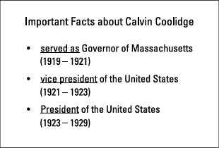
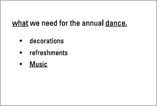
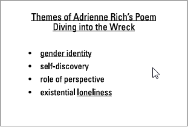
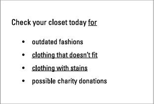
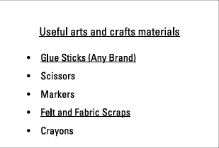
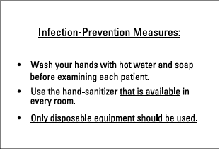
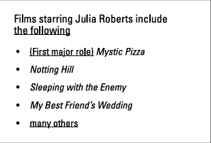
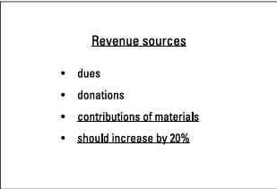
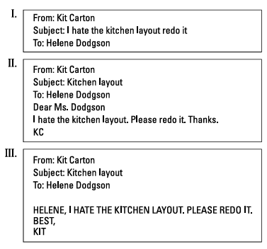

--
id: l9jq02mj2p7spjxvbz3sfft
title: Grammar Lesson
desc: ''
updated: 1739902376411
created: 1739896537656
--

Grammar Lessons

# Template 
### Quiz

Text text text **____blank____** text.  

  
Click to reveal answer

  **Your Answer Here**

text box:
<textarea id="userText" name="userText" rows="4" cols="50" placeholder="Type here..."></textarea>

--
# Chapter 1
## Time Travel: Identifying the Verb and Choosing the Correct Tense
In science fiction films, a character can zoom into the past or hop into the future, usually with the help of a machine resembling a giant vacuum cleaner. You time travel too, when you choose verbs for your sentences. Verbs express action or state of being in the past, present, and future. In this chapter you practice locating the verb and selecting the appropriate tense. You also tackle singular and plural forms, plugging the right one into every sentence.

## The Questions You'll Answer
Here you find sentences that allow you to sharpen your verb skills in these ways:
✓ Locating the verb(s) in a sentence
✓ Selecting simple past-, present-, or future-tense verbs to fit the meaning of a sentence
✓ Choosing progressive verb forms to indicate ongoing action
✓ Placing past perfect, present perfect, or future perfect forms where they’re needed
✓ Finding the right tense to summarize speech and discuss literary or artistic works
✓ Expressing unchangeable facts in present tense
✓ Determining whether you need a singular or plural form

## What to Watch Out For

Verb tense can be tricky, as can agreement — the matching of singular verbs to singular 
subjects and plural verbs to plural subjects. When you work through these questions, 
watch out for these issues:

✓ Zero in on the time period(s) covered in the sentence.
✓ Establish a timeline if more than one action or state of being is expressed in the 
sentence.
✓ Stay in the same tense unless the meaning of the sentence justifies a shift.
✓ Check whether the subject is singular or plural and match the verb to the subject.
✓ Ignore words that resemble verbs but function as descriptions or nouns.

## The Questions You'll Work On
1.	 Eric and his band played five songs by the Beatles, to the delight of the audience.

Click to reveal answer

Your answer here

- 
2.	 Maria slipped out of the room quietly at the end of the lecture on the causes of World War One.

Click to reveal answer

Your answer here

- 

3.	 The twins will be happy on their birthday when they receive your present!

Click to reveal answer

Your answer here

- 
4.	 Perhaps because of my brother’s illness, my dog Tweet seems sad today.

Click to reveal answer

Your answer here

- 
5.	 The child searched for a tissue but found only a dirty candy wrapper.

Click to reveal answer

Your answer here

- 
6.	 The screaming figure at the left of the painting represents a mother’s grief.

Click to reveal answer

Your answer here

- 
7.	 Glenn has always carried the sizzling pizza in a special, heat-proof box.

Click to reveal answer

Your answer here

- 
8.	 The puppies, along with the kittens, were displayed in the shop window for all to see.

Click to reveal answer

Your answer here

- 
9.	 The last meeting of the council was bittersweet, as the members were now scattering for distant destinations.

Click to reveal answer

Your answer here

- 
10.	 To go faster, try not to look at the keyboard as you type.

Click to reveal answer

Your answer here

- 
11.	 Smiling, Barbara wrestled with the math problem until she calculated the correct answer.

Click to reveal answer

Your answer here

- 
12.	 Daniel’s pen, having run out of ink, sat on the shelf, unused and forgotten.

Click to reveal answer

Your answer here

- 
13.	 While copying the letter, Mike stuck his finger in the moving paper tray.

Click to reveal answer

Your answer here

- 
14.	 Norman has been judged “normal” by his doctor, but his friends view him differently.

Click to reveal answer

Your answer here

- 
15.	 Sliding down the mountain, the ski instructor guided his students.

Click to reveal answer

Your answer here

- 
## Choosing Simple and Perfect Tense Verb Forms
### 16–55 Select the tense and form of the verb in parentheses that fits the meaning of the sentence.

16.	 I _____ (to start) my blog a year ago, and I do not intend to stop now.

Click to reveal answer

Your answer here

- 
17.	 Sheryl and her friend always _____(to shop) on a Tuesday, when the store offers double discounts.

Click to reveal answer

Your answer here

- 
18.	 Next year, four boys _____ (to compete) for a single spot on the wrestling team.

Click to reveal answer

Your answer here

- 
19.	 Emma _____ (to snap) a picture of her brother Eric every year on his birthday, including today.

Click to reveal answer

Your answer here

- 
20.	 Last week I tossed a bit of my dinner under the table because the dog _____(to beg) for scraps while I ate.

Click to reveal answer

Your answer here

- 
21.	 Start working on your lab report as soon as you _____ (to arrive) home.

Click to reveal answer

Your answer here

- 
22.	 Mr. Martin _____ (to trim) the tree after he had watered it.

Click to reveal answer

Your answer here

- 
23.	 While Harry _____ (to wash) the clothes, Oliver was brushing the dog’s matted fur.

Click to reveal answer

Your answer here

- 
24.	 Jackie _____ (to learn) Arabic when she lived in Tunisia.

Click to reveal answer

Your answer here

- 
25.	 Carla _____ (to fill) the gas tank before she realized that her credit card was not in her wallet.

Click to reveal answer

Your answer here

- 
26.	 By the time George gets home, Maria _____(to gobble) all the cookies, and George hates all the other snacks.

Click to reveal answer

Your answer here

- 
27.	 When I _____ (to bake) the cookies, I placed them on the dining room table.

Click to reveal answer

Your answer here

- 
28.	 Although the king commands instant obedience, his followers sometimes _____(to disobey).

Click to reveal answer

Your answer here

- 
29.	 Marlene _____ (to lecture) for two hours before she noticed that several audience members were asleep.

Click to reveal answer

Your answer here

- 
30.	 I _____ (to live) in this neighborhood for about a year, and despite its problems, I still love my home.

Click to reveal answer

Your answer here

- 
31.	 The yellow and brown leaves began to fall; the autumn soon _____ (to end).

Click to reveal answer

Your answer here

- 
32.	 No one _____ (to work) harder than Ellen, who spent eight or nine hours a day on this project for the first two weeks and is now allotting ten or twelve hours a day to it!

Click to reveal answer

Your answer here

- 
33.	 Jared _____ (to jog) four miles every day as soon as he wakes up.

Click to reveal answer

Your answer here

- 
34.	 From now on, David _____ (to complete)his homework on time, to avoid detention and poor grades.

Click to reveal answer

Your answer here

- 
35.	 Elliot always _____ (to return) his library books late, so he pays many fines.

Click to reveal answer

Your answer here

- 
36.	 While Meredith _____ (to paint) the ceiling, a dog jumped on the ladder.

Click to reveal answer

Your answer here

- 
37.	 Place the dough in a warm spot, and in a few hours it _____ (to double) in size.

Click to reveal answer

Your answer here

- 
38.	 It _____ (to rain) every day for a month, including today, but tomorrow’s forecast calls for sunshine.

Click to reveal answer

Your answer here

- 
39.	 The soda had soaked into the carpet by the time the janitor _____ (to arrive) with a mop.

Click to reveal answer

Your answer here

- 
40.	 Right now, Catherine’s friends _____(to gather) for her surprise party.

Click to reveal answer

Your answer here

- 
41.	 Once George _____ (to chop) down the cherry tree, the fruit was lost.

Click to reveal answer

Your answer here

- 
42.	 I paid the electric bill on the 17th, so I _____ (to receive) the next bill in about a week.

Click to reveal answer

Your answer here

- 
43.	 Although Eddie _____ (to dance) happily, Shirley turned off the music.

Click to reveal answer

Your answer here

- 
44.	 Clancy never _____ (to brush) his teeth by himself, even though he is five years old now.

Click to reveal answer

Your answer here

- 
45.	 As we speak, our enemies _____ (to attack) with great force, but we will not surrender.

Click to reveal answer

Your answer here

- 
46.	 The teacher _____ (to staple) the drawings on the bulletin board so that the parents could admire their children’s artwork.

Click to reveal answer

Your answer here

- 
47.	 By the time Eleanor and Henry are satisfied with the renovation, they _____ (to exceed) their budget by a wide margin.

Click to reveal answer

Your answer here

- 
48.	 Where the tulips _____ (to bloom), weeds eventually covered every inch of the garden.

Click to reveal answer

Your answer here

- 
49.	 In Maya’s fantasy novel, a wizard’s curse_____ (to turn) a little boy into a frog.

Click to reveal answer

Your answer here

- 
50.	 Amanda and her friends _____ (to study) Chinese for four years by the time they travel to that country.

Click to reveal answer

Your answer here

- 
51.	 Joe _____ (to practice) karate for many years and still takes an advanced class every Saturday.

Click to reveal answer

Your answer here

- 
52.	 In Shakespeare’s Othello, the title charac- ter wrongly _____ (to trust) Iago, one of the most evil villains in literature.

Click to reveal answer

Your answer here

- 
53.	 LGA Manufacturing has an old-fashioned policy; the company _____ (to market) its products only in a store, not on the Internet.

Click to reveal answer

Your answer here

- 
54.	 If my dog buries a bone every three days, how many _____ (to bury) by the end of the month?

Click to reveal answer

Your answer here

- 
55.	 In Dickens’s classic novel Great Expectations, Pip _____ (to learn) the identity of his benefactor in a chilling scene.

Click to reveal answer

Your answer here

- 
## Consistently Choosing the Right Verb Tense
### 56–65 Select the tense and form of the verb in parentheses that fits the meaning of the sentence.Take care to avoid unnecessary shifts from one tense to another.

56.	 In my dream, a giant dinosaur ran into my dining room, and then he _____ (to stroll) around the room.

Click to reveal answer

Your answer here

- 
57.	 Perhaps because the president _____ (to campaign) for the mayor, the mayor won by a huge margin.

Click to reveal answer

Your answer here

- 
58.	 Linda _____ (to enter) the cafeteria and sits next to the most hated teacher in the entire school!

Click to reveal answer

Your answer here

- 
59.	 The orchestra _____ (to insure) the instru- ments every year, so no one ever worries about storm damage after the hurricane.

Click to reveal answer

Your answer here

- 
60.	 Last year I traveled to Europe, but next year I _____ (to tour) Asia.

Click to reveal answer

Your answer here

- 
61.	 In response to the reporter’s question, the zookeeper said that the lion _____ (to be) very friendly.

Click to reveal answer

Your answer here

- 
62.	 Morty declared that eight added to ten _____ (to equal) eighteen.

Click to reveal answer

Your answer here

- 
63.	 Arthur told me that he _____ (to need) a loan until payday and asked me to give him $10

Click to reveal answer

Your answer here

- 
 
64.	 Shana reported that at the end of every show, the ballet dancers _____ (to bow) and ignored the boos from the audience.

Click to reveal answer

Your answer here

- 
65.	 The astronomer told the youngsters that the earth _____ (to revolve) around the sun.

Click to reveal answer

Your answer here

- 

# Chapter 2
## Taking a Look at Irregular, Helping, and Descriptive Verb Forms
Every year, my students are upset to discover that English has so many irregular verbs. If I were the Queen of Grammar, I’d outlaw irregular verbs. Unfortunately, without them I wouldn’t be able to fashion the first sentence of this chapter, because are would be behind bars. So would has! Like it or not, and because I’m not the *Queen of Grammar*, you and I are stuck with irregulars. Not to worry: In this chapter you practice selecting irregular verbs,changing meaning with helping verbs (should, can, may, do, does, did, and the like), and employing verb forms that can act as descriptions, which grammarians call participles and infinitives and the rest of us call “pains in the neck.”

## The Questions You’ll Work On
In this chapter, you work on questions that develop these skills:
✓	Using irregular past-tense and participle forms correctly
✓	Selecting the proper form and tense of the irregular verbs to be and to have
✓	Adding shades of meaning with the helping verbs should, must, can, could, may, might,
and would
✓	Creating questions with helping verbs
✓	Identifying participles functioning as descriptions
✓	Choosing the best form of participles and infinitives used as descriptions
## What to watch out for
Keep these points in mind when you answer the questions in this chapter:
✓	Check whether the past-tense form or participle is regular or irregular.
✓	Choose the correct tense of irregular verbs based on the meaning of the sentence.
✓	Employ reading comprehension skills to detect the need for a helping verb expressing
obligation, possibility, condition, or ability.
✓	Rearrange word order and add helping verbs to create questions.
✓	Select present participles or infinitives as descriptions for actions in the past, present, or future.

## Handling Irregular Verbs
### 66–90 Choose the proper past, present perfect, past perfect, or future perfect form of the irregular verb in parentheses so that the verb fits the meaning of the sentence.

66.	 Joe _____ (to catch) the ball as it reached the top of the outfield fence.

Click to reveal answer

Your answer here

- 
67.	 The car was cruising along the highway smoothly until it _____ (to hit) a huge bump.

Click to reveal answer

Your answer here

- 
68.	 Dorothy and the baby _____ (to sleep) for two hours when they returned from a visit to Grandma.

Click to reveal answer

Your answer here

- 
69.	 At the end of the trial the judge _____ (to rise) from her chair and left the courtroom.

Click to reveal answer

Your answer here

- 
70.	 Last week the Yankees _____ (to beat) their fiercest rivals.

Click to reveal answer

Your answer here

- 
71.	 From 2010 through 2011, the confused clerk _____ (to put) all the forms in the wrong file cabinet.

Click to reveal answer

Your answer here

- 
72.	 The helicopter _____ (to fly) straight up into the sky and then headed south.

Click to reveal answer

Your answer here

- 
73.	 Glenn _____ (to see) the little dog and grabbed her before she could run away again.

Click to reveal answer

Your answer here

- 
74.	 I didn’t know that you _____ (to swim) in the deep water last summer; I thought you were less advanced in your swimming skills.

Click to reveal answer

Your answer here

- 
75.	 Nelson wouldn’t _____ (to get) sick if he had washed his hands more frequently.

Click to reveal answer

Your answer here

- 
76.	 The bully approached, but because my uncle _____ (to teach) me how to handle difficult people, I wasn’t afraid.

Click to reveal answer

Your answer here

- 
77.	 The doctor _____ (to do) everything in his power; now Allison must wait for the medicine to take effect.

Click to reveal answer

Your answer here

- 
78.	 Miriam _____ (to let) the dog out for a few minutes, but she will call him inside soon.

Click to reveal answer

Your answer here

- 
79.	 Although Adam _____ (to find) a good candidate already, the boss continued to interview others for the job.

Click to reveal answer

Your answer here

- 
80.	 “Who _____ (to begin) the fight, you or your brother?” asked Mother as she sepa- rated her battling children.

Click to reveal answer

Your answer here

- 
81.	 After you _____ (to send) the letter, shred the scrap copies.

Click to reveal answer

Your answer here

- 
82.	 At first the rain was simply annoying, but when it _____ (to freeze), the streets became very slippery and many pedestrians fell.

Click to reveal answer

Your answer here

- 
83.	 Albert _____ (to tear) his shirt when he crawled through the obstacle course.

Click to reveal answer

Your answer here

- 
84.	 “I _____ (to know) it!” exclaimed the detec- tive as the murderer confessed.

Click to reveal answer

Your answer here

- 
85.	 When she attempted to pay for her coffee, Lee discovered that she _____ (to lose) all her coins because of a small hole in her pocket.

Click to reveal answer

Your answer here

- 
86.	 By midnight Angie _____ (to sing) that aria enough times to set a world record.

Click to reveal answer

Your answer here

- 
87.	 In ancient times, murderers were often _____ (to hang) in the public square.

Click to reveal answer

Your answer here

- 
88.	 The picture _____ (to hang) on the wall for years, but no one noticed it.

Click to reveal answer

Your answer here

- 
89.	 The janitor _____ (to sweep) the sidewalk before the students arrive, so expect a clean path.

Click to reveal answer

Your answer here

- 
90.	 The riflemen _____ (to lay) down their weapons but are ready to resume target practice at a moment’s notice.

Click to reveal answer

Your answer here

- 
## Dealing with To Be and To Have
### 91–105 Select the proper form of the verb to be or to have to fit the meaning of the sentence.

91.	 The marble statue _____ (to be) on the shelf right now, but earlier it was in the sculptor’s studio.

Click to reveal answer

Your answer here

- 
92.	 Along with Jack, I _____ (to be) bored and decided to watch a different show.

Click to reveal answer

Your answer here

- 
93.	 The co-presidents _____ (to have) no trouble persuading club members to go out for pizza when they suggest the excur- sion at the end of the meeting, because ­everyone will be hungry then.

Click to reveal answer

Your answer here

- 
94.	 Louisa rejected the sofa when it was delivered because it _____ (to have) a stain on one cushion.

Click to reveal answer

Your answer here

- 
95.	 Max _____ (to be) sick for the last two days, but the doctor predicts that his temperature will be normal tomorrow.

Click to reveal answer

Your answer here

- 
96.	 The lottery winners _____ (to be) difficult; they refuse to share their winnings.

Click to reveal answer

Your answer here

- 
97.	 If the referee and the coach can’t agree, our efforts _____ (to be) fruitless because we will forfeit the game.

Click to reveal answer

Your answer here

- 
98.	 Shelley _____ (to have) difficulty getting up on time ever since her alarm clock broke, but she plans to buy a new one soon.

Click to reveal answer

Your answer here

- 
99.	 While the elevators were rising, the mechanic _____ (to have) doubts about the strange noises below.

Click to reveal answer

Your answer here

- 
100.	 We _____ (to be) here, patiently waiting, for more than four hours before Justin arrived.

Click to reveal answer

Your answer here

- 
101.	 When Doreen _____ (to be) 13, she strug- gled to start her business, but one day sales began to rise.

Click to reveal answer

Your answer here

- 
102.	 By the time it opens on Broadway, the show _____ (to have) four different directors.

Click to reveal answer

Your answer here

- 
103.	 Gina, who _____ (to be) your friend, begs you to forgive her.

Click to reveal answer

Your answer here

- 
104.	 Doug, who _____ (to be) very immature in those days, used to stick gum under everyone’s desk.

Click to reveal answer

Your answer here

- 
105.	 Sam thought that his mom _____ (to have) a stroke, but fortunately he was wrong; it was just a headache.

Click to reveal answer

Your answer here

- 
## Adding Meaning with Helping Verbs
### 106–120 Choose the verb form that expresses the tense of the verb and the shade of meaning shown in parentheses.

106.	 Shelly’s song _____ (to win, present tense, ability) her an award for “Best New Artist.”

Click to reveal answer

Your answer here

- 
107.	 Alice _____ (to fly, future, possibility) to Buenos Aires on business next week.

Click to reveal answer

Your answer here

- 
108.	 Your hands _____ (to be, present, obliga- tion) clean before you perform surgery, Doctor!

Click to reveal answer

Your answer here

- 
109.	 Because she loves that color, Helen _____ (to choose, present, possibility) only green blocks for her playhouse.
SS

Click to reveal answer

Your answer here

- 
110.	 On Saturday mornings, the whole family _____ (to attend, past, repeated action) Wendy’s softball games and cheer her on.

Click to reveal answer

Your answer here

- 
111.	 The workers _____ (to pave, past, obliga- tion) the street more smoothly, but they did a sloppy job.

Click to reveal answer

Your answer here

- 
112.	 Margaret _____ (to jump, past, ability) over the fence easily, but instead she waited patiently for the guard to open the gate.

Click to reveal answer

Your answer here

- 
113.	 Enter the house quietly because the baby _____ (to be, present, possibility) asleep.

Click to reveal answer

Your answer here

- 
114.	 The mathematician was told that she _____ (to calculate, present, obligation) the odds of failure before making a recommendation.

Click to reveal answer

Your answer here

- 
115.	 The sheriff _____ (to arrest, present, ­obligation) Josephine for murder, as he has ­collected an overwhelming amount of ­evidence of her crime.

Click to reveal answer

Your answer here

- 
116.	 If he graduates from high school with honors, Walter _____ (to enroll, future, ability) in college and continue on the path to success.

Click to reveal answer

Your answer here

- 
117.	 Seven hours ago, Otis said that he _____ (to prepare, past, possibility) dinner, but we are still waiting, hungrier than ever.

Click to reveal answer

Your answer here

- 
118.	 “You _____,” (to continue, present, permission) remarked the teacher as the ­student hesitated.

Click to reveal answer

Your answer here

- 
119.	 If it had not rained, Sam _____ (to go, past, condition) for a walk.

Click to reveal answer

Your answer here

- 
120.	 With a sharp pencil, Eliza _____ (to poke, past, repeated action) through the flimsy paper and then ask for a new sheet to write on.

Click to reveal answer

Your answer here

- 
## Creating Questions with Helping Verbs
### 121–130: Change the underlined portion of the sentence, as needed, to turn the statement into a question. Note: The period at the end of the sentence has been replaced by a question mark already.

121.	 <u>Mary owns</u> a small but valuable art collection?

Click to reveal answer

Your answer here

- 
122.	 <u>Bert was carrying</u> a large carton of crayons to the daycare center?

Click to reveal answer

Your answer here

- 
123.	 <u>Jefferson will attend</u> the committee meet- ing this afternoon, despite his busy schedule?

Click to reveal answer

Your answer here

- 
124.	 <u>Eugene has</u> too many video games, according to his friend James?

Click to reveal answer

Your answer here

- 
125.	 After he had chewed his gum for an hour, <u>Steven blew</u> an enormous bubble?

Click to reveal answer

Your answer here

- 
126.	 <u>The wire between the fenceposts sags</u> so low that cattle cross easily from one field to the next?

Click to reveal answer

Your answer here

- 
127.	 <u>Deborah is not</u> interested in reading that poem aloud?

Click to reveal answer

Your answer here

- 
128.	 <u>You will have eaten</u> by the time George arrives at the restaurant?

Click to reveal answer

Your answer here

- 
129.	 <u>Ellie went</u> to the skating rink when it was closed?

Click to reveal answer

Your answer here

- 
130. <u>The winning essay compared</u> face-to-face communication with social media relationships?

Click to reveal answer

Your answer here

- 

## Detecting and Placing Descriptive Verb Forms
### 131–140 In the sentence, which word or words function as descriptive verb forms (participles) and not as verbs?
 
131.	 In the flowing stream, Hank found a little paper boat.

Click to reveal answer

Your answer here

- 
132.	 Tom, pleased with his high test score, will celebrate with his family this evening.

Click to reveal answer

Your answer here

- 
133.	 In the last scene of the play, Daniel walks rapidly toward the setting sun.

Click to reveal answer

Your answer here

- 
134.	 Confused, Eliza is sorting through the instructions for her new computer and printer.

Click to reveal answer

Your answer here

- 
135.	 The mountains rising majestically in the background are a symbol of nature’s power.

Click to reveal answer

Your answer here

- 
136.	 The printed word, carrying meaning for centuries, will never be obsolete.

Click to reveal answer

Your answer here

- 
137.	 “I have done my homework!” screamed Andrew, tired of his mother’s nagging.

Click to reveal answer

Your answer here

- 
138.	 The research was done by laboratories around the world, all funded by one generous donor.

Click to reveal answer

Your answer here

- 
139.	 Amelia is performing in the play, although she hates the conceited director, who, hired under a long-term contract, does whatever he wishes.

Click to reveal answer

Your answer here

- 
140.	 The snake, sunning itself on the rock, slithered away when hikers came near him.

Click to reveal answer

Your answer here

- 
## Selecting Tense for Descriptive Verb Forms
### 141–150 Which form of the verb in parentheses works best as a description in the sentence?
 
141.	 _____ (to prepare) the room for redecora- tion, Vincent discovered a crack that grew longer with every tug of the wallpaper he was removing.

Click to reveal answer

Your answer here

- 
142.	 _____ (to speak) with intense emotion, the actor recites his lines every night without a trace of boredom.

Click to reveal answer

Your answer here

- 
143.	 _____ (to water) the plants during vaca- tions, Caroline installed an automatic sprinkler.

Click to reveal answer

Your answer here

- 
144.	 The mayor, _____ (to vow, to fight) crime, will increase the number of police officers.

Click to reveal answer

Your answer here

- 
145.	 The cat raked sharp claws across the new desk _____ (to stand) in the corner of the living room.

Click to reveal answer

Your answer here

- 
146.	 His funds _____ (to exhaust), Nelson called home and begged for a loan from his parents.

Click to reveal answer

Your answer here

- 
147.	 Annie walked ten miles _____ (to visit) her Aunt Marie.

Click to reveal answer

Your answer here

- 
148.	 _____ (to walk) the entire shoreline this morning, Ed can assure the reporters at tonight’s news conference that all the beaches are ready to reopen.

Click to reveal answer

Your answer here

- 
149.	 Barbara and Arnie, _____ (to confer) already, will need no introduction when they attend the next meeting.

Click to reveal answer

Your answer here

- 
150.	 “It’s great _____ (to meet) you!” exclaimed Paul as he shook hands with his new tennis partner, who had never seen Paul before in his life.

Click to reveal answer

Your answer here

- 

# Chapter 3
## One to Many: Forming Plurals of Nouns and Pronouns
According to one website, as of January, 2013, the English language was made up of - 1,019, 729.6 words. I don’t believe that anyone actually knows — or can know — how - many words are in any language. (And what on earth is 0.6 of a word?) So you can forget - about numbers when you study proper English, with one huge exception: You have to pay - attention to singular and plural forms of nouns and pronouns. In this chapter, you practice - with nouns, turning one (the singular form) into many (the plural form). You also sort - singular and plural pronouns, so that you can match them appropriately with the words - they represent.

## The Questions You’ll Work On
In this chapter, you work on questions that cover the following concepts:
✓	Forming plurals of common and proper nouns, both regular and irregular
✓	Creating plural forms of hyphenated and compound words
✓	Tackling difficult pronouns such as everything, one, either, all, some, that, which who, and so forth What to watch out for

## What to Watch Out For 
Keep these points in mind when you’re answering the questions in this chapter:
✓	Most nouns form the plural by adding the letter s. For nouns ending in ch, sh, x, s, and z, add es.
✓	Nouns ending in a y change the y to i and add es if the letter preceding the y is a consonant (any letter except a, e, i, o, or u).
✓	Add s or es to the most important word in a hyphenated or compound noun.
✓	These pronouns are always singular: one, everyone, everything, everybody, no one,
nothing, nobody, someone, something, somebody, either, neither, each, other, and another.
✓	These pronouns are always plural: few, both, several, and many.
✓	Relative pronouns (that, which, who) are singular if they refer to singular nouns
or pronouns and plural if they refer to plural nouns or pronouns.
✓	These pronouns can be either singular or plural: all, any, most, some, and none. If one of these pronouns refers to a plural (for example, all of the shows, in which all refers to shows), the pronoun is plural. If the pronoun refers to a singular (for example, most of the air, in which most refers to air), the pronoun is singular.

## Forming Plural Nouns
### 151–165 What is the correct plural form of these nouns?
 
151.	 stitch, telephone, tax

Click to reveal answer

Your answer here

- 
152.	 dye, splash, sandal

Click to reveal answer

Your answer here

- 
153.	 tomato, catch, mug

Click to reveal answer

Your answer here

- 
154.	 monkey, turkey, baby

Click to reveal answer

Your answer here

- 
155.	 zoo, success, edge

Click to reveal answer

Your answer here

- 
156.	 child, woman, man

Click to reveal answer

Your answer here

- 
157.	 deer, elephant, month

Click to reveal answer

Your answer here

- 
158.	 light, batch, biography

Click to reveal answer

Your answer here

- 
159.	 microphone, jelly, virus

Click to reveal answer

Your answer here

- 
160.	 delivery, essay, wife

Click to reveal answer

Your answer here

- 
161.	 Smith, Jones, O’Toole

Click to reveal answer

Your answer here

- 
162.	 leaf, pitch, copy

Click to reveal answer

Your answer here

- 
163.	 son-in-law, kangaroo, tooth

Click to reveal answer

Your answer here

- 
164.	 alumnus, mass medium, Woods

Click to reveal answer

Your answer here

- 
165.	 species, statistic, vice president

Click to reveal answer

Your answer here

- 
## Sorting Singular and Plural Pronouns
### 166–195 Identify the singular (S) and/or plural (P) pronouns in the sentence.

- 
166.	 Isaac asked his aunt to reduce her work- load, but she refused.

Click to reveal answer

Your answer here

- 
167.	 As the children opened their presents, they told Santa how great his selections were.

Click to reveal answer

Your answer here

- 
168.	 We must apply sunscreen to our arms, according to my mother.

Click to reveal answer

Your answer here

- 
169.	 “Where is your sneaker?” asked the babysitter as he searched the room I share with my little sister.

Click to reveal answer

Your answer here

- 
170.	 “Your yoga class will be delayed an hour,” I announced when the students had gathered in front of their lockers.

Click to reveal answer

Your answer here

- 
171.	 A friend of mine wants to go on vacation with them, but they prefer to travel by themselves.

Click to reveal answer

Your answer here

- 
172.	 The cookies are in his pocket; I saw them myself.

Click to reveal answer

Your answer here

- 
173.	 The football coach remarked, “Everyone is counting on you,” but I was too stressed to play.

Click to reveal answer

Your answer here

- 
174.	 Something is wrong with the computer, because it blinks constantly and flashes a warning sign every hour.

Click to reveal answer

Your answer here

- 
175.	 Several of the engineers have examined the platform and declared it safe, but when someone screamed, everyone ran.

Click to reveal answer

Your answer here

- 
176.	 One of the books has an index, but those on the top shelf do not, so we use them infrequently.

Click to reveal answer

Your answer here

- 
177.	 Both of us entered the international math competition; however, no one from our country won.

Click to reveal answer

Your answer here

- 
178.	 Neither of my uncles attended the gradua- tion ceremony, so the principal mailed a diploma to each of them.

Click to reveal answer

Your answer here

- 
179.	 The talk show host directed the question to her audience, but someone on stage answered it anyway.

Click to reveal answer

Your answer here

- 
180.	 All of the birds flew to the pond, but most of the water had evaporated, and they soon left.

Click to reveal answer

Your answer here

- 
181.	 Either of the restaurants is fine with me, if anyone would like to stop for a snack.

Click to reveal answer

Your answer here

- 
182.	 Arthur located most of the films, but a few were hard to find, so we had to substitute others.

Click to reveal answer

Your answer here

- 
183.	 The hungry man asked me to give him some of my sandwiches.

Click to reveal answer

Your answer here

- 
184.	 Someone rang the bell, but no one was there when Judy opened the door, expecting to see her brother.

Click to reveal answer

Your answer here

- 
185.	 Everyone was required to bring his or her swimsuit to camp, but Anna forgot to pack hers.

Click to reveal answer

Your answer here

- 
186.	 All of the orange juice spilled, but no one wiped the table until Billy called the manager and asked for her help.

Click to reveal answer

Your answer here

- 
187.	 Each of Bobby’s bicycles is missing one wheel, but Bobby thinks both of the bikes can be repaired.

Click to reveal answer

Your answer here

- 
188.	 Much of Gene’s trouble stems from his reliance on everyone’s admiration.

Click to reveal answer

Your answer here

- 
189.	 Sharla and Alex like one tattoo but hate the other; they have mixed opinions about mine, a blue star.

Click to reveal answer

Your answer here

- 
190.	 The shoes that Mark bought weren’t comfortable, but they were more stylish than anything else he purchased yesterday.

Click to reveal answer

Your answer here

- 
191.	 Someone who should know better washed my best pair of pants in hot water.

Click to reveal answer

Your answer here

- 
192.	 The branches that tapped on the window made too much noise, so I cut them off.

Click to reveal answer

Your answer here

- 
193.	 While she waited to hear the winner’s name announced, Lulu, who had bought three lottery tickets, crossed her fingers for luck.

Click to reveal answer

Your answer here

- 
194.	 The envelope and writing paper, which were stored in the desk, are hers, but the stapler is theirs.

Click to reveal answer

Your answer here

- 
195.	 The doctor treated eight patients who were stricken by the same disease, which was fatal for nearly all of them.

Click to reveal answer

Your answer here

- 
# Chapter 4
## Identifying Subjects and Per  fecting Subject-Verb Agreement
What are you talking about, at this exact moment? That’s the subject of your - conversation. While I’m on the subject of subjects, I must mention that every sentence - has a subject — the who or what being discussed. The most important aspect of subjects - is agreement: not smiling and saying, “Yes! Yes!” but rather ensuring that a singular subject - pairs with a singular verb form and a plural subject pairs with a plural verb form. In this - chapter, you find the subject and then play matchmaker between subjects and verbs. (If you - have trouble identifying the verb, turn to Chapters 1 and 2 for extra help.)

## The Questions You’ll Work On
In this chapter, you work on questions that cover the following concepts:
✓	Finding the subject in statements, questions, and commands
✓	Identifying compound subjects and pronouns acting as subjects
✓	Choosing the correct verb for every subject-verb pair

## What to Watch Out For 
Keep these points in mind when you’re answering the questions in this chapter:
✓	To find the subject, first locate the verb(s) in the sentence. Ask who? or what? is performing the action or is in the state of being expressed by the verb.
✓	Don’t be fooled by location. Most subjects appear before the verb, but some follow the verb. Use your reading comprehension skills to answer the who? or what? questions.
✓	Most subjects and verbs show up with descriptions attached. Ignore distracting words or phrases and concentrate on the real subject-verb pair.
✓	Verb forms used as descriptions or as nouns may resemble verbs without functioning
as the verb in the sentence. When you ask who? or what? to find the subject, be sure you’re working from the real verb.
✓	The subject in a command may be an understood, but not stated, you.
✓	Pronouns acting as subjects can be tricky. Check out Chapter 3 for help distinguishing singular and plural pronouns.

## Locating the Subject
### 196–215 Identify the subject(s) in the sentence.

196.	 The plastic tip of the shoelace slowly slipped through the hole as Juan marched down the street.

Click to reveal answer

Your answer here

- 
197.	 Marina and Tom are in the grocery store on the corner of Appleton Avenue.

Click to reveal answer

Your answer here

- 
198.	 Eight security cameras constantly swiveled in their holders on the ceiling of the jewelry store.

Click to reveal answer

Your answer here

- 
199.	 In the garden behind the house, the bride and groom solemnly recited their vows.

Click to reveal answer

Your answer here

- 
200.	 Only one girl in the crowd of 200 fans ­actually got an autograph.

Click to reveal answer

Your answer here

- 
201.	 Jumping on the trampoline is fun for Lily and Jane during the long weeks of summer vacation.

Click to reveal answer

Your answer here

- 
202.	 Stop talking back to the teacher now!

Click to reveal answer

Your answer here

- 
203.	 Henry distributed sheets of paper to whoever needed some.

Click to reveal answer

Your answer here

- 
204.	 Does the new brand of peanut butter taste odd to you?

Click to reveal answer

Your answer here

- 
205.	 There on the shelf sat four large statues of historical figures.

Click to reveal answer

Your answer here

- 
206.	 Above the clouds and far from the violent storm, the plane flew safely toward its destination.

Click to reveal answer

Your answer here

- 
207.	 The bus full of delighted tourists slowly circled the famous monument.

Click to reveal answer

Your answer here

- 
208.	 Each of the coffee cups has a small crack near the rim.

Click to reveal answer

Your answer here

- 
209.	 Both of the parakeets happily land on my finger for a bit of birdseed and a bite of lettuce.

Click to reveal answer

Your answer here

- 
210.	 Allison and her former friend Pete parted angrily, snarling at each other and walking in opposite directions.

Click to reveal answer

Your answer here

- 
211.	 Grandpa, who loves hockey, was the goalie on his college team.

Click to reveal answer

Your answer here

- 
212.	 Either the apartment with a terrace or the townhouse will surely please that buyer.

Click to reveal answer

Your answer here

- 
213.	 The dog that I believe should win the contest is over there.

Click to reveal answer

Your answer here

- 
214.	 Courtney, along with her mother, spoke politely to the mayor about the need for longer library hours.

Click to reveal answer

Your answer here

- 
215.	 The fire truck, which is heading to a blaze downtown, speeds through the intersection.

Click to reveal answer

Your answer here

- 
## Fine-Tuning Subject-Verb Agreement
### 216–240 In the context of the sentence, what form of the verb (V) in parentheses is correct, and what is the subject (S) of that verb?

216.	 Every morning Anna _____ (to open, present tense) the gate and _____ (to allow, present tense) her poodle to play in the yard.

Click to reveal answer

Your answer here

- 
217.	 On the way to work, Clare and David always _____ (to share, present perfect tense) funny stories about their boss.

Click to reveal answer

Your answer here

- 
218.	 The large-sized bottle of my favorite shampoo _____ (to be, past tense) on sale last week.

Click to reveal answer

Your answer here

- 
219.	 Alicia and I _____ (to plan, present progressive tense) a talent show to raise money for needy children.

Click to reveal answer

Your answer here

- 
220.	 The Cub Scouts _____ (to place, past progressive tense) candy apples in small, sticky piles in preparation for the Halloween party.

Click to reveal answer

Your answer here

- 
221.	 _____ (to be, past tense) Hank pleased when he _____ (to read, past tense) your letter?

Click to reveal answer

Your answer here

- 
222.	 The best exhibits in the museum _____ (to seem, present tense) more crowded lately.

Click to reveal answer

Your answer here

- 
223.	 Matthew and I _____ (to sing, past progres- sive tense) every single song until our voices _____ (to break, past tense) from overuse.

Click to reveal answer

Your answer here

- 
224.	 _____ (to have, present tense) you any extra icing for my birthday cake?

Click to reveal answer

Your answer here

- 
225.	 Through the dark, damp tunnel _____ (to crawl, present tense) the chipmunks, eager to reach the picnic tables.

Click to reveal answer

Your answer here

- 
226.	 Ham and cheese _____ (to be, present tense) my favorite sandwich, but salad _____ (to be, present tense) a more nutritious choice.

Click to reveal answer

Your answer here

- 
227.	 “Your problem _____ (to be, present tense) 17 unexcused absences,” commented the teacher as she explained why the student was scheduled for detention.

Click to reveal answer

Your answer here

- 
228.	 Politics _____ (to influence, present tense) much of the debate on that issue, but the senators from that state always _____ (to vote, present tense) according to their consciences.

Click to reveal answer

Your answer here

- 
229.	 John, not his friends, _____ (to go, present progressive tense) to attend the ceremony.

Click to reveal answer

Your answer here

- 
230.	 Any of the solutions he _____ (to offer, present tense) to the panel _____ (to be, present tense) acceptable.

Click to reveal answer

Your answer here

- 
231.	 _____ (to be, present tense) the House of Representatives in session now?

Click to reveal answer

Your answer here

- 
232.	 Most of the salt in those diets _____ (to come, present tense) from natural sources.

Click to reveal answer

Your answer here

- 
233.	 Two or three of the plants with red leaves _____ (to droop, present progressive tense) to the ground because of the drought.

Click to reveal answer

Your answer here

- 
234.	 The study of economics _____ (to seem, present tense) interesting, but I have never taken any courses about this subject.

Click to reveal answer

Your answer here

- 
235.	 Two hours of homework _____ (to be, pres- ent perfect tense) my usual amount, but I _____ (to expect, present tense) to spend more time on my studies next year.

Click to reveal answer

Your answer here

- 
236.	 Every girl and boy in the kindergarten _____ (to play, present tense) with the plastic blocks, not the wooden ones.

Click to reveal answer

Your answer here

- 
237.	 That little girl _____ (to be, present tense) the only one of the dancers who _____ (to make, present tense) friends easily.

Click to reveal answer

Your answer here

- 
238.	 A thousand dollars _____ (to be, present tense) too much to pay for that broken- down car, which _____ (to look, present tense) like a rusty bucket.

Click to reveal answer

Your answer here

- 
239.	 Neither Ginger nor her aunts _____ (to have, present tense) keys to the house, but the landlord _____ (to be, present tense) able to supply an extra set.

Click to reveal answer

Your answer here

- 
240.	 Shelby _____ (to sell, present progressive tense) me one of the cars that _____ (to be, present tense) energy efficient.

Click to reveal answer

Your answer here

- 
# Chapter 5
## Coming to a Clear Agreement: Pairing Pronouns and Antecedents
Pronouns are like socks. They have to fit perfectly, because if they don’t, you spend the - day walking around with a lump around your toes or pulling up a too-short heel. They - also have to match: no green and blue mixing allowed! Pronouns are stand-ins for other - nouns or pronouns — their antecedents. Don’t worry about the terminology. Just be sure - to select the correct pronoun. In this chapter you find practice for every situation likely to - arise in matching pronouns to antecedents correctly and clearly.

## The Questions You’ll Work On
In this chapter, you work on questions that develop these skills:
✓	Identifying pronouns and their antecedents
✓	Pairing singular and plural pronouns with the appropriate antecedents
✓	Matching the gender of pronouns and antecedents
✓	Ensuring that the antecedent of every pronoun is clear

## What to Watch Out For
Keep these points in mind when you’re answering the questions in this chapter:

✓	To determine whether you’re using the proper pronoun, first identify the antecedent.
✓	Singular pronouns take the place of singular nouns or other singular pronouns.
✓	Plural pronouns take the place of plural nouns or other plural pronouns.
✓	Match masculine pronouns to masculine nouns, and feminine pronouns to feminine
nouns. Use neuter pronouns for objects and ideas (it, those, and the like).
✓	Some personal pronouns refer to the speaker (I, me, we, and so forth) or to the person
addressed (you, your, for example). These pronouns have no antecedent in the sen-
tence. Other pronouns that refer to an undetermined person or thing (such as whatever
or something) may also lack an antecedent in the sentence.
✓	Pronouns must express only one meaning. If the reader can’t grasp the pronoun-
antecedent relationship, you have to reword the sentence.

## Identifying Pronouns and Their Antecedents
### 241–250 Identify each pronoun in the sentence as well as the word(s) the pronoun replaces (the antecedent). 

#### Note: More than one pronoun may refer to the same antecedent, and sometimes a pronoun has no antecedent in the sentence.

241.	 Martin told his players they had to work harder.

Click to reveal answer

Your answer here

- 
242.	 Mary and her uncle watched their favorite show at his house.

Click to reveal answer

Your answer here

- 
243.	 In his sonnets, Shakespeare inspires readers to think deeply about the meaning of their lives.

Click to reveal answer

Your answer here

- 
244.	 My dog wants to chew on his bone, but I can’t find it.

Click to reveal answer

Your answer here

- 
245.	 Whoever broke the window should pay for it!

Click to reveal answer

Your answer here

- 
246.	 The motorcycle that Jean built from a kit won the race, which was sponsored by a local bank.

Click to reveal answer

Your answer here

- 
247.	 None of the computer programs work until someone enters a password and username.

Click to reveal answer

Your answer here

- 
248.	 John, who needs a shave, broke his own razor and then borrowed mine.

Click to reveal answer

Your answer here

- 
249.	 What you want is impossible, but I will try to do everything anyway!

Click to reveal answer

Your answer here

- 
250.	 The dentist to whom Mary entrusted her teeth took good care of them.

Click to reveal answer

Your answer here

- 
## Pairing Pronouns and Antecedents Correctly
### 251–260 What are the correct pronouns for each blank in the sentence? The intended meaning of each pronoun appears in parentheses.

251.	 Sara was delighted to receive the book and read _____ (book) aloud to _____ (Sara’s) friends.

Click to reveal answer

Your answer here

- 
252.	 Gregory prepared three reports for _____ (Gregory’s) supervisor, but when _____ (Gregory) handed _____ (reports) in, the supervisor was not happy.

Click to reveal answer

Your answer here

- 
253.	 Dora and I liked the dresses, but _____ (Dora and I) decided _____ (dresses) were too formal for the occasion.

Click to reveal answer

Your answer here

- 
254.	 The company where _____ (Arthur’s) father works is expanding _____ (the company’s) business to Asia.

Click to reveal answer

Your answer here

- 
255.	 The audience sat in _____ (audience’s) seats, patiently waiting for the performance to begin, but _____ (performance) was delayed.

Click to reveal answer

Your answer here

- 
256.	 Counting _____ (a group including the speaker) votes is a simple task; _____ (inspectors) will ensure that _____ (task) is done properly.

Click to reveal answer

Your answer here

- 
257.	 James, _____ (James) loves football, plans to play _____ (football) in college.

Click to reveal answer

Your answer here

- 
258.	 Because neither of the athletes has _____ (athlete’s) sneakers tied properly, _____ (the speaker) expect one of _____ (athletes) to fall.

Click to reveal answer

Your answer here

- 
259.	 Everyone in the restaurant wants _____ (everyone’s) meal right away, but Chef Helen will cook at _____ (Chef Helen’s) own pace.

Click to reveal answer

Your answer here

- 
260.	 When a person wins a prize, _____ (a group including the speaker) clap for _____ (someone).

Click to reveal answer

Your answer here

- 
## Avoiding Vague Pronoun References
### 261–270 Which sentence(s) in the group of three use pronouns clearly and correctly?

261. 

I.
 Ellen and her sister thought she got a good grade.

II.
 The pitcher and catcher worked on his throwing speed.

III.
 The umpire found his glasses just in time for the playoffs.

Click to reveal answer

Your answer here

- 
262. 

I.
 The bowl was on the table with the green tablecloth; I washed it.

II.
 Joe and I hung our posters on the south wall.

III.
 I hope you like the figs; I picked them myself.

Click to reveal answer

Your answer here

- 
263. 

I.
 He is tall and strong; those are attractive qualities.

II.
 Summer gives me more free time than winter, so I prefer it.

III.
 When I slammed the vase into the wall, I broke it.

Click to reveal answer

Your answer here

- 
264. 

I.
 The boy Mary insulted walked away from her angrily.

II.
 I love that horror film; there are five wonderfully scary monsters in it.

III.
 Patrick wants to study law because his father is one.

Click to reveal answer

Your answer here

- 
265. 

I.
 The tacks and nails from that store are very sharp, so I always buy them.

II.
 The tacks covered all the seats, which were dangerous.

III.
 I read many modern novels, and I usually like them.

Click to reveal answer

Your answer here

- 
266. 

I.
 The library book has a stain on the cover, but I can’t remove it.

II.
 The fish that Catherine bought had red spots on its tail.

III.
His grandmother introduced Mark to opera, and he loved it.

Click to reveal answer

Your answer here

- 
267. 

I.
 The architect likes the new building, which was designed by his competitor.

II.
 Gloria explained that she was late because her train left an hour past its scheduled time.

III.
 Charlie watches football and baseball games all day long and wishes he could be a professional at it.

Click to reveal answer

Your answer here

- 
268. 

I.
 Georgina put one more card on top of the four she had fashioned into a little house, but it fell.

II.
 The computer mouse I dropped broke into three pieces, but I glued them back together.

III.
 I did my homework in the middle of the night without a flashlight, which was a problem.

Click to reveal answer

Your answer here

-  
269. 

I.
 In the paper it says that war may break out within the next two days.

II.
 In an article in the paper it says that soldiers will report for duty tomorrow.

III.
 The government hopes to avoid war because of its high cost in both money and lives.

Click to reveal answer

Your answer here

- 
270. 

I.
 The Yankee was a great hitter, but the other team's star was better at it.

II.
 The shades let in some light; they were translucent.

III.
 Allowing some sunlight reduces the need for strong electric lights, which may not be efficient in energy use.

Click to reveal answer

Your answer here

- 

# Chapter 6
## Solving the Case (of Pronouns)
You don’t have to be a detective to know that pronouns — the part of speech that takes - the place of nouns — are important. The issue with pronouns is that their form sometimes - changes depending upon how they’re used in the sentence — a quality known as case. In - this chapter you work on all three cases — subject (also known as subjective or nominative - case), object (also known as objective case), and possessive.

## The Questions You’ll Work On
In this chapter, you work on questions that involve these concepts:
✓	Identifying pronouns as subject, object, or possessive
✓	Choosing the correct pronoun case according to the pronoun’s role in the sentence

### What to Watch Out For
Keep these points in mind when you’re answering the questions in this chapter:

✓	Subject pronouns act as subjects, the who or what performing the action or in the state
of being expressed in the sentence.
✓	Subject pronouns also follow linking verbs (forms of the verb to be or verbs that
express sensory information, such as to sound, to feel, and so forth).
✓	Object pronouns act as objects: direct objects, indirect objects, and objects of a preposi-
tion or verbal (a verb form not functioning as a verb). You don’t need to worry about what
type of object you have, as long as you know that the pronoun is acting as an object. An
object answers the questions whom? or what? after a verb, preposition, or verb form.
✓	Possessive pronouns express ownership. When you say my book or our vacation, my
and our are possessive pronouns.
✓	Some possessive pronouns function as subjects, objects, or other roles commonly
played by nouns. In that book is mine, mine is a possessive pronoun because it
expresses ownership, even though in this sentence it’s acting as a subject complement.
✓	You may run across a verb form ending in -ing that acts as a noun — a gerund, in
English-teacher terminology. The pronoun preceding it is possessive. For example, in
this sentence the possessive pronoun my precedes the gerund swimming: The coach
doesn’t like my swimming, but he can’t stop me!
✓	Don’t confuse possessive pronouns with contractions — shortened forms of other words.
It’s means “it is,” and its is a possessive pronoun. No possessive pronoun has an apostrophe.

## Sorting Subject, Object, and Possessive Pronouns
### 271–285 Identify the underlined pronouns as subject (S), object (O), or possessive (P) pronouns.

271.	 As they built the shelter, the guides told us to watch carefully, in case we ever had to erect a hut like it.

Click to reveal answer

Your answer here

- 
272.	 Doreen and I caught five fish yesterday, but she threw them back into the water because we don’t like to eat salmon.

Click to reveal answer

Your answer here

- 
273.	 Lola is my friend; however, you are her enemy.

Click to reveal answer

Your answer here

- 
274.	 The flight attendant told him to turn off his computer and confiscated it when he refused.

Click to reveal answer

Your answer here

- 
275.	 Al has placed Kerina and you at a lively table, but if you want to change seats, the choice is yours.

Click to reveal answer

Your answer here

- 
276.	 I know it was she on the phone because I always recognize voices.

Click to reveal answer

Your answer here

- 
277.	 Lulu’s parents hate her adding an extra course because they think she is too busy already.

Click to reveal answer

Your answer here

- 
278.	 After Helen had examined the clothing thoroughly, she tried on a coat and declared, “Mine is more stylish and warmer,” as she threw his away.

Click to reveal answer

Your answer here

- 
279.	 My jumbo slice of cake didn’t tempt him, perhaps because yours was dry and tasteless.

Click to reveal answer

Your answer here

- 
280.	 The director loved your jumping in front of the runaway horse in the final scene, but your mom told herself not to look at the screen while you were in danger.

Click to reveal answer

Your answer here

- 
281.	 Their pitcher has a better record than I, but my team wins more games than his.

Click to reveal answer

Your answer here

- 
282.	 Give your food to whoever is hungry, even though our supply is low.

Click to reveal answer

Your answer here

- 
283.	 Melissa, whom the proctor scolded for ­lateness, says she actually arrived earlier than 

I.

Click to reveal answer

Your answer here

- 
284.	 When our computer crashed, James shook its screen and yelled, “Whose program was running recently?”

Click to reveal answer

Your answer here

- 
285.	 I won’t go to the pool with his family because that cousin splashes whoever is nearby.

Click to reveal answer

Your answer here

- 
## Using Subject and Object Pronouns Correctly
### 286–320 What pronouns should be inserted in the blanks? Note: Check the parentheses for identifying information.

286.	 Scott and _____ (Scott’s) fellow racewalk- ers swing _____ (Scott’s and the racewalk- ers’) arms as _____ (Scott and the racewalkers) hurry to the finish line.

Click to reveal answer

Your answer here

- 
287.	 Keith and _____ (Pam) gave _____ (Pam’s) nephew five crayons, because Pam always prefers to select the colors_____ (Pam) likes.

Click to reveal answer

Your answer here

- 
288.	 Woody saluted _____ (Dan) before _____ (Woody and Dan) bowed to the audience and thanked _____ (referring to the speaker) for directing the play.

Click to reveal answer

Your answer here

- 
289.	 _____ (David) and _____ (referring to the speaker) will order food for 100 people, in case _____ (guests) all come.

Click to reveal answer

Your answer here

- 
290.	 Everyone but _____ (referring to the speaker) plays the guitar, but _____ (referring to the people being spoken to) understand the instrument and _____ (the instrument’s) construction too.

Click to reveal answer

Your answer here

- 
291.	 _____ (Toni-Anne) and _____ (Toni-Anne’s) favorite singer, Bob Cassino, have never met, but _____ (Toni-Anne) thinks of _____ (Bob Cassino) as a friend anyway.

Click to reveal answer

Your answer here

- 
292.	 Amy Tan’s novels provide Ira and _____ (Beth) with many hours of pleasant reading, but _____ (referring to the speaker) prefer the films and watch _____ (films) often.

Click to reveal answer

Your answer here

- 
293.	 Daniel and _____ (Pamela) weeded the garden together, but _____ (Daniel and Pamela) hired _____ (the speaker) to mow the lawn.

Click to reveal answer

Your answer here

- 
294.	 _____ (a group including the speaker) and the managers explain the insurance policy to clients whenever _____ (clients) request _____ (referring to the group including the speaker) help.

Click to reveal answer

Your answer here

- 
295.	 Did _____ (Derek) hit _____ (the ball) and run around _____ (the bases)?

Click to reveal answer

Your answer here

- 
296.	 Seeing Laura and _____ (James) pulling _____ (Laura and James’s) wagon up the hill was impressive, because_____ (the hill) was very steep.

Click to reveal answer

Your answer here

- 
297.	 To satisfy _____ (the teacher), Mr.
Palgrove, Beth and _____ (the speaker) handed in an excellent paper that we wrote by _____ (Beth and the speaker), without extra help.

Click to reveal answer

Your answer here

- 
298.	 Do _____ (Helen and Maria) know the boy _____ (the boy) designed the winning sailboat for _____ (Henry)?

Click to reveal answer

Your answer here

- 
299.	 All of _____ (referring to the group of speakers) students worried about the test _____ (the test) was scheduled for _____ (referring to the group of speakers).

Click to reveal answer

Your answer here

- 
300.	 Everyone _____ (referring to everyone) borrowed bowling shoes must return _____ (the shoes) to _____ (referring to the speaker) by 5 o’clock.

Click to reveal answer

Your answer here

- 
301.	 It was _____ (Eve) at the front desk; Peter and _____ (referring to the speaker) are sure _____ (Peter and the speaker) recog- nized _____ (Eve).

Click to reveal answer

Your answer here

- 
302.	 When a stuffed toy loses _____ (toy’s) nose, _____ (toy) looks even more adorable.

Click to reveal answer

Your answer here

- 
303.	 Ken doesn’t know _____ (referring to owner- ship by an unknown person) chewing gum is stuck to the table, but _____ (Ken) wants _____ (gum) removed.

Click to reveal answer

Your answer here

- 
304.	 Deborah, _____ (referring to Deborah) is sitting in the second row, will watch _____ (Bill) with great attention in case Bill forgets _____ (Bill’s) lines.

Click to reveal answer

Your answer here

- 
305.	 Please don’t tell _____ (Allison) and _____ (the speaker) any jokes while _____ (Allison and the speaker) are trying to concentrate.

Click to reveal answer

Your answer here

- 
306.	 The bus with _____ (the bus’s) 20 passen- gers flew by _____ (referring to the speaker) stop, so _____ (the speaker) was late for _____ (referring to the person lis- tening) barbecue.

Click to reveal answer

Your answer here

- 
307.	 Watson and Sons pays _____ (  Watson and Sons’) employees too little compared to _____ (  Watson and Sons’) competitors.

Click to reveal answer

Your answer here

- 
308.	 Are Jason and _____ (Frank) the funniest comedians in the show, or is _____ (  Valerie)?

Click to reveal answer

Your answer here

- 
309.	 Jeff told _____ (Jeff) that _____ (Jeff) would understand the question and write _____ (essay) quickly.

Click to reveal answer

Your answer here

- 
310.	 Mack told the secret to Al and _____ (Wendy) before _____ (Mack) told _____ (the speaker), but _____ (Mack) gave _____ (the speaker) more details.

Click to reveal answer

Your answer here

- 
311.	 Jeremy is as nervous as _____ (Gloria) when _____ (Jeremy and Gloria) visit _____ (Gloria’s) parents.

Click to reveal answer

Your answer here

- 
312.	 Elizabeth hates _____ (referring to the speaker) calling _____ (Elizabeth) “Liz” and has forbidden _____ (referring to the speaker) to do so.

Click to reveal answer

Your answer here

- 
313.	 Fran, _____ (Fran) Charlie thinks should take a course in public speaking, is not open to _____ (the course’s) subject matter.

Click to reveal answer

Your answer here

- 
314.	 Between you and _____ (referring to the speaker), no one is happier about _____ (referring to the person being spoken to) getting a new puppy than _____ (referring to the speaker).

Click to reveal answer

Your answer here

- 
315.	 Don’t _____ (referring to the person or people being spoken to) think _____ (anyone in the group) wants to succeed should study harder than _____ (Christopher)?

Click to reveal answer

Your answer here

- 
316.	 Alex and _____ (referring to the speaker) plan to read the article and respond to _____ (anyone in the group) has com- plaints about _____ (referring to the speaker) work.

Click to reveal answer

Your answer here

- 
317.	 The top students, Nick and _____ (James), will receive awards from the school, which always honors _____ (the school’s) schol- ars at the end of the year.

Click to reveal answer

Your answer here

- 
318.	 The letter tucked into the bottle began, “To _____ (referring to any person) finds this bottle”; _____ (referring to the speaker) read _____ (the letter) eagerly.

Click to reveal answer

Your answer here

- 
319.	 The dancer and _____ (referring to the speaker) believe that it is _____ (Frances) _____ (Frances) stole the salt shaker.

Click to reveal answer

Your answer here

- 
320.	 When Jason told you to ask _____ (refer- ring to anyone in a group) you like to work on the project with _____ (Jason), did you choose _____ (Mary and Frances)?

Click to reveal answer

Your answer here

- 
# Chapter 7
## Forming Complete Sentences
In court, witnesses must swear to tell “the truth, the whole truth, and nothing but the - truth.” In grammar, you have to write “the sentence, the whole sentence, and nothing but - the sentence.” In other words, complete sentences rule — not fragments (partial or incom- - plete sentences) or run-ons (two or more ideas improperly thrown together). In this chapter - you practice identifying and creating complete and grammatically correct statements and - questions.

## The Questions You’ll Work On
In this chapter, you work on questions that involve these skills:
✓	Recognizing whether a sentence is complete or incomplete
✓	Joining two or more ideas correctly
✓	Editing fragments and run-ons to create complete sentences

## What to Watch Out For
Keep these points in mind when you’re answering the questions in this chapter:
✓	Every sentence must express a complete thought.
✓	Be sure the sentence has a matching subject-verb pair.
✓	All sentences need endmarks — periods for statements, question marks for questions,
and exclamation points for exclamations.
✓	Don’t assume that short sentences are incomplete and long sentences are complete.
Meaning, not length, is your guide.
✓	Semicolons (;) and conjunctions such as and, but, or, nor, for, since, because, where, when,
and others link one clause (a grammatical unit containing a subject-verb pair) to another.
✓	Relative pronouns — who, whoever, whom, whomever, that, and which — relate one
idea to another, usually by replacing a noun. For example, in this sentence the relative
pronoun that replaces book: The book that I bought is very heavy.
✓	Adverbs such as however, consequently, therefore, then, also, nevertheless, and others
may not link one complete sentence to another. Use these words to add meaning, but
be sure that you use a semicolon or a conjunction between the sentences.

## Recognising Complete Sentences 
### 321-331 Identify the complete sentence(s).

321. 

I.

Have eaten?

II.

Have you eaten

III.

Have you eaten?

Click to reveal answer

Your answer here

- 
322. 

I.

Boris, along with Helena and her best friends from school.

II.

Boris, along with Helena and her best friends from school

III.

Boris, along with Helena and her best friends from school!

Click to reveal answer

Your answer here

- 
323. 

I.

At the army museum, many exhibits caught our attention.

II.

At the army museum, many exhibits caught our attention

III.

At the army museum, many exhibits catching our attention.

Click to reveal answer

Your answer here

- 
324. 

I.

Balloons of all colors of the rainbow above us in the sky!

II.

Balloons of all colors of the rainbow floated above us in the sky!

III.

Balloons of all colors of the rainbow floated above us in the sky

Click to reveal answer

Your answer here

- 
325. 

I.

Around the corner on tiptoes came the burglar.

II.

The burglar came around the corner on tiptoes.

III.

On tiptoes, around the corner the burglar came.

Click to reveal answer

Your answer here

- 
326. 

I.

I dance.

II.

I dance on stage.

III.

On Sundays, I dance.

Click to reveal answer

Your answer here

- 
327. 

I.

Standing in the aisle, Charlotte scanned the audience, searching for an empty seat.

II.

Standing in the aisle, Charlotte scanned the audience and searched for an empty seat

III.

Standing in the aisle, Charlotte, scan- ning the audience, searching for an empty seat.

Click to reveal answer

Your answer here

- 
328. 

I.

The little dog, chewing his food quickly and then running off to play.

II.

The little dog chewed his food quickly and then ran off to play.

III.

The little dog chewed his food quickly and then ran off to play

Click to reveal answer

Your answer here

- 
329. 

I.

Who is solving the puzzle.

II.

Who is solving the puzzle?

III.

Who is solving the puzzle!

Click to reveal answer

Your answer here

- 
330. 

I.

Alan, having changed his clothes, was ready for the dance.

II.

Having changed his clothes, Alan, ready for the dance.

III.

Having changed his clothes, Alan was ready for the dance.

Click to reveal answer

Your answer here

- 
331. 

I.

Nice to meet you.

II.

Nice meeting you!

III.

It was nice to meet you.
 ## Combining Ideas Correctly ###  332–346 Identify the sentence(s) in which ideas are joined correctly.

Click to reveal answer

Your answer here

- 
332. 

I.

The table fell over, but it didn’t break.

II.

The table fell over, it didn’t break.

III.

The table fell over but didn’t break.

Click to reveal answer

Your answer here

- 
333. 

I.

Miami has a warm climate, Greenland is much colder.

II.

Miami has a warm climate, and Greenland is much colder.

III.

Miami has a warm climate, but Greenland is much colder.

Click to reveal answer

Your answer here

- 
334. 

I.

Although she had reviewed the mate- rial thoroughly, Lisa was still nervous before her test.

II.

Lisa was still nervous before her test, although she had reviewed the mate- rial thoroughly.

III.

She had reviewed the material thor- oughly, Lisa was still nervous before her test.

Click to reveal answer

Your answer here

- 
335. 

I.

Tomorrow Laura will hike two miles, or she will work out for an hour at the gym.

II.

Tomorrow Laura will hike two miles, and she will work out for an hour at the gym.

III.

Tomorrow Laura will hike two miles, she will work out for an hour at the gym.

Click to reveal answer

Your answer here

- 
336. 

I.

The baby cried for hours, no one could quiet her.

II.

The baby cried for hours, and no one could quiet her.

III.

The baby cried for hours, because no one could quiet her.

Click to reveal answer

Your answer here

- 
337. 

I.

Before she met the ambassadors, the President examined their credentials carefully.

II.

The President examined their cre- dentials carefully before she met the ambassadors.

III.

The President first examined their credentials carefully, and then she met the ambassadors.

Click to reveal answer

Your answer here

- 
338. 

I.

The can is full, so please empty it.

II.

The can is full, you should empty it.

III.

The can is full, please empty it.

Click to reveal answer

Your answer here

- 
339. 

I.

Although they had arrived late, the manager refused to shorten the team practice.

II.

The manager refused to shorten the team practice, although they had arrived late.

III.

They had arrived late, but the man- ager refused to shorten the team practice.

Click to reveal answer

Your answer here

- 
340. 

I.

Even though George has never ­studied French, he understands a few simple words.

II.

George has never studied French, however, he understands a few simple words.

III.

George has never studied French, he understands a few simple words anyway.

Click to reveal answer

Your answer here

- 
341. 

I.

Stamp collecting is a fascinating hobby, it can be expensive.

II.

Stamp collecting is a fascinating hobby, although it can be expensive.

III.

Stamp collecting is a fascinating hobby, additionally it can be expensive.

Click to reveal answer

Your answer here

- 
342. 

I.

Jim dropped the fragile vase, conse- quently, it shattered into a thousand pieces.

II.

Jim dropped the fragile vase; conse- quently, it shattered into a thousand pieces.

III.

Jim dropped the fragile vase, and consequently it shattered into a thousand pieces.

Click to reveal answer

Your answer here

- 
343. 

I.

Penny turned off her phone, for she didn’t want to be interrupted.

II.

Penny turned off her phone, she didn’t want to be interrupted.

III.

Penny turned off her phone because she didn’t want to be interrupted.

Click to reveal answer

Your answer here

- 
344. 

I.

I went to Vermont, where I met many skiers.

II.

I went to Vermont, there I met many skiers.

III.

I went to Vermont, I met many skiers there.

Click to reveal answer

Your answer here

- 
345. 

I.

Jack’s suit is old, nevertheless, he still looks good in it.

II.

Jack’s suit is old, however, he still looks good in it.

III.

Jack’s suit is old; he still looks good in it though.

Click to reveal answer

Your answer here

- 
346. 

I.

The mechanic checked the steering wheel, which was fine, but he said that the brakes were defective.

II.

The mechanic checked the steering wheel, which was fine, and then he said that the brakes were defective.

III.

The mechanic checked the steering wheel, which was fine, although he said that the brakes were defective.

Click to reveal answer

Your answer here

- 
## Correcting Run-Ons and Fragments
### 347–361 What changes, if any, should be made to the underlined words in order to create a complete sentence?

347.	 Teresa <u> holding the tray</u>  as I placed the glasses on it.

Click to reveal answer

Your answer here

- 
348.	 Generous donors drop coins in the box <u> their contributions fund</u>  scholarships.

Click to reveal answer

Your answer here

- 
349.	 <u> Who likes ice cream</u> 

Click to reveal answer

Your answer here

- 
350.	 <u> Place the carton</u>  in the corner of the lobby, Margaret.

Click to reveal answer

Your answer here

- 
351.	 <u> The dictionary resting</u>  on a shelf in the corner.

Click to reveal answer

Your answer here

- 
352.	 I find knitting <u> relaxing, my aunt prefers</u> embroidery.

Click to reveal answer

Your answer here

- 
353.	 Those mountain peaks <u> covered</u>  with snow even in the summer.

Click to reveal answer

Your answer here

- 
354.	 Mattie, <u> having read</u>  the paper, went for a walk.

Click to reveal answer

Your answer here

- 
355.	 Park the truck in the <u>lot, be sure</u> to lock it.

Click to reveal answer

Your answer here

- 
356.	 <u>A pen and pencil on the desk in the corner of the living room.</u>

Click to reveal answer

Your answer here

- 
357.	 Which <u>performs better in the annual talent show</u>

Click to reveal answer

Your answer here

- 
358.	 <u> Accepting an internship, Bert, always plan- ning</u> his next career move, which will lead him to success.

Click to reveal answer

Your answer here

- 
359.	 When the handle turns, the fire hose sprays water with great force <u>in the direc- tion indicated on the dial</u>.

Click to reveal answer

Your answer here

- 
360.	 Picasso’s statue has a gently curved <u>side, which highlighting</u> the grain of the marble.

Click to reveal answer

Your answer here

- 
361.	 While <u>swimming</u>, Harriet tangled her foot in a fishing line.

Click to reveal answer

Your answer here

- 
# Chapter 8 !
## Moving Beyond the Basics: Adding Descriptions
A complete sentence (see Chapter 7) can be as short as two words: Marjorie raps, for
example. Life would be very boring, though, if you relied only on subjects and verbs
to get your meaning across. Add in some adjectives and adverbs — the descriptive parts of
speech — and your listener or reader perks up. These “extras” give us Marjorie raps often or
Marjorie raps superfast or Little Marjorie raps every single day. In this chapter you practice
with short descriptions — one-word or slightly longer expressions that attach to nouns,
pronouns, verbs, and other adjectives and adverbs.

## The Questions You’ll Work On
In this chapter, you work on questions in these areas:
✓	Identifying adjectives and adverbs
✓	Selecting the appropriate adjective or adverb for a particular situation
✓	Knowing when to use a or an
✓	Inserting hyphens in compound descriptions. 

## What to Watch Out For
Keep these points in mind when you’re answering the questions in this chapter:

✓	Adjectives describe nouns and pronouns, telling you how many, which one, how much,
or what kind of thing or person you’re talking about.
✓	Adverbs describe verbs, telling you how, when, where, why, or under what conditions
an action or state of being occurs.
✓	Adverbs also describe adjectives and other adverbs, expressing the intensity or degree
of the quality the adverb describes.
✓	The article an precedes a word beginning with a vowel sound (a, e, i, o, or u).
A precedes a word beginning with a consonant sound (any letter except the
vowels listed in the preceding sentence).
✓	If two or more words function as one description, you generally hyphenate them, as in
second-place finish, green-and-yellow hat, hard-working waiter, and so forth.

## Distinguishing Between Adjectives and Adverbs
### 362–373 Identify the underlined words (in order) as adjectives (ADJ), adverbs (ADV), or neither (N).

362.	 The green scarf slipped off her bare head.

Click to reveal answer

Your answer here

- 
363.	 Put these shiny cups below because I may use them later.

Click to reveal answer

Your answer here

- 
364.	 Good journalists still cover important stories, not sensational gossip.

Click to reveal answer

Your answer here

- 
365.	 Five tiny mice curled up and squeaked softly when they sensed danger.

Click to reveal answer

Your answer here

- 
366.	 The escaped prisoners, tired and hungry, eventually surrendered.

Click to reveal answer

Your answer here

- 
367.	 Your school shoes are too tight, so we must buy a larger size.

Click to reveal answer

Your answer here

- 
368.	 When Luke sounded hoarse, his trusted voice coach gave him honey and lemon.

Click to reveal answer

Your answer here

- 
369.	 Identical twins are playing one role in that Broadway play.

Click to reveal answer

Your answer here

- 
370.	 A vacant building, unguarded, may attract squatters who live there illegally.

Click to reveal answer

Your answer here

- 
371.	 Be smart. Drive defensively, and you’ll arrive safely and enjoy a lovely vacation.

Click to reveal answer

Your answer here

- 
372.	 The production crew is responsible for setting the props on stage before the cur- tain first rises.

Click to reveal answer

Your answer here

- 
373.	 Chef John is justly famous for his use of extremely fresh ingredients and fast prepa- ration of complicated dishes.

Click to reveal answer

Your answer here

- 
## Placing Adjectives and Adverbs in Sentences
### 374–393 Insert an adjective or an adverb in each blank, choosing from the words in the parentheses.

374.	 The reporter was _____ (pleased, pleas- ingly) to see his _____ (local, locally) story attract _____ (national, nationally) attention.

Click to reveal answer

Your answer here

- 
375.	 Are _____ (common, commonly) electronic devices _____ (bad, badly) for _____ (social, socially) connections?

Click to reveal answer

Your answer here

- 
376.	 Wading into _____ (deep, deeply) waters, Ron felt _____ (cool, coolly) _____ (immedi- ate, immediately).

Click to reveal answer

Your answer here

- 
377.	 Ben strummed his _____ (new, newly) guitar _____ (energetic, energetically) but not _____ (good, well).

Click to reveal answer

Your answer here

- 
378.	 The _____ (large, largely) delivery van runs _____ (smooth, smoothly), so its contents remain in _____ (good, well) condition.

Click to reveal answer

Your answer here

- 
379.	 Our show’s _____ (loyal, loyally) audience protests _____ (loud, loudly) whenever the network _____ (serious, seriously) threat- ens to cancel it.

Click to reveal answer

Your answer here

- 
380.	 Jackson’s gift was _____ (extreme, extremely) _____ (generous, generously), even though he considered the donation _____ (minimal, minimally).

Click to reveal answer

Your answer here

- 
381.	 Dave feels _____ (happy, happily) because the voters _____ (sure, surely) agree with his position on the _____ (controversial, controversially) issue.

Click to reveal answer

Your answer here

- 
382.	 “Play _____ (nice, nicely),” exclaimed the _____ (over, overly) strict babysitter, but the children continued their _____ (rough, roughly) games.

Click to reveal answer

Your answer here

- 
383.	 It’s _____ (real, really) _____ (unusual, unusually) for an amateur to discover such a _____ (rare, rarely) fossil.

Click to reveal answer

Your answer here

- 
384.	 Mina worked _____ (hard, hardly), but the _____ (low, lowly) grade she _____ (sad, sadly) read on her paper did not reflect her efforts.

385.	 Children who behave _____ (bad, badly) should be scolded _____ (prompt, promptly) and then given a chance to improve with the _____ (gentle, gently) guidance of their caretakers.

Click to reveal answer

Your answer here

-
386.	 _____ (Ripe, Ripely) plums taste _____ (sweet, sweetly), but fruit picked too soon may be _____ (bitter, bitterly).

Click to reveal answer

Your answer here

- 
387.	 Walk _____ (rapid, rapidly) down the hall and turn _____ (sharp, sharply) when you reach the _____ (first, firstly) door on the left.

Click to reveal answer

Your answer here

- 
388.	 I feel _____ (bad, badly) that I spoke _____ (insulting, insultingly) to my most _____ (important, importantly) client.

Click to reveal answer

Your answer here

- 
389.	 Eileen appeared _____ (merry, merrily) at the party, but afterwards she sounded _____ (sad, sadly) and _____ (nervous, nervously).

Click to reveal answer

Your answer here

- 
390.	 Anything _____ (wicked, wickedly) makes us feel _____ (uncomfortable, uncomfort- ably), at least for a _____ (short, shortly) time.

Click to reveal answer

Your answer here

- 
391.	 It’s _____ (certain, certainly) true that young children often wait less _____ (patient, patiently) for their turns to play _____ (fun, funnily) games.

Click to reveal answer

Your answer here

- 
392.	 The _____ (wide, widely) seen broadcast was _____ (sure, surely) helpful to the show’s _____ (dismal, dismally) ratings.

Click to reveal answer

Your answer here

- 
393.	 The senator _____ (sudden, suddenly) inter- rupted to declare _____ (firm, firmly) that she was _____ (political, politically) neutral.

Click to reveal answer

Your answer here

- 
## Dealing with Articles
### 394–  402 Choose a *or* an to precede each expression.
 
394.	 apple, orange, banana

Click to reveal answer

Your answer here

- 
395.	 card, printer, outdoor trip

Click to reveal answer

Your answer here

- 
396.	 bicycle, old-fashioned girl, modern woman

Click to reveal answer

Your answer here

- 
397.	 everyday dish, light, history

Click to reveal answer

Your answer here

- 
398.	 amusing story, unusual incident, original song

Click to reveal answer

Your answer here

- 
399.	 initial impression, very happy child, addi- tional payment

Click to reveal answer

Your answer here

- 
400.	 historic occasion, important dictionary, telephone

Click to reveal answer

Your answer here

- 
401.	 herb garden, fir tree, balcony

Click to reveal answer

Your answer here

- 
402.	 orphan, adventure, e-mail message

Click to reveal answer

Your answer here

- 
## Hyphenating Descriptions
### 403–  411 Identify the description(s) that correctly include or omit hyphens.

403. 

I.

self-cleaning oven

II.

best-dressed list

III.

package of blue-pens

Click to reveal answer

Your answer here

-
404. 

I.

recently passed law

II.

brown-eyed boy

III.

poorly-expressed idea

Click to reveal answer

Your answer here

- 
405. 

I.

third base coach

II.

very-shallow water

III.

sixth-grade math

Click to reveal answer

Your answer here

- 
406. 

I.

nine-year-old kid

II.

constantly-changing world

III.

nearly-enough candy

Click to reveal answer

Your answer here

- 
407. 

I.

tension-relieving exercise

II.

a job well done

III.

newly formed committee

Click to reveal answer

Your answer here

- 
408. 

I.

three-blind mice

II.

very-happy puppy

III.

less-valid argument

Click to reveal answer

Your answer here

- 
409. 

I.

elementary school desk

II.

Yankees baseball team

III.

book review section

Click to reveal answer

Your answer here

- 
410. 

I.

more interesting story

II.

red haired ape

III.

extremely difficult problem

Click to reveal answer

Your answer here

- 
411. 

I.

annual-dental exam

II.

language-proficiency test

III.

mostly-boring material

Click to reveal answer

Your answer here

- 

# Chapter 9
# Taking the Long View: Descriptive Phrases and Clauses

As you text or tweet, short descriptions seem like a good idea. (Chapter 8 provides practice with almost everything you need to know about these one- or two-word descriptions, also known as adjectives and adverbs.) Longer descriptive elements — phrases and clauses — may not make it into a tweet, but they’re valuable nonetheless. In this chapter you have a chance to show that you know where to place descriptions — mostly the long form, plus a couple of tricky short descriptions — so that they express your intended meaning.

## The Questions You’ll Work On
In this chapter, you work on these concepts:

✓	Recognizing the word or words described by phrases and clauses
✓	Placing phrases and clauses so that they are clear and describe the appropriate word

## What to Watch Out For
Keep these points in mind when you’re answering the questions in this chapter:

✓	Prepositional phrases may describe nouns or pronouns (adjective phrases) or verbs
(adverb phrases).
✓	Infinitives and participles may also act as descriptions. Infinitives (to + verb, such as
to meet, to greet, to sleep) may describe nouns, pronouns, or verbs. Participles (the
part of a verb you use with has, have, or had, such as given, driving, and the like) may
describe nouns or pronouns.
✓	Clauses (units of a sentence that contain a subject-verb pair) may describe nouns,
pronouns, or verbs.
✓	To find any sort of adjective, ask these questions: How many? Which one? What kind? To
locate an adverb, ask the following: How? When? Where? Why? Under what conditions?
✓	Every description, no matter how long or short, must be placed as near as possible
to the word it describes. Only, just, almost, and nearly must be placed right before the
word or words they apply to, not earlier in the sentence.
✓	Steer clear of vague descriptions that may describe one or more words in the sentence.
Your meaning must be clear.
✓	When a verbal phrase begins a sentence, it must describe the subject of the sentence.

## Identifying the Words Being Described 
### 412– 431 Identify the word(s) described by theunderlined expression.

412.	 A zookeeper with a long broom stood outside the lions’ large, grassy enclosure.

Click to reveal answer

Your answer here

- 
413.	 Clara sneezed into her handkerchief and then paused before resuming her speech.

Click to reveal answer

Your answer here

- 
414.	 Above the clouds, the child’s green kite soared swiftly.

Click to reveal answer

Your answer here

- 
415.	 The author of the mystery series says that she will kill her detective in the next installment.

Click to reveal answer

Your answer here

- 
416.	 The red wool carpet lay over the scratched floor and made the room look much more attractive to the buyer.

Click to reveal answer

Your answer here

- 
417.	 Monica, sliding her finger around the bowl, did not realize that all the icing was gone.

Click to reveal answer

Your answer here

- 
418.	 Two puppets, which belonged to my grand- mother, played important roles in our show.

Click to reveal answer

Your answer here

- 
419.	 Before Dennis applied for a scholarship, he researched many possible awards and found several that seemed within his reach.

Click to reveal answer

Your answer here

- 
420.	 Sheltering beneath their mother’s arms, the twins smiled shyly at the doctor, who offered each of them a cherry lollipop.

Click to reveal answer

Your answer here

- 
421.	 Shirley visited France and took only one photo of the Eiffel Tower.

Click to reveal answer

Your answer here

- 
422.	 The boy who cried wolf is a famous fairy tale and an accurate depiction of human nature.

Click to reveal answer

Your answer here

- 
423.	 Nancy’s detective stories were always fun to read about, although sometimes she seemed to benefit from too many coincidental clues.

Click to reveal answer

Your answer here

- 
424.	 No matter how many times he mopped the floor, Doug couldn’t keep up with the water flowing through the cracks in the foundation.

Click to reveal answer

Your answer here

- 
425.	 The team manager discussed the price of new uniforms at his meeting last night.

Click to reveal answer

Your answer here

- 
426.	 When Tom finally threw down his spoon, he had been stirring the sauce for nearly an hour.

Click to reveal answer

Your answer here

- 
427.	 While carrying wood, the lumberjack dropped a few logs on the lawn, and the birds quickly scattered in fear.

Click to reveal answer

Your answer here

- 
428.	 Conscientious assistants take notes of everything their supervisors say, regard- less of how unimportant the comments seem.

Click to reveal answer

Your answer here

- 
429.	 David and his puppy, rolling together in a mock fight, knocked over a lamp and two tables before they were finished.

Click to reveal answer

Your answer here

- 
430.	 Last month I traveled to Seattle, a beauti- ful city, to see my family.

Click to reveal answer

Your answer here

- 
431.	 Receiving a medal for what he accom- plished during his time in office, the prin- cipal bowed to his audience and praised both students and faculty.

Click to reveal answer

Your answer here

- 
## Avoiding Misplaced, Dangling, and Vague Descriptions
### 432–  451 In which of these sentences are the descriptions placed correctly?

432. 

I.

The ruby earrings rested on the nightstand next to my bed that I wore to the dance.

II.

The ruby earrings that I wore to the dance rested on the nightstand next to my bed.

III.

The ruby earrings rested on the nightstand that I wore to the dance next to my bed.

Click to reveal answer

Your answer here

- 
433. 

I.

The crosstown bus filled with holi- day shoppers inched slowly through heavy traffic.

II.

Filled with holiday shoppers, the crosstown bus inched slowly through heavy traffic.

III.

The crosstown bus inched slowly through heavy traffic filled with holi- day shoppers.

Click to reveal answer

Your answer here

- 
434. 

I.

Elena only has three children, though she had hoped for a larger family.

II.

Elena has only three children, though she had hoped for a larger family.

III.

Elena has three children, though she had only hoped for a larger family.

Click to reveal answer

Your answer here

- 
435. 

I.

George’s scowling unnecessarily alarmed people.

II.

George’s unnecessary scowling alarmed people.

III.

George’s scowling alarmed people unnecessarily.

436. 

I.

Tracy and the cat licking fur curled up on the couch.

II.

Tracy and the cat curled up on the couch licking fur.

III.

Licking fur, Tracy and the cat curled up on the couch.

Click to reveal answer

Your answer here

- 
437. 

I.

The letter said that she had won the lottery in Alice’s mailbox.

II.

The letter in Alice’s mailbox said that she had won the lottery.

III.

The letter said that in Alice’s mailbox she had won the lottery.

Click to reveal answer

Your answer here

- 
438. 

I.

He drove the car down the highway that he bought last year.

II.

That he bought last year, he drove the car down the highway.

III.

He drove the car that he bought last year down the highway.

Click to reveal answer

Your answer here

- 
439. 

I.

Although the lobby renovation is taking longer than expected, we are sure that everyone will like the new floor tiles from Greece when it reopens in September.

II.

Although the lobby renovation is taking longer than expected, we are sure that when it reopens in September, everyone will like the new floor tiles from Greece.

III.

Although the lobby renovation is taking longer than expected, when it reopens in September we are sure that everyone will like the new floor tiles from Greece.

Click to reveal answer

Your answer here

- 
440. 

I.

My hands, breaking into a thousand pieces, were slippery, and the dishes fell.

II.

My hands were slippery, and the dishes fell, breaking into a thousand pieces.

III.

Breaking into a thousand pieces, my hands were slippery, and the dishes fell.

Click to reveal answer

Your answer here

- 
441. 

I.

She almost won with 500 votes; the loser received  410

II.

She won with almost 500 votes; the loser received 410

III.

With almost 500 votes, she won; the loser received 410

Click to reveal answer

Your answer here

- 
442. 

I.

The highway boundary, painted white, was visible even at night.

II.

Painted white, the highway boundary was visible even at night.

III.

The highway boundary was visible even at night, painted white.

Click to reveal answer

Your answer here

- 
443. 

I.

Because Harry is on a diet that emphasizes fruits and vegetables, he just bought ice cream once a month.

II.

Because Harry is on a diet that emphasizes fruit and vegetables, he bought just ice cream once a month.

III.

Because Harry is on a diet that emphasizes fruit and vegetables, he bought ice cream just once a month.

Click to reveal answer

Your answer here

- 
444. 

I.

Jack avoided the mugger who was standing still and pointing a gun, running into the woods.

II.

Running into the woods, Jack avoided the mugger who was standing still and pointing a gun.

III.

Jack, running into the woods, avoided the mugger who was stand- ing still and pointing a gun.

Click to reveal answer

Your answer here

- 
445. 

I.

Eleanor told me during the class the teacher was boring.

II.

During the class, Eleanor told me the teacher was boring.

III.

Eleanor told me the teacher was boring during the class.

Click to reveal answer

Your answer here

- 
446. 

I.

When you’re dealing with unreason- able people, making decisions quickly causes arguments.

II.

When you’re dealing with unreason- able people, making decisions causes arguments quickly.

III.

When you’re dealing with unreason- able people, making quick decisions causes arguments.

Click to reveal answer

Your answer here

- 
447. 

I.

Lying asleep in her crib, the nanny checked on the child.

II.

The nanny, lying asleep in her crib, checked on the child.

III.

The nanny checked on the child lying asleep in her crib.

Click to reveal answer

Your answer here

- 
448. 

I.

The house Agnes once visited sold for a million dollars.

II.

The house Agnes visited sold for a million dollars once.

III.

The house Agnes visited once sold for a million dollars.

Click to reveal answer

Your answer here

- 
449. 

I.

Testifying for the defense, the eye- witness account from Mr. Jones was compelling.

II.

Testifying for the defense, Mr. Jones’s eye-witness account was compelling.

III.

Testifying for the defense, Mr. Jones gave a compelling account of what he had witnessed.

Click to reveal answer

Your answer here

- 
450. 

I.

The commissioner explained the environmental impact of mining with a slide presentation.

II.

The commissioner explained with a slide presentation the environmental impact of mining.

III.

With a slide presentation, the com- missioner explained the environmen- tal impact of mining.

Click to reveal answer

Your answer here

- 
451. 

I.

The tattoo artist injected ink into the client’s upper arm, which was thickly muscled and hard to draw on.

II.

Thickly muscled and hard to draw on, the tattoo artist injected ink into the client’s upper arm.

III.

The tattoo artist injected ink, thickly muscled and hard to draw on, into the client’s upper arm.

Click to reveal answer

Your answer here

- 

# Chapter 10
## For Better or Worse: Forming Correct Comparisons
While everyone else is dabbing away tears or snapping photos, do you find yourself wondering why wedding vows pledge “for better or worse” instead of “for more good or more bad”? If so, this chapter is for you. Here, you’re challenged to create comparisons of all types — with one word or many. You also identify and correct vague, illogical, or impossible comparisons.

The Questions You’ll Work On
In this chapter, you work on questions that involve the following tasks:
✓	Choosing the correct word(s) to compare two elements (the comparative form, such as
nicer) or three or more elements (the superlative form, such as nicest)
✓	Inserting more, most, less, and least properly
✓	Dealing with irregular comparisons — good, better, best and bad, worse, worst
✓	Identifying words that can’t be compared
✓	Avoiding incomplete and illogical comparisons

## What to Watch Out For
Keep these points in mind when you’re answering the questions in this chapter:

✓	Short words often form positive comparisons by adding -er or -est to the base word,
and if the base word ends in y, you generally change the y to i before adding -er or -est.
✓	Don’t double up: If you add -er or -est, don’t use more or most too.
✓	Use the comparative (-er or more, less) when comparing two elements and the superla-
tive (-est or most, least) when comparing three or more elements.
✓	Absolutes — perfect, unique, and similar concepts — can’t be compared.
✓	Good, bad, well, many, and much are irregular.
✓	All comparisons must be complete and clear.
✓	Use other or else when comparing someone or something to the group that includes
the person or thing being compared.

## Creating Comparative and Superlative Forms
### 452–  476 Which comparisons of the base word are correct?

452.	 Base word: neat Comparisons: neater, more neater, less neat, neatest, least neat

Click to reveal answer

Your answer here

- 
453.	 Base word: close Comparisons: more close, closer, most close, less close, closest

Click to reveal answer

Your answer here

- 
454.	 Base word: beautiful Comparisons: beautifuller, more beautiful, beautifullest, most beautiful, less beautiful

Click to reveal answer

Your answer here

- 
455.	 Base word: scary Comparisons: scarier, scariest, more scarier, most scariest, least scary

Click to reveal answer

Your answer here

- 
456.	 Base word: competent Comparisons: competenter, less compe- tent, less competenter, least competent, least competentest

Click to reveal answer

Your answer here

- 
457.	 Base word: pretty Comparisons: prettyer, prettier, prettyest, prettiest, less pretty

Click to reveal answer

Your answer here

- 
458.	 Base word: softly Comparisons: softlier, softliest, more softly, most softly, less softly

Click to reveal answer

Your answer here

- 
459.	 Base word: fast Comparisons: faster, fastest, less fast, least fast, most fast

Click to reveal answer

Your answer here

- 
460.	 Base word: tall Comparisons: taller, tallest, more tall, most tall, less tall

Click to reveal answer

Your answer here

- 
461.	 Base word: rapidly Comparisons: more rapidly, most rapidly, less rapidly, least rapidly, rapider

Click to reveal answer

Your answer here

- 
462.	 Base word: concerned Comparisons: more concerned, less con- cerned, most concerned, least concerned, concernest

Click to reveal answer

Your answer here

- 
463.	 Base word: nimbly Comparisons: nimblier, nimbliest, more nimbly, more nimblier, most nimbliest

Click to reveal answer

Your answer here

- 
464.	 Base word: merry Comparisons: more merry, most merry, more merrier, most merriest, merrier

Click to reveal answer

Your answer here

- 
465.	 Base word: loudly Comparisons: loudlier, loudliest, more loudly, most loudly, more loudlier

Click to reveal answer

Your answer here

- 
466.	 Base word: curved Comparisons: curveder, curvedest, less curved, least curved, most curved 
467.	 Base word: friendly Comparisons: friendlier, friendliest, less friendlier, least friendlier, most friendlier

Click to reveal answer

Your answer here

- 
468.	 Base word: artificially Comparisons: more artificially, most artificially, less artificially, least artificially, artificialler

Click to reveal answer

Your answer here

- 
469.	 Base word: dead Comparisons: deader, deadest, more dead, less dead, most dead

Click to reveal answer

Your answer here

- 
470.	 Base word: good Comparisons: better, best, more better, most better, less better

Click to reveal answer

Your answer here

- 
471.	 Base word: much Comparisons: mucher, more, muchest, most, less much

Click to reveal answer

Your answer here

- 
472.	 Base word: bad Comparisons: worse, worser, worst, worster, more bad

Click to reveal answer

Your answer here

- 
473.	 Base word: unique Comparisons: uniquer, uniquest, more unique, most unique, least unique

Click to reveal answer

Your answer here

- 
474.	 Base word: well Comparisons: better, best, weller, wellest, more well

Click to reveal answer

Your answer here

- 
475.	 Base word: perfect Comparisons: perfecter, perfectest, more perfect, most perfect, more nearly perfect

Click to reveal answer

Your answer here

- 
476.	 Base word: badly Comparisons: badlier, more badlier, badliest, less badliest, worse

Click to reveal answer

Your answer here

-

## Avoiding Incomplete, ­Illogical, or Vague Comparisons
### 477–501 How should the underlined expression be changed to create a correct comparison? Note: Check the parentheses, if present, for clues to the intended meaning of the sentence.

- 
477.	 Alice is happier. (comparing Alice to her sister)

Click to reveal answer

Your answer here

- 
478.	 When Peter quit his job, he was poorer.

Click to reveal answer

Your answer here

- 
479.	 George Washington may be more famous than any President of the United States.

Click to reveal answer

Your answer here

- 
480.	 This allergy season is equally as bad as last year’s season.

Click to reveal answer

Your answer here

- 
481.	 Compared to his brother, Levi has the most freckles.

Click to reveal answer

Your answer here

- 
482.	 During the boring lecture, five people fell asleep, and Darian snored the loudest.

Click to reveal answer

Your answer here

- 
483.	 Dmitri Smith and his wife Alicia Alvarez are both dentists, but Alicia earns the least.

Click to reveal answer

Your answer here

- 
484.	 My parakeet Robbie has the curviest tail.
(comparing Robbie to all birds)

Click to reveal answer

Your answer here

- 
485.	 Veronica likes Archie less than her friend Bob.

Click to reveal answer

Your answer here

- 
486.	 The invention of the touch screen was more important than any technological innovation of that year.

Click to reveal answer

Your answer here

- 
487.	 Ending on page 1,000, that Victorian novel is longer than most modern novelists.

Click to reveal answer

Your answer here

- 
488.	 The dance teacher claimed that Fred, ner- vous and self-conscious, tried not to look dumb and “ended up looking dumber.”

Click to reveal answer

Your answer here

- 
489.	 After examining 50 antique statues, the curator said that the one from Mesopotamia was more incomparable.

Click to reveal answer

Your answer here

- 
490.	 Elizabeth Bennet, the main character in Pride and Prejudice, is less self-aware than she thinks she is.

Click to reveal answer

Your answer here

- 
491.	 “Oranges are juicier than any fruit,” exclaimed Ann as she bit into a freshly picked piece.

Click to reveal answer

Your answer here

- 
492.	 Julia’s accent is less comprehensible than Alicia.

Click to reveal answer

Your answer here

- 
493.	 A circle that is 2 inches in diameter is rounder than one with a 4-inch diameter.

Click to reveal answer

Your answer here

- 
494.	 Marcy loaned money to her friend, whose house is the messier in the neighborhood.

Click to reveal answer

Your answer here

- 
495.	 Henry’s strategy for achieving a perfect score on the SAT was less efficient as refer- enced to mine.

Click to reveal answer

Your answer here

- 
496.	 Of all the minutes in a day, the baby had to pick the worse one to fall asleep!

Click to reveal answer

Your answer here

  
-
497.	 My suitcase is as heavy, perhaps even heavier than, yours.

Click to reveal answer

Your answer here

- 
498.	 George does a better job repairing shoes than either Mac or Nelson.

Click to reveal answer

Your answer here

- 
499.	 Sidney’s hair, before his recent trip to the salon, was curlier than Anthony.

Click to reveal answer

Your answer here

- 
500.	 Discussing his role in the negotiations, Mr. Alexander claimed to be the more effective of the two union representatives.

Click to reveal answer

Your answer here

- 
501.	 This lamp is as bright, if not brighter than, all the others in my house.

Click to reveal answer

Your answer here

- 

# Chapter 11
## Avoiding Capital Punishment: Placing Capital Letters Properly
Would you like to stay out of Grammar Jail? If so, place your capital letters where
they’re needed and nowhere else. Sounds easy, right? It is — mostly. Just know the
rules and follow them. Then the Grammar Cops won’t come after you.

## The Questions You’ll Work On
In this chapter, you work on these questions:
✓	Deciding when to capitalize people’s names and titles, relationships, and ethnicity
✓	Choosing capitals or lowercase letters for dates, seasons, geographical names, and
regions
✓	Selecting capitals for the titles of literary and scientific works and historical eras or
events
✓	Placing capitals in references to school years and courses
✓	Following the rules for capital letters in quotations

## What to Watch out For
Keep these points in mind when you’re answering the questions in this chapter:

✓	Proper names and the personal pronoun I are capitalized, as is a title used as a name or
preceding the name of the person holding that title.
✓	Seasons of the year aren’t capitalized, but the names of months and days are.
✓	The proper names of countries, regions, and geographical features are capitalized.
Generic geographical references are in lowercase.
✓	The first letter of a sentence, title, or subtitle is always capitalized. In headline style,
nouns, verbs, and other important words in titles are capitalized; less important words
aren’t. Titles of scientific works generally follow sentence style, capitalizing only the
first word of the title and subtitle, as well as any proper names.
✓	References to God are customarily capitalized.
✓	School years are in lowercase. Subject areas, except for languages or references to
countries, aren’t capitalized. The names of courses are capitalized in headline style.
✓	The first word of a quotation that is connected to a speaker tag (he said, I stated, and so
forth) is capitalized. Quotations inserted into a sentence without a speaker tag begin
with a lowercase letter, unless the first word is a proper name or the pronoun 

I.
 The
second half of an interrupted quotation begins with a lowercase letter.

## Capitalizing Names, Titles, Relationships, and Ethnicity
### 502–521 Which words should be capitalized?
 
502.	 i celebrate thanksgiving with my family at mary’s house.

Click to reveal answer

Your answer here

- 
503.	 the ambassador told president fowler that war was avoidable if both countries signed the treaty.

Click to reveal answer

Your answer here

- 
504.	 yesterday peter expressed his belief that god is present at all times.

Click to reveal answer

Your answer here

- 
505.	 recently professor smith, dean of faculty, revised the requirements for promotion to department head.

Click to reveal answer

Your answer here

- 
506.	 the display of african-american art at the museum drew huge crowds; more than 50 artists were represented.

Click to reveal answer

Your answer here

- 
507.	 did you know that aunt elizabeth always invites grandma and grandpa to her son’s birthday party?

Click to reveal answer

Your answer here

-  
508.	 louise smith, chief of operations at medico incorporated, introduced vice president ellis to the staff.

Click to reveal answer

Your answer here

- 
509.	 conchetta, a distant cousin, recently met the president of the united states.

Click to reveal answer

Your answer here

- 
510.	 a famous grocery, ballocco’s italian spe- cialties, has both a website and a physical store.

Click to reveal answer

Your answer here

- 
511.	 the preacher explained in detail how to worship the lord.

Click to reveal answer

Your answer here

- 
512.	 the district attorney gave me five pages of testimony from the principal prosecution witness, general rodriguez.

Click to reveal answer

Your answer here

- 
513.	 his polish girlfriend taught aunt may and me how to dance the polka, playing many songs suitable for that type of dance.

Click to reveal answer

Your answer here

- 
514.	 one famous secretary-general of the united nations, dag hammarskjold, received the nobel peace prize in 1961

Click to reveal answer

Your answer here

- 
515.	 janice jones, treasurer of our religious study group, asked for a moment of silence to praise god and his works.

Click to reveal answer

Your answer here

- 
516.	 the annual greek-american parade takes place tomorrow, according to archbishop kerakalos, the head of the greek historical society.

Click to reveal answer

Your answer here

- 
517.	 how many non-european hockey players participate in the international league of ice hockey, the organization that oversees the schedule and salaries?

Click to reveal answer

Your answer here

- 
518.	 my favorite film star, jeffrey o. phelps, won the oscar for best supporting actor.

Click to reveal answer

Your answer here

- 
519.	 the mayor fired daniel ellis, a supervisor with the department of parks, after hurricane sandy.

Click to reveal answer

Your answer here

- 
520.	 her brother worked for consolidated edison, which supplies electricity to the city, until 2012, when he retired with the rank of vice president.

521.	 does mother know that uncle bill just left for alabama, where he will run for senator?

Click to reveal answer

Your answer here

- 
## Capitalizing Geographical Names, Quotations, and School References
### 522–532 Which words should be capitalized?

522.	 my french teacher is from tunisia, a country in africa where that language is widely spoken.

Click to reveal answer

Your answer here

- 
523.	 when alan was a sophomore, he spent every monday in december working on a mural for the school cafeteria.

Click to reveal answer

Your answer here

- 
524.	 last winter marian said, “every snowy day is a treasure.”

Click to reveal answer

Your answer here

- 
525.	 lucy loves her history class, but she excels in science and math.

Click to reveal answer

Your answer here

- 
526.	 in the spring you should take introduction to biology instead of nuclear physics.

Click to reveal answer

Your answer here

-
527.	 lou thinks that sandals are “light and airy.”

Click to reveal answer

Your answer here

- 
528.	 to reach the rocky mountains, i drove west for three days last summer.

Click to reveal answer

Your answer here

- 
529.	 ruining the entire month, april 15th is the deadline for filing tax returns for each year.

Click to reveal answer

Your answer here

- 
530.	 “i invest in fine art,” remarked jean, “because i like to support local artists.”

Click to reveal answer

Your answer here

- 
531.	 joe lives in tribeca, a neighborhood in manhattan, but he’s originally from the midwest.

Click to reveal answer

Your answer here

- 
532.	 having gobbled up my french fries, johnny then wiped his greasy fingers on my best egyptian cotton towels.
74

Click to reveal answer

Your answer here

- 
## Capitalizing the Titles of Artistic or Scientific Works
### 533–541 Which words in each title should be capitalized? Note: Check the parentheses to see whether the work follows headline or sentence style.

533.	 the love song of benny and jenny (headline style)

Click to reveal answer

Your answer here

- 
534.	 penicillin: an examination of the safety and effectiveness of a common antibiotic (sen- tence style)

Click to reveal answer

Your answer here

- 
535.	 superbug, snakefeet, and fish teeth: a his- tory of three rock bands (headline style)

Click to reveal answer

Your answer here

- 
536.	 serafina my love: how two star-crossed lovers met their fate (headline style)

Click to reveal answer

Your answer here

- 
537.	 traffic circulation patterns: an analysis of driver choice from 2005–2015 (sentence style)

Click to reveal answer

Your answer here

-
538.	 hospital sanitary practices: a guide for administrators (sentence style)

Click to reveal answer

Your answer here

- 
539.	 you get more than you pay for by bargaining! (headline style) 
540.	 basil: an invasive crop or helpful newcomer? (sentence style)

Click to reveal answer

Your answer here

- 
541.	 are you listening? a musician’s memoir of an auditory education (headline style)

Click to reveal answer

Your answer here

- 

# Chapter 12
## Exercising Comma Sense: Placing Commas Correctly
A tiny curved line, the comma has more power than most elected officials. It can make your meaning clear or change the meaning of a sentence entirely. Placing commas where they belong isn’t rocket science, but it does require you to notice every detail. In this chapter you practice paying attention to commas and exercising “comma sense.” The Questions You’ll Work On

In this chapter, you work on questions that exercise the following skills:
✓	Punctuating lists with commas and inserting semicolons where needed
✓	Differentiating between essential and nonessential information by inserting commas
✓	Using commas to set off introductory elements and interruptions in the sentence
✓	Creating direct address with commas
✓	Separating clauses with commas and conjunctions

## What to Watch out For 
Keep these points in mind when you’re answering the questions in this chapter:
✓	Elements of a list are generally separated by commas. The comma before and is
optional, though most people include it.
✓	If items in a list contain commas, use semicolons to separate the items.
✓	Set off nonessential descriptions from the rest of the sentence using commas. Essential
information is not set off by commas.
✓	Nonessential clauses (subject-verb statements) often begin with which. Essential
clauses often begin with that.
✓	Commas set off words in a sentence that interrupt the flow of meaning (direct address,
exclamations, and the like).
✓	When you join one complete sentence to another with a conjunction (and, or, but, for, yet, nor), place a comma before the conjunction.

## Commas in Lists
### 542–556 Punctuate the list by adding commas and semicolons as needed. Note: Some optional commas already appear in the lists.
 
542.	 ham eggs bacon cereal milk, and toast

Click to reveal answer

Your answer here

- 
543.	 drizzle hurricane hail sleet, and rain

Click to reveal answer

Your answer here

- 
544.	 vanilla and chocolate

Click to reveal answer

Your answer here

- 
545.	 vanilla and chocolate and strawberry ice cream

Click to reveal answer

Your answer here

- 
546.	 slid teetered, and fell flat

Click to reveal answer

Your answer here

- 
547.	 the dirty ripped faded shoes

Click to reveal answer

Your answer here

- 
548.	 three blind noisy mice

Click to reveal answer

Your answer here

- 
549.	 a constantly changing mysterious personality

Click to reveal answer

Your answer here

- 
550.	 my oldest kindest friend and her extremely strict parents

Click to reveal answer

Your answer here

- 
551.	 became angry went to the boss, and vented his passionately held beliefs

Click to reveal answer

Your answer here

- 
552.	 algebra which I hated geometry which I loved, and calculus which I enjoyed

Click to reveal answer

Your answer here

- 
553.	 your penetrating unusually creative mind

Click to reveal answer

Your answer here

- 
554.	 Peter Walsh her former sweetheart Richard Dalloway her husband Hugh Whitbread an old friend (Note: This list contains the names of three people, each followed by an explanation of his or her identity.)

Click to reveal answer

Your answer here

- 
555.	 sealed the crucially important envelope and mailed it

Click to reveal answer

Your answer here

- 
556.	 five sides equal in length width, and height

Click to reveal answer

Your answer here

-

## Using Commas with Identifying and Extra Information
### 557–576 Identify the word or words (if any) that should be followed by commas.

557.	 The plant that has drooping leaves needs more water.

Click to reveal answer

Your answer here

- 
558.	 The football players who are injured want more protective gear, but the quarterback believes that his current equipment is sufficient.

Click to reveal answer

Your answer here

- 
559.	 The corner of Second Avenue and Fifth Street where the accident took place now has a stoplight.

Click to reveal answer

Your answer here

- 
560.	 Alice’s cousin Charles is the funniest of the five siblings.

Click to reveal answer

Your answer here

- 
561.	 My bedroom ceiling which has three long cracks will be repaired next week.

Click to reveal answer

Your answer here

- 
562.	 The house I grew up in was painted yellow and had a green roof.

Click to reveal answer

Your answer here

- 
563.	 Johnny playing with his toy cars was not old enough to drive a real vehicle.

Click to reveal answer

Your answer here

- 
564.	 Sodium chloride better known as salt is a flavorful addition to most meals.

Click to reveal answer

Your answer here

- 
565.	 The toddler playing in the sandbox was reluctant to leave the playground.

Click to reveal answer

Your answer here

- 
566.	 The chairman of the board Mr. Smith resigned yesterday.

Click to reveal answer

Your answer here

- 
567.	 The law enacted at midnight represented a compromise between the opposing parties.

Click to reveal answer

Your answer here

- 
568.	 The office decorated in blue our state color displays paintings with patriotic themes.

Click to reveal answer

Your answer here

- 
569.	 Six o’clock when my alarm rings is the time I jump onto my exercise bike and pedal for an hour.

570.	 A cheerleader who doesn’t concentrate can easily fall and suffer an injury.

Click to reveal answer

Your answer here

- 
571.	 I didn’t join the club because we’re friends; I am interested in its activities.

Click to reveal answer

Your answer here

- 
572.	 The herb Debby sprinkles on most of her salads dill is easy to grow.

Click to reveal answer

Your answer here

- 
573.	 Catherine laughed as she told the story.

Click to reveal answer

Your answer here

- 
574.	 Sarah won’t slap you because she avoids violence at all costs.

Click to reveal answer

Your answer here

- 
575.	 I have seen the funniest film ever made Caddyshack about 30 times.

Click to reveal answer

Your answer here

- 
576.	 Nearly every student of English literature loves Shakespeare’s best play Hamlet.

Click to reveal answer

Your answer here

-

## Creating a Pause in a Sentence
### 577–591 Identify the word or words (if any) that should be followed by commas.

577.	 Yes I hate geraniums and roses.

Click to reveal answer

Your answer here

- 
578.	 Max however would like to pilot a jet.

Click to reveal answer

Your answer here

- 
579.	 Oscar I think you could become a superstar.

Click to reveal answer

Your answer here

- 
580.	 Eloise closed the door and then she locked it.

Click to reveal answer

Your answer here

- 
581.	 The clerk slapped a price sticker on each tube and placed the merchandise on the shelf.

Click to reveal answer

Your answer here

- 
582.	 Go to your room Henry before I lose my temper!

Click to reveal answer

Your answer here

- 
583.	 Oh no one remembered to bring the ketchup or mustard!

Click to reveal answer

Your answer here

- 
584.	 Really she’s so elegant that I can’t imagine her in a kitchen laundry, or basement.

Click to reveal answer

Your answer here

- 
585.	 He walked two miles through the park but he took a bus home.

Click to reveal answer

Your answer here

- 
586.	 The itsy-bitsy spider went up the water spout you know.

Click to reveal answer

Your answer here

- 
587.	 Nevertheless you must complete all your chores before you watch the playoffs.

Click to reveal answer

Your answer here

- 
588.	 Your calculator is broken and your answer therefore is incorrect.

Click to reveal answer

Your answer here

-

589.	 By the way Gloria your zipper is open and so is your mouth.

Click to reveal answer

Your answer here

- 
590.	 Logging more than a thousand hours flying that plane Albert is an expert pilot.

Click to reveal answer

Your answer here

- 
591.	 Although it’s too difficult for beginners the course is great for advanced students.

Click to reveal answer

Your answer here

- 

# Chapter 13
## Little Things That Mean A Lot: Apostrophes and Quotation Marks
A postrophes and quotation marks cause much confusion, but these tiny bits of ink serve a purpose. Apostrophes indicate ownership and omitted letters or numbers. Quotation marks identify words from someone other than the writer. In this chapter you answer questions about the proper placement of apostrophes and quotation marks.

The Questions You’ll Work On
In this chapter, you work on questions in the following areas:
✓	Placing apostrophes to show ownership by one or more people
✓	Shortening words or numbers with apostrophes
✓	Using apostrophes with expressions of time and money
✓	Distinguishing between quoted and paraphrased material
✓	Situating periods, commas, and other punctuation marks in quoted material, citations,
and titles

## What to Watch Out For 
Keep these points in mind when you’re answering the questions in this chapter:

✓	Don’t use an apostrophe to create a plural. (Exceptions to this rule exist, but they’re
not in common use.)
✓	To create a possessive, singular noun, add ’s. To create a possessive, regular plural, add
an apostrophe after the s. To create the possessive form of an irregular plural, add ’s.
✓	In contractions, replace omitted words or numbers with an apostrophe. (A few irregular
contractions, such as won’t for will not, don’t follow this rule.)
✓	Always surround quoted material and titles of short works (poems, short stories, and
the like) with quotation marks.
✓	In Standard American English, single quotation marks appear only when one quotation
nests inside another quotation. Place periods and commas before the closing
quotation mark. Place semicolons and colons after the closing quotation mark.
✓	If you’re quoting a question, the question mark precedes the closing quotation mark.
If the sentence is a question but the quotation isn’t, place the question mark after the
closing quotation mark. Follow the same pattern for exclamation points — before
the closing quotation mark if the quoted words are an exclamation and after the
closing quotation mark if the sentence, but not the quotation, is an exclamation.

## Creating the Possessive
### Form of Nouns 592–600 What is the possessive form of these nouns?

592.	 Dora, stars, girl

Click to reveal answer

Your answer here

- 
593.	 lamps, Robin, pencils

Click to reveal answer

Your answer here

- 
594.	 lawyer, peanuts, parakeet

Click to reveal answer

Your answer here

- 
595.	 child, children, boys

Click to reveal answer

Your answer here

- 
596.	 men, rugs, dinosaur

Click to reveal answer

Your answer here

- 
597.	 workbook, french fries, women

Click to reveal answer

Your answer here

- 
598.	 son-in-law, deer, Martin

Click to reveal answer

Your answer here

- 
599.	 buildings, brothers-in-law, who

Click to reveal answer

Your answer here

- 
600.	 fish, oranges, Ms. Jones  ## Creating Contractions with Apostrophes ### 601–609 Where appropriate, create contractions of these word pairs by omitting letters and inserting apostrophes.

601.	 do not, I will, is not

Click to reveal answer

Your answer here

- 
602.	 it is, they are, you have

Click to reveal answer

Your answer here

- 
603.	 he is, she was, we are

Click to reveal answer

Your answer here

- 
604.	 will not, should not, I would

Click to reveal answer

Your answer here

- 
605.	 has not, must not, why is

Click to reveal answer

Your answer here

- 
606.	 cannot, would have, she had

Click to reveal answer

Your answer here

- 
607.	 might have, it was, does not

Click to reveal answer

Your answer here

- 
608.	 who would, could have, how is

Click to reveal answer

Your answer here

- 
609.	 what is, let us, should have

Click to reveal answer

Your answer here

-
## Inserting and Deleting Apostrophes
### 610–616 Insert apostrophes where they are needed and delete them where they are not appropriate.

- 
610.	 The class of 55 will celebrate it’s reunion in two month’s.

Click to reveal answer

Your answer here

- 
611.	 Jane bought two new camera’s but isnt pleased with her purchase.

Click to reveal answer

Your answer here

- 
612.	 Dont wait until 2018 to start saving; six years earlier, in 12, start to pile up dollar’s.

Click to reveal answer

Your answer here

-
613.	 They shouldve given us more time to take those exam’s.

Click to reveal answer

Your answer here

- 
614.	 Bagels’ were very popular breakfast foods in 1909’.

Click to reveal answer

Your answer here

- 
615.	 Im tired of doing two hours homework every night; Marys assignments are easier.

Click to reveal answer

Your answer here

- 
616.	 Whod work two weeks for only a days pay?

Click to reveal answer

Your answer here

- 
## Distinguishing Between Quotations and Paraphrases
### 617–624 Look at this script, in which two friends discuss a baseball game. Read the sentences following the script. What, if anything, should be surrounded by quotation marks?

Script:
JEFF: Hey, did you go to the game last night?

JANE: Yeah, and I’m glad I did. Did you see Marcus hit in the third inning? It was stupendous! It shot over the left-field wall like a rocket. Were you there?

JEFF: No. I stayed home to do the most boring math homework in the universe. You know what? The teacher didn’t even collect the homework! She didn’t grade it. Isn’t that, like, against the law or something?

- 
617.	 Jane told Jeff that Marcus hit a home run.

Click to reveal answer

Your answer here

- 
618.	 Jeff explained, I stayed home to do the most boring math homework in the universe.

Click to reveal answer

Your answer here

- 
619.	 Jane replied, I’m glad I did, when Jeff asked Jane whether she had attended the game.

Click to reveal answer

Your answer here

- 
620.	 Jane believes that Marcus’s home run was stupendous.

Click to reveal answer

Your answer here

- 
621.	 Jeff asked Jane whether not collecting or grading assigned homework was illegal.

Click to reveal answer

Your answer here

- 
622.	 According to Jeff, the teacher didn’t grade the homework.

Click to reveal answer

Your answer here

- 
623.	 Did Jeff ask Jane, Were you there?

Click to reveal answer

Your answer here

-
624.	 Jeff claims that he did the most boring math homework in the universe.

Click to reveal answer

Your answer here

-
## Placing Quotation Marks and Other Punctuation
### 625–638 Place commas, periods, question marks, exclamation points, and quotation marks in the sentence as needed. Also capitalize letters as needed. Note: Directly quoted words are underlined. You decide whether the quoted words merit quotation marks.
- 
625.	 **The heat wave will end on Saturday**, the forecaster promised.

Click to reveal answer

Your answer here

- 
626.	 Mark screamed **let her go!**

Click to reveal answer

Your answer here

- 
627.	 Wilbur asked **did Christine take a taxi to the theater?**

Click to reveal answer

Your answer here

- 
628.	 Pilar was born in Ecuador, where, she says, **the weather is often hot and humid.**

Click to reveal answer

Your answer here

- 
629.	 Xavier eventually declared that his unusual name was **awesome**.

Click to reveal answer

Your answer here

-
630.	**I wonder where the birthday candles are**, Grandma whispered, **and if we have enough.**

Click to reveal answer

Your answer here

- 
631.	 This smartphone app claims to make **shopping** easier, according to the boy who is selling it.

Click to reveal answer

Your answer here

- 
632.	 Marisa explained that she was **completely exhausted**; she and Lola went home immediately.

Click to reveal answer

Your answer here

- 
633.	 Henry requested many things, including a pocket **knife** and a **pony**.

Click to reveal answer

Your answer here

- 
634.	 **When he learned to read, Daryl was five,** declared Jordan, **not ten years old.**

Click to reveal answer

Your answer here

- 
635.	 Robbie explained **the teacher thinks I am supersmart**. (*Note: Supersmart is a quotation from the teacher.*)

Click to reveal answer

Your answer here

- 
636.	**It is going to rain**, Harry predicted **the picnic will be postponed.**

Click to reveal answer

Your answer here

- 
637.	 Will said that the cheese smelled funky: It had been in the refrigerator for more than a year.

Click to reveal answer

Your answer here

- 
638.	 According to the authorities, police offi- cers were called brave and heroic by all who witnessed the daring rescue.

Click to reveal answer

Your answer here

- 

## Punctuating Academic Work
### 639–646 Place commas, periods, question marks, exclamation points, and quotation marks, as needed, in the sentence. Also insert capital letters where needed. Note: To help you identify titles and directly quoted words, these elements are underlined. (Assume that all titles belong to short works that are normally placed in quotation marks.) Citations appear in parentheses, as they do in academic papers.

639.	 In his first paper, **A History of the Stuart Family**, Professor Milling explores the relationship between the Stuarts and their business partners.

Click to reveal answer

Your answer here

- 
640.	 Jacobs argues that the colonies **were motivated by a desire for freedom**, not additional markets for their goods.

Click to reveal answer

Your answer here

- 
641.	 Rich’s poem, **Diving into the Wreck**, explores gender and other themes.

Click to reveal answer

Your answer here

- 

642.	 **Going to Savannah**, a poem by Agnes Little, is on the reading list.

Click to reveal answer

Your answer here

- 
643.	 The chorus’s version of **You Are My Sunshine** relies on three-part harmony.

Click to reveal answer

Your answer here

- 
644.	 In homage to Shakespeare, the main character considers whether **to be truthful or not to be truthful** (line 23).

Click to reveal answer

Your answer here

- 
645.	 When she wrote **Killer Whales and Their Prey**, Maxine Davis asserted that these animals are endangered (44).

Click to reveal answer

Your answer here

- 
646.	 The essay explores the relationship between voter turnout and weather and claims that weather is less important than other factors (Dooley 23).

Click to reveal answer

Your answer here

- 

# Chapter 14
## Not Just for Railroad Tracks: Parallelism
Picture railroad tracks as a train chugs along. What happens if the tracks aren’t perfectly parallel? Derailment and disaster! The damage to your sentence may not be as obvious, but it occurs, nevertheless, if your sentence isn’t parallel. Watch out when you write lists, comparisons, and any sentences with two or more matched elements (sub- jects, verbs, clauses, and so forth); they’re only parallel if everything performing the same function has the same grammatical identity — perhaps all infinitives or all gerunds or all clauses. Don’t worry about the grammar terms. Just listen to the voice inside your head reading your words. If a sentence or list sounds balanced, it’s probably parallel. In this chap- ter you answer questions on all sorts of parallel situations.

## The Questions You’ll Work On
In this chapter, you work on these types of questions:
✓	Ensuring that lists are parallel
✓	Keeping elements parallel when they’re joined by paired conjunctions (either/or,
­neither/nor, both/and, not only/but also)
✓	Writing parallel comparisons with rather/than, as much as, more/than, and other
­connectors
✓	Avoiding unnecessary shifts in verb tense, person, and active/passive voice

## What to Watch Out For
Keep these points in mind when you’re answering the questions in this chapter:
✓	When you’re dealing with a pair of conjunctions, check that the same grammatical
structure follows each half of the conjunction pair. In other words, if a subject-verb pair
follows either, a subject-verb pair must follow or.
✓	Check all comparisons to be sure that the items compared have the same grammatical
structure. You can compare a description to a description or a verb to a verb, but not a
verb to a description.
✓	Avoid switching from active (I wrote a speech) to passive voice (the speech was read by me).
✓	Unless the meaning of the sentence requires a change in tense, be consistent.
✓	Don’t change from one person (say, third person, as in they study) to another (such as
the second-person statement you learn) unless you have a good reason to do so.

## Identifying Parallel Elements in Lists
### 647–661 Which of these are parallel?

647.	    

I.

skiing, skating, complaining

II.

to plant, to sow, to reap

III.

going to sleep, waking up, ready for work

Click to reveal answer

Your answer here

- 
648.	    

I.

smart, creative, has immense energy

II.

keeps score, notifies the umpire, encourages the team

III.

over the mountain, through the woods, to Grandmother’s house

Click to reveal answer

Your answer here

- 
649.	    

I.

Jane calculates, Artie summarizes, Peter plans

II.

riding a bike, walking in the garden, to relax

III.

around the corner, sneaky as a fox, behind the fence

Click to reveal answer

Your answer here

- 
650.	    

I.

came, saw, conquered

II.

coming, seeing, conquering

III.

come, see, conquered

Click to reveal answer

Your answer here

- 
651.	    

I.

silk, thread, carefully sewn

II.

jump, twirl, fall

III.

ignoring, bought, sold

Click to reveal answer

Your answer here

- 
652.	    

I.

sung by the Beatles, recording a hit song, performed by the school chorus

II.

heard everywhere, is popular, has many fans

III.

Ringo plays the drums, Paul strums the guitar, I sing along

Click to reveal answer

Your answer here

- 
653.	    

I.

who needs a computer, that costs a fortune, which the store displays in the window

II.

in the basement, energy-efficient fur- nace, in need of cleaning

III.

with remote control, flanked by speakers, sharp picture quality

Click to reveal answer

Your answer here

- 
654.	    

I.

early opening, excellent service, committed to quality

II.

Lisa’s spying on her neighbors, the detective tapping her phone, the judge hearing the case

III.

because I said so, when the blizzard rages, after the game ends

Click to reveal answer

Your answer here

- 
655.	    

I.

a bulldozer piled up sand, the dump truck carted it away, the jackhammer broke the pavement

II.

gliding, smoothing the ice, stopping by the fence

III.

soil rich in nutrients, in the botanical garden, endangered species of plants

Click to reveal answer

Your answer here

- 
656.	    

I.

screamed, threw food, epic tantrum

II.

buying a cottage, replacing the roof that was damaged in the storm, redecorating

III.

hid under a chair, away from other players, whispered

Click to reveal answer

Your answer here

- 
657.	    

I.

as time goes by, if I applied to that college, before midnight at the latest

II.

why the card is wet, while it is rain- ing lightly, before the monsoon ends

III.

he had been told, he had been warned, he had been suspended

Click to reveal answer

Your answer here

- 
658.	    

I.

Mary wrote the chapter, she proof- read it, the chapter was revised by her

II.

the editor liked it, he praised the writing, reviewers went wild

III.

on the remainder table, off the best- seller list, the book tanked

Click to reveal answer

Your answer here

- 
659.	    

I.

the apple he picked, the grapes he harvested, the grass he mowed

II.

stop, look, listen

III.

while you cook, Henry irons the scarf, although the wedding is tomorrow

Click to reveal answer

Your answer here

- 
660.	    

I.

the puppy to watch, to take to the park, the kitten to cuddle

II.

whoever is hungry, whatever you need, whomever I ask

III.

when winter comes, the snow piles up, the plow scours the streets

Click to reveal answer

Your answer here

- 
661.	    

I.

twist and shout, dance the night away, went to the movies

II.

the parrot with yellow feathers, the dog running away, a zoo is out of control

III.

tomorrow, yesterday, soon

Click to reveal answer

Your answer here

- 
## Working with Paired Conjunctions
### 662–673 How should the underlined words be changed, if at all, to make the sentence parallel?

  
662.	 I would rather work in the library than to go home.

Click to reveal answer

Your answer here

- 
663.	 Style depends not only how you look but also on attitude.

Click to reveal answer

Your answer here

- 
664.	 Oliver’s supposed masterpiece was both tuneless and it was too long.

Click to reveal answer

Your answer here

- 
665.	 When you apply for a selective school, either you will be accepted or rejected; you won’t know unless you try.

Click to reveal answer

Your answer here

- 
666.	 Recipes in that cookbook contain meat rather than they have vegetables.

Click to reveal answer

Your answer here

- 
667.	 Both the soldiers and that the general agreed, so the proposed change to the battle plan was accepted.

Click to reveal answer

Your answer here

- 
668.	 The doctor was pleased with both the patient’s blood pressure and slower heart rate.

Click to reveal answer

Your answer here

- 
669.	 Mary was not only fair but she also was careful to explain her decision to the contestants.

670.	 Neither Jean’s absence nor that her coworkers were on a coffee break mattered, as no customers called.

Click to reveal answer

Your answer here

- 
671.	 Ximena neither explained nor cared if someone mispronounced her name.

Click to reveal answer

Your answer here

- 
672.	 The film director will not only emphasize special effects but also she will design them herself.

Click to reveal answer

Your answer here

- 
673.	 Participants in the study either have worked in a laboratory or they plan to do so within five years.

Click to reveal answer

Your answer here

- 
## Creating Parallel Comparisons
### 674–682 How should the underlined portion of the sentence be changed, if at all, to create a parallel comparison?

674.	 To play baseball is as appealing to Suri as baking cookies.

Click to reveal answer

Your answer here

- 
675.	 I would rather go to the movies than walking around the mall.

Click to reveal answer

Your answer here

- 
676.	 Lillian is equal in height and in weight to her twin, Lola.

Click to reveal answer

Your answer here

- 
677.	 George’s mother was upset with him more because of his lateness than that he tracked mud on the kitchen floor.

Click to reveal answer

Your answer here

- 
678.	 That small dinosaur was probably more aggressive than it was passive.

Click to reveal answer

Your answer here

- 
679.	 Are your scores on the real SAT as high as what you got on the practice test?

Click to reveal answer

Your answer here

- 
680.	 Rather than eating at the diner, Lou enjoys dining in a fine restaurant.

Click to reveal answer

Your answer here

- 
681.	 Spelling is easier for me than John.

Click to reveal answer

Your answer here

- 
682.	 We have as much to prepare today as tomorrow.

Click to reveal answer

Your answer here

 
- 
## Keeping Sentences Parallel
### 683–696 How should the underlined portion of the sentence be changed, if at all, to make the sentence parallel?

683.	 Pursued by a bear, Nicholas ran as fast as possible to the car, and then he locks the door.

Click to reveal answer

Your answer here

- 
684.	 Before you disconnect the water pipe, the valve should be turned off by you.

Click to reveal answer

Your answer here

- 
685.	 To travel in Sweden was relaxing; coming home was not.

Click to reveal answer

Your answer here

- 
686.	 Dr. Weber admitted the patient, Ms. Smith, to the hospital, and the patient was later examined by him.

Click to reveal answer

Your answer here

- 
687.	 They should capture the audience’s atten- tion right away, so an actor must speak forcefully when the curtain rises.
94

Click to reveal answer

Your answer here

- 
688.	 The stage set has colorful lighting, costumes, curtains, and rugs that are colorful too.

Click to reveal answer

Your answer here

- 
689.	 Shirley smiled when she saw the backyard, which was bordered by daisies, shaded by oak trees, and a pond cooled it.

Click to reveal answer

Your answer here

- 
690.	 To study other cultures, learn new lan- guages, and to visit foreign countries are worthwhile pursuits.

Click to reveal answer

Your answer here

- 
691.	 Bicycle riding helps people become physically fit and you will find bikes convenient too.

Click to reveal answer

Your answer here

- 
692.	 Many dictionaries do not include slang words nor common texting abbreviations.

Click to reveal answer

Your answer here

- 
693.	 An apple, pear, and banana are in the fruit bowl.

Click to reveal answer

Your answer here

- 
694.	 Successful politicians greet each supporter in person, and social media is used too.

Click to reveal answer

Your answer here

- 
695.	 As a short-term solution for hurricane vic- tims and in prevention of future storm damage, this plan is excellent.

Click to reveal answer

Your answer here

- 
696.	 A current teacher must recommend a ­student applying for an honors course, or they can submit an essay explaining why the workload will not be too challenging.

Click to reveal answer

Your answer here

- 

# Chapter 15
## Slimming Down: Cutting Repetition and Wordiness
Do your sentences need to go on a diet? Are they chubby around the middle, with repetitive or wordy elements? If so, consider this chapter your path to trimmer, more powerful expression.

## The Questions You’ll Work On

In this chapter, you work on these concepts:
✓	Identifying synonyms or other repetitious expressions
✓	Writing concisely by eliminating unnecessary words

## What to Watch Out For. 
Keep these points in mind when you’re answering the questions in this chapter:

✓	Many words are close in meaning. Tense, for example, refers to how you feel when your
muscles clench as tightly as possible. Nervous, on the other hand, describes the jitters
that zing through your nervous system. Chances are you don’t need both tense and
nervous to describe one mood. Look for the right word, the one that truly fits the
situation in your sentence.
✓	Shorter isn’t always better, but nobody likes to waste time. Look for extra words:
doubled descriptions, unnecessary explanations, and overly complicated sentence
structure. When you find these issues, revise the sentence.

## Cutting Repetitive Words and Phrases from Sentences
### 697–706 What words, if any, are repetitive in the sentence? Note: For the purpose of this exercise, assume that words close in meaning, but not identical, are unnecessary.

697.	 Mike, who is a fitness fanatic, jogged on streets and roads each and every morning.

Click to reveal answer

Your answer here

- 
698.	 Tom, pencil in hand and eraser ready in case of mistakes, drew a four-sided square shape on the paper.

Click to reveal answer

Your answer here

- 
699.	 The big toe on that statue is 6 inches long in length and weighs 10 pounds.

Click to reveal answer

Your answer here

- 
700.	 Totally and completely confused, the clown pranced in the circular ring in front of her delighted audience.

Click to reveal answer

Your answer here

- 
701.	 Try Sparkle-It today — the easiest and most carefree way to clean ovens and other kitchen equipment with no effort!

Click to reveal answer

Your answer here

- 
702.	 In my opinion, I think that what I experi- enced emotionally and felt in my heart was truly unique.

Click to reveal answer

Your answer here

- 
703.	 Georgina’s diagnosis — an untreatable disease, fatal in most cases — dismayed and frightened her so much that she retreated to her bed and stayed there.

Click to reveal answer

Your answer here

- 
704.	 Undoubtedly the best in his field, the biographer is thorough, checking original papers as well as secondary sources.

Click to reveal answer

Your answer here

- 
705.	 Attempting to cross Niagara Falls on a high wire with an audience of 300 million televi- sion viewers, the wire walker tried to reach the other shore.

Click to reveal answer

Your answer here

- 
706.	 The popular hit series is set in a small Southern town that has 500 inhabitants.

Click to reveal answer

Your answer here

- 

## Writing Concisely
### 707–721 How should the original sentence best be revised, if at all, to avoid wordiness? **Note**: Be sure the revision you choose is grammatically correct and faithful to the meaning of the original sentence.

707.	 Original sentence: The title character in Macbeth is ambitious, and it is this ambition that leads him to crime.

I.

The title character, Macbeth, has ambition and leads him to crime.

II.

Leading to crime, the title character in Macbeth is ambitious.

III.

Ambition leads to crime in Shakespeare’s Macbeth.
IV.
The ambition of the title character of Macbeth leads him to crime.

Click to reveal answer

Your answer here

- 

708.	 Original sentence: Jill was always fair and reasonable, and she saw the advantages and disadvantages of both sides in every argument.

I.

Fair and reasonable, Jill saw the advantages and disadvantages of both sides in every argument.

II.

Jill was always fair and reasonable, and she saw each side’s advantages and disadvantages.

III.

Jill seeing the advantages and disadvantages of both sides in every argument fairly.
IV.
Jill’s fairness and reasonableness led her to see both sides.

Click to reveal answer

Your answer here

- 
709.	 Original sentence: It was this place, Illinois, that saw the birth of Abraham Lincoln, one of the greatest presidents who ever headed the United States.

I.

Illinois saw the birth of Abraham Lincoln, one of the greatest presidents who ever headed the United States.

II.

Abraham Lincoln, one of the greatest presidents of the United States, was born in Illinois.

III.

Illinois, which was what saw the birth of one of the greatest presidents, was the place where Abraham Lincoln was born.
IV.
Illinois was where one of the greatest presidents of the United States, Abraham Lincoln, was born and he headed the government.

Click to reveal answer

Your answer here

- 
710.	 Original sentence: Fifi, who is a dog, loves going to the park; the park is where she plays with other dogs.

I.

Fifi loves going to the park, where she plays with other dogs.

II.

Fifi, who is a dog, loves going to the park and plays with other dogs.

III.

Fifi, who is a dog, loves going to the park with other dogs.
IV.
Fifi, a dog who loves going to the park, plays with other dogs there.

Click to reveal answer

Your answer here

- 
711.	 Original sentence: When I asked Dr. Spencer about his training, he told me that he had studied at Oxford University in Britain.

I.

Dr. Spencer told me that he had studied at Oxford University in Britain.

II.

Dr. Spencer studied at Oxford University in Britain.

III.

Dr. Spencer told me that his studies took place at Oxford University in Britain.
IV.
Dr. Spencer trained at Oxford.

Click to reveal answer

Your answer here

- 
712.	 Original sentence: Handcuffed with their wrists restrained, the burglars then proceeded to demand phone calls, lawyers, and immediate release.

I.

Handcuffed with their wrists restrained, the burglars proceeded to demand phone calls, lawyers, and immediate release.

II.

Handcuffed with their wrists restrained, the burglars then demanded phone calls, lawyers, and immediate release.

III.

Handcuffed, the burglars then proceeded to demand phone calls, lawyers, and immediate release.
IV.
Handcuffed, the burglars then demanded phone calls, lawyers, and immediate release.

Click to reveal answer

Your answer here

- 
713.	 Original sentence: After 12 years of experi- ence at his previous jobs, all positions in marketing, Edward was interested in pur- suing a different career path that wasn’t marketing.

I.

After 12 years of experience at his previous jobs, in marketing, Edward was interested in pursuing a different career path, not marketing.

II.

After 12 years of experience in mar- keting, Edward’s previous job was due for a change.

III.

After 12 years in marketing, Edward was interested in a different career.
IV.
After 12 years of experience at his previous jobs, Edward was inter- ested in a different career path outside of marketing.

Click to reveal answer

Your answer here

- 
714.	 Original sentence: Smith Publishing, which publishes some books that deal with science and math, employs many experts in science and math to check its publications and eliminate any errors.

I.

Smith Publishing, which publishes some books about science and math, employs many experts in science and math to check its publications and eliminate any errors.

II.

Smith Publishing employs many experts to eliminate errors in its science and math publications.

III.

Smith Publishing, publishing some books about science and math, employs many experts in science and math to check its publications.
IV.
Smith Publishing, which publishes some books about science and math, employs many experts to check its publications and eliminate any errors.

Click to reveal answer

Your answer here

- 
715.	 Original sentence: We were already sitting in seats when the orchestra, all musicians, began to play at the direction of the conductor, who raised his baton to start the performance.

I.

We were already seated when the conductor raised his baton and the orchestra began to play.

II.

We were already sitting when the orchestra, all musicians, began to play as the conductor, he raised his baton to start the performance.

III.

The conductor raised his baton and the orchestra began to play and we were sitting in seats then.
IV.
We were already sitting in seats when all musicians began playing at the direction of the conductor, who raised his baton to start the performance.

Click to reveal answer

Your answer here

- 
716.	 Original sentence: Oliver Twist, which some consider Charles Dickens’s finest novel, focuses on a young boy, not very old, who is forced to steal.

I.

Oliver Twist, considered Charles Dickens’s finest novel, focuses on a boy who is not too old who is forced to steal.

II.

Oliver Twist, which some consider Charles Dickens’s finest novel, focuses on a young boy forced to steal.

III.

Oliver Twist, which some consider Charles Dickens’s finest novel, focuses on a boy who is forced to steal.
IV.
Oliver Twist, Dickens’s finest novel, focuses on a boy who is forced to steal.

Click to reveal answer

Your answer here

-
717.	 Original sentence: It was then, at the moment when the cell divided, that the researchers hoped that the new medica- tion would make a difference.

I.

It was then, when the cell divided, that the researchers hoped that the new medication would make a difference.

II.

Then, at the moment when the cell divided, the researchers hoped that the new medication would make a difference.

III.

The researchers hoped the new medication would make a difference during cell division.
IV.
The researchers, hoping the new medication would make a difference at the moment when the cell divided.

Click to reveal answer

Your answer here

- 
718.	 Original sentence: For four hours, quasars — high energy objects — were observed in that galaxy.

I.

Quasars were observed for four hours in that galaxy.

II.

For four hours in a galaxy, quasars were observed.

III.

Galaxy quasars were observed for four hours.
IV.
For four hours of time, quasars — high energy objects — were observed.

Click to reveal answer

Your answer here

- 

719.	 Original sentence: Unanimous votes do not (or when they do, only rarely) occur in that committee, the reason for this fact being that committee members hold strong but opposing views.

I.

Unanimous votes do not (or only rarely) occur in that committee, the reason for this fact being that com- mittee members hold strong but opposing views.

II.

Unanimous votes rarely occur in that committee, because committee mem- bers hold strong but opposing views.

III.

Unanimous votes only rarely occur in that committee, the reason being that committee members hold strong but opposing views.
IV.
Unanimous votes only rarely occur in that committee, because commit- tee members oppose each other’s views.

Click to reveal answer

Your answer here

- 
720.	 Original sentence: As I said before, Colles’ fractures are fractures of the arm bone near the wrist.

I.

Colles’ fractures are fractures of the arm bone near the wrist.

II.

As I said before, Colles’ fractures occur when the arm bone breaks near the wrist.

III.

Colles’ fractures occur when the arm bone breaks near the wrist.
IV.
Colles’ fractures occur when the arm bone near the wrist breaks, as I said before.

Click to reveal answer

Your answer here

- 
721.	 Original sentence: In this novel, the author discusses various themes and ideas, all very important concepts that the reader should ponder.

I.

In this novel, the author discusses various themes, all very important concepts that the reader should ponder.

II.

The novel’s author discusses various themes and ideas, all very important concepts that the reader should ponder.

III.

In this novel, the author discusses various ideas, all important concepts that the reader should ponder.
IV.
This novel presents important ideas that the reader should ponder.

Click to reveal answer

Your answer here

- 

# Chapter 16
You can — and should — develop a sense of style when you’re writing. Style comes from many factors. In this chapter you work on combining ideas in interesting, fluid ways and experimenting with sentence patterns.bining ideas in interesting, fluid ways
and experimenting with sentence patterns.

## The Questions You’ll Work On
In this chapter, you work on questions targeting the following:
✓	Inserting information into basic sentences with clauses and phrases
✓	Ensuring that sentences express the intended meaning
✓	Punctuating complicated sentences correctly
✓	Varying the normal subject-verb-complement pattern of a sentence
✓	Experimenting with sentence structure

## What to Watch Out For
Keep these points in mind when you’re answering the questions in this chapter:
✓	Clauses (subject-verb statements) beginning with who, whom, whose, which, or that
usually insert descriptions of nouns or pronouns. Other types of clauses describe
verbs, giving information about time, place, method, or reasons.
✓	Some clauses play crucial roles inside other clauses, acting as subjects or objects.
These clauses often begin with whoever, whomever, or that.
✓	Placed properly, verbals — words that resemble verbs but function as nouns, adjec-
tives, or adverbs — make your writing flow more smoothly. Consider using infinitives
(to + a verb), gerunds (the -ing form of a verb acting as a noun), and participles (a verb
form that may function as an adjective) to spice up your sentences.
✓	When you work with participles and infinitives, check the tense. The present
form places the action or the state of being at the same time as the verb in
the sentence. The past tense places the action or state of being prior to what
the main verb of the sentence expresses.
✓	When you add clauses or phrases, take care that your sentence is complete
(no fragments!) and properly punctuated (no run-ons!).
✓	Essential, identifying information isn’t set off from the rest of the sentence
by commas. Extra information is surrounded by commas.
✓	When a sentence begins with a verbal, the subject of the sentence must
be the one performing the action or in the state of being expressed by the
verbal.
✓	Mature writers vary sentence length and pattern.

## Weaving Complex Sentences
### 722–751 Which sentence or sentences combine the listed ideas smoothly and correctly?

722.	 Ideas: The lamp is on the table. The lamp shines brightly. The table is next to the sofa.

I.

The brightly shining lamp is on the table next to the sofa.

II.

Next to the sofa, the lamp is shining brightly on the table.

III.

On the table next to the sofa is the lamp, which shines brightly.

Click to reveal answer

Your answer here

- 
723.	 Ideas: The bus has 50 seats. The bus is stuck in traffic.

I.

The bus, which has 50 seats, is stuck in traffic.

II.

The bus of 50 seats is stuck in traffic.

III.

The bus, it has 50 seats and is stuck in traffic.

Click to reveal answer

Your answer here

- 
724.	 Ideas: The book contains many pictures.
The pictures show forests and mountains.
The book is for children.

I.

The book contains many pictures, and it shows forests and mountains, and it is for children.

II.

The children’s book contains many pictures of forests and mountains.

III.

The book of many pictures shows forests and mountains, intended for children.
104

Click to reveal answer

Your answer here

- 
725.	 Ideas: This container is for food scraps.
The food scraps form compost. The ­compost fertilizes the garden.

I.

Food scraps form compost in this container fertilizing the garden.

II.

In this container there are food scraps, and they form compost, and they fertilize the garden.

III.

This container is for food scraps, which form compost to fertilize the garden.

Click to reveal answer

Your answer here

- 
726.	 Ideas: The suitcase is heavy. The suitcase has wheels. I don’t have to carry the suit- case. I am glad.

I.

The suitcase is heavy, but fortu- nately, it has wheels and I don’t have to carry it.

II.

I’m glad I don’t have to carry the heavy suitcase, which has wheels.

III.

The heavy suitcase has wheels, and I don’t have to carry it, and I am glad about not carrying it.

Click to reveal answer

Your answer here

- 
727.	 Ideas: The sun came out. The temperature rose. The ice melted.

I.

The sun coming out, the temperature rising and ice melting.

II.

When the sun came out, the ­temperature rose and the ice melted.

III.

The sun came out, so the ­temperature rose, so the ice melted.

728.	 Ideas: I saw the play. The play was suspenseful.
I gasped at times.

I.

The suspenseful play made me gasp at times.

II.

Seeing the play, which was suspense- ful, was something that made me gasp at times.

III.

The play was so suspenseful that I gasped at times.

Click to reveal answer

Your answer here

- 
729.	 Ideas: The air is dry. The plant needs water more often.

I.

Because the air is dry, the plant needs water more often.

II.

In dry air, the plant needs water more often.

III.

Needing water more often, the air is dry for the plant.

Click to reveal answer

Your answer here

- 
730.	 Ideas: Jonathan has many clients. His cli- ents trust him. He handles their taxes.

I.

Jonathan has many clients who trust him to handle their taxes.

II.

Jonathan, with many clients, is trusted by them to handle the taxes they have.

III.

Handling their taxes, Jonathan has many clients, and they trust him.

Click to reveal answer

Your answer here

- 
731.	 Ideas: My boss works on Saturdays. He likes Saturdays for work. The office is empty on Saturdays. No one interrupts him on Saturdays.

I.

My boss, working on Saturdays, likes that the office is empty and that no one interrupts him on Saturdays.

II.

My boss likes to work on Saturdays because the office is empty and free of interruptions.

III.

My boss likes working on Saturdays in an empty office without interruptions.

Click to reveal answer

Your answer here

- 
732.	 Ideas: Consumers like fruit and vegetables that have bright colors. Some fruit and vegetable growers add artificial color.
They add color when the fruit and vegeta- bles are harvested.

I.

At harvest time, some growers add artificial color to fruit and vegetables to satisfy consumer demand for such produce.

II.

Because of consumer demand for brightly colored fruit and vegetables, some growers artificially add bright color to the fruits and vegetables when the fruits and vegetables are harvested.

III.

Demanding bright colors for fruit and vegetables for consumers, some growers add the color artificially.

Click to reveal answer

Your answer here

- 
733.	 Ideas: Smartphones run apps. “Apps” is short for “applications.” Apps today are more advanced. Apps written some years ago were less advanced.

I.

The applications, also known as “apps,” for smartphones are more advanced now than the apps were some years ago, being less advanced then.

II.

Being more advanced now, smartphones running better apps.

III.

Smartphone applications, or “apps,” are more advanced now than they used to be.

Click to reveal answer

Your answer here

- 
734.	 Ideas: Some trains run at high speeds. At high speeds it takes a while for a train to stop. A sudden stop cannot happen at high speed.

I.

A train running at high speed cannot stop suddenly.

II.

Running at high speed, a train cannot stop suddenly.

III.

Sudden stops, they cannot happen for high-speed trains.

Click to reveal answer

Your answer here

- 
735.	 Ideas: Fluorescent bulbs are efficient. They use less energy than many other bulbs.
Energy costs decrease. Consumers pay less when they use fluorescent bulbs.

I.

Fluorescent bulbs are energy effi- cient, so they use less energy, and customers’ electric bills are lower.

II.

Energy-efficient fluorescent bulbs decrease customers’ electric bills.

III.

Fluorescent bulbs, being energy effi- cient, decrease customers’ electric bills.

Click to reveal answer

Your answer here

- 
736.	 Ideas: Some artists study anatomy. Artists usually draw better drawings of human figures after the artists study anatomy.

I.

Studying anatomy may help artists draw human figures.

II.

To study anatomy, which some artists do, is that which helps artists when they draw human figures.

III.

Studying anatomy, some artists when they are drawing human figures work better.

Click to reveal answer

Your answer here

- 
737.	 Ideas: Mosquitoes don’t fly well. It is hard to fly into the wind. A fan generates wind.
A fan can keep mosquitoes away.

I.

Because mosquitoes don’t fly well, especially into the wind, a fan can repel mosquitoes.

II.

A fan can repel mosquitoes because they fly poorly into the wind.

III.

Generating wind, a fan may repel mosquitoes, which don’t fly well.

Click to reveal answer

Your answer here

- 
738.	 Ideas: A computer produces sound.
Programming can change the sound.
Computer sound may resemble the sound of musical instruments.

I.

Programmed properly, computers can mimic musical instruments.

II.

Programming different sounds on a computer results in musical instru- ment sounds.

III.

To create sounds resembling musical instruments, computer programmers can do that.
106

Click to reveal answer

Your answer here

- 
739.	 Ideas: Emily has a mirror. The mirror was her favorite possession. The mirror cracked. It wasn’t Emily’s favorite then.

I.

Before the mirror cracked, it was Emily’s favorite possession.

II.

A favorite possession, Emily’s mirror was cracking and then wasn’t favored.

III.

Until it cracked, Emily’s favorite pos- session was the mirror.

Click to reveal answer

Your answer here

- 
740.	 Ideas: Cheating is a disgrace. Henry cheats.

I.

That Henry cheats is a disgrace.

II.

Henry, cheating, is a disgrace.

III.

To cheat is a disgrace for Henry.

Click to reveal answer

Your answer here

- 
741.	 Ideas: People mishear a word. People misunderstand the meaning of the word.
Eventually, the mistaken meaning is accepted. The wrong meaning becomes the right meaning.

I.

After mishearing and misunderstand- ing a word, people eventually accept the “wrong” meaning as right.

II.

To mishear and to misunderstand a word, the meaning is accepted as right, even though it used to be wrong.

III.

Because people mishear and misunderstand a word, they accept mistakes and go from wrong to right.

Click to reveal answer

Your answer here

- 
742.	 Ideas: Letter carriers are on strike. They want more money.

I.

Letter carriers that want higher salaries are on strike.

II.

Letter carriers, that want higher salaries, are on strike.

III.

Letter carriers, who want higher salaries, are on strike.

Click to reveal answer

Your answer here

- 

743.	 Ideas: Some ink washes away. Some ink is permanent. Jim’s shirt has ink stains. Jim washed the shirt. Some stains remain.
Those stains are from the permanent ink.

I.

Jim washed his shirt, but the stains made with permanent ink remained.

II.

Jim couldn’t remove stains, made with permanent ink, from his shirt.

III.

Made with permanent ink, Jim couldn’t remove stains from his shirt.

Click to reveal answer

Your answer here

- 
744.	 Ideas: Charlotte visits Indianapolis. Her grandmother lives in Indianapolis.
Charlotte saw her grandmother. She went to Indianapolis for that purpose.

I.

To see her grandmother, Charlotte visited Indianapolis.

II.

Charlotte visited Indianapolis to see her grandmother.

III.

For seeing her grandmother, Charlotte visited Indianapolis.

Click to reveal answer

Your answer here

- 
745.	 Ideas: The football was in the air. It hurtled through the air. The football cleared the goalposts.

I.

Hurtling through the air, the football cleared the goalposts.

II.

To hurtle though the air, the football cleared the goalposts.

III.

Clearing the goalposts, the football hurtled through the air.

Click to reveal answer

Your answer here

- 
746.	 Ideas: There is an essay. The writing is polished. The essay will win a prize.

I.

The essay that is a polished piece of writing and that will win a prize.

II.

Polished, the essay is a piece and writing and it will win a prize.

III.

A polished piece of writing, that essay will win a prize.

Click to reveal answer

Your answer here

- 

747.	 Ideas: Ben stayed up all night. He fought to keep his eyes open at work the next day.

I.

Staying up all night, Ben fought to keep his eyes open at work the next day.

II.

Stayed up all night, Ben fought to keep his eyes open at work the next day.

III.

Having stayed up all night, Ben fought to keep his eyes open at work the next day.

Click to reveal answer

Your answer here

- 
748.	 Ideas: Everyone wore masks and odd clothes to the costume party. No one rec- ognized anyone else.

I.

Wearing masks and odd clothes, no one at the costume party recognized anyone else.

II.

Having worn masks and odd clothes to the costume party, no one recog- nized anyone else.

III.

Had worn masks and odd clothes, no one at the costume party recognized anyone else.

Click to reveal answer

Your answer here

- 
749.	 Ideas: She had a goal. Her goal was to see Mount Everest. Her goal was not easy.

I.

To see Mount Everest, her goal, wasn’t easy.

II.

Being her goal, seeing Mount Everest not being easy.

III.

Her goal, to see Mount Everest, wasn’t easy.

Click to reveal answer

Your answer here

- 
750.	 Ideas: A book has an index. I want that book.

I.

I want the book, that has an index.

II.

I want the book that has an index.

III.

Having an index, I want that book.

Click to reveal answer

Your answer here

- 
751.	 Ideas: I did the laundry yesterday. You should do the laundry today.

I.

Doing the laundry yesterday, you should do it today.

II.

Having done the laundry yesterday, I think you should do it today.

III.

The laundry done yesterday, you should do it today.

Click to reveal answer

Your answer here

- 

## Varying Sentence Patterns
### 752–766 Read these sentences, some of which change the common sentence pattern. Which sentence or sentences, if any, are correct?
752. 

I.

On the bus, did he?

II.

On the bus, was he?

III.

Was he on the bus?

Click to reveal answer

Your answer here

-  
753. 

I.

In the courtroom stood the new lawyer, awestruck.

II.

Awestruck, the new lawyer stood in the courtroom.

III.

Awestruck, in the courtroom stood the new lawyer.

Click to reveal answer

Your answer here

- 
754. 

I.

Around the corner, just in time, came a police officer.

II.

Just in time, around the corner came a police officer.

III.

Coming around the corner, just in time, a police officer.

Click to reveal answer

Your answer here

- 
755. 

I.

Loving Chinese food, avoiding Japanese food.

II.

Loved Chinese food, he avoided Japanese food.

III.

Chinese food he loved, but Japanese food he avoided.

Click to reveal answer

Your answer here

- 
756. 

I.

Finished everything, have they?

II.

Everything finished, have they?

III.

Have they finished everything? 108

Click to reveal answer

Your answer here

- 
757. 

I.

Creating perfect ice for hockey, through the pipes flowed Freon under the surface.

II.

Creating perfect ice for hockey, Freon flowed through the pipes under the surface.

III.

Through the pipes Freon under the surface flowed, creating perfect ice for hockey.

Click to reveal answer

Your answer here

- 
758. 

I.

His winning a gold medal, no goal more important to him.

II.

Winning a gold medal, his goal, was more important to him.

III.

No goal was more important to him than winning a gold medal.

Click to reveal answer

Your answer here

- 
759. 

I.

That Jane’s motives were pure was all that mattered to Joe.

II.

To Joe, that Jane’s motives were pure was all that mattered.

III.

All that mattered to Joe was that Jane’s motives were pure.

Click to reveal answer

Your answer here

- 
760. 

I.

No matter what Agatha says, don’t listen.

II.

Whatever Agatha says, it does not matter, don’t listen.

III.

Not mattering what Agatha says, don’t listen.

Click to reveal answer

Your answer here

- 
761. 

I.

What he does, you don’t have to do too.

II.

Whatever he does, too, you don’t have to.

III.

You not having to do what he does.

Click to reveal answer

Your answer here

- 
762. 

I.

Breaking through the cloudy skies was a rainbow.

II.

A rainbow, breaking through the cloudy skies was.

III.

Was a rainbow breaking through the cloudy skies.

Click to reveal answer

Your answer here

- 

763. 

I.

Whatever attracts attention, such as a feather-and-glue dress, she wants.

II.

Whatever attracts attention — a feather-and-glue dress, perhaps — she wants.

III.

Wanting a feather-and-glue dress, attracting attention.

Click to reveal answer

Your answer here

- 
764. 

I.

Moving to Lithuania, he experienced his ancestors’ culture.

II.

His ancestors’ culture moving to Lithuania he experienced.

III.

He, moving to Lithuania, experienced his ancestors’ culture.

765. 

I.

On the track, speeding along, the blue racing car stood out.

II.

Standing out, on the track the blue racing car, speeding along.

III.

Standing out and speeding along, the blue racing car on the track.

Click to reveal answer

Your answer here

- 
766. 

I.

Of love he knew nothing.

II.

Nothing he knew of love.

III.

Knowing nothing, he of love.

Click to reveal answer

Your answer here

- 

# Chapter 17
## Spotlighting Verbs: Voice and Mood
How’s your voice? I’m not asking whether you sing in the shower. Instead, I’m inquiring about your knowledge of active and passive verbs (qualities known as voice in the grammar world). In this chapter you also get in touch with mood — specifically, when and how to use a verb in subjunctive mood. Sounds complicated, right? It isn’t. Those important-sounding grammar terms mask some very simple principles: active verb forms are nearly always better than passive, and if/then statements require special attention. In this chapter you find practice questions on the voice and mood of verbs.

## The Questions You’ll Work On
In this chapter, you work on these types of questions:
✓	Distinguishing between active and passive verb forms
✓	Changing passive verbs to active where appropriate
✓	Selecting the proper verb forms for if/then statements

## What to Watch Out For 
Keep these points in mind when you’re answering the questions in this chapter:
✓	When a sentence has a verb in active voice, the subject performs the action or is in the
state of being expressed by the verb, as in Pete applied for a position with the Peace Corps.
✓	With a passive-voice verb, the subject receives the action, as in The job notice was
posted on the bulletin board.
✓	In general, use passive voice only when an active-voice sentence is awkward or
impossible (when you don’t know who performed the action, for example).
✓	If you discuss a situation that isn’t true, use subjunctive mood for the if statement and
the conditional helping verb would for the other portion of the sentence. Were creates
a subjunctive statement for being verbs; had does the same thing for action verbs.
✓	If you’re talking about a real possibility, don’t use subjunctive in an if/then statement.
✓	The if statement never includes the helping verb would.
✓	Sometimes in an if/then statement, the if is implied. You still need a subjunctive verb in
the clause that sets up the hypothetical situation. Here’s an example, with the subjunctive
verb underlined: Had Natalia understood Italian, she would have scolded the waiter. The
hypothetical statement may also begin with as if or as though.

## Identifying Active an Passive Verb Forms
### 767–774 Identify active verb forms (AV) and passive verb forms (PV). Note: In addition to words functioning as verbs, label descriptive verb forms (participles) as active (AV) or passive (PV).

767.	 The ruins were uncovered early in 1912 

Click to reveal answer

Your answer here

- 
768.	 France and England were first connected by high-speed trains when the Chunnel, a tunnel under the English Channel, was constructed.

Click to reveal answer

Your answer here

- 
769.	 Fog blanketed the area, but somehow Raymond found the path home.

Click to reveal answer

Your answer here

- 
770.	 Carlos’s poetry class is working hard; the poems he writes are imaginative.

Click to reveal answer

Your answer here

- 
771.	 William rejected 30 applicants represent- ing 16 schools because, he says, not one was properly trained.
111

Click to reveal answer

Your answer here

- 
772.	 Played at maximum volume, Doug’s music stunned and pleased the crowd.

Click to reveal answer

Your answer here

- 
773.	 Having been summoned to jury duty, Richard was absent from work last week.

Click to reveal answer

Your answer here

- 
774.	 Smallpox, which terrified and afflicted so many, has been eradicated.

Click to reveal answer

Your answer here

- 
## Changing Passive Voice to Active
### 775–781 How should the sentence be changed, if at all, so that the verb is in active voice? Note: A verb may be active and need no change, or a change to active voice may not be possible.

775.	 The letter was stamped by the clerk after Louella had paid the postage.

Click to reveal answer

Your answer here

- 
776.	 Two candles were blown out by the smil- ing toddler.

Click to reveal answer

Your answer here

- 
777.	 Did Max’s umbrella hit you when the wind whisked it out of his hand?

Click to reveal answer

Your answer here

- 

778.	 Isaac hopes that taxes will be lowered when Governor Mary Smith takes over.

Click to reveal answer

Your answer here

- 
779.	 Helmets should be worn at all times during bicycle rides.

Click to reveal answer

Your answer here

- 
780.	 Large suitcases must be checked before boarding, but some passengers take them into the cabin anyway.

Click to reveal answer

Your answer here

- 
781.	 Ten minutes had passed before we realized that she was absent.

Click to reveal answer

Your answer here

- 
## Using Subjunctive Verbs Properly
### 782–796 How should the underlined portion of the sentence be changed, if at all, so that it is grammatically correct?

782.	 If the heat wave continues, Eric will buy another air conditioner.

Click to reveal answer

Your answer here

- 
783.	 If I was a lottery winner, I would circle the globe on a first-class ticket. Unfortunately, I didn’t win.

Click to reveal answer

Your answer here

- 
784.	 If Marty was promoted, he would have taken us to a fancy restaurant to celebrate.
Instead, we treated him to a hot dog from the corner stand.

Click to reveal answer

Your answer here

- 
785.	 If Alex would be suspended, he will miss at least 50 games; the commissioner will announce his decision tomorrow, and Alex will know his fate.

Click to reveal answer

Your answer here

- 
786.	 Anna would have bought more snacks if she had known how hungry her guests were.

Click to reveal answer

Your answer here

- 
787.	 Being Dmitri an accomplished magician, he would pull a rabbit out of a hat.
Because he’s still learning, he can retrieve only a scarf from a baseball cap.

Click to reveal answer

Your answer here

- 
788.	 Had Sparky Firedog gotten lost, the firefighters would not have rested before locating their mascot.

Click to reveal answer

Your answer here

- 
789.	 On the way to the used car lot, Lola made up her mind: If the convertible were in good shape, she would buy it.

Click to reveal answer

Your answer here

- 
790.	 If the chef added seasoning to that food, it would have tasted better and more diners would have eaten it.

Click to reveal answer

Your answer here

- 
791.	 If Maddy were to answer the phone, hang up!

Click to reveal answer

Your answer here

- 
792.	 The clerk asked if Ali would like to have the toy gift-wrapped.

Click to reveal answer

Your answer here

- 
793.	 If the pitcher had thrown a fast ball, the batter would of hit a home run.

Click to reveal answer

Your answer here

- 
794.	 The mathematician spoke as if Jordan was his equal, but Jordan has trouble adding two and two.

Click to reveal answer

Your answer here

- 
795.	 Cary looks as though he were 60, but he’s only 30 years old.

Click to reveal answer

Your answer here

- 
796.	 Dialing the repair shop, Johnny wishes he bought the computer at a store, not at a flea market.

Click to reveal answer

Your answer here

- 

# Chapter 18
## Dealing with Electronic Media
One of the best educated people I know recently said, “Grammar in e-mail? You’re kid- ding! I’ve never put a comma in an e-mail. I don’t use them in presentations either.” Well, I do. I put commas in text messages too, as well as in instant messages. I don’t tweet, but if I did, I’d probably throw in a couple of commas there also. Granted, I’m stricter than normal people (in other words, nongrammarians). Plus, I have to admit that communica- tion media change so rapidly that the rules for writing with them have to be fluid also. Most people feel free to drop at least some conventions of grammar when they pull out a smartphone or a tablet or project a presentation slide. But before you toss all the rules, you should know today’s commonly accepted standards for writing e-mails, texts, and instant messages. Furthermore, you should know how to write a list with bullet points — the sort you see on PowerPoint, Prezi, or Keynote presentation slides — without inflicting a fatal wound on Standard English. For help with these skills, read on.

## The Questions You’ll Work On

In this chapter, you work on questions testing these skills:
✓	Capitalizing titles and bullet points in presentation slides and subject lines
✓	Punctuating bulleted lists, e-mails, texts, and instant messages
✓	Creating parallel bulleted lists
✓	Communicating clearly and achieving the right degree of formality in electronic media

## What to Watch out For
Keep these points in mind when you’re answering the questions in this chapter:
✓	The title of a presentation slide, if it has one, follows the headline style of capitaliza-
tion. Subject lines of e-mails usually do so also, though you have more leeway there.
✓	All the items on a bullet-point list should be parallel. In other words, they should have
the same grammatical identity.
114
✓	If the bulleted list begins with an introductory sentence, use a colon if the sentence is
complete or if the bullet points aren’t part of the introductory statement. Don’t place
any punctuation after an introductory statement that ends with a linking verb (any
form of to be) or if the bullet points combine with the introductory statement to form a
complete sentence.
✓	Commonly used (and mutually understood) abbreviations are fine in instant messages
and texts. Breaking some rules of capitalization and punctuation is generally accepted
in these short forms, as long as the meaning is clear. Words may also be omitted or
implied, unless they are necessary for clarity.
✓	When writing to someone who outranks you (a supervisor, a teacher, an elderly rela-
tive), follow the rules of Standard English.

## Presentation Slides
### 797–814 What changes, if any, should you make to the underlined material to create a grammatically correct presentation slide?

797.

Click to reveal answer

Your answer here

- 
798.

Click to reveal answer

Your answer here

- 
799.

Click to reveal answer

Your answer here

- 
800.

Click to reveal answer

Your answer here

- 
801.

Click to reveal answer

Your answer here

- 
802.

Click to reveal answer

Your answer here

- 

803.

Click to reveal answer

Your answer here

- 
804.

Click to reveal answer

Your answer here

- 
805.

Click to reveal answer

Your answer here

- 
806.

Click to reveal answer

Your answer here

- 
807.

Click to reveal answer

Your answer here

- 
808.

Click to reveal answer

Your answer here

- 
809.

Click to reveal answer

Your answer here

- 
810.

Click to reveal answer

Your answer here

- 
811.

Click to reveal answer

Your answer here

- 
812.

Click to reveal answer

Your answer here

- 
813.

Click to reveal answer

Your answer here

- 
814.

Click to reveal answer

Your answer here

- 

## Composing E-Mails, Instant Messages, and Texts
### 815–826 Which of these, if any, are acceptable electronic communications? Note: Because some informality is accepted in electronic media, the “situation” information explains the context and medium.

  
815.	 Situation: Instant message, Jean asks her friend whether he wants to go for a walk with her.

I.

walk today

II.

walk?

III.

Want to walk

Click to reveal answer

Your answer here

- 
816.	 Situation: Text, a parent asks a teacher whether his child’s grades are good.

I.

grades good

II.

Grades?

III.

grades good?

Click to reveal answer

Your answer here

- 

  
817.	 Situation: E-mail from business to customer, announcing a sale.
 

Click to reveal answer

Your answer here

- 

818.	 Situation: Excerpt from a blog post from a food writer hoping for a book contract.

I.

This recipe for tomato stew needs a hint of dates.

II.

This recipe 4 tomato stew needs a hint of d8s.

III.

Add a hint of dates to this tomato stew and wow!

Click to reveal answer

Your answer here

- 
819.	 Situation: Instant message, history teacher to guidance counselor, in response to a question about the possibility that a student will plagiarize a paper.

I.

no   writing paper by herself

II.

no, writing paper by herself

III.

No. Writing paper by herself

Click to reveal answer

Your answer here

- 
820.	 Situation: Text from Bill to his grandfather.

I.

G2G Gramps ttyl

II.

Gotta go Gramps ttyl

III.

I have to go, Gramps. I’ll talk to you later.

Click to reveal answer

Your answer here

- 
821.	 Situation: E-mail from client to architect, giving an opinion on preliminary plans  

Click to reveal answer

Your answer here

- 
822.	 Situation: Excerpt from a film review on a website for general readers.

I.

gr8 CGI in the crashing planet sequence

II.

great CGI in the crashing planet sequence

III.

great special effects in the crashing planet sequence

Click to reveal answer

Your answer here

- 

823.	 Situation: E-mail to a potential employer from a job applicant.
  

Click to reveal answer

Your answer here

- 
824.	 Situation: Instant message from Jack to Jill, best friends and constant companions, about Henry’s claim that he’s dating a supermodel.

I.

omg i cant believe it

II.

idnbi

III.

lol your joking

Click to reveal answer

Your answer here

- 
825.	 Situation: Excerpt from a reader comment on an article in an online newspaper.

I.

Mr. Smith’s position, that the waste disposal factory should be relocated, is impractical, as no other sites have been identified.

II.

You’re an idiot, Smith! Nobody else will take that factory.

III.

Smith – I hate you and everything you say.

Click to reveal answer

Your answer here

- 
826.	 Situation: Text from boss to employee about a change in policy.

I.

FYI: Breaks can be 10 minutes tops.

II.

breaks now 10 mins long and no more

III.

10 min breaks only

Click to reveal answer

Your answer here

- 

# Chapter 19
## Choosing Language to Suit Your Audienc
When people find out that I write grammar books, some go into “gotcha” mode. They scrutinize everything I say, hoping to catch a mistake. And they do! In fact, they should. Why? Because formal, totally proper English isn’t appropriate for all situations. When you’re at a party, you probably employ what I call “conversational English” — a less formal version of the language that features shortened or dropped words, incomplete sentences, and similar elements. Conversational English makes you more approachable. One level down is even less formal, what I call “friendspeak.” On this level you make some mistakes on purpose, using slang and throwing in me instead of I or who instead of whom. Of course, in school or on the job, proper English is generally the goal. In this chapter you practice moving from level to level of correctness, depending upon the situation you’re in. These questions check your ability to adapt your oral or ­written expression as needed.

## The Questions You’ll Work On
In this chapter, you work on questions that test these skills:
✓	Identifying levels of formality
✓	Suiting your words to a particular situation

## What to Watch Out For 
Keep these points in mind when you’re answering the questions in this chapter:
✓	If you’re speaking or writing to someone with more power than you, formal English is
best. However, no one likes to hear stiff, old-fashioned, or flowery expressions. Even in
formal English, strive for direct and clear expression.
✓	When communicating with peers, let the relationship and situation guide you. A friend
in the office may be comfortable with conversational English while you’re gossiping at
the coffee machine but not when you’re writing a business memo. On Friday night away
from the office, friends may “kick off their grammar shoes” and break every rule in the
book.
122
✓	Slang works only when everyone who’s supposed to be part of the conver-
sation understands what you’re saying. By its nature, slang excludes some
people, usually on purpose. Teenagers invent terms all the time specifically to
mystify adults — and succeed beautifully!
✓	Jargon — specialized terms, abbreviations, and acronyms — is fine only if the
intended audience comprehends. Acronyms are formed from the first letter of
each word in a name (NATO for North Atlantic Treaty Organization, for example).
✓	Electronic communication (text or instant messages, blogs, e-mails) sometimes
relax the usual grammar rules, but even there, take care if you’re writing to
someone of higher status in a given situation.

## Identifying Levels of Formality
### 827–836 Place these expressions in order of formality, moving from the most formal to the least. **Note**: Two expressions may “tie.” For example, your answer may be **1 and 2, 3**. In that answer, the first and second statements have the same level of formality, and the third statement is less formal than the first two.

827.	 1.
You just don’t get it.
2.
You do not comprehend the situation.
3.
You don’t understand what happened.

Click to reveal answer

Your answer here

- 
828.	 1.
I provide herein
2.
I enclose
3.
Here’s

Click to reveal answer

Your answer here

- 
829.	 1.
Don’t worry about that issue.
2.
Hey, don’t flip out!
3.
Forget it, please.

Click to reveal answer

Your answer here

- 
830.	 1.
does not exercise
2.
total couch potato
3.
never exercises

Click to reveal answer

Your answer here

- 
831.	 1.
C U L8R
2.
See you later.
3.
I will meet you later today.

Click to reveal answer

Your answer here

- 
832.	 1.
My bad.
2.
Oops! Sorry.
3.
I apologize.
124

Click to reveal answer

Your answer here

- 
833.	 1.
Does this interest you?
2.
r u in?
3.
Are you in?

Click to reveal answer

Your answer here

- 
834.	 1.
about your request
2.
in reference to your request
3.
pursuant to your request

Click to reveal answer

Your answer here

- 
835.	 1.
You had to ask!
2.
In response to your question
3.
To answer your question

Click to reveal answer

Your answer here

- 
836.	 1.
the child under discussion
2.
the kid we’re talking about
3.
the child we are discussing

Click to reveal answer

Your answer here

- 
## The Right Words for the Right Time
### 837–851 Which of these statements, if any, are suitable in the specified situation? Note: The statement may be excerpted from a longer conversation or piece of writing.
  
837.	 Situation: Student’s e-mail to a teacher asking for a letter of recommendation.

I.

Would you please write a letter of recommendation?

II.

You get me. Wanna write for me?

III.

r u ok to write 4 me?

Click to reveal answer

Your answer here

- 

838.	 Situation: Letter of complaint from a customer to a company about a recent purchase.

I.

Your vacuum stinks. I want my money back now!

II.

The vacuum doesn’t work, so I want a refund.

III.

Vacuum = busted. Refund = mine.

Click to reveal answer

Your answer here

- 
839.	 Situation: Text message from Lily, who has known Anthony since preschool, com- menting on a mutual friend’s unexpected offer to help with a school project.

I.

2G2BT

II.

rly? r u sure?

III.

4 real?

Click to reveal answer

Your answer here

- 
840.	 Situation: Co-worker speaking to a peer at a committee meeting chaired by their supervisor.

I.

The marketing stuff’s epic, but the neighborhood’s sketchy.

II.

Whassup with the neighborhood? The marketing’s okay.

III.

The marketing is fine, but the neigh- borhood is questionable.

Click to reveal answer

Your answer here

- 
841.	 Situation: Phone call from a parent to another parent about a play date for their children.

I.

Saturday okay with you? Maybe the beach? Or the playground? Could be fun.

II.

How about I take the kids to the beach or the playground on Saturday for a fun afternoon?

III.

Would it be permissible for me to take our children on an excursion this Saturday, perhaps to the beach or to the playground, so that they can amuse each other for a while?

Click to reveal answer

Your answer here

- 
842.	 Situation: Alice speaks with a traffic patrol officer who has pulled her over to the side of the road.

I.

You gotta problem?

II.

What’s the problem, Officer?

III.

Is there a problem?

Click to reveal answer

Your answer here

- 
843.	 Situation: Instant message from a boss to an assistant, requesting a file they’ve been working on.

I.

get me file asap

II.

need file now

III.

file - now

Click to reveal answer

Your answer here

- 
844.	 Situation: Comment to a citizen from a clerk in a government agency.

I.

What’s your DOB and SSN?

II.

Tell me your date of birth and social security number.

III.

When were you born, and what’s your social?

Click to reveal answer

Your answer here

- 
845.	 Situation: Text from daughter to mother about a cash-flow problem.

I.

ATM card no good. What to do?

II.

ATM no good. ??

III.

ATM?

Click to reveal answer

Your answer here

- 
846.	 Situation: Class notes for future study.

I.

war b/c border wasn’t where it s/b

II.

They went to war because the border was drawn where it should not have been.

III.

border wrong, so war

Click to reveal answer

Your answer here

- 

847.	 Situation: Letter to client from an insur- ance agent.

I.

Don’t expect us to file Form 

Click to reveal answer

Your answer here

- 
112. You didn’t supply a copy of the EOB from your PCP.

II.

We will file Form 112 after you send the “Explanation of Benefits” state- ment you received from your Primary Care Physician (your doctor).

III.

No 112 until we get the EOB from PCP.

Click to reveal answer

Your answer here

- 
848.	 Situation: Comment from a tourist to the tour guide, whose English is minimal and who is speaking in a low voice.

I.

Speak louder, please.

II.

Sound off!

III.

Kick it up a notch.

Click to reveal answer

Your answer here

- 
849.	 Situation: Text from son to parents after he proposed to his girlfriend.

I.

she said yes

II.

she said yes wedding in july

III.

Wedding in July   
850.	 Situation: E-mail from broker to customer, who asked for information quickly.

I.

Spoke with Jacobs. Deal’s OK with him.

II.

I had a chance to speak with Mr. Jacobs, as you asked. I called him immediately, as you were in a rush. He indicated that the deal is fine with him.

III.

Re Jacobs: deal’s okay with him.

Click to reveal answer

Your answer here

- 
851.	 Situation: E-mail to co-workers from their union representative about a possible job action. It’s illegal for the union members to strike.

I.

Tomorrow we should all call in “sick,” if that’s how the vote turns out at the meeting tonight.

II.

Important vote at tonight’s meeting.
Please attend.

III.

We’re getting the flu tomorrow, depending on tonight’s vote.

Click to reveal answer

Your answer here

- 
# Chapter 20
## Tricky Word Traps
T he road to proper English is full of potholes, including words with vastly different mean- ings that resemble each other in spelling or sound and words that many people use interchangeably — and incorrectly. In this chapter you perfect your ability to tell these “twins” apart and smooth the highway to better speech and writing. 

## The Questions You’ll Work On
In this chapter, you work on these types of questions:
✓	Distinguishing between words such as passed and past that sound nearly the same
✓	Using almost-look-alikes such as farther and further correctly
✓	Selecting possessives and contractions (their and they’re, its and it’s) as needed
✓	Placing commonly misused words (if and whether, like and as) in their proper context

## What to Watch Out For
Keep these points in mind when you’re answering the questions in this chapter:
✓	Accept means “to agree or to take”; except means “other than.” Related forms are
­acceptance and exception.
✓	In common usage, affect is a verb meaning “to influence,” and effect is a noun meaning
“a result.” Effect is sometimes used as a verb meaning “to bring about,” as in to effect
change.
✓	Farther measures distance; further means “additional.”
✓	As a noun, principal is the head of a school or one of the most important people in a
given situation; as an adjective it also means “most important.” A principle is a “rule or
standard.”
✓	Stationary refers to something that’s fixed in one place; stationery is school or office
supplies, especially paper and envelopes.
✓	To compliment is “to praise,” and to complement is “to complete, to bring to a better
level.” Related forms are complimentary (which may mean either “praising” or “free”)
and complementary.
128
✓	A historic event is an important moment in history, the record or study of the
past. Historical refers to anything related to the past. The noun past refers to
everything up until the present moment; past as an adverb means “in front
of” or “by.” Passed is a verb meaning “moved by or along” in time or space.
✓	A capitol is a building where government meets; the capital is the city where
the government is located. Capital also refers to money for investing and
may, as an adjective, mean “chief, most important.”
✓	There refers to a place, their shows possession, and they’re means “they are.”
✓	To is a preposition, two is a number, and too means “also” or “excessive.”
✓	Since refers to time, and because to a reason. If begins a statement about a
condition or possibility, and whether presents two alternatives (whether or
not).
✓	Unique means “one of a kind” and is an absolute term. Unusual or rare are
better words when something is odd, but not unique.
✓	Disinterested means “fair and impartial,” and uninterested means
“not interested.”
✓	Like may be a verb (meaning “to appreciate or enjoy”) or a preposition. It
may not introduce a subject-verb statement; to introduce subject-verb pairs,
use as or as though.
✓	Try and works only when you’re discussing two actions; otherwise, use try to.
✓	You emigrate when you leave a country and immigrate when you enter a
country. Related words are emigrant, emigration, immigrant, and immigration.
✓	A number of means “some,” but the number usually refers to a specific
­quantity.
✓	When you hint at something, you imply; when you figure out what the hint
means, you infer.
✓	Kind of or sort of means “type of.” Don’t use these expressions as substitutes
for rather, somewhat, or a bit.

## Distinguishing between Words Resembling Each Other
### 852–881 Which of the underlined words, if any, are used correctly in these expressions?

852. 

I.

moving **to** a new house

II.

putting on **there** shoes

III.

**it’s** a shame

Click to reveal answer

Your answer here

- 
853. 

I.

taking **you’re** time

II.

thinks **two** much

III.

**accept** the offer

Click to reveal answer

Your answer here

- 
854. 

I.

**you’re** right, not wrong

II.

a dog and **it’s** bone

III.

everyone **except** Tom

Click to reveal answer

Your answer here

- 
855. 

I.

**too** books, one on the shelf and one on the desk

II.

**you’re** right foot

III.

**it’s** raining

Click to reveal answer

Your answer here

- 
856. 

I.

no one **except** for Henry

II.

**there** meeting us later

III.

**too** the mall

Click to reveal answer

Your answer here

- 
857. 

I.

me **too**

II.

**it’s** my turn

III.

every activity **accept** swimming

Click to reveal answer

Your answer here

- 
858. 

I.

**you’re** wallet

II.

bicycle losing **its** wheel

III.

**to** people who form a lovely couple

Click to reveal answer

Your answer here

- 
859. 

I.

styling **your** hair

II.

in **their** neighborhood

III.

**to** young for that toy 130

Click to reveal answer

Your answer here

- 

860. 

I.

sitting over **their**

II.

**your** first job

III.

whether **its** true or not

Click to reveal answer

Your answer here

- 
861. 

I.

**exception** to the rule

II.

college **acceptance**

III.

the car over **they’re**

Click to reveal answer

Your answer here

- 
862. 

I.

cause and **affect**

II.

walking **passed** the bank

III.

our school **principal**

Click to reveal answer

Your answer here

- 
863. 

I.

historians studying the **past**

II.

**principals** of fair play

III.

special **effects**

Click to reveal answer

Your answer here

- 
864. 

I.

time **passed** slowly

II.

illness that **effected** her

III.

when **principles** scold students

Click to reveal answer

Your answer here

- 
865. 

I.

**past** over when promotions were announced

II.

**principal** reason to sign the treaty

III.

the **affect** of the drought on crops

Click to reveal answer

Your answer here

- 
866. 

I.

the parade moved **passed**

II.

the **effect** of Barbara’s actions

III.

the dome of the **capital** building

Click to reveal answer

Your answer here

- 
867. 

I.

heat **affects** the players

II.

**capitol** to invest

III.

**principles** of sportsmanship

Click to reveal answer

Your answer here

- 
868. 

I.

**principal** talking to the first graders

II.

spending interest income, not **capitol**

III.

has an **affect** on Max’s mood 
869. 

I.

meeting of the **principle** signers of the treaty

II.

visiting the freshly painted and renovated **capitol**

III.

factors that **affect** you

Click to reveal answer

Your answer here

- 
870. 

I.

Paris, the **capitol** of France

II.

the **principles** of investing

III.

side **effects** of this medicine

Click to reveal answer

Your answer here

- 
871. 

I.

**principles’** educational conference

II.

**capital** letters

III.

**passed** tense verb

Click to reveal answer

Your answer here

- 
872. 

I.

to **effect** change

II.

upon **further** consideration

III.

not the **principle** reason

Click to reveal answer

Your answer here

- 
873. 

I.

ran **farther** than a marathoner

II.

**complements** to the chef on a great meal

III.

**historic** novels, including those with little readership or influence

Click to reveal answer

Your answer here

- 
874. 

I.

**stationary** for class, including an extra package of paper

II.

**historical** documents

III.

**complimentary** tickets

Click to reveal answer

Your answer here

- 
875. 

I.

**stationary** bicycle at the health club

II.

no **further** trouble

III.

all in the **passed**

Click to reveal answer

Your answer here

- 
876. 

I.

curtains in **complimentary** colors

II.

**stationery** store having a back-to- school sale

III.

the **principals** of good writing

Click to reveal answer

Your answer here

- 
877. 

I.

shoes that **complement** your outfit

II.

**historic** treaty that ended the war

III.

**principal** dancers, who enact the lead roles

Click to reveal answer

Your answer here

- 
878. 

I.

buying **historical** textbooks for class

II.

vacationing **further** from home

III.

monogrammed **stationary**

Click to reveal answer

Your answer here

- 
879. 

I.

shopping for wedding invitations at a **stationary** store

II.

**complementary** gift when you spend more than $500 on merchandise

III.

needing **further** study

Click to reveal answer

Your answer here

- 
880. 

I.

**compliments** for the hero

II.

**further** south along this road

III.

**historical** first human step on the moon

Click to reveal answer

Your answer here

- 
881. 

I.

**farther** reading

II.

**complements** on her fine performance

III.

what the **historical** records show

Click to reveal answer

Your answer here

- 
## Words Incorrectly Seen as Synonyms
### 882–906 How should the underlined words be changed, if at all, to create a correct sentence?

882.	 **Like** I said, I agreed to direct this play **since** it’s very **unique**.

Click to reveal answer

Your answer here

- 
883.	 Elena wonders **if** George **likes** the subject, **because** he seldom mentions it.

Click to reveal answer

Your answer here

- 
884.	 **Since** birds can fly, they see the world from an** extremely unique **point of view, one that humans achieve only if they’re in an airplane.

Click to reveal answer

Your answer here

- 
885.	 **Since** yesterday, Alex has phoned me five times, asking me if I’ll sell him the **unusual** vase — quite rare — I found during my trip to Mexico.

Click to reveal answer

Your answer here

- 
886.	 **Since** the concert is sold out, Kira asked **whether** it would be broadcast, **as** she’d love to see the event.

Click to reveal answer

Your answer here

- 
887.	 Joe is **like**, trustworthy, so if he says he’s been ill **since** Monday, he’s telling the truth.

Click to reveal answer

Your answer here

- 
888.	 **Whether** you **like** the role or not, I expect you to do **like** we agreed and go on stage.

Click to reveal answer

Your answer here

- 
889.	 Zina will **try to** wrap **a number of** presents, **because** she’s always willing to help.

Click to reveal answer

Your answer here

- 
890.	 **Because the number of** lions in the zoo is **kind of **hard to estimate, Jana will have to guess.
132

Click to reveal answer

Your answer here

- 
891.	 This **kind of **plant and** the number of** others need little water, **since** they are native to the desert.

Click to reveal answer

Your answer here

- 
892.	 **Since** Miranda **emigrated** from South Africa last year, she’s been **sort of** busy establish- ing her business.

Click to reveal answer

Your answer here

- 
893.	 **If** he plays **like** I know he can, that pianist will be welcomed as an **immigrant** in dozens of countries.

Click to reveal answer

Your answer here

- 
894.	 **Since** he **emigrated** from France, Louis has resided in a **unique** house in Tunisia, one that architectural students often examine.

Click to reveal answer

Your answer here

- 
895.	 Jacqueline will **try and** calm down, but she’s **sort of** upset **because** she has to pay overdue fees for her library books.

Click to reveal answer

Your answer here

- 
896.	 After **immigrating** to New York City, Ellen **tried and** immediately liked hot dogs, the **sort of** food you can eat while you walk.

Click to reveal answer

Your answer here

- 
897.	 **Try and** look **like** you were born here; don’t let the tourists know you’re a recent **immigrant** to this country.

Click to reveal answer

Your answer here

- 

898.	 **Like** my mom, I **try and** sometimes fail, but at least I make **a number of** attempts!

Click to reveal answer

Your answer here

- 
899.	 If Judge James Smith is disinterested, the trial will be fair and he’ll try to reach a proper verdict.

Click to reveal answer

Your answer here

- 
900.	 Robbie **implied** that the phone bill was **two** high **as** he remarked, “I could fly there and talk in person for less!”

Click to reveal answer

Your answer here

- 
901.	 Yawning to show that she was **disinterested**, Jasmine made **a number of **attempts to be excused from the meeting, which was **sort of **boring.

Click to reveal answer

Your answer here

- 
902.	 Deciding **whether** to **immigrate** from the country where he was born, Andreas considered **the number of** visas issued each year and calculated his chances of receiving one.

Click to reveal answer

Your answer here

- 
903.	 In this **sort of** mystery novel, the detective often **implies** the identity of the murderer after gathering **the number of** clues.

904.	 **Uninterested** in human activity, the bear took a **number of** steps toward the picnic basket to **try to** locate some food.

Click to reveal answer

Your answer here

- 
905.	 Mark was **kind of **happy when the **disinterested** professor left the university too weeks before Mark was scheduled to be her student, because he liked to be entertained as much as enlightened by his teachers.

Click to reveal answer

Your answer here

- 
906.	 The program will **try and** assist new **immigrants** in their adjustment to a new country.

Click to reveal answer

Your answer here

- 

# Chapter 21
## Seeing Double: Confusing Word Pairs
You can’t always trust your eyes and ears to help you select the right word or phrase. Sometimes a single space or letter changes the meaning altogether. That word, which means “completely,” proves my point because it resembles all together, which refers to a group acting “in unison.” To make your life even more difficult, some expressions that you see everywhere, such as alot and could of, don’t exist in Standard English. In this chapter you sharpen your English skills by concentrating on spacing and spelling, so that your word choices will always be correct.

## The Questions You’ll Work On
In this chapter, you work on these skills:
✓	Selecting the proper word or phrase for a particular context
✓	Eliminating words that aren’t correct in Standard English

## What to Watch Out For 
Keep these points in mind when you’re answering the questions in this chapter:
✓	Altogether means “completely”; all together means “in unison” or “gathered in the same
place.”
✓	Some time refers to a period of time; sometime means “at some point in the future”;
sometimes means “occasionally.” Someday and anytime are adverbs referring to an
unspecified time in the future. Some day is a noun (day) with a description (some). It
means “an unnamed day”; any time (also a noun + a description) means “any amount of
time.” Someplace is an adverb meaning “somewhere”; some place is a noun-description
combo that refers to an unspecified location.
✓	Every day means “each day”; everyday means “ordinary or common.”
✓	Already means “so soon” or “by this time”; all ready means “completely prepared.”
✓	These words, though common, aren’t Standard English expressions: alright, alot, might
of, could of, would of, should of, might could, eachother, hisself, theyselves, theirselves,
anywheres, nowheres, and etc., had of, had ought, this here, that there.

## Selecting the Correct One- or Two-Word Expression
### 907–923 Which of the underlined expressions, if any, are correct?

907. 

I.

**already** finished, and it’s only 9 o’clock

II.

thinking about you **every day**

III.

the choir, **altogether** in the rehearsal hall, waiting to perform

Click to reveal answer

Your answer here

- 
908. 

I.

to meet again **someday**

II.

**every body** in the morgue

III.

seven snacks, **already** for the chil- dren’s lunchboxes

Click to reveal answer

Your answer here

- 
909. 

I.

visits his uncle **some times**

II.

not hungry because she’s eaten **already**

III.

the entire jury, **altogether** in the courtroom

Click to reveal answer

Your answer here

- 
910. 

I.

**altogether** corrupt, not a shred of honesty left

II.

**everyday** dishes, not the ones for special guests

III.

spending **sometime** on exam prep

Click to reveal answer

Your answer here

- 
911. 

I.

**some times** sings professionally

II.

to be a star **some day**

III.

**everybody** on the staff, with no exceptions

Click to reveal answer

Your answer here

- 
912. 

I.

the family, **altogether** on holidays and birthdays

II.

**everyday** chores, but nothing extra

III.

buying **some place** on 16th Street

Click to reveal answer

Your answer here

- 
913. 

I.

a fitness plan for **every body** with a few extra pounds on it

II.

to meet **someday** next week, but not Monday

III.

books Maxine read **all ready** but would like to read again

Click to reveal answer

Your answer here

- 
914. 

I.

**someplace** to relax, such as a spa

II.

a document that is **altogether** mean- ingless, as if it were written by a two-year-old

III.

calling **any time**

Click to reveal answer

Your answer here

- 
915. 

I.

**all ready** for the trip — bags packed and passport renewed

II.

**every day** negotiations, nothing historic

III.

if the boss has **anytime** this week

Click to reveal answer

Your answer here

- 
916. 

I.

lifting weights **every day**

II.

hoping to run for office **sometime**

III.

planning to meet Helen **someday**

Click to reveal answer

Your answer here

- 
917. 

I.

dressed-up seniors, **already** for the prom

II.

permission to log on to the computer **sometimes**

III.

going home in one car, **altogether**

Click to reveal answer

Your answer here

- 
918. 

I.

getting revenge **someday**

II.

a plan that is **all together** ambitious and inspiring

III.

devoting **anytime** to volunteer work

Click to reveal answer

Your answer here

- 
919. 

I.

finding **some place** in the orchestra, perhaps in the string section

II.

**everyday** challenges for elderly residents

III.

going out because I **all ready** did my homework

Click to reveal answer

Your answer here

- 

920. 

I.

sheltering from the storm, **altogether** under the awning

II.

asking for **sometime** off from work

III.

call **anytime**, day or night

Click to reveal answer

Your answer here

- 

921. 

I.

my **sometime** friend, now my enemy

II.

**Everyday** of the week

III.

**all together majestic** and inspiring

Click to reveal answer

Your answer here

- 
922. 

I.

vampires, not **altogether** dead

II.

film making its debut **someday** next month

III.

nine months old and walking **already**

Click to reveal answer

Your answer here

- 
923. 

I.

may burst out laughing at **any time**

II.

has **sometimes** acted on Broadway

III.

danced, **altogether**, in the chorus line

Click to reveal answer

Your answer here

- 

## Eliminating Words that Don’t Exist
### 924–951 How should the underlined expressions be changed, if at all, to correct the sentence?
 
924.	 Greg has **alot** of friends who **would of** taken care of him if they **had of** known he was ill.

Click to reveal answer

Your answer here

- 
925.	 If **it’s all** right with Mike, Tracy and he **might** **could** help **eachother** with their physics homework.

Click to reveal answer

Your answer here

- 
926.	 “I **might of** known!” shouted the detective, who added that she had never believed the murder weapon could be **anywheres** near **that there** crime scene.

Click to reveal answer

Your answer here

- 
927.	 **This here** notebook he bought **hisself**, but Isabel purchased **that** one for him.

Click to reveal answer

Your answer here

- 
928.	 The rowers reassured **theyselves** that if they **had of** won, they **would’ve** treated the losing team more politely.

Click to reveal answer

Your answer here

- 
929.	 Betsy **should of** watered the plants yester- day; now **this here** garden has **a lot** of dead plants.

Click to reveal answer

Your answer here

- 
930.	 Sam is **nowheres** to be found; he **could of** told me his location when we spoke with **each other**.

Click to reveal answer

Your answer here

- 
931.	 After falling, the skater checked **hisself** for a minute and then said he was **all right**, though he **could’ve** been lying.

Click to reveal answer

Your answer here

- 
932.	 **A lot** of work went into **that there** art exhibit, the best examples of Picasso’s work **anywheres**.

Click to reveal answer

Your answer here

- 
933.	 **This here** janitor was assigned alot of ­mopping, painting, **and etc**.

Click to reveal answer

Your answer here

- 

934.	 The shoppers **theirselves** packed their pur- chases (groceries, clothing, dishes, **etc.**), but the clerk **should of** taken care of that chore.

Click to reveal answer

Your answer here

- 
935.	 James and Matt comforted **eachother**, reminding **theirselves** that they **would’ve** won the spelling bee had it not been canceled.

Click to reveal answer

Your answer here

- 
936.	 Shelly was frantic because she couldn’t find her pet bird **anywheres**, but the parrot was **all right**, hiding in **that there** closet.

Click to reveal answer

Your answer here

- 
937.	 With **nowheres** to go, Aaron and Betsy **should of** stayed home, but instead they drove around nearby suburbs, including Babylon, Massapequa, Bayshore, **and etc**.

Click to reveal answer

Your answer here

- 
938.	 Winnie **might of** chosen **this here** blue sweater if she **had** known it was available.

Click to reveal answer

Your answer here

- 
939.	 The boys upset **themselves** when they spoke with **each other** about the math test, which **should’ve** been easier than it was, in their opinion.

Click to reveal answer

Your answer here

- 

940.	 Max and his friends, who **could not of been** more bored, entertained **theirselves** by naming the Presidents — Washington, Lincoln, Kennedy, **etc., etc., etc.**

Click to reveal answer

Your answer here

- 
941.	 If I **had of** written **that there** anonymous letter, the grammar **would of** been correct!

Click to reveal answer

Your answer here

- 
942.	 They sold similar cars **everywheres**, but in **this** dealership the owner **might of** given you a better price.

Click to reveal answer

Your answer here

- 
943.	 Yang **had ought** to apply for **that there** scholarship, because then he can achieve admission **anywheres**.

Click to reveal answer

Your answer here

- 
944.	 If Mr. Mellon **hadn’t of** tried to satisfy his curiosity by looking **everywheres** for clues, his neighbors **might of** avoided calling the police.

Click to reveal answer

Your answer here

- 
945.	 Ms. Johnson, who **ought** to know where the photos **could’ve been** stored, asked Annie and Sascha to help **each other** figure out where their work was.

Click to reveal answer

Your answer here

- 

946.	 Wendy **would of** given Jim a ride, if she **had** **of** seen him waiting for the train all by **himself**.

Click to reveal answer

Your answer here

- 
947.	 Johnny **had ought** to be more careful with **hisself**, because he **could have** pulled a muscle by exercising too much.

Click to reveal answer

Your answer here

- 
948.	 Eloise **her self** told me that she **would of** spoken more candidly if she **could of**.

Click to reveal answer

Your answer here

- 
949.	 Darius **hadn’t ought** to complain about his score on the test because he **could not of** done better on algebra, geometry, **and etc.**

Click to reveal answer

Your answer here

- 
950.	 **“Alright**, sit down **anywhere**,” declared Miss Echeva, “and help **eachother** with your grammar homework.”

Click to reveal answer

Your answer here

- 
951.	 Finding **himself** in a difficult situation, the spy **had ought** to give up on his mission, and everything will turn out **all right**.

Click to reveal answer

Your answer here

- 

# Chapter 22
## Steering Clear of Incorrect Expressions
I’m the first to admit that some grammar rules make no sense. When my students ask why they have to place a comma in a certain spot or change a word, sometimes my only answer is because you do. End of story! Occasionally, though, grammar rests on a logical framework. In this chapter you tackle a few rules in that category, as well as a couple that represent nothing more than tradition.

## The Questions You’ll Work On
In this chapter, you work on questions that focus on the following skills:
✓	Selecting expressions that are correct in Standard English
✓	Avoiding double negatives
✓	Distinguishing between the verbs rise and raise, sit and set, and lie and lay

## Watch to Watch Out For
Keep these points in mind when you’re answering the questions in this chapter:
✓	Different than isn’t generally accepted in formal usage. Use different from, followed by a noun.
✓	The reason is because is incorrect in Standard English. Use the reason is that or simply
state the reason, introduced by because.
✓	Irregardless and being that aren’t Standard English expressions. Try regardless, despite,
or because.
✓	In some languages, the more negatives you include, the more emphatically you’re deny-
ing the point. In English, though, double negatives are a no-no because the two nega-
tives equal a positive statement. Avoid can’t hardly, can’t scarcely, can’t help but, and
can’t but. Go for can hardly, can scarcely, can’t help (plus the -ing form of a verb, as in
can’t help snooping), and can only.
✓	The English language distinguishes between what you measure (sugar, for example, or
loyalty) and what you count (shoes or years, perhaps). Measuring words include amount,
less, little, and much. To count, select number of, fewer, few, and many. A few words
(more, all, any, no, and some) work for both measuring and counting. Between and among
are prepositions; use between when you have two people or things (between home and
school) and among when you have more than two (among 50 musicians).
140
✓	Rise means “to get up, to lift oneself.” Use raise when you’re lifting something (or some-
one!) else. Rise is an irregular verb: rise, rose, rising, risen. Raise is regular: raise, raising,
raised.
✓	Sit is what you do when you place yourself in a chair or another surface. Set means
“to place,” and it refers to an action you perform on something else. Sit is irregular: sit,
­sitting, sat. Set is also irregular: set, setting, set.
✓	Lie means “to rest or recline.” Lay is “to place, to put down.” These verbs are devilish
because the past tense of lie is lay. The past participle is lain. The past tense of lay is
laid, which is also the past participle.

## Avoiding Double Negatives and Other Errors
### 952–971 How should the underlined words be changed, if at all, to create a correct sentence?

952.	 **Don’t** not mix business with pleasure, **being that** you’re **not on** duty now.

Click to reveal answer

Your answer here

- 
953.	 May didn’t know **nothing** about spelling, and her handwriting was different **from** ours because she never attended **no school**.

Click to reveal answer

Your answer here

- 
954.	 **Being that** it’s summer, you **can’t** expect no freezing rain or **different** weather.

Click to reveal answer

Your answer here

- 
955.	 Greta **didn’t know** nothing, wouldn’t do **nothing**, and **refused any** help.

Click to reveal answer

Your answer here

- 
956.	 Mick **can’t get** no satisfaction when he com- plains to Customer Service that he hasn’t received **any new guitars**, although he **has paid** for three.

Click to reveal answer

Your answer here

- 
957.	 Zach won’t tell **no lies**, **irregardless** of who’s asking for information, so do not explain **nothing** to him.

Click to reveal answer

Your answer here

- 
958.	 The dog **should give** you no trouble, **being** a gentle animal, unless you **do not** feed him.

Click to reveal answer

Your answer here

- 
959.	 **No**, Ellie **did not tell** her aunt that Karl **had completed** nothing.

Click to reveal answer

Your answer here

- 
960.	 Jacques **can’t help but think** that, **regardless** of salary, his work is no **different than** his boss’s.

Click to reveal answer

Your answer here

- 
961.	 **Irregardless** of what he says, the reason I changed jobs is **because** I **didn’t** feel respected.

Click to reveal answer

Your answer here

- 
962.	 **Being that** Katie is dieting, she **shouldn’t** **have** no candy, **never**.

Click to reveal answer

Your answer here

- 
963.	 Steve claimed that he had not done **nothing**; **irregardless**, the district attorney **couldn’t** **help but charge** him with burglary.

Click to reveal answer

Your answer here

- 
964.	 Walter’s approach to the problem was **different** **from** Hannah’s, **but** he **hadn’t** expected no criticism from her.

Click to reveal answer

Your answer here

- 
965.	 Don’t you know **no** better, **regardless** of the fact that you **haven’t** been taught manners in a formal way?

Click to reveal answer

Your answer here

- 
966.	 The reason Nick moved is **because** he **couldn’t** hardly stand his supervisor’s denial of **any** guilt.

Click to reveal answer

Your answer here

- 
967.	 **No engineer** **but** Martin has **ever** stepped in that room, and you **can hardly** blame him for bragging about his courage.

Click to reveal answer

Your answer here

- 
968.	 Charlotte **couldn’t help but weave** a ­beautiful web; the reason was **because** she **was not** an ordinary spider.

Click to reveal answer

Your answer here

- 
969.	 Judy **could scarcely** believe her eyes; the reason is **that** a flying saucer **hadn’t ever** landed on her lawn before!

Click to reveal answer

Your answer here

- 
970.	 Do you know **neither** Latin **nor** Greek, or haven’t you **never** studied an ancient language?

Click to reveal answer

Your answer here

- 
971.	 King Leo **hadn’t but** five knights, and ­winning the war was something he **couldn’t** **hardly** imagine, except under **different** and unlikely circumstances.

Click to reveal answer

Your answer here

- 
## Counting and Measuring Words
### 972–986 How should the underlined words be changed, if at all, to create a correct sentence?

972.	 Imelda has **much** shoes, **far more than** Jessie, but **less** time to shop.

Click to reveal answer

Your answer here

- 
973.	 **Much** time has passed since Ellery noticed that many trees had **some** buds on their branches.

Click to reveal answer

Your answer here

- 
974.	 Put **less** books on that shelf, which appears **less** sturdy than the one over there, which holds **much** thick volumes.

Click to reveal answer

Your answer here

- 
975.	 The soup needs **a little** pepper to spice it up; be sure to prepare **less** than you did last time, as we expect **less** guests.

Click to reveal answer

Your answer here

- 
976.	 Let’s keep the secret **between** the three of us, because if **more** people know, our error will attract **many** attention.

Click to reveal answer

Your answer here

- 
977.	 Considering the **amount** of hours I spent adding **much** vocabulary words to my flash cards, I should have scored **much** higher on the test.

Click to reveal answer

Your answer here

- 
978.	 When Jack is **among** friends, he is **less** ner- vous than when the conversation is **among** him and only one other person.

Click to reveal answer

Your answer here

- 
979.	 This dial shows the **amount** of electricity consumed, which is **lesser** than last year but much **more than** the goal we set.

Click to reveal answer

Your answer here

- 
980.	 **Between** your options are law, banking, and education. The first two guarantee **many** salary increases, but the last may give you **more** success.

Click to reveal answer

Your answer here

- 
981.	 Dr. Henry pays **much** attention to his stu- dents, though he gives **many more** home- work assignments and **fewer** extra credit work than other teachers.

Click to reveal answer

Your answer here

- 
982.	 Charlie and Rose have **many fewer** money **between** them than they’d like, but it is as **much** as they need.

Click to reveal answer

Your answer here

- 
983.	 **Many** have complained that the rugs have **less** natural fibers and soil **more** easily than they used to.

Click to reveal answer

Your answer here

- 
984.	 The card read, **“Much** love to my **many** fans who give me so **many** applause.”

Click to reveal answer

Your answer here

- 
985.	 **Much more** quilts are **much better** than **fewer** on a cold night like this!

Click to reveal answer

Your answer here

- 
986.	 Sayed had **much** to be thankful for, such as **much** friends, **few** enemies, and a loving family.

Click to reveal answer

Your answer here

- 
## Strange Verb Pairs
### 987–1,001 Which of these expressions, if any, is grammatically correct?

987. 

I.

raise the flag

II.

lay down for a nap now

III.

setting on the chair

Click to reveal answer

Your answer here

- 
988. 

I.

sit the fragile antique desk in the corner

II.

the sun, which rose at 5 a.m.

III.

has laid in bed for ten hours

Click to reveal answer

Your answer here

- 
989. 

I.

the audience, raising for a standing ovation

II.

who had sat in the shade on a blanket

III.

laid railroad tracks near the station

Click to reveal answer

Your answer here

- 
990. 

I.

because yesterday he sat the bird- cage near a window

II.

has lain the picnic basket on the ground

III.

raised the shelf two inches higher

Click to reveal answer

Your answer here

- 
991. 

I.

setting a spell, to relax

II.

rise for the singing of the national anthem

III.

lay down for a nap about an hour ago

Click to reveal answer

Your answer here

- 
992. 

I.

peasants rose in rebellion

II.

laid flowers in front of the shrine

III.

has set still for the photographer

Click to reveal answer

Your answer here

- 
993. 

I.

lay the suitcase on the bench and left it there

II.

raises an important point at the meeting

III.

the diamond, set in a gold ring

Click to reveal answer

Your answer here

- 
994. 

I.

lying carpet on the floor

II.

sitting in the principal’s office, wait- ing for an appointment

III.

Raise and shine! It’s time to get out of bed!

Click to reveal answer

Your answer here

- 
995. 

I.

robbers lying in wait for a victim

II.

has laid on the sofa, pretending to sleep

III.

sitted on the window ledge

Click to reveal answer

Your answer here

- 
996. 

I.

will sit the decorations in the carton, ready for storage

II.

was lain to rest in the town cemetery

III.

his rising hope, as he listened to those encouraging words

Click to reveal answer

Your answer here

- 
997. 

I.

set aside funds for college tuition

II.

stirring yeast into the mixture and waiting for the bread to raise

III.

laying eggs

Click to reveal answer

Your answer here

- 
998. 

I.

laying still, not moving a muscle

II.

sat on a jury

III.

rising your expectations and doing better work as a result

Click to reveal answer

Your answer here

- 
999. 

I.

raise money for the homeless

II.

had set goals for himself

III.

plants laying dormant for the winter 1

Click to reveal answer

Your answer here

- 
1000. 

I.

a position on the issue that laid her open to defeat in the next election

II.

raising a fuss

III.

sat down on paper a record of all that had happened

Click to reveal answer

Your answer here

- 
1001. 

I.

set the story in the Victorian era

II.

will rise the stakes

III.

yesterday lay claim to
