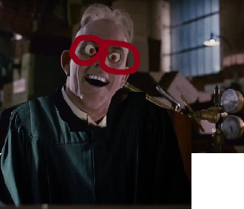

## 3.	 The twins will be happy on their birthday when they receive your present!

Click to reveal answer

3.
**will be, receive**
The first verb, will be, links a state of being — happy — to the twins. The second is an action verb, receive.

.

### happy = adjective

## 6.	 The screaming figure at the left of the painting represents a mother’s grief.

Click to reveal answer

 6.
**represents**
Although screaming and painting refer to actions, screaming functions as a description and painting as an object (a thing) in this sentence. The only verb in this sentence is **represents**.

Screaming 😱 = description

.

Painting 🖼️ = Object 

- 

## 7.	 Glenn has always carried the sizzling pizza in a special, heat-proof box.

Click to reveal answer

7.
**has carried**
The action in this sentence is expressed by two words, has carried, which together make one verb. The word sizzling resembles a verb but serves as a description, not the action in the sentence. Are you surprised that always isn’t included in the verb? It’s an adverb, telling when the action happens.

-------

auxiliary verb "**has**" and the past participle "**carried**." The main verb is "carried," which shows the action being performed.

NOTE:
[[grammar.rules.auxverb]]

- 

## 8.	 The puppies, along with the kittens, were displayed in the shop window for all to see.

Click to reveal answer

8.
**were displayed**
What happened to the puppies? They were displayed, the action verb in this sentence. Did "to see" trip you up? That’s an infinitive, the “head” of the verb family that never functions as the verb in a sentence.

TO = infinitive 

-

## 9.	 The last meeting of the council was bittersweet, as the members were now scattering for distant destinations.

Click to reveal answer

9.
**was, were scattering**
The sentence has two parts, one about the last meeting of the council and one about the actions of the members. The verb in the first part, was, expresses a state of being and links a description (bittersweet) to the subject (meeting). The verb in the second part, were scattering, tells you about the actions of the members.

-

## 10.	 To go faster, try not to look at the keyboard as you type.

Click to reveal answer

10.
**try, type**
Remember that infinitives, the “to + verb” form, simply name the verb family. They never function as verbs in a sentence. The action verbs here are try and type.

-
 
## 11.	 Smiling, Barbara wrestled with the math problem until she calculated the correct answer.

Click to reveal answer

11.
**wrestled, calculated**
The first word in the sentence, smiling, looks like an action verb. However, it functions as a description of Barbara. The true action verbs are wrestled and calculated.

- 

## 12.	 Daniel’s pen, having run out of ink, sat on the shelf, unused and forgotten.

Click to reveal answer

12.
**sat**
Several words in this sentence (having run, unused, forgotten) resemble verbs, but because they **function as descriptions**, they aren’t actually verbs. Sat is the only action verb.

- 
## 13.	 While copying the letter, Mike stuck his finger in the moving paper tray.

Click to reveal answer

13.
**copying, stuck**
The subject of this sentence, Mike, did two actions; he was copying and he stuck his finger in the tray. The first portion of the sentence begins with a conjunction (While), which should be followed by a subject-verb statement. Two words are missing, but Mike was copying is implied, so copying counts as an official verb.

- 

## 14.	 Norman has been judged “normal” by his doctor, but his friends view him differently.

Click to reveal answer

14.
**has been judged, view**
Three words make up the first verb in this sentence, has been judged, but the second idea needs only one verb, view, to express his friends’ actions.

- 
## 15.	 Sliding down the mountain, the ski instructor guided his students.

Click to reveal answer

15.
**guided**
The first verb form is an introductory participle. In other words, sliding is a description of ski instructor. You know it doesn’t function as a verb because it doesn’t follow a conjunction such as while, after, before, or a similar word. The action verb that pairs with ski instructor is guided, the only verb in this sentence.

- 

## Choosing Simple and Perfect Tense Verb Forms
### 16–55 Select the tense and form of the verb in parentheses that fits the meaning of the sentence.

20.	 Last week I tossed a bit of my dinner under the table because the dog _____(to beg) for scraps while I ate.

Click to reveal answer

20.
**was begging (Last week I tossed a bit of my dinner under the table because the dog was**
begging for scraps while I ate.) The verb in the first portion of the sentence, tossed, indicates an action that took place while another action occurred. The singular, past progressive tense gives a sense of an action, begging, that occurred over some time. The simple past-tense form, begged, would also work here, but the immediacy of past progressive tense is better.

22.	 Mr. Martin _____ (to trim) the tree after he had watered it.

Click to reveal answer

22.
**trimmed (Mr. Martin trimmed the tree after he had watered it.)**
In this sentence the busy Mr. Martin is doing two things, trimming and watering, but these actions occur at different times. Standard English requires that the earlier action, the watering, be in past perfect tense (had watered). The action that occurs second is expressed in simple past tense, trimmed.

23.	 While Harry _____ (to wash) the clothes, Oliver was brushing the dog’s matted fur.

Click to reveal answer

23.
**was washing (While Harry was washing the clothes, Oliver was brushing the dog’s**
matted fur.) The second portion of the sentence indicates that the action took place in the past (was brushing). The singular, past progressive form, was washing, works nicely here, because the actions happen at the same time and only one person was involved in the washing. (The simple past tense, washed, could also work in this sentence.)

- 

- 
25.	 Carla _____ (to fill) the gas tank before she realized that her credit card was not in her wallet.

Click to reveal answer

25.
**had filled (Carla had filled the gas tank before she realized that her credit card was not in**
her wallet.) Two actions occur in this sentence. Both are in the past, but one takes place before the other. Standard English requires that the earlier action be in past perfect tense (had filled). The action that occurs second is expressed in simple past tense, realized.

- 

26.	 By the time George gets home, Maria _____(to gobble) all the cookies, and George hates all the other snacks.

Click to reveal answer

26.
**will have gobbled (By the time George gets home, Maria will have gobbled all the cookies,**
and George hates all the other snacks.) The sentence includes a deadline — the time George gets home — and something that happens before the deadline — Maria’s snack attack. The future perfect tense, will have gobbled, is made for just such a situation.

- 

27.	 When I _____ (to bake) the cookies, I placed them on the dining room table.

Click to reveal answer

27.
**had baked (When I had baked the cookies, I placed them on the dining room table.)**
Two actions in the past show up in this sentence, the baking of the cookies and their placement on the table. Logic tells you that the baking happened before I placed the cookies somewhere other than in the oven. To move one action further in the past than another, use the past perfect tense, had baked.

- 