Chapter 2

# Below Here

# Chapter 2
## Taking a Look at Irregular, Helping, and Descriptive Verb Forms
Every year, my students are upset to discover that English has so many irregular verbs. If I were the Queen of Grammar, I’d outlaw irregular verbs. Unfortunately, without them I wouldn’t be able to fashion the first sentence of this chapter, because are would be behind bars. So would has! Like it or not, and because I’m not the *Queen of Grammar*, you and I are stuck with irregulars. Not to worry: In this chapter you practice selecting irregular verbs,changing meaning with helping verbs (should, can, may, do, does, did, and the like), and employing verb forms that can act as descriptions, which grammarians call participles and infinitives and the rest of us call “pains in the neck.”

## The Questions You’ll Work On
In this chapter, you work on questions that develop these skills:
✓	Using irregular past-tense and participle forms correctly
✓	Selecting the proper form and tense of the irregular verbs to be and to have
✓	Adding shades of meaning with the helping verbs should, must, can, could, may, might,
and would
✓	Creating questions with helping verbs
✓	Identifying participles functioning as descriptions
✓	Choosing the best form of participles and infinitives used as descriptions
## What to watch out for
Keep these points in mind when you answer the questions in this chapter:
✓	Check whether the past-tense form or participle is regular or irregular.
✓	Choose the correct tense of irregular verbs based on the meaning of the sentence.
✓	Employ reading comprehension skills to detect the need for a helping verb expressing
obligation, possibility, condition, or ability.
✓	Rearrange word order and add helping verbs to create questions.
✓	Select present participles or infinitives as descriptions for actions in the past, present, or future.

## Handling Irregular Verbs
### 66–90 Choose the proper past, present perfect, past perfect, or future perfect form of the irregular verb in parentheses so that the verb fits the meaning of the sentence.

66.	 Joe _____ (to catch) the ball as it reached the top of the outfield fence.

Click to reveal answer

66.
**caught (Joe caught the ball as it reached the top of the outfield fence.)**
The action takes place in the past, because the ball reached (past tense) the fence when Joe caught it. The irregular past-tense form of to catch is caught.

- 
67.	 The car was cruising along the highway smoothly until it _____ (to hit) a huge bump.

Click to reveal answer

67.
**hit (The car was cruising along the highway smoothly until it hit a huge bump.)**
The action is in the past, as the first verb, was cruising, tells you. The second verb should be in the past also, but because hitting a bump isn’t an event stretching over a time period, as cruising is, the simple past tense is best. Hit is the irregular past-tense form of to hit.

- 
68.	 Dorothy and the baby _____ (to sleep) for two hours when they returned from a visit to Grandma.

Click to reveal answer

68.
**slept (Dorothy and the baby slept for two hours when they returned from a visit to**
Grandma.) You need the simple past tense for the first part of this sentence, in order to match the past-tense verb (returned) in the second part of the sentence. The irregular past-tense form of to sleep is slept.

- 
69.	 At the end of the trial the judge _____ (to rise) from her chair and left the courtroom.

Click to reveal answer

69.
**rose (At the end of the trial the judge rose from her chair and left the courtroom.)**
The sentence talks about the past (left), so you need a past-tense verb for the blank. The irregular past-tense form of to rise is rose.

- 
70.	 Last week the Yankees _____ (to beat) their fiercest rivals.

Click to reveal answer

70.
**beat (Last week the Yankees beat their fiercest rivals.)**
The irregular past-tense form of to beat is beat. You know you need past tense because the sentence refers to last week.

- 
71.	 From 2010 through 2011, the confused clerk _____ (to put) all the forms in the wrong file cabinet.

Click to reveal answer

71.
**put (From 2010 through 2011, the confused clerk put all the forms in the wrong file**
cabinet.) The time range (2010 through 2011) tells you that you’re in the past. The irregular past- tense form of to put is put.

- 
72.	 The helicopter _____ (to fly) straight up into the sky and then headed south.

Click to reveal answer

72.
**flew (The helicopter flew straight up into the sky and then headed south.)**
The copter headed south, so you know that past tense is what you need. The irregular past-tense form of to fly is flew.

- 
73.	 Glenn _____ (to see) the little dog and grabbed her before she could run away again.

Click to reveal answer

73.
**saw (Glenn saw the little dog and grabbed her before she could run away again.)**
The sentence includes a past-tense verb, grabbed, which should be matched with the irregular past-tense form of to see, which is saw.

- 
74.	 I didn’t know that you _____ (to swim) in the deep water last summer; I thought you were less advanced in your swimming skills.

Click to reveal answer

74.
**swam (I didn’t know that you swam in the deep water last summer; I thought you were less**
advanced in your swimming skills.) The irregular past-tense form of to swim is swam. The words last summer indicate that you need past tense in this sentence.

- 
75.	 Nelson wouldn’t _____ (to get) sick if he had washed his hands more frequently.

Click to reveal answer

75.
**have gotten (Nelson wouldn’t have gotten sick if he had washed his hands more**
frequently.) The irregular past participle of to get is gotten, not got, in American usage. Therefore, have gotten is correct here.

- 
76.	 The bully approached, but because my uncle _____ (to teach) me how to handle difficult people, I wasn’t afraid.

Click to reveal answer

76.
**had taught (The bully approached, but because my uncle had taught me how to handle**
difficult people, I wasn’t afraid.) The sentence covers two time periods in the past — when the uncle taught and when the bully approached. The teaching takes place before the approaching, so the earlier action should be expressed in past perfect tense. The irregular past perfect form of to teach is had taught.

- 
77.	 The doctor _____ (to do) everything in his power; now Allison must wait for the medicine to take effect.

Click to reveal answer

77.
**has done (The doctor has done everything in his power; now Allison must wait for the**
medicine to take effect.) The doctor acted and now Allison is waiting, so past and present are connected in this sentence. The present perfect tense does the job here. The irregular present perfect form of to do is has done. The simple past tense, did, is also acceptable.

- 
78.	 Miriam _____ (to let) the dog out for a few minutes, but she will call him inside soon.

Click to reveal answer

78.
**let (Miriam let the dog out for a few minutes, but she will call him inside soon.)**
Miriam’s action occurred already, so past tense is appropriate for this sentence. The irregular past-tense form of to let is let.

- 
79.	 Although Adam _____ (to find) a good candidate already, the boss continued to interview others for the job.

Click to reveal answer

Your answer here

- 
80.	 “Who _____ (to begin) the fight, you or your brother?” asked Mother as she sepa- rated her battling children.

Click to reveal answer

80.
**began (“Who began the fight, you or your brother?” asked Mother as she separated her**
battling children.) The irregular past-tense form of to begin is began. The mother asked, so past tense makes sense. (Also, you can’t ask about the beginning of a fight until it has begun!)

- 
81.	 After you _____ (to send) the letter, shred the scrap copies.

Click to reveal answer

81.
**have sent (After you have sent the letter, shred the scrap copies.)**
The sentence deals with two time periods: the present (indicated by the command, shred) and the past, which is when the letter is mailed. The present and past are linked by the present perfect form, have sent.

- 
82.	 At first the rain was simply annoying, but when it _____ (to freeze), the streets became very slippery and many pedestrians fell.

Click to reveal answer

82.
**froze (At first the rain was simply annoying, but when it froze, the streets became very**
slippery and many pedestrians fell.) Three events take place more or less at the same time — the change from water to ice, the formation of slippery sidewalks, and the crash landing of many pedestrians. Because these events are simultaneous, the irregular past-tense form, froze, is what you want here.

- 
83.	 Albert _____ (to tear) his shirt when he crawled through the obstacle course.

Click to reveal answer

83.
**tore (Albert tore his shirt when he crawled through the obstacle course.)**
The simple past tense works fine here, because Albert tore his clothing when he crawled.

- 
84.	 “I _____ (to know) it!” exclaimed the detec- tive as the murderer confessed.

Click to reveal answer

84.
**knew (“I knew it!” exclaimed the detective as the murderer confessed.)**
The detective’s exclamation refers to one action in the past, not to a series of actions that must be put in order, a situation that requires the use of the past perfect tense. The simple past-tense form, knew, does the job here.

- 
85.	 When she attempted to pay for her coffee, Lee discovered that she _____ (to lose) all her coins because of a small hole in her pocket.

Click to reveal answer

85.
**had lost (When she attempted to pay for her coffee, Lee discovered that she had lost all**
her coins because of a small hole in her pocket.) The sentence mentions several events in the past. Attempting to pay for the coffee and discovering the hole happen more or less at the same time, but losing the coins occurs earlier. The earlier action is expressed with the past perfect tense, had lost. The other actions (attempted, discovered) are in simple past tense.

- 
86.	 By midnight Angie _____ (to sing) that aria enough times to set a world record.

Click to reveal answer

86.
**will have sung (By midnight Angie will have sung that aria enough times to set a world**
record.) The sentence contains a deadline (by midnight) and an action that will take place before the deadline (the singing). The future perfect tense, will have sung, is exactly what you need for this situation.

- 
87.	 In ancient times, murderers were often _____ (to hang) in the public square.

Click to reveal answer

87.
**hanged (In ancient times, murderers were often hanged in the public square.)**
The verb to hang has two important meanings — one, as in this sentence, refers to the execution of a criminal. The other is the verb that refers to hanging an object on a wall. For this sentence, you want the first meaning. The past-tense form for that meaning is hanged.

- 
88.	 The picture _____ (to hang) on the wall for years, but no one noticed it.

Click to reveal answer

88.
**hung (The picture hung on the wall for years, but no one noticed it.)**
The verb to hang has two important meanings — one referring to the execution of a criminal and the other to a painting or other object hanging on a wall. For the second meaning, which is the one you want for this sentence, the irregular past-tense form is hung.

- 
89.	 The janitor _____ (to sweep) the sidewalk before the students arrive, so expect a clean path.

Click to reveal answer

89.
**will have swept (The janitor will have swept the sidewalk before the students arrive, so**
expect a clean path.) The sentence states a deadline — before the students arrive. Future perfect tense works well with deadlines, so will have swept is the form you want. The simple future form, will sweep, or the present tense, sweeps, also fit this sentence.

- 
90.	 The riflemen _____ (to lay) down their weapons but are ready to resume target practice at a moment’s notice.

Click to reveal answer

90.
**have laid (The riflemen have laid down their weapons but are ready to resume target**
practice at a moment’s notice.) Two verbs, to lie and to lay, can be confusing. The first means to lie down, what you do when you take a nap. The second means to put or to place, which you do when you place a rifle on the ground. The present perfect form of to lay is has or have laid. Here you pair it with have because the subject, riflemen, is plural. Why present perfect tense? The action in the past (have laid down their weapons) is connected to the pres- ent, when they are ready to resume their practice.

- 
## Dealing with To Be and To Have
### 91–105 Select the proper form of the verb to be or to have to fit the meaning of the sentence.

91.	 The marble statue _____ (to be) on the shelf right now, but earlier it was in the sculptor’s studio.

Click to reveal answer

91.
**is (The marble statue is on the shelf right now, but earlier it was in the sculptor’s studio.)**
You know that the situation in the sentence takes place in the present tense because of the phrase right now. The third-person, singular form is works well because you are talking about the statue; therefore, you need a third-person form.

- 
92.	 Along with Jack, I _____ (to be) bored and decided to watch a different show.

Click to reveal answer

92.
**was (Along with Jack, I was bored and decided to watch a different show.)**
The sentence talks about something in the past, when I decided to watch anything other than the yawn-producing show on the television. The first-person form (when the speaker is the subject) is what you want. Therefore, the answer is was.

- 
93.	 The co-presidents _____ (to have) no trouble persuading club members to go out for pizza when they suggest the excur- sion at the end of the meeting, because ­everyone will be hungry then.

Click to reveal answer

93.
**will have (The co-presidents will have no trouble persuading club members to go out for**
pizza when they suggest the excursion at the end of the meeting, because everyone will be hungry then.) The clues here are when they suggest and everyone will be, which indicate that you are in the future tense. Singular and plural forms are the same in the future tense. Go for will have.

- 
94.	 Louisa rejected the sofa when it was delivered because it _____ (to have) a stain on one cushion.

Click to reveal answer

94.
**had (Louisa rejected the sofa when it was delivered because it had a stain on one cushion.)**
The sofa is already in the house (it was delivered), so you know you need past tense. The third-person form (the one used to talk about something) is what you want. The verb had is the answer.

- 
95.	 Max _____ (to be) sick for the last two days, but the doctor predicts that his temperature will be normal tomorrow.

Click to reveal answer

95.
**has been (Max has been sick for the last two days, but the doctor predicts that his temper-**
ature will be normal tomorrow.) The sentence ranges over the past (the last two days) and the present (predicts). Present perfect tense connects these two time periods. Go for the singular, third-person form, has been, because you’re talking about Max. When you talk about someone or something, you need a third-person form.

- 
96.	 The lottery winners _____ (to be) difficult; they refuse to share their winnings.

Click to reveal answer

96.
**are being (The lottery winners are being difficult; they refuse to share their winnings.)**
The second portion of the sentence talks about something happening right now, so you’re in the present tense. The action is ongoing, so the present progressive form is appropriate. Because you have winners, a plural, you want a plural form, are being.

- 
97.	 If the referee and the coach can’t agree, our efforts _____ (to be) fruitless because we will forfeit the game.

Click to reveal answer

97.
**will be (If the referee and the coach can’t agree, our efforts will be fruitless because we**
will forfeit the game.) The sentence talks about a possible event in the future, when we will forfeit. The future- tense will be matches nicely.

- 
98.	 Shelley _____ (to have) difficulty getting up on time ever since her alarm clock broke, but she plans to buy a new one soon.

Click to reveal answer

98.
**has had (Shelley has had difficulty getting up on time ever since her alarm clock broke,**
but she plans to buy a new one soon.) The first portion of the sentence talks about two time periods — when the alarm clock broke (past) and her present difficulty. Present perfect tense is, well, perfect for this sentence because it connects past and present. The present progressive form, is having, also works here, because Shelley’s difficulty is ongoing.

- 
99.	 While the elevators were rising, the mechanic _____ (to have) doubts about the strange noises below.

Click to reveal answer

99.
**was having (While the elevators were rising, the mechanic was having doubts about the**
strange noises below.) The first part of the sentence tells you about an ongoing action in the past, so past ­progressive tense makes sense for the second part of the sentence also. The mechanic is singular, and you’re talking about him, so opt for the third-person, singular, past ­progressive form, was having. Note: The simple past tense, had, also works here.

- 
100.	 We _____ (to be) here, patiently waiting, for more than four hours before Justin arrived.

Click to reveal answer

100.
**had been (We had been here, patiently waiting, for more than four hours before Justin**
arrived.) Two actions occur in the past, but one, the waiting, happened first. Go for we had been, the first-person, plural form of the past perfect tense. Past perfect tense places one event in the past prior to another.

- 
101.	 When Doreen _____ (to be) 13, she strug- gled to start her business, but one day sales began to rise.

Click to reveal answer

101.
**was (When Doreen was 13, she struggled to start her business, but one day sales began**
to rise.) You’re in the past when you talk about a business owner at age 13! (Another clue is struggled, which also indicates the past.) Go for the singular, past-tense form — was.

- 
102.	 By the time it opens on Broadway, the show _____ (to have) four different directors.

Click to reveal answer

102.
**will have had (By the time it opens on Broadway, the show will have had four different**
directors.) See the deadline in this sentence? It’s by the time it opens. A deadline tells you that you need future perfect tense, or will have had.

- 
103.	 Gina, who _____ (to be) your friend, begs you to forgive her.

Click to reveal answer

103.
**is (Gina, who is your friend, begs you to forgive her.)**
Because who stands in for Gina (in grammar terminology, Gina acts as the antecedent of who), you need a form that matches Gina. The verb is works well here, because you’re in present tense.

- 
104.	 Doug, who _____ (to be) very immature in those days, used to stick gum under everyone’s desk.

Click to reveal answer

104.
**was (Doug, who was very immature in those days, used to stick gum under everyone’s**
desk.) Two things were happening at the same time in this sentence: Doug’s immaturity and his pranks with gum. Because the statement about gum is in past tense, the statement about immaturity should be also. Doug is singular, so opt for was, a singular, past-tense form.

- 
105.	 Sam thought that his mom _____ (to have) a stroke, but fortunately he was wrong; it was just a headache.

Click to reveal answer

105.
**had had (Sam thought that his mom had had a stroke, but fortunately he was wrong; it was**
just a headache.) This verb form sounds like a typo, but it’s actually the past perfect tense. Two actions took place in the past — Sam’s thinking and whatever happened to his mom. The think- ing occurred after the illness started, so it’s expressed in simple past tense (thought). To place the illness earlier in the timeline, go for past perfect, had had. Another possi- ble answer is was having, in which case the thinking and the illness are simultaneous.

- 
## Adding Meaning with Helping Verbs
### 106–120 Choose the verb form that expresses the tense of the verb and the shade of meaning shown in parentheses.

106.	 Shelly’s song _____ (to win, present tense, ability) her an award for “Best New Artist.”

Click to reveal answer

106.
**can win (Shelly’s song can win her an award for “Best New Artist.”)**
The helping verb can expresses ability in the present tense.

- 
107.	 Alice _____ (to fly, future, possibility) to Buenos Aires on business next week.

Click to reveal answer

107.
**may fly (Alice may fly to Buenos Aires on business next week.)**
The helping verb may introduces a possibility in the present time. Did you consider might fly or could fly? These helping verbs also serve to express a possible action, but the strictest, most formal English generally reserves might and could for past-tense situations, as in yesterday Alice could go to Buenos Aires, but next week she cannot.

- 
108.	 Your hands _____ (to be, present, obliga- tion) clean before you perform surgery, Doctor!

Click to reveal answer

108.
**should be (Your hands should be clean before you perform surgery, Doctor!)**
The helping verb should introduces a sense of obligation. Another possible helping verb for this situation is must.

- 
109.	 Because she loves that color, Helen _____ (to choose, present, possibility) only green blocks for her playhouse.
SS

Click to reveal answer

109.
**may choose (Because she loves that color, Helen may choose only green blocks for her**
playhouse.) The helping verb may introduces a possibility in the present time. Did you consider might choose or could choose? These helping verbs also serve to express a possible action, but the strictest, most formal English generally reserves might and could for past-tense situations, as in Helen told me that she might choose only green blocks.

- 
110.	 On Saturday mornings, the whole family _____ (to attend, past, repeated action) Wendy’s softball games and cheer her on.

Click to reveal answer

110.
**would attend (On Saturday mornings, the whole family would attend Wendy’s softball games and cheer her on.)**
The helping verb would expresses a repeated or customary action in the past tense.

- 
111.	 The workers _____ (to pave, past, obliga- tion) the street more smoothly, but they did a sloppy job.

Click to reveal answer

111.
**should have paved (The workers should have paved the street more smoothly, but they did a sloppy job.)**
The helping verbs should and have, added to paved, create a statement about obliga- tion in the past.

- 
112.	 Margaret _____ (to jump, past, ability) over the fence easily, but instead she waited patiently for the guard to open the gate.

Click to reveal answer

112.
**could have jumped (Margaret could have jumped over the fence easily, but instead she**
waited patiently for the guard to open the gate.) The helping verb could expresses ability, and have moves the action of jumping into the past.

- 
113.	 Enter the house quietly because the baby _____ (to be, present, possibility) asleep.

Click to reveal answer

113.
**may be (Enter the house quietly because the baby may be asleep.)**
The helping verb may expresses possibility. Other verbs that work are might and could, but the strictest, most formal English reserves those helping verbs for past-tense sentences.

- 
114.	 The mathematician was told that she _____ (to calculate, present, obligation) the odds of failure before making a recommendation.

Click to reveal answer

114.
**must calculate (The mathematician was told that she must calculate the odds of failure**
before making a recommendation.) The helping verb must expresses obligation. Another possible answer is should calculate.

- 
115.	 The sheriff _____ (to arrest, present, ­obligation) Josephine for murder, as he has ­collected an overwhelming amount of ­evidence of her crime.

Click to reveal answer

115.
**should arrest (The sheriff should arrest Josephine for murder, as he has collected an**
overwhelming amount of evidence of her crime.) The helping verb should expresses obligation. Another possible answer is must arrest.

- 
116.	 If he graduates from high school with honors, Walter _____ (to enroll, future, ability) in college and continue on the path to success.

Click to reveal answer

116.
**can enroll (If he graduates from high school with honors, Walter can enroll in college and**
continue on the path to success.) The helping verb can expresses ability in the present or future. Did you opt for could enroll? The strictest, most formal English reserves could for past tense.

- 
117.	 Seven hours ago, Otis said that he _____ (to prepare, past, possibility) dinner, but we are still waiting, hungrier than ever.

Click to reveal answer

117.
**might prepare (Seven hours ago, Otis said that he might prepare dinner, but we are still**
waiting, hungrier than ever.) The helping verb might adds possibility to the verb prepare. Because you’re in the past tense, might works better in this sentence than may, another helping verb of possibility.

- 
118.	 “You _____,” (to continue, present, permission) remarked the teacher as the ­student hesitated.

Click to reveal answer

118.
**may continue (“You may continue,” remarked the teacher as the student hesitated.)**
The helping verb may expresses permission in the present tense.

- 
119.	 If it had not rained, Sam _____ (to go, past, condition) for a walk.

Click to reveal answer

119.
**would have gone (If it had not rained, Sam would have gone for a walk.)**
The helping verb would expresses a condition — the circumstances needed for Sam’s willingness to go for a walk, and have gone places the action in the past. Did you answer might have gone? That shades the meaning slightly, expressing the possibility of Sam’s walking. Because the question specifies condition, would have gone is the better choice.

- 
120.	 With a sharp pencil, Eliza _____ (to poke, past, repeated action) through the flimsy paper and then ask for a new sheet to write on.

Click to reveal answer

120.
**would poke (With a sharp pencil, Eliza would poke through the flimsy paper and then ask**
for a new sheet to write on.) The helping verb would expresses a repeated action in the past.

- 
## Creating Questions with Helping Verbs
### 121–130: Change the underlined portion of the sentence, as needed, to turn the statement into a question. Note: The period at the end of the sentence has been replaced by a question mark already.

121.	 <u>Mary owns</u> a small but valuable art collection?

Click to reveal answer

121.
**Does Mary own (Does Mary own a small but valuable art collection?)**
The helping verb does, together with the main verb own, creates a question. The sub- ject, Mary, should be placed between the singular helping verb (does) and the main verb (own).

- 
122.	 <u>Bert was carrying</u> a large carton of crayons to the daycare center?

Click to reveal answer

122.
**Was Bert carrying (Was Bert carrying a large carton of crayons to the daycare center?)**
The singular past progressive verb, was carrying, must be split by the singular subject, Bert, to create a question.

- 
123.	 <u>Jefferson will attend</u> the committee meet- ing this afternoon, despite his busy schedule?

Click to reveal answer

123.
**Will Jefferson attend (Will Jefferson attend the committee meeting this afternoon, despite**
his busy schedule?) The future-tense verb, will attend, is interrupted by the subject, Jefferson, in a question.

- 
124.	 <u>Eugene has</u> too many video games, according to his friend James?

Click to reveal answer

124.
**Does Eugene have (Does Eugene have too many video games, according to his friend**
James?) The statement (Eugene has too many video games, according to his friend, James) gets by with one present-tense verb, has. Another, less common possibility is Has Eugene too many video games, according to his friend James? However, the usual way to begin this question is Does Eugene have.

- 
125.	 After he had chewed his gum for an hour, <u>Steven blew</u> an enormous bubble?

Click to reveal answer

125.
**did Steven blow (After he had chewed his gum for an hour, did Steven blow an enormous**
bubble?) The first part of the sentence tells you that an hour passed, so you know that you’re in the past tense here. Past-tense questions may be created with the helping verb did. The subject, Steven, belongs between the helping verb and the main verb.

- 
126.	 <u>The wire between the fenceposts sags</u> so low that cattle cross easily from one field to the next?

Click to reveal answer

126.
**Does the wire between the fenceposts sag (Does the wire between the fenceposts sag so**
low that cattle cross easily from one field to the next?) The helping verb does pairs with the main verb sag to create a question. Wire is singu- lar, so does is the helping verb you need, not do.

- 
127.	 <u>Deborah is not</u> interested in reading that poem aloud?

Click to reveal answer

127.
**Is Deborah not (Is Deborah not interested in reading that poem aloud?)**
No helping verbs are needed to turn this statement, which contains the verb is, into a ques- tion. In fact, if the main verb of a sentence is a form of to be, you can usually forget about helping verbs when you’re creating a question. However, you should rearrange the word order to ask a question in formal English. Another possible answer is Isn’t Deborah. Isn’t is a contraction, a shortened form that substitutes an apostrophe for the omitted letter o.

- 
128.	 <u>You will have eaten</u> by the time George arrives at the restaurant?

Click to reveal answer

128.
**Will you have eaten (Will you have eaten by the time George arrives at the restaurant?)**
The subject, you, slips between two helping verbs, will and have, to create this ques- tion in the future perfect tense.

- 
129.	 <u>Ellie went</u> to the skating rink when it was closed?

Click to reveal answer

129.
**Did Ellie go (Did Ellie go to the skating rink when it was closed?)**
The past-tense form of the verb to go is went, but you can’t pair a helping verb with went to create a question — or for any other reason. Instead, you need to return to the infinitive, pull out the go, and add the past-tense helping verb, did, to ask a question in Standard English.

- 
130.	 <u>The winning essay compared</u> face-to-face communication with social media relationships?

Click to reveal answer

130.
**Did the winning essay compare (Did the winning essay compare face-to-face communica-**
tion with social media relationships?) The past-tense form, compared, drops out of this sentence when you change it into a question. The helping verb did (which is a past-tense form) is separated from the main verb, compare, by the subject, the winning essay.

- 

## Detecting and Placing Descriptive Verb Forms
### 131–140 In the sentence, which word or words function as descriptive verb forms (participles) and not as verbs?
 
131.	 In the flowing stream, Hank found a little paper boat.

Click to reveal answer

131.
**flowing**
Flowing is a form of the verb to flow, but in this sentence it describes stream. The main action in the sentence is found, which is what Hank did.

- 
132.	 Tom, pleased with his high test score, will celebrate with his family this evening.

Click to reveal answer

132.
**pleased**
The action in the sentence — the real verb — is will celebrate. The word pleased comes from the verb to please, but in this sentence it functions as a description of Tom.

- 
133.	 In the last scene of the play, Daniel walks rapidly toward the setting sun.

Click to reveal answer

133.
**setting**
The action in the sentence — the real verb — is walks. The word setting comes from the verb to set, but here it functions as a description of the sun.

- 
134.	 Confused, Eliza is sorting through the instructions for her new computer and printer.

Click to reveal answer

134.
**confused**
The main action in the sentence is expressed by the verb, is sorting. The verb form ­confused, a form of the verb to confuse, adds information about Eliza, but it functions as a description.

- 
135.	 The mountains rising majestically in the background are a symbol of nature’s power.

Click to reveal answer

135.
**rising**
The state of being in the sentence is expressed by the verb are. Rising, a form of the verb to rise, describes the subject of the sentence, mountains, but it doesn’t function as a verb.

- 
136.	 The printed word, carrying meaning for centuries, will never be obsolete.

Click to reveal answer

136.
**printed, carrying**
The main verb in the sentence is will be, which expresses a state of being. Two verb forms function as descriptions — printed and carrying. Both describe word.

- 
137.	 “I have done my homework!” screamed Andrew, tired of his mother’s nagging.

Click to reveal answer

137.
**tired**
The sentence has two parts: one in quotation marks and one that “tags” the quotation by identifying the speaker. Inside the quotation, the verb is have done. No word there functions as a description. In the other part of the sentence, screamed is a verb that tells you what Andrew is doing. The word tired gives you more information about Andrew, but it doesn’t function as a verb. Did you select nagging also? In this sentence, nagging is a noun — the “thing” Andrew can’t stand! It’s not a description.

- 
138.	 The research was done by laboratories around the world, all funded by one generous donor.

Click to reveal answer

138.
**funded**
The main verb in the sentence is was done. The verb form funded describes laboratories.

- 
139.	 Amelia is performing in the play, although she hates the conceited director, who, hired under a long-term contract, does whatever he wishes.

Click to reveal answer

139.
**hired**
Several words function as verbs in this sentence: is performing, hates, does, and wishes. Only one verb form is a description: hired. Did you choose conceited? True, that word resembles a verb because it ends in -ed. However, to conceit isn’t a verb; in fact, it isn’t even a word! Conceited is simply an adjective.

- 
140.	 The snake, sunning itself on the rock, slithered away when hikers came near him.

Click to reveal answer

140.
**sunning**
The sentence contains two verbs, slithered and came. The word hikers may look like the verb to hike, but it’s just a noun. The descriptive verb form in this sentence is sunning.

- 
## Selecting Tense for Descriptive Verb Forms
### 141–150 Which form of the verb in parentheses works best as a description in the sentence?
 
141.	 _____ (to prepare) the room for redecora- tion, Vincent discovered a crack that grew longer with every tug of the wallpaper he was removing.

Click to reveal answer

141.
**Preparing (Preparing the room for redecoration, Vincent discovered a crack that grew**
longer with every tug of the wallpaper he was removing.) Your reading comprehension skills tell you that Vincent’s tug on the old paper happens at the same time as the preparation of the room for redecoration. Therefore, the pres- ent participle, preparing, is correct.

- 
142.	 _____ (to speak) with intense emotion, the actor recites his lines every night without a trace of boredom.

Click to reveal answer

142.
**Speaking (Speaking with intense emotion, the actor recites his lines every night without a**
trace of boredom.) Two clues tell you that this sentence describes an ongoing situation: the main, present- tense verb (recites) and every night. For an ongoing situation, the present participle, speaking, works nicely.

- 
143.	 _____ (to water) the plants during vaca- tions, Caroline installed an automatic sprinkler.

Click to reveal answer

143.
**To water (To water the plants during vacations, Caroline installed an automatic sprinkler.)**
In this sentence, the installation happened in the past (Caroline installed), but the reason for the installation is ongoing. The infinitive, to water, states the reason.

- 
144.	 The mayor, _____ (to vow, to fight) crime, will increase the number of police officers.

Click to reveal answer

144.
**vowing to fight (The mayor, vowing to fight crime, will increase the number of police**
officers.) The main verb in the sentence, will increase, refers to the future. The present participle (vowing) is a good fit for a sentence with a future-tense verb, as is the present-tense infinitive, to fight, and the present perfect form, having vowed to fight.

- 
145.	 The cat raked sharp claws across the new desk _____ (to stand) in the corner of the living room.

Click to reveal answer

145.
**standing (The cat raked sharp claws across the new desk standing in the corner of the**
living room.) The present participle, standing, indicates that the desk is there at the same time that the cat raked his claws on it. Present participles express simultaneous events.

- 
146.	 His funds _____ (to exhaust), Nelson called home and begged for a loan from his parents.

Click to reveal answer

146.
**exhausted (His funds exhausted, Nelson called home and begged for a loan from his**
parents.) The past participle, exhausted, is a good match for the simple past-tense verb forms, called and begged.

- 
147.	 Annie walked ten miles _____ (to visit) her Aunt Marie.

Click to reveal answer

147.
**to visit (Annie walked ten miles to visit her Aunt Marie.)**
The infinitive, to visit, gives the reason for Annie’s long walk.

- 
148.	 _____ (to walk) the entire shoreline this morning, Ed can assure the reporters at tonight’s news conference that all the beaches are ready to reopen.

Click to reveal answer

148.
**Having walked (Having walked the entire shoreline this morning, Ed can assure the**
reporters at tonight’s news conference that all the beaches are ready to reopen.) To crack this sentence, make a timeline. First comes the walk, then the news confer- ence, and then the reopening of the beaches. To place the walk before the news confer- ence, use the perfect form, having walked.

- 
149.	 Barbara and Arnie, _____ (to confer) already, will need no introduction when they attend the next meeting.

Click to reveal answer

149.
**having conferred (Barbara and Arnie, having conferred already, will need no introduc-**
tion when they attend the next meeting.) The first encounter between Barbara and Arnie took place already. To express an action that occurs before another action in the sentence, use the perfect form, having conferred.

- 
150.	 “It’s great _____ (to meet) you!” exclaimed Paul as he shook hands with his new tennis partner, who had never seen Paul before in his life.

Click to reveal answer

150.
**to meet (“It’s great to meet you!” exclaimed Paul as he shook hands with his new tennis**
partner, who had never seen Paul before in his life.) Your reading comprehension skills tell you that Paul’s comment about meeting his partner refers to the same moment he extends his hand for a shake. The simple infini- tive, to meet, expresses simultaneous events. You don’t need the perfect form, which places one event before another.

- 

# Chapter 3
## One to Many: Forming Plurals of Nouns and Pronouns
According to one website, as of January, 2013, the English language was made up of - 1,019, 729.	 6 words. I don’t believe that anyone actually knows — or can know — how - many words are in any language. (And what on earth is 0.6 of a word?) So you can forget - about numbers when you study proper English, with one huge exception: You have to pay - attention to singular and plural forms of nouns and pronouns. In this chapter, you practice - with nouns, turning one (the singular form) into many (the plural form). You also sort - singular and plural pronouns, so that you can match them appropriately with the words - they represent.

## The Questions You’ll Work On
In this chapter, you work on questions that cover the following concepts:
✓	Forming plurals of common and proper nouns, both regular and irregular
✓	Creating plural forms of hyphenated and compound words
✓	Tackling difficult pronouns such as everything, one, either, all, some, that, which who, and so forth What to watch out for

## What to Watch Out For 
Keep these points in mind when you’re answering the questions in this chapter:
✓	Most nouns form the plural by adding the letter s. For nouns ending in ch, sh, x, s, and z, add es.
✓	Nouns ending in a y change the y to i and add es if the letter preceding the y is a consonant (any letter except a, e, i, o, or u).
✓	Add s or es to the most important word in a hyphenated or compound noun.
✓	These pronouns are always singular: one, everyone, everything, everybody, no one,
nothing, nobody, someone, something, somebody, either, neither, each, other, and another.
✓	These pronouns are always plural: few, both, several, and many.
✓	Relative pronouns (that, which, who) are singular if they refer to singular nouns
or pronouns and plural if they refer to plural nouns or pronouns.
✓	These pronouns can be either singular or plural: all, any, most, some, and none. If one of these pronouns refers to a plural (for example, all of the shows, in which all refers to shows), the pronoun is plural. If the pronoun refers to a singular (for example, most of the air, in which most refers to air), the pronoun is singular.

## Forming Plural Nouns
### 151–165 What is the correct plural form of these nouns?
 
151.	 stitch, telephone, tax

Click to reveal answer

729.
**I. and II. (I. Because the air is dry, the plant needs water more often. II. In dry air, the**
plant needs water more often.) In Sentences I and II, statements about the air (Because the air is dry and in dry air) introduce the main idea (the plant needs water more often). Sentences I and II convey meaning efficiently and correctly. Sentence III (Needing water more often, the air is dry for the plant) mangles the meaning, because an introductory verb form (Needing water more often, in this sentence) attaches to the subject (air, in this sentence). Sentence III doesn’t work.

- 
152.	 dye, splash, sandal

Click to reveal answer

152.
**dyes, splashes, sandals**
The words dye and sandal need only an s to form the plural. Splash, however, ends in sh, so you need to add es to form the plural.

- 
153.	 tomato, catch, mug

Click to reveal answer

153.
**tomatoes, catches, mugs**
The addition of s creates the plural of mug. The word catch, which ends with ch, needs es to form the plural. So does tomato. In general, a noun ending in o forms the plural with es if the letter preceding the o is a consonant. (A consonant is any letter except a, e, i, o or u.)

- 
154.	 monkey, turkey, baby

Click to reveal answer

154.
**monkeys, turkeys, babies**
To form the plural of a word ending in y, you add s if the y is preceded by a vowel (a, e, i, o, or u). You change the y to i and add es if the y is preceded by a consonant (any letter that isn’t a vowel). Therefore, monkey and turkey need only an s, because the second-to-last letter in each word is a vowel, e. Baby, on the other hand, changes to babies, because the second-to-last letter is a consonant, b.

- 
155.	 zoo, success, edge

Click to reveal answer

155.
**zoos, successes, edges**
To form the plural of a noun ending in o, you generally add only an s if the letter pre- ceding the final o is a vowel (a, e, i, o, or u). Therefore, zoos is the correct plural form. Words ending in the letter s form the plural with es, so go for successes. The word edge needs an s, and nothing more, to form the plural.

- 
156.	 child, woman, man

Click to reveal answer

156.
**children, women, men**
These three words are irregular. None form the plural with s or es. Instead, the whole word changes! For help with irregular plurals, check your dictionary. Near the singular form you should see the abbreviation pl., which stands for plural, followed by the plural form.

- 
157.	 deer, elephant, month

Click to reveal answer

157.
**deer, elephants, months**
Animal plurals can be tricky, so you should check your dictionary if you aren’t sure of the proper form. The plural of deer is deer! No change at all. On the other hand, you may see one elephant or two elephants while you’re on a safari. The plural of month is months.

- 
158.	 light, batch, biography

Click to reveal answer

158.
**lights, batches, biographies**
A simple s is enough for the plural of light. Add es to batch, because it ends with ch. A consonant precedes the y in biography, so you change the y to i and add es. (A conso- nant is any letter except a, e, i, o, or u.)

- 
159.	 microphone, jelly, virus

Click to reveal answer

159.
**microphones, jellies, viruses**
Add the letter s to form the plural of microphone. Because jelly ends in a y preceded by a consonant (any letter except a, e, i, o, or u), form the plural by changing the y to i and adding es. Add es to virus to form the plural, viruses, because the singular form ends in s.

- 
160.	 delivery, essay, wife

Click to reveal answer

160.
**deliveries, essays, wives**
Remember the rule about words ending in y: Add s if the letter preceding the y is a vowel (a, e, i, o, or u). Change the y to i and add es if a consonant (any letter that isn’t a vowel) precedes the y. Using this rule, you get deliveries (because a consonant pre- cedes the y in delivery) and essays (because a vowel precedes the y in essay). The word wife has an irregular plural form, wives.

- 
161.	 Smith, Jones, O’Toole

Click to reveal answer

161.
**Smiths, Joneses, O’Tooles**
To form the plural of names, add es to names ending in ch, sh, x, s, and z, and a simple s to everything else. Don’t form a plural of a name with an apostrophe!

- 
162.	 leaf, pitch, copy

Click to reveal answer

162.
**leaves, pitches, copies**
The irregular plural of leaf is leaves. (Always check your dictionary if you’re unsure whether a plural is regular or irregular.) Pitch ends in ch, so you add es to form the plural. Copy ends with y preceded by a consonant (any letter that isn’t a, e, i, o, or u), so change the y to i and add es to form the plural.

- 
163.	 son-in-law, kangaroo, tooth

Click to reveal answer

163.
**sons-in-law, kangaroos, teeth**
For a hyphenated word, zero in on the most important word and make that word plural — and nothing else! Therefore, the proper plural form is sons-in-law, because the family relationship (son) is highlighted. For words ending in o, you usually add an s if the letter preceding the o is a vowel (a, e, i, o, or u). Therefore, the plural of kangaroo is kangaroos. Teeth is an irregular plural. (Always check your dictionary if you’re unsure whether a plural is regular or irregular.)

- 
164.	 alumnus, mass medium, Woods

Click to reveal answer

164.
**alumni, mass media, Woodses**
The irregular plural of alumnus, a word that comes down to us via Latin, is alumni (or, for a group composed solely of females, alumnae). Similarly, the plural of medium, another word of Latin origin, is media, unless you’re using the word to mean a size (three mediums sold this morning but no smalls) or a psychic (Jim consulted three mediums in order to communicate with his dead pet). To form the plural of my last name, Woods, add es because the name ends with an s.

- 
165.	 species, statistic, vice president

Click to reveal answer

165.
**species, statistics, vice presidents**
Trick question here: You can have one species or two species — same spelling. Statistic takes an s to form the plural. For the compound word, vice president, add an s to the most important part, which in this case is president.

- 
## Sorting Singular and Plural Pronouns
### 166–195 Identify the singular (S) and/or plural (P) pronouns in the sentence.

- 
166.	 Isaac asked his aunt to reduce her work- load, but she refused.

Click to reveal answer

166.
**his (S), her (S), she (S)**
His, her, and she are all singular pronouns. Each refers to one person. Did you make a mistake and choose but? But is not a pronoun; it’s a conjunction — a joining word.

- 
167.	 As the children opened their presents, they told Santa how great his selections were.

Click to reveal answer

167.
**their (P), they (P), his (S)**
They and their are plural pronouns, referring to a plural noun (children). His is a singu- lar pronoun, referring to a singular noun, Santa. Did you mistakenly choose As? As isn’t a pronoun. It’s a conjunction — a joining word.

- 
168.	 We must apply sunscreen to our arms, according to my mother.

Click to reveal answer

168.
**We (P), our (P), my (S)**
We and our are plural pronouns. Each refers to a group. My is a singular pronoun; it refers to one person.

- 
169.	 “Where is your sneaker?” asked the babysitter as he searched the room I share with my little sister.

Click to reveal answer

169.
**your (S), he (S), I (S), my (S)**
Your, he, I, and my are singular pronouns. Each refers to one person.

- 
170.	 “Your yoga class will be delayed an hour,” I announced when the students had gathered in front of their lockers.

Click to reveal answer

170.
**Your (P), I (S), their (P)**
The yoga class contains more than one student, so your is plural. So is their, because it refers to the group. The personal pronoun I is always singular. Did you opt for had? Had is a verb, not a pronoun. Don’t be fooled into thinking that all short words are pronouns.

- 
171.	 A friend of mine wants to go on vacation with them, but they prefer to travel by themselves.

Click to reveal answer

171.
**mine (S), them (P), they (P), themselves (P)**
The pronoun mine refers to one person, so it’s singular. The pronouns them, they, and themselves are all plural because they refer to a group.

- 
172.	 The cookies are in his pocket; I saw them myself.

Click to reveal answer

172.
**his (S), I (S), them (P), myself (S)**
Three pronouns here are singular: his, I, and myself. All refer to just one person. Them is a plural pronoun because it refers to a group.

- 
173.	 The football coach remarked, “Everyone is counting on you,” but I was too stressed to play.

Click to reveal answer

173.
**Everyone (S), you (S), I (S)**
Three singular pronouns appear in this sentence: everyone, you, and I. Are you sur- prised to see that everyone is singular? All the pronouns that end in -one (including someone, anyone, and no one, as well as one all by itself) are singular.

- 
174.	 Something is wrong with the computer, because it blinks constantly and flashes a warning sign every hour.

Click to reveal answer

174.
**Something (S), it (S)**
All the pronouns that end with -thing (something, everything, nothing) are singular. It is also singular; in this sentence it refers to the singular noun, computer. Did every give you pause? Everything is a pronoun, but every is a description (an adjective).

- 
175.	 Several of the engineers have examined the platform and declared it safe, but when someone screamed, everyone ran.

Click to reveal answer

175.
**Several (P), it (S), someone (S), everyone (S)**
This sentence contains one plural pronoun, several. It, someone, and everyone are sin- gular pronouns. All the pronouns that end in -one (including someone, anyone, and no one, as well as one all by itself) are singular.

- 
176.	 One of the books has an index, but those on the top shelf do not, so we use them infrequently.

Click to reveal answer

176.
**One (S), those (P), we (P), them (P)**
Any pronoun containing -one, including the word one, is singular. We and them are plural because they refer to groups. So is those, which refers to books, a plural noun.

- 
177.	 Both of us entered the international math competition; however, no one from our country won.

Click to reveal answer

177.
**Both (P), us (P), no one (S), our (P)**
The pronouns both, us, and our are always plural. Any pronoun containing -one, includ- ing the two-word pronoun no one, is singular.

- 
178.	 Neither of my uncles attended the gradua- tion ceremony, so the principal mailed a diploma to each of them.

Click to reveal answer

178.
**Neither (S), my (S), each (S), them (P)**
Because you’re talking about uncles, you may be tempted to think that any pronoun nearby is plural. Resist that temptation! The pronoun neither is always singular, because it refers to one uncle at a time — neither this uncle nor the other uncle. The pronouns my and each are also singular. The only plural here is them, which refers to a group.

- 
179.	 The talk show host directed the question to her audience, but someone on stage answered it anyway.

Click to reveal answer

179.
**her (S), someone (S), it (S)**
Three pronouns here are singular: her, someone, and it. Did you think someone was plural? Any pronoun containing -one, including the word someone, is singular. Also, in case you erred in choosing anyway, be aware that anyway is an adverb, not a pronoun.

- 
180.	 All of the birds flew to the pond, but most of the water had evaporated, and they soon left.

Click to reveal answer

180.
**All (P), most (S), they (P)**
The pronouns all and most take their identity as singular or plural pronouns from the words they refer to. If the word referred to is singular, the pronoun is singular. If the word referred to is plural, the pronoun is plural. In this sentence, all refers to birds, a plural noun. Therefore, all is plural here. Most refers to water, a singular noun, so most is singular here.

- 
181.	 Either of the restaurants is fine with me, if anyone would like to stop for a snack.

Click to reveal answer

181.
**Either (S), me (S), anyone (S)**
All three pronouns here are singular — always! Either is always singular, because it refers to one restaurant at a time: either this restaurant or that one. All pronouns ending with -one, including anyone, are singular.

- 
182.	 Arthur located most of the films, but a few were hard to find, so we had to substitute others.

Click to reveal answer

182.
**most (P), few (P), we (P), others (P)**
All four of these pronouns are plural. Three — few, we, and others — are always plural. Most takes its identity as a singular or plural pronoun from the word it refers to. If the word referred to is singular, the pronoun is singular. If the word referred to is plural, the pronoun is plural. In this sentence, most refers to films, a plural noun, so most quali- fies as a plural pronoun.

- 
183.	 The hungry man asked me to give him some of my sandwiches.

Click to reveal answer

183.
**me (S), him (S), some (P), my (S)**
The pronouns me, him, and my in this sentence are all singular. Some is plural because it refers to more than one sandwich.

- 
184.	 Someone rang the bell, but no one was there when Judy opened the door, expecting to see her brother.

Click to reveal answer

184.
**Someone (S), no one (S), her (S)**
Pronouns ending in -one, including the two-word pronoun, no one, are always singular. Her refers to one female (in this sentence, Judy), so it’s singular also.

- 
185.	 Everyone was required to bring his or her swimsuit to camp, but Anna forgot to pack hers.

Click to reveal answer

185.
**Everyone (S), his (S), her (S), hers (S)**
Pronouns ending with -one are always singular, as are his and her, each of which refers to one person. The pronoun hers may look plural because it ends in s, but it is singular because it refers to one female.

- 
186.	 All of the orange juice spilled, but no one wiped the table until Billy called the manager and asked for her help.

Click to reveal answer

186.
**All (S), no one (S), her (S)**
In this sentence all refers to orange juice, a singular noun, so all is also singular. All the pronouns ending in -one are singular, including the compound pronoun no one. Her is also a singular pronoun.

- 
187.	 Each of Bobby’s bicycles is missing one wheel, but Bobby thinks both of the bikes can be repaired.

Click to reveal answer

187.
**Each (S), both (P)**
The pronoun each is always singular, and both is always plural. Did you add one to your list? True, one may be a pronoun, but not when it’s attached directly to a noun (one wheel, in this sentence). In such a situation, one is an adjective.

- 
188.	 Much of Gene’s trouble stems from his reliance on everyone’s admiration.

Click to reveal answer

188.
**Much (S), his (S), everyone’s (S)**
The pronoun much is singular, as are the possessive pronouns his and everyone’s.

- 
189.	 Sharla and Alex like one tattoo but hate the other; they have mixed opinions about mine, a blue star.

Click to reveal answer

189.
**other (S), they (P), mine (S)**
The pronoun other refers to one of the two tattoos that Sharla and Alex agree on, so other is singular. They is plural because it refers to Sharla and Alex (two people). Mine is singular in this sentence because it refers to one tattoo, a blue star. If you selected one, you fell into a trap. One is an adjective, not a pronoun, when it’s attached to a noun. In this sentence, one is attached to tattoo.

- 
190.	 The shoes that Mark bought weren’t comfortable, but they were more stylish than anything else he purchased yesterday.

Click to reveal answer

190.
**that (P), they (P), anything (S), he (S)**
The relative pronoun that takes its identity from its antecedent — the word it refers to. In this sentence, that is a stand-in for shoes, a plural, so that is plural also. They is always plural, and he is always singular. Anything is a singular pronoun also, just like the other pronouns that end with -thing: everything and something.

- 
191.	 Someone who should know better washed my best pair of pants in hot water.

Click to reveal answer

191.
**Someone (S), who (S), my (S)**
All the pronouns ending in -one are singular. Because someone is singular and who refers to someone, who is singular in this sentence, as is the pronoun my.

- 
192.	 The branches that tapped on the window made too much noise, so I cut them off.

Click to reveal answer

192.
**that (P), I (S), them (P)**
The relative pronoun that takes its identity from its antecedent — the word it refers to. In this sentence that is a stand-in for branches, a plural, so that is plural also. The pro- noun I is always singular, and them is always plural.

- 
193.	 While she waited to hear the winner’s name announced, Lulu, who had bought three lottery tickets, crossed her fingers for luck.

Click to reveal answer

193.
**she (S), who (S), her (S)**
The relative pronoun who can be either singular or plural, depending upon the word or words it refers to. In this sentence, who stands in for Lulu, a singular noun, so who is singular too. She and her are also singular pronouns.

- 
194.	 The envelope and writing paper, which were stored in the desk, are hers, but the stapler is theirs.

Click to reveal answer

194.
**which (P), hers (S), theirs (P)**
The relative pronoun which can be either singular or plural, depending on the word or words it refers to. In this sentence, which refers to two nouns, envelope and writing paper. Therefore, which is plural. Although the pronoun hers ends in s, it’s singular because it refers to one person. Theirs, on the other hand, is plural because it refers to a group.

- 
195.	 The doctor treated eight patients who were stricken by the same disease, which was fatal for nearly all of them.

Click to reveal answer

195.
**who (P), which (S), all (P), them (P)**
The relative pronouns who and which can be either singular or plural, depending upon the word or words they refer to. In this sentence, who stands in for patients, a plural noun, so who is plural too. Which refers to disease, a singular noun, and thus is singu- lar. The pronoun all can also be either singular or plural, depending upon what it refers to. In this sentence, all refers to them. Them is plural, so all is plural as well.

- 
# Chapter 4
## Identifying Subjects and Per  fecting Subject-Verb Agreement
What are you talking about, at this exact moment? That’s the subject of your - conversation. While I’m on the subject of subjects, I must mention that every sentence - has a subject — the who or what being discussed. The most important aspect of subjects - is agreement: not smiling and saying, “Yes! Yes!” but rather ensuring that a singular subject - pairs with a singular verb form and a plural subject pairs with a plural verb form. In this - chapter, you find the subject and then play matchmaker between subjects and verbs. (If you - have trouble identifying the verb, turn to Chapters 1 and 2 for extra help.)

## The Questions You’ll Work On
In this chapter, you work on questions that cover the following concepts:
✓	Finding the subject in statements, questions, and commands
✓	Identifying compound subjects and pronouns acting as subjects
✓	Choosing the correct verb for every subject-verb pair

## What to Watch Out For 
Keep these points in mind when you’re answering the questions in this chapter:
✓	To find the subject, first locate the verb(s) in the sentence. Ask who? or what? is performing the action or is in the state of being expressed by the verb.
✓	Don’t be fooled by location. Most subjects appear before the verb, but some follow the verb. Use your reading comprehension skills to answer the who? or what? questions.
✓	Most subjects and verbs show up with descriptions attached. Ignore distracting words or phrases and concentrate on the real subject-verb pair.
✓	Verb forms used as descriptions or as nouns may resemble verbs without functioning
as the verb in the sentence. When you ask who? or what? to find the subject, be sure you’re working from the real verb.
✓	The subject in a command may be an understood, but not stated, you.
✓	Pronouns acting as subjects can be tricky. Check out Chapter 3 for help distinguishing singular and plural pronouns.

## Locating the Subject
### 196–215 Identify the subject(s) in the sentence.

196.	 The plastic tip of the shoelace slowly slipped through the hole as Juan marched down the street.

Click to reveal answer

196.
**tip, Juan**
The first verb in the sentence is slipped. When you ask who slipped? you have no answer. When you ask what slipped? the answer is tip. Next verb up is marched. Okay, who marched? The answer is Juan. Your subjects are tip and Juan. Did you select shoe- lace? That word appears in a description — the prepositional phrase of the shoelace. The subject is never part of a prepositional phrase.

- 
197.	 Marina and Tom are in the grocery store on the corner of Appleton Avenue.

Click to reveal answer

197.
**Marina, Tom**
The verb in this sentence is are. When you ask who are? the answer is Marina and Tom are. The word and is a conjunction — a word that joins. Ignore it and you see the sub- jects of this sentence: Marina, Tom.

- 
198.	 Eight security cameras constantly swiveled in their holders on the ceiling of the jewelry store.

Click to reveal answer

198.
**cameras**
The verb in the sentence is swiveled. When you ask who swiveled? you have no answer. What you ask what swiveled? the answer is cameras swiveled. The subject is cameras. (Eight and security are descriptions attached to cameras, not the subjects.)

- 
199.	 In the garden behind the house, the bride and groom solemnly recited their vows.

Click to reveal answer

199.
**bride, groom**
The verb in the sentence is recited. When you ask who recited? the answer is bride and groom recited. Ignore and, a conjunction (joining word). The subjects are bride, groom.

- 
200.	 Only one girl in the crowd of 200 fans ­actually got an autograph.

Click to reveal answer

200.
**girl**
The verb in the sentence is got. When you ask who got? the answer is girl got. Your subject is girl. Did you stumble over the crowd of 200 fans? All those words are extra information.

- 
201.	 Jumping on the trampoline is fun for Lily and Jane during the long weeks of summer vacation.

Click to reveal answer

201.
**Jumping**
The verb in this sentence is is. When you ask who is? you have no answer. When you ask what is? the answer is jumping. Yes, the subject looks like a verb! In fact, it could be part of a verb in a different sentence. In this sentence, though, jumping is a noun and the subject of the sentence. If you answered jumping on the trampoline, don’t worry. You just added on the description attached to jumping. The subject is still there, so your answer is acceptable.

- 
202.	 Stop talking back to the teacher now!

Click to reveal answer

202.
**you (understood)**
The verb here is stop, a command. If you ask who stop? the answer is the person you’re commanding. In other words, the subject of a command is always you, but the subject in a command is understood, not stated.

- 
203.	 Henry distributed sheets of paper to whoever needed some.

Click to reveal answer

203.
**Henry, whoever**
This sentence contains two verbs, distributed and needed. Ask the questions for each verb. Who distributed? The answer is Henry distributed, so Henry is the subject of distrib- uted. Now ask who needed? The answer is whoever needed. Therefore, whoever is the subject of needed.

- 
204.	 Does the new brand of peanut butter taste odd to you?

Click to reveal answer

204.
**brand**
The verb in this question is does taste. Ask the usual questions — who does taste? what does taste? The answer is new brand of peanut butter. In that expression, one word (brand) is key and the rest (new, of peanut butter) are descriptions. The subject is brand. If you answered the new brand of peanut butter, you added the descriptions to the subject, but count your answer as correct because it includes the subject.

- 
205.	 There on the shelf sat four large statues of historical figures.

Click to reveal answer

205.
**statues**
Follow the usual procedure to find the real subject in this sentence. Locate the verb, in this case sat, and ask who sat? and what sat? The second question tells you that four large statues of historical figures sat. Okay, time to dig the subject out of that long list of words. Ignore the descriptions (four, large, of historical figures) and you’re left with ­statues, the true subject. If you answered four large statues of historical figures, count your answer as correct because it includes the subject.

- 
206.	 Above the clouds and far from the violent storm, the plane flew safely toward its destination.

Click to reveal answer

206.
**plane**
The verb in the sentence is flew. Ask the questions: Who flew? You have no answer. What flew? The answer is plane, and that’s your subject. Notice that this subject is located in the middle of the sentence. Don’t choose a subject by location; use the ques- tions, and you’ll find the correct answer.

- 
207.	 The bus full of delighted tourists slowly circled the famous monument.

Click to reveal answer

207.
**bus**
The verb in this sentence is circled. When you ask who circled? you may think the answer is tourists. Look more closely at the sentence. True, the tourists moved, but they moved because they were on the bus. Go back to the verb and ask what circled? Now the answer is clear: the bus circled. The subject is bus. By the way, full of delighted tour- ists is a prepositional phrase, which never contains the subject of a sentence.

- 
208.	 Each of the coffee cups has a small crack near the rim.

Click to reveal answer

208.
**Each**
The pronoun each is the subject here, and of the coffee cups is a description clarifying the meaning of each. (In grammar terminology, cups is the object of a preposition and not eligible to be a subject.) The verb is has, and when you ask what has? the answer is each has. If you answered each of the coffee cups, your answer is acceptable because the real subject, each, is included with its descriptions.

- 
209.	 Both of the parakeets happily land on my finger for a bit of birdseed and a bite of lettuce.

Click to reveal answer

209.
**Both**
The verb in this sentence is land. Ask your question: Who land? The answer, in long form, is both of the parakeets. Now take away the description (of the parakeets, a prepo- sitional phrase) and you’re left with the subject, the pronoun both. Parakeets, by the way, can’t be a subject because in this sentence it functions as the object of the prepo- sition of. If you answered both of the parakeets, your answer is acceptable because the real subject, both, is included with its descriptions.

- 
210.	 Allison and her former friend Pete parted angrily, snarling at each other and walking in opposite directions.

Click to reveal answer

210.
**Allison, friend**
The main verb in this sentence is parted. You may have detected two other verb forms, snarling and walking. In this sentence those verb forms function as descriptions. Okay, ask the question: Who parted? The answer is Allison and her former friend Pete. Now you have to excavate the real subjects. Cross out the descriptions (her, former) and the conjunction (the joining word and). You can also cross off Pete because in this sen- tence, Pete and friend are the same person. The first one in the sentence, friend, is the subject. The second, Pete, is an appositive — the grammar term for an equivalent. An appositive isn’t a subject.

- 
211.	 Grandpa, who loves hockey, was the goalie on his college team.

Click to reveal answer

211.
**Grandpa, who**
This sentence makes two statements, each with its own verb and subject. The first statement is Grandpa was the goalie on his college team. The second statement is who loves hockey. Take them one at a time. The verb in the first statement is was. Ask the question who was? The answer is Grandpa. There’s your first subject. Now check out the second statement. The verb is loves. Who loves? The answer, oddly enough, is who loves. The pronoun who is the subject of the verb was. (Who, of course, is a stand-in for Grandpa.)

- 
212.	 Either the apartment with a terrace or the townhouse will surely please that buyer.

Click to reveal answer

212.
**apartment, townhouse**
The word either is tricky. In some situations it’s a pronoun, but when it’s paired in a sentence with or, both the either and the or are conjunctions (joining words). In an either/or sentence — and also in a neither/nor sentence — the subjects are linked by these conjunctions. In this sentence, the subjects are apartment and townhouse. The verb is will please. When you ask who will please? and what will please?, you discover the apartment and townhouse.

- 
213.	 The dog that I believe should win the contest is over there.

Click to reveal answer

213.
**dog, that, I**
Before you can locate the subjects, you have to untangle the statements in this sen- tence. You have three: (1) The dog is over there; (2) that should win the contest; (3) I believe. Now zero in on each statement separately. In the first, the verb is is. When you ask who is? the answer is the dog is. Dog is your first subject. Now go to the second statement. The verb is should win. Who should win? Your answer is the pronoun that. Did you answer dog again? The logic is understandable, but the grammar is clear. The pronoun that replaces dog in the second statement. The subject of should win is that. The third statement is easy. Who believes? I believe. The subject is I. As always, the key to untangling all the statements is to identify the verbs and ask the usual subject questions.

- 
214.	 Courtney, along with her mother, spoke politely to the mayor about the need for longer library hours.

Click to reveal answer

214.
**Courtney**
This sentence is easier to figure out if you cross out the prepositional phrase, along with her mother. (It’s a description.) Now the verb, spoke, pops out. Who spoke? Courtney spoke. True, your reading comprehension skills may have told you that both Courtney and her mother spoke, but the word and isn’t in the sentence. Because mother is the object of the preposition along with, it can’t function as a subject.

- 
215.	 The fire truck, which is heading to a blaze downtown, speeds through the intersection.

Click to reveal answer

215.
**truck, which**
To find the subjects of this sentence more easily, untangle the two statements the sen- tence contains: (1) The fire truck speeds through the intersection and (2) which is head- ing to a blaze downtown. Now analyze each statement separately. In the first statement, the verb is speeds. What speeds? The truck. In the second statement, the noun truck has been replaced by a pronoun, which. The verb is is heading. Ask your question: What is heading? The answer is which. Did you choose truck for both verbs? That’s a common mistake, because which represents truck. However, when one subject works for two verbs, the verbs are joined by a conjunction such as and or but.

- 
## Fine-Tuning Subject-Verb Agreement
### 216–240 In the context of the sentence, what form of the verb (V) in parentheses is correct, and what is the subject (S) of that verb?

216.	 Every morning Anna _____ (to open, present tense) the gate and _____ (to allow, present tense) her poodle to play in the yard.

Click to reveal answer

216.
**V: opens, allows; S: Anna. (Every morning Anna opens the gate and allows her poodle to**
play in the yard.) The sentence has two action verbs (to open and to allow). You must stay in the present tense, so you have two possible for each verb — open or opens and allow or allows. First, ask your subject questions without worrying about which form you need. When you ask who open or opens? and who allow or allows? the answer is Anna. Now you know you have a singular subject (Anna), which matches with the singular verbs, opens and allows.

- 
217.	 On the way to work, Clare and David always _____ (to share, present perfect tense) funny stories about their boss.

Click to reveal answer

217.
**V: have shared; S: Clare, David. (On the way to work, Clare and David always have shared**
funny stories about their boss.) The sentence contains one verb, which must be in present perfect tense. Your options are has shared and have shared. First, ask your subject questions without worrying about which form you need. When you ask who has shared or have shared? the answer is Clare and David. And is a word that adds one subject to another, creating a plural. Now you know you have a plural subject (Clare, David), which matches with the plural verb, have shared.

- 
218.	 The large-sized bottle of my favorite shampoo _____ (to be, past tense) on sale last week.

Click to reveal answer

218.
**V: was; S: bottle. (The large-sized bottle of my favorite shampoo was on sale last week.)**
The sentence contains one verb, which must be in past tense. Therefore your options are was and were. Ask your subject questions without worrying about which form you need. When you ask who was or were? you get no answer. Now ask what was or were? The answer is bottle. (The other words attached to bottle are all descriptions. You can ignore them. In case you’re curious about grammar terms, large-sized is an adjective and of my favorite shampoo is a prepositional phrase.) You have a singular subject (bottle), which matches with the singular verb, was. If you included the descriptions, large-sized and of my favorite shampoo, your answer is still acceptable, so long as you included bottle, the real subject.

- 
219.	 Alicia and I _____ (to plan, present progressive tense) a talent show to raise money for needy children.

Click to reveal answer

219.
**V: are planning; S: Alicia, I. (Alicia and I are planning a talent show to raise money for**
needy children.) The verb to plan must be in present progressive tense, so your choices are is planning and are planning. Ask your subject question: Who is or are planning? The answer is Alicia and I. In English, as well as in math, one plus one equals two. So add Alicia and I and you end up with two people, a plural subject, which must match the plural verb form are planning.

- 
220.	 The Cub Scouts _____ (to place, past progressive tense) candy apples in small, sticky piles in preparation for the Halloween party.

Click to reveal answer

220.
**V: were placing; S: Scouts. (The Cub Scouts were placing candy apples in small, sticky piles**
in preparation for the Halloween party.) The verb to place must be in past progressive tense, so you must choose between was placing and were placing. Ask your subject question: Who was or were placing? The answer is Scouts were placing. The plural subject Scouts matches the plural verb were placing. If you chose Cub Scouts, consider your answer correct also. Cub is a descriptor, telling you what kind of Scouts you’re discussing.

- 
221.	 _____ (to be, past tense) Hank pleased when he _____ (to read, past tense) your letter?

Click to reveal answer

221.
**V: Was, read; S: Hank, he. (Was Hank pleased when he read your letter?)**
Divide this sentence into its two component parts and work on each one separately. The first part is Was or Were Hank pleased. Hank is singular, so you need was, a singu- lar verb form. Now for the second part: when he read your letter. The verb is read, a handy past-tense form that is the same for both singular and plural subjects. Ask the question who read? The answer to that part of the sentence is he.

- 
222.	 The best exhibits in the museum _____ (to seem, present tense) more crowded lately.

Click to reveal answer

222.
**V: seem; S: exhibits. (The best exhibits in the museum seem more crowded lately.)**
The two present-tense choices available to you are seems and seem. Ask your subject question: Who seem or seems? You get no answer, so replace who with what and ask again: What seem or seems? The answer is exhibits, a plural subject that pairs with the plural verb form seem.

- 
223.	 Matthew and I _____ (to sing, past progres- sive tense) every single song until our voices _____ (to break, past tense) from overuse.

Click to reveal answer

223.
**V: were singing, broke; S: Matthew, I, voices. (Matthew and I were singing every single**
song until our voices broke from overuse.) Take each part of the sentence separately. The first blank offers two options in the past progressive tense, was singing and were singing. Ask your subject question: Who was or were singing? The answer is Matthew and I, a plural subject because you have two people. Therefore, you need the plural verb, were singing. Onward to the second part of the sentence: Who broke? The answer is voices broke. There you go: You have two verbs, were singing and broke, and three subjects, Matthew, I, and voices. By the way, broke is the past-tense verb form for both singular and plural subjects. Convenient, right?

- 
224.	 _____ (to have, present tense) you any extra icing for my birthday cake?

Click to reveal answer

224.
**V: Have; S: you. (Have you any extra icing for my birthday cake?)**
The verb to have has two forms in the present tense: has and have. When you ask the subject question who has or have? the answer is you have. Is you singular or plural? You have no way of knowing, and it doesn’t matter. The pronoun you may be singular or plural, depending upon context. Either way, it matches with have.

- 
225.	 Through the dark, damp tunnel _____ (to crawl, present tense) the chipmunks, eager to reach the picnic tables.

Click to reveal answer

225.
**V: crawl; S: chipmunks. (Through the dark, damp tunnel crawl the chipmunks, eager to**
reach the picnic tables.) The subject in this sentence is in an unusual spot, after the verb instead of before. No worries: Just ask the usual question: Who crawl or crawls? The answer is chipmunks, a plural, which must be matched with the plural verb form crawl.

- 
226.	 Ham and cheese _____ (to be, present tense) my favorite sandwich, but salad _____ (to be, present tense) a more nutritious choice.

Click to reveal answer

226.
**V: is, is; S: ham and cheese, salad. (Ham and cheese is my favorite sandwich, but salad is a**
more nutritious choice.) When foods form one dish or sandwich (peanut butter and jelly, for example, or rice and beans), the dish or sandwich is considered one, singular item. Therefore, when you ask what is or are? to find the answer for the first blank, your answer is ham and cheese, a singular subject that takes a singular verb, is. When you ask the same ques- tions for the second blank, you get salad is — both singular forms.

- 
227.	 “Your problem _____ (to be, present tense) 17 unexcused absences,” commented the teacher as she explained why the student was scheduled for detention.

Click to reveal answer

227.
**V: is; S: problem. (“Your problem is 17 unexcused absences,” commented the teacher as**
she explained why the student was scheduled for detention.) This sentence revolves around a form of the verb to be, a linking verb that acts as a sort of “equal sign” in the sentence. If you were writing this sentence as a math prob- lem, you’d have “problem = absences.” You may notice that the first part of the “equa- tion” is singular (problem) but the second part is plural (absences). So which one governs the verb? The first one. In this type of sentence, location is everything.

- 
228.	 Politics _____ (to influence, present tense) much of the debate on that issue, but the senators from that state always _____ (to vote, present tense) according to their consciences.

Click to reveal answer

228.
**V: influences, vote; S: Politics, senators. (Politics influences much of the debate on that**
issue, but the senators from that state always vote according to their consciences.) The word politics appears to be plural because it ends in the letter s. However, it’s sin- gular. Therefore, you should pair it with the singular verb form influences. In the second blank, your choices are votes and vote. Ask your question: Who vote or votes? The answer is senators vote — a plural subject-verb combination.

- 
229.	 John, not his friends, _____ (to go, present progressive tense) to attend the ceremony.

Click to reveal answer

229.
**V: is going; S: John. (John, not his friends, is going to attend the ceremony.)**
The expression not his friends is a distraction in this sentence. Notice the commas sur- rounding it? Imagine that you can lift the expression out of the sentence. Now your task is easier. The choices for present progressive include is going and are going. Time for your question: Who is going? The answer: John is going. The singular subject John matches the singular verb is going.

- 
230.	 Any of the solutions he _____ (to offer, present tense) to the panel _____ (to be, present tense) acceptable.

Click to reveal answer

230.
**V: offers, are; S: he, any. (Any of the solutions he offers to the panel are acceptable.)**
This sentence has two parts, one tucked inside the other. When you untangle them, the answer is easier to determine. The tucked-in part is he (offers/offer) to the panel. The outer part is any of the solutions (is/are) acceptable. In the tucked-in part, you have he offers, a singular subject and verb that you find with the usual questions (Who offers or offer? He offers. The singular subject he matches the singular verb offers.) In the outer portion of the sentence, the pronoun any is plural because the word it refers to (solu- tions) is plural. (Remember that any can be either singular or plural depending upon the word that it refers to.) Once you know that any is plural in this sentence, you can choose the plural verb are right away.

- 
231.	 _____ (to be, present tense) the House of Representatives in session now?

Click to reveal answer

231.
**V: Is; S: House of Representatives. (Is the House of Representatives in session now?)**
The House of Representatives is a single body — one thing. Therefore, pair it with the singular verb form is and you have a correct sentence.

- 
232.	 Most of the salt in those diets _____ (to come, present tense) from natural sources.

Click to reveal answer

232.
**V: comes; S: Most. (Most of the salt in those diets comes from natural sources.)**
The pronoun most can be either singular or plural depending upon the word it refers to. In this sentence, most refers to salt, a singular word. Therefore, most is a singular subject that pairs nicely with the singular verb comes. If you selected salt or diets as subjects, you forgot one important fact: The object of a preposition can’t be a subject. If you answered most of the salt in those diets, count your answer as correct because the true subject, most, is included with the descriptions.

- 
233.	 Two or three of the plants with red leaves _____ (to droop, present progressive tense) to the ground because of the drought.

Click to reveal answer

233.
**V: are drooping; S: two, three. (Two or three of the plants with red leaves are drooping to**
the ground because of the drought.) To crack this sentence, ignore the distractions — the prepositional phrases of the plants and with red leaves. Now ask your questions: Who is or are drooping? What is or are drooping? Your answer is two or three. The numbers two and three function as sub- jects here. They are plurals, so they need the plural verb are drooping.

- 
234.	 The study of economics _____ (to seem, present tense) interesting, but I have never taken any courses about this subject.

Click to reveal answer

234.
**V: seems; S: study. (The study of economics seems interesting, but I have never taken any**
courses about this subject.) Cross off the prepositional phrase (of economics), which distracts you from the true subject-verb pair. Now focus on what’s left: the study (seems/seem) interesting. Study is singular, so you need the singular verb form seems.

- 
235.	 Two hours of homework _____ (to be, pres- ent perfect tense) my usual amount, but I _____ (to expect, present tense) to spend more time on my studies next year.

Click to reveal answer

235.
**V: has been, expect; S: hours, I. (Two hours of homework has been my usual amount, but I**
expect to spend more time on my studies next year.) When you speak about an amount of time, the amount is singular. Therefore, even though two hours appears to be plural, it’s actually singular because it’s one amount. Now ask the questions: Who has been? What have been? The answer is two hours or hours, which in this sentence is a singular subject and must pair with the singular verb form has been. The second part of the sentence is easy: Who expect or expects? The answer is I expect.

- 
236.	 Every girl and boy in the kindergarten _____ (to play, present tense) with the plastic blocks, not the wooden ones.

Click to reveal answer

236.
**V: plays; S: girl, boy. (Every girl and boy in the kindergarten plays with the plastic blocks,**
not the wooden ones.) The word every has the power to change the meaning of the sentence. No matter what follows it — even something that appears plural such as girl and boy — the word every creates a singular expression. Why? The logic is that every makes you consider the members of the group one by one. Every is not a pronoun and can’t be a subject. Therefore, when you ask who play or plays? the answer is girl and boy, which is singular because the expression is preceded by every. Isn’t English a strange language?

- 
237.	 That little girl _____ (to be, present tense) the only one of the dancers who _____ (to make, present tense) friends easily.

Click to reveal answer

237.
**V: is, makes; S: girl, who. (That little girl is the only one of the dancers who makes friends**
easily.) The first part of this sentence is easy. The subject, girl, pairs with the singular form is. The second portion is tricky, as are all sentences that refer to a group and a member of the group. These sentences contain the statements the only one of the (insert group name) or one of the (insert group name), followed by who, which, or that. The key is to think about the meaning of the who/which/that statement. In this sentence, the who statement is about making friends easily. When you apply your reading comprehension skills, you see that only one person is in that category. Therefore, who represents girl, a singular noun. Because who is singular, it requires a singular verb, makes.

- 
238.	 A thousand dollars _____ (to be, present tense) too much to pay for that broken- down car, which _____ (to look, present tense) like a rusty bucket.

Click to reveal answer

238.
**V: is, looks; S: dollars, which. (A thousand dollars is too much to pay for that broken-down**
car, which looks like a rusty bucket.) Amounts of money function as singular subjects, unless you’re talking about the pieces of metal or paper that make up our currency. When you ask what is or are? for the first part of the sentence, the answer is thousand dollars, which looks plural but is actually singular. Therefore, you need the singular verb is, paired with the singular subject dol- lars or thousand dollars. (Either choice is fine.) Now check out the second part of the sentence. Ask the question what look or looks? The answer is the pronoun which. Because which refers to the singular noun car, it’s a singular subject and needs the sin- gular verb looks.

- 
239.	 Neither Ginger nor her aunts _____ (to have, present tense) keys to the house, but the landlord _____ (to be, present tense) able to supply an extra set.

Click to reveal answer

239.
**V: have, is; S: Ginger, aunts, landlord. (Neither Ginger nor her aunts have keys to the**
house, but the landlord is able to supply an extra set.) The paired conjunctions (joining words) neither/nor follow a simple rule: The subject that is closest to the verb is the one to match. In this sentence, aunts is closer to the blank than Ginger. (Why focus on Ginger and aunts? Ask the question who has or have? The answer is Ginger and aunts, which are the subjects.) Because aunts is plural, you need the plural verb form, have. Moving to the second blank, your choices are are, is, and am — all present-tense forms of to be. Ask who are? who is? what am? and the answer is landlord is.

- 
240.	 Shelby _____ (to sell, present progressive tense) me one of the cars that _____ (to be, present tense) energy efficient.

Click to reveal answer

240.
**V: is selling, are; S: Shelby, that. (Shelby is selling me one of the cars that are energy**
efficient.) This sentence contains two separate statements: (1) Shelby is selling me one of the cars and (2) that are energy efficient. The first portion of this sentence is easy: Shelby (singu- lar subject) pairs with is selling (singular verb). The second portion of the sentence is harder. The key is the pronoun that, which begins a statement about energy-efficient cars. Your reading comprehension skills tell you that more than one car falls into the energy-efficient category, and Shelby is selling one of them. Because more than one car is energy-efficient, that is plural and pairs with the plural verb are.

- 
# Chapter 5
## Coming to a Clear Agreement: Pairing Pronouns and Antecedents
Pronouns are like socks. They have to fit perfectly, because if they don’t, you spend the - day walking around with a lump around your toes or pulling up a too-short heel. They - also have to match: no green and blue mixing allowed! Pronouns are stand-ins for other - nouns or pronouns — their antecedents. Don’t worry about the terminology. Just be sure - to select the correct pronoun. In this chapter you find practice for every situation likely to - arise in matching pronouns to antecedents correctly and clearly.

## The Questions You’ll Work On
In this chapter, you work on questions that develop these skills:
✓	Identifying pronouns and their antecedents
✓	Pairing singular and plural pronouns with the appropriate antecedents
✓	Matching the gender of pronouns and antecedents
✓	Ensuring that the antecedent of every pronoun is clear

## What to Watch Out For
Keep these points in mind when you’re answering the questions in this chapter:

✓	To determine whether you’re using the proper pronoun, first identify the antecedent.
✓	Singular pronouns take the place of singular nouns or other singular pronouns.
✓	Plural pronouns take the place of plural nouns or other plural pronouns.
✓	Match masculine pronouns to masculine nouns, and feminine pronouns to feminine
nouns. Use neuter pronouns for objects and ideas (it, those, and the like).
✓	Some personal pronouns refer to the speaker (I, me, we, and so forth) or to the person
addressed (you, your, for example). These pronouns have no antecedent in the sen-
tence. Other pronouns that refer to an undetermined person or thing (such as whatever
or something) may also lack an antecedent in the sentence.
✓	Pronouns must express only one meaning. If the reader can’t grasp the pronoun-
antecedent relationship, you have to reword the sentence.

## Identifying Pronouns and Their Antecedents
### 241–250 Identify each pronoun in the sentence as well as the word(s) the pronoun replaces (the antecedent). 

#### Note: More than one pronoun may refer to the same antecedent, and sometimes a pronoun has no antecedent in the sentence.

241.	 Martin told his players they had to work harder.

Click to reveal answer

241.
**his/Martin, they/players**
The singular, masculine pronoun his refers to Martin, one male. The plural pronoun they (which can refer to men, women, or mixed groups) refers to the plural noun players.

- 
242.	 Mary and her uncle watched their favorite show at his house.

Click to reveal answer

242.
**her/Mary, their/Mary and uncle, his/uncle**
The singular, feminine pronoun her refers to Mary, one female. The plural pronoun their refers to Mary and her uncle — a group of two. The singular, masculine pronoun his refers to uncle.

- 
243.	 In his sonnets, Shakespeare inspires readers to think deeply about the meaning of their lives.

Click to reveal answer

243.
**his/Shakespeare, their/readers**
The singular, masculine pronoun his refers to Shakespeare, one male. The plural pro- noun their (which can refer to men, women, or mixed groups) refers to the plural noun readers.

- 
244.	 My dog wants to chew on his bone, but I can’t find it.

Click to reveal answer

244.
**My/I, his/dog, I/no antecedent, it/bone**
The personal pronoun I (as well as the plural we) refer to the person or people speak- ing, so you won’t find an antecedent in the sentence for I (as in this sentence) or we (which doesn’t appear in this sentence). The possessive pronoun my refers to the per- sonal pronoun I. The singular, masculine pronoun his refers to dog, and the singular, neuter pronoun it refers to bone.

- 
245.	 Whoever broke the window should pay for it!

Click to reveal answer

245.
**Whoever/no antecedent, it/window**
The pronoun whoever refers to an unknown person or people. (That’s a handy quality, as whoever works for both singular and plural situations!) You won’t find an antecedent for whoever in the sentence. The singular, neuter pronoun it refers to window.

- 
246.	 The motorcycle that Jean built from a kit won the race, which was sponsored by a local bank.

Click to reveal answer

246.
**that/motorcycle, which/race**
Both that and which can be singular or plural and masculine, feminine, or neuter, depending upon the antecedent. In this sentence, that is the motorcycle (so that is sin- gular and neuter in this sentence) and which is the race (making which singular and neuter here).

- 
247.	 None of the computer programs work until someone enters a password and username.

Click to reveal answer

247.
**None/programs, someone/no antecedent**
The pronoun none can be either singular or plural and of any gender, depending upon the word it refers to. In this sentence, none refers to programs. It’s plural and neuter in this context. Someone refers to an unknown person and has no antecedent.

- 
248.	 John, who needs a shave, broke his own razor and then borrowed mine.

Click to reveal answer

248.
**who/John, his/John, mine/no antecedent**
The pronoun who can be either singular or plural and either masculine or feminine, depending upon the word it refers to. In this sentence, who refers to John, as does the singular, masculine pronoun his. Mine refers to the speaker, who doesn’t appear in the sentence, so mine has no antecedent.

- 
249.	 What you want is impossible, but I will try to do everything anyway!

Click to reveal answer

249.
**What/no antecedent, you/no antecedent, I/no antecedent, everything/no antecedent**
This sentence is full of pronouns, but not antecedents. The personal pronoun I refers to the speaker, just as you refers to the person being spoken to. What is an unknown quantity here; the reader or listener has no context. Similarly, everything is general and has no antecedent in the sentence.

- 
250.	 The dentist to whom Mary entrusted her teeth took good care of them.

Click to reveal answer

250.
**whom/dentist, her/Mary, them/teeth**
Mary trusted the dentist, so dentist is the antecedent of whom. Her refers to Mary, and them refers to teeth.

- 
## Pairing Pronouns and Antecedents Correctly
### 251–260 What are the correct pronouns for each blank in the sentence? The intended meaning of each pronoun appears in parentheses.

251.	 Sara was delighted to receive the book and read _____ (book) aloud to _____ (Sara’s) friends.

Click to reveal answer

251.
**it, her (Sara was delighted to receive the book and read it aloud to her friends.)**
The pronoun in the first blank refers to book, a singular neuter noun. Therefore, the pronoun it is correct. In the second blank, the singular, feminine, possessive pronoun her replaces Sara’s.

- 
252.	 Gregory prepared three reports for _____ (Gregory’s) supervisor, but when _____ (Gregory) handed _____ (reports) in, the supervisor was not happy.

Click to reveal answer

252.
**his, he, them (Gregory prepared three reports for his supervisor, but when he handed**
them in, the supervisor was not happy.) The masculine, singular, possessive pronoun his replaces Gregory’s, just as the mascu- line, singular pronoun he takes the place of Gregory. For reports — a plural, neuter noun — you need them, a plural pronoun.

- 
253.	 Dora and I liked the dresses, but _____ (Dora and I) decided _____ (dresses) were too formal for the occasion.

Click to reveal answer

253.
**we, they (Dora and I liked the dresses, but we decided they were too formal for the**
occasion.) The plural pronoun that includes the speaker is we, a good stand-in for Dora and I. In the second blank you need a plural, neuter pronoun — they.

- 
254.	 The company where _____ (Arthur’s) father works is expanding _____ (the company’s) business to Asia.

Click to reveal answer

254.
**his, its (The company where his father works is expanding its business to Asia.)**
The singular, masculine, possessive pronoun his replaces Arthur’s. In the second blank you need its to refer to the singular, possessive noun, company’s. Did you choose their? That’s a common error! Every company and business is singular and should match with it or its, not the plural pronoun their.

- 
255.	 The audience sat in _____ (audience’s) seats, patiently waiting for the performance to begin, but _____ (performance) was delayed.

Click to reveal answer

255.
**their, it (The audience sat in their seats, patiently waiting for the performance to begin,**
but it was delayed.) This sentence is a little tricky. The audience appears to be singular, but it’s actually a collective noun because an audience is made up of many different people. The audi- ence can, as a whole, be seated, but once you mention seats, you have to think about the individuals, the component parts of the collective noun audience. With more than one individual, you need the plural, possessive pronoun, their. The second blank is sim- pler: The singular, neuter pronoun it works perfectly as a replacement for performance.

- 
256.	 Counting _____ (a group including the speaker) votes is a simple task; _____ (inspectors) will ensure that _____ (task) is done properly.

Click to reveal answer

256.
**our, they, it (Counting our votes is a simple task; they will ensure that it is done properly.)**
The plural, possessive pronoun our refers to a group that includes the speaker. Because inspectors is plural, you need a plural pronoun (they). The last blank calls for a singular, neuter pronoun, it.

- 
257.	 James, _____ (James) loves football, plans to play _____ (football) in college.

Click to reveal answer

257.
**who, it (James, who loves football, plans to play it in college.)**
The relative pronoun who can be either singular or plural, and masculine or feminine. Here it relates the statement about James’s love of football to the statement about James’s college plans. (Relative pronouns relate; that’s why they’re called relative.) In the second blank, the singular, neuter pronoun it replaces football.

- 
258.	 Because neither of the athletes has _____ (athlete’s) sneakers tied properly, _____ (the speaker) expect one of _____ (athletes) to fall.

Click to reveal answer

258.
**his or her, I, them (Because neither of the athletes has his or her sneakers tied properly, I**
expect one of them to fall.) The pronoun neither is singular, so you need a singular, possessive pronoun here. You don’t know whether the athletes are men, women, or one of each, so his or her works best in the first blank. The personal pronoun I refers to the speaker, and the plural pro- noun them refers to athletes.

- 
259.	 Everyone in the restaurant wants _____ (everyone’s) meal right away, but Chef Helen will cook at _____ (Chef Helen’s) own pace.

Click to reveal answer

259.
**his or her, her (Everyone in the restaurant wants his or her meal right away, but Chef**
Helen will cook at her own pace.) The pronoun everyone appears plural, but it’s a singular word that must be matched by another singular pronoun. Because you don’t know whether the diners are men, women, or a mixed group, his or her is best. The pronoun in the second blank refers to one woman (Chef Helen), so you need a singular, feminine pronoun, her.

- 
260.	 When a person wins a prize, _____ (a group including the speaker) clap for _____ (someone).

Click to reveal answer

260.
**we, him or her (When a person wins a prize, we clap for him or her.)**
The plural pronoun we refers to a group including the speaker. In the second blank you need a singular form, but you don’t know whether a person is a man or a woman. Him or her covers both possibilities.

- 
## Avoiding Vague Pronoun References
### 261–270 Which sentence(s) in the group of three use pronouns clearly and correctly?

261.	 I.
 Ellen and her sister thought she got a good grade.

II.
 The pitcher and catcher worked on his throwing speed.

III.
 The umpire found his glasses just in time for the playoffs.

Click to reveal answer

261.
**III. (The umpire found his glasses just in time for the playoffs.)**
In Sentence I (Ellen and her sister thought she got a good grade), she could refer to Ellen or her sister. She is too vague. In Sentence II (The pitcher and catcher worked on his throwing speed), his could refer to the pitcher’s or the catcher’s throwing speed, so his is also vague. In the last sentence, his has only one possible antecedent, the umpire.

- 
262.	 I.
 The bowl was on the table with the green tablecloth; I washed it.

II.
 Joe and I hung our posters on the south wall.

III.
 I hope you like the figs; I picked them myself.

Click to reveal answer

262.
**II. and III. (II. Joe and I hung our posters on the south wall. III. I hope you like the figs; I**
picked them myself.) In Sentence I (The bowl was on the table with the green tablecloth; I washed it), it is vague. The reader doesn’t know whether it refers to the bowl or the tablecloth. In Sentence II, our clearly refers to Joe and I. In Sentence III, them clearly refers to figs.

- 
263.	 I.
 He is tall and strong; those are attractive qualities.

II.
 Summer gives me more free time than winter, so I prefer it.

III.
 When I slammed the vase into the wall, I broke it.

Click to reveal answer

263.
**I. (He is tall and strong; those are attractive qualities.)**
In Sentence II (Summer gives me more free time than winter, so I prefer it), the pronoun it may refer to either season mentioned, so it is too vague. Similarly, in Sentence III (When I slammed the vase into the wall, I broke it), it may be either the vase or the wall. Not clear, and therefore not correct! Sentence I, however, is fine. Those refers to quali- ties, so the reader isn’t confused.

- 
264.	 I.
 The boy Mary insulted walked away from her angrily.

II.
 I love that horror film; there are five wonderfully scary monsters in it.

III.
 Patrick wants to study law because his father is one.

Click to reveal answer

264.
**I. and II. (I. The boy Mary insulted walked away from her angrily. II. I love that horror**
film; there are five wonderfully scary monsters in it.) In the first sentence, her can refer only to Mary. In the second sentence, it refers to film. No confusion in Sentences I and II! In the last sentence (Patrick wants to study law because his father is one), the pronoun one has no antecedent. Patrick’s father isn’t law; presumably he’s a lawyer, but lawyer isn’t in the sentence. Without much needed clarity, Sentence III is wrong.

- 
265.	 I.
 The tacks and nails from that store are very sharp, so I always buy them.

II.
 The tacks covered all the seats, which were dangerous.

III.
 I read many modern novels, and I usually like them.

Click to reveal answer

265.
**III. (I read many modern novels, and I usually like them.)**
The pronoun them in Sentence III is clear; it refers to novels. Sentences I and II have problems. In the first sentence (The tacks and nails from that store are very sharp, so I always buy them), them could be tacks or nails or both. In the second sentence (The tacks covered all the seats, which were dangerous), which may be the tacks or the seats. Sentences I and II are unclear and therefore incorrect.

- 
266.	 I.
 The library book has a stain on the cover, but I can’t remove it.

II.
 The fish that Catherine bought had red spots on its tail.

III.
His grandmother introduced Mark to opera, and he loved it.

Click to reveal answer

266.
**II. and III. (II. The fish that Catherine bought had red spots on its tail. III. His grandmother**
introduced Mark to opera, and he loved it.) Check out Sentence I (The library book has a stain on the cover, but I can’t remove it): What can’t I remove — the stain or the book? Because the reader doesn’t know, Sentence I is wrong. In Sentence II, its refers to fish. Sentence II is clear and correct. In Sentence III, it refers to opera, and his and he refer to Mark. These pronouns are clear, so Sentence III is correct.

- 
267.	 I.
 The architect likes the new building, which was designed by his competitor.

II.
 Gloria explained that she was late because her train left an hour past its scheduled time.

III.
 Charlie watches football and baseball games all day long and wishes he could be a professional at it.

Click to reveal answer

267.
**I. and II. (I. The architect likes the new building, which was designed by his competitor.**
II. Gloria explained that she was late because her train left an hour past its scheduled time.) In Sentence I, the pronoun which clearly refers to building, and his refers to architect. In Sentence II, she and her refer to Gloria, and its refers to train. Everything’s fine with these two sentences. Sentence III (Charlie watches football and baseball games all day long and wishes he could be a professional at it) has a problem, though. What does it mean? Watching sports? Playing them? It has no antecedent, so Sentence III is wrong.

- 
268.	 I.
 Georgina put one more card on top of the four she had fashioned into a little house, but it fell.

II.
 The computer mouse I dropped broke into three pieces, but I glued them back together.

III.
 I did my homework in the middle of the night without a flashlight, which was a problem.

Click to reveal answer

268.
**II. (The computer mouse I dropped broke into three pieces, but I glued them back**
together.) Sentence II has two pronouns: The I clearly refers to the speaker, and them refers to pieces. All correct! In Sentence I (Georgina put one more card on top of the four she had fashioned into a little house, but it fell), what fell? The last card or the house? Because you can’t determine the answer to that question, Sentence I is wrong. In Sentence III (I did my homework in the middle of the night without a flashlight, which was a problem), which is unclear. The problem may be lack of sleep (in the middle of the night) or lack of light (without a flashlight).

-  
269.	 I.
 In the paper it says that war may break out within the next two days.

II.
 In an article in the paper it says that soldiers will report for duty tomorrow.

III.
 The government hopes to avoid war because of its high cost in both money and lives.

Click to reveal answer

269.
**III. (The government hopes to avoid war because of its high cost in both money and lives.)**
In Sentence I (In the paper it says that war may break out within the next two days) you have a double subject — paper it. Why repeat? Beginning the sentence with The paper says that . . . is clearer. Sentence II (In an article in the paper it says that soldiers will report for duty tomorrow) doesn’t double up subjects as Sentence I does, though, because article and paper are objects of prepositions, not subjects. However, the second sentence has a different problem: it has no clear antecedent, because both arti- cle and paper are possible. (The correct version would be An article in the paper says that soldiers will report for duty tomorrow.) In the last sentence, its clearly refers to war. Only Sentence III is correct.

- 
270.	 I.
 The Yankee was a great hitter, but the other team's star was better at it.

II.
 The shades let in some light; they were translucent.

III.
 Allowing some sunlight reduces the need for strong electric lights, which may not be efficient in energy use.

Click to reveal answer

270.
**II. and III. (II. The shades let in some light; they were translucent. III. Allowing some sun-**
light reduces the need for strong electric lights, which may not be efficient in energy use.) In Sentence I (The Yankee was a great hitter, but the other team’s star was better at it), it could refer to batting, if only batting were in the sentence. It isn’t! Therefore, Sentence I is wrong. In Sentence II, they refers to shades, so that sentence is correct. Sentence III correctly pairs lights with which.

- 

# Chapter 6
## Solving the Case (of Pronouns)
You don’t have to be a detective to know that pronouns — the part of speech that takes - the place of nouns — are important. The issue with pronouns is that their form sometimes - changes depending upon how they’re used in the sentence — a quality known as case. In - this chapter you work on all three cases — subject (also known as subjective or nominative - case), object (also known as objective case), and possessive.

## The Questions You’ll Work On
In this chapter, you work on questions that involve these concepts:
✓	Identifying pronouns as subject, object, or possessive
✓	Choosing the correct pronoun case according to the pronoun’s role in the sentence

### What to Watch Out For
Keep these points in mind when you’re answering the questions in this chapter:

✓	Subject pronouns act as subjects, the who or what performing the action or in the state
of being expressed in the sentence.
✓	Subject pronouns also follow linking verbs (forms of the verb to be or verbs that
express sensory information, such as to sound, to feel, and so forth).
✓	Object pronouns act as objects: direct objects, indirect objects, and objects of a preposi-
tion or verbal (a verb form not functioning as a verb). You don’t need to worry about what
type of object you have, as long as you know that the pronoun is acting as an object. An
object answers the questions whom? or what? after a verb, preposition, or verb form.
✓	Possessive pronouns express ownership. When you say my book or our vacation, my
and our are possessive pronouns.
✓	Some possessive pronouns function as subjects, objects, or other roles commonly
played by nouns. In that book is mine, mine is a possessive pronoun because it
expresses ownership, even though in this sentence it’s acting as a subject complement.
✓	You may run across a verb form ending in -ing that acts as a noun — a gerund, in
English-teacher terminology. The pronoun preceding it is possessive. For example, in
this sentence the possessive pronoun my precedes the gerund swimming: The coach
doesn’t like my swimming, but he can’t stop me!
✓	Don’t confuse possessive pronouns with contractions — shortened forms of other words.
It’s means “it is,” and its is a possessive pronoun. No possessive pronoun has an apostrophe.

## Sorting Subject, Object, and Possessive Pronouns
### 271–285 Identify the underlined pronouns as subject (S), object (O), or possessive (P) pronouns.

271.	 As they built the shelter, the guides told us to watch carefully, in case we ever had to erect a hut like it.

Click to reveal answer

271.
**S, O, S, O (As they built the shelter, the guides told us to watch carefully, in case we ever**
had to erect a hut like it.) They is a subject pronoun, acting in this sentence as the subject of the verb built. Us is an object pronoun, which in this sentence serves as the indirect object of the verb told. (In case you’re curious, the direct object is to watch carefully.) Next up is the subject pronoun we, which functions as the subject of the verb had. Finally, it is an object pro- noun acting as the object of the preposition like.

- 
272.	 Doreen and I caught five fish yesterday, but she threw them back into the water because we don’t like to eat salmon.

Click to reveal answer

272.
**S, S, O, S (Doreen and I caught five fish yesterday, but she threw them back into the water**
because we don’t like to eat salmon.) I is a subject pronoun — specifically, the subject of the verb caught. She is also a sub- ject pronoun, paired with the verb threw. Next you see an object pronoun, them, which is the direct object of the verb threw. Last but not least, we is a subject pronoun, acting as the subject of do like. (What happened to the negative? The contraction don’t is actually do not, and not is an adverb, not part of the verb.)

- 
273.	 Lola is my friend; however, you are her enemy.

Click to reveal answer

273.
**P, S, P (Lola is my friend; however, you are her enemy.)**
This sentence has two possessive pronouns, my (attached to friend) and her (attached to enemy). The pronoun you is a subject pronoun in this sentence because it functions as the subject of the verb are.

- 
274.	 The flight attendant told him to turn off his computer and confiscated it when he refused.

Click to reveal answer

274.
**O, P, O, S (The flight attendant told him to turn off his computer and confiscated it when**
he refused.) The pronoun him is an object pronoun functioning in this sentence as the indirect object of the verb told. (The direct object, if you care, is to turn off his computer.) His is a possessive pronoun attached to computer. It is an object pronoun, serving here as the object of the verb confiscated. Finally, the subject pronoun he is the subject of the verb refused.

- 
275.	 Al has placed Kerina and you at a lively table, but if you want to change seats, the choice is yours.

Click to reveal answer

275.
**O, S, P (Al has placed Kerina and you at a lively table, but if you want to change seats, the**
choice is yours.) The verb has placed has two direct objects in this sentence: Kerina (a noun) and the object pronoun you. Next you have a subject pronoun, you, which is the subject of the verb want. Yours is a possessive pronoun following the linking verb is.

- 
276.	 I know it was she on the phone because I always recognize voices.

Click to reveal answer

276.
**S, S, S, S (I know it was she on the phone because I always recognize voices.)**
The first verb in this sentence is know, and the subject pronoun I is its subject. Then you run into a linking verb, was. Think of a linking verb as an equal sign in a math prob- lem. What comes before and after a linking verb should be equal. Therefore, both it and she are subject pronouns. The first one, it, is the actual subject and the second, she, is the subject complement. Now you have another verb, recognize. I is the subject pro- noun acting as the subject of recognize.

- 
277.	 Lulu’s parents hate her adding an extra course because they think she is too busy already.

Click to reveal answer

277.
**P, S, S (Lulu’s parents hate her adding an extra course because they think she is too busy**
already.) Lulu’s parents don’t hate her. They hate that their daughter might add an extra course. Therefore, the her is attached to adding and is a possessive pronoun. (In technical grammar terminology, her is a possessive attached to the gerund adding.) They is a subject pronoun, acting as the subject of the verb think. She is also a subject pronoun, acting as the subject of the verb is.

- 
278.	 After Helen had examined the clothing thoroughly, she tried on a coat and declared, “Mine is more stylish and warmer,” as she threw his away.

Click to reveal answer

278.
**S, P, P (After Helen had examined the clothing thoroughly, she tried on a coat and**
declared, “Mine is more stylish and warmer,” as she threw his away.) The subject pronoun she is the subject of the verb tried in this sentence. Both mine and his are possessive pronouns here; mine refers to Helen’s coat, and his to an unknown male. By the way, the possessive pronoun mine is the subject of the verb is, but it’s possessive because it expresses ownership.

- 
279.	 My jumbo slice of cake didn’t tempt him, perhaps because yours was dry and tasteless.

Click to reveal answer

279.
**P, O, P (My jumbo slice of cake didn’t tempt him, perhaps because yours was dry and**
tasteless.) The sentence begins with a possessive pronoun, my, which is attached to jumbo slice of cake. The object pronoun him is the direct object of the verb did tempt. (The con- traction didn’t is short for did not, but not is an adverb, not part of the verb itself.) The possessive pronoun yours acts as the subject of the verb was, but it’s still possessive because it expresses ownership.

- 
280.	 The director loved your jumping in front of the runaway horse in the final scene, but your mom told herself not to look at the screen while you were in danger.

Click to reveal answer

280.
**P, P, O, S (The director loved your jumping in front of the runaway horse in the final**
scene, but your mom told herself not to look at the screen while you were in danger.) The director doesn’t love you; the director loves the jumping. The possessive pronoun your is attached to jumping. The next your is also possessive, attached to mom. Next up is the indirect object herself, an object pronoun. Finally, you have the subject pronoun you working as the subject of the verb were. (Are you wondering what the direct object of told is? The direct object of told is to look, an infinitive.)

- 
281.	 Their pitcher has a better record than I, but my team wins more games than his.

Click to reveal answer

281.
**P, S, P, P (Their pitcher has a better record than I, but my team wins more games than his.)**
The possessive pronoun their is attached to the noun pitcher. To figure out the next pronoun, you need to add an implied word: do. Tuck that word into the sentence and you have than I do. Now you see that the subject pronoun I is the subject of the verb do. You come across another possessive pronoun, my, which is attached to the noun team. Lastly, you have to add in some implied words again. Think of the sentence as ending with than his team does. His is a possessive pronoun attached to the noun team.

- 
282.	 Give your food to whoever is hungry, even though our supply is low.

Click to reveal answer

282.
**P, S, P (Give your food to whoever is hungry, even though our supply is low.)**
The possessive pronoun your is attached to the noun food, just as the possessive pro- noun our is attached to the noun supply. In between these two pronouns is whoever, a subject pronoun that serves as the subject of the verb is in this sentence.

- 
283.	 Melissa, whom the proctor scolded for ­lateness, says she actually arrived earlier than 

I.

Click to reveal answer

283.
**O, S, S (Melissa, whom the proctor scolded for lateness, says she actually arrived earlier**
than I.) The object pronoun whom is the direct object of the verb scolded. She is a subject pro- noun, acting as the subject of the verb arrived. I is also a subject, though its verb, did, is implied; earlier than I did is the complete expression.

- 
284.	 When our computer crashed, James shook its screen and yelled, “Whose program was running recently?”

Click to reveal answer

284.
**P, P, P (When our computer crashed, James shook its screen and yelled, “Whose program**
was running recently?”) This sentence has three possessive pronouns: our is attached to the noun computer, its is attached to the noun screen, and whose is attached to the noun program.

- 
285.	 I won’t go to the pool with his family because that cousin splashes whoever is nearby.

Click to reveal answer

285.
**S, P, S (I won’t go to the pool with his family because that cousin splashes whoever is**
nearby.) The subject pronoun I is the subject of the verb will go. (Are you wondering where will go is in this sentence? The answer is inside the contraction won’t go, which is short for will not go. Take away not, which is an adverb, and you have will go.) The possessive pronoun his is attached to the noun family. Finally you have the subject pronoun who- ever, which is the subject of the verb is.

- 
## Using Subject and Object Pronouns Correctly
### 286–320 What pronouns should be inserted in the blanks? Note: Check the parentheses for identifying information.

286.	 Scott and _____ (Scott’s) fellow racewalk- ers swing _____ (Scott’s and the racewalk- ers’) arms as _____ (Scott and the racewalkers) hurry to the finish line.

Click to reveal answer

286.
**his, their, they (Scott and his fellow racewalkers swing their arms as they hurry to the**
finish line.) The possessive pronoun his is equivalent to Scott’s, a possessive noun. The plural pos- sessive form their takes the place of the plural possessive nouns, Scott’s and the race- walkers’. They, a subject pronoun, acts as the subject of the verb hurry.

- 
287.	 Keith and _____ (Pam) gave _____ (Pam’s) nephew five crayons, because Pam always prefers to select the colors_____ (Pam) likes.

Click to reveal answer

287.
**she, her, she (Keith and she gave her nephew five crayons, because Pam always prefers to**
select the colors she likes.) In the first blank you need a subject pronoun, she, which is the subject of the verb gave. The possessive pronoun her replaces the possessive noun Pam’s. The subject pronoun she works nicely as the subject of the verb likes.

- 
288.	 Woody saluted _____ (Dan) before _____ (Woody and Dan) bowed to the audience and thanked _____ (referring to the speaker) for directing the play.

Click to reveal answer

288.
**him, they, me (Woody saluted him before they bowed to the audience and thanked me for**
directing the play.) You need an object pronoun for the first blank, and him functions properly there as the object of the verb saluted. Two people may be replaced by one plural pronoun, they, which functions as the subject of the verb bowed. In the last blank you need an object pronoun, me, which is the direct object of the verb thanked.

- 
289.	 _____ (David) and _____ (referring to the speaker) will order food for 100 people, in case _____ (guests) all come.

Click to reveal answer

289.
**He, I, they (He and I will order food for 100 people, in case they all come.)**
The subject noun David may be replaced by the subject pronoun he. You also need a subject pronoun to refer to the speaker, and I fits perfectly. (Did you choose myself? If so, you made a common mistake. The -self pronouns work only for emphasis, as in I myself will do it, or to express action that doubles back, as in I asked myself why I was in such trouble.) In the last blank the subject pronoun they replaces the subject noun guests.

- 
290.	 Everyone but _____ (referring to the speaker) plays the guitar, but _____ (referring to the people being spoken to) understand the instrument and _____ (the instrument’s) construction too.

Click to reveal answer

290.
**me, you, its (Everyone but me plays the guitar, but you understand the instrument and its**
construction too.) The word but is usually a conjunction — a joining word — but the first time you see it in this sentence, it’s a preposition. Prepositions need objects, and me is an object pro- noun. (If you selected myself, you made a common mistake. The -self pronouns work only for emphasis, as in I myself will do it, or to express action that doubles back, as in I asked myself why I bother with grammar.) You is the subject pronoun acting as the sub- ject of the verb understand. In the third blank, go for the possessive its. The contraction it’s, by the way, means it is and isn’t a possessive pronoun.

- 
291.	 _____ (Toni-Anne) and _____ (Toni-Anne’s) favorite singer, Bob Cassino, have never met, but _____ (Toni-Anne) thinks of _____ (Bob Cassino) as a friend anyway.

Click to reveal answer

291.
**She, her, she, him (She and her favorite singer, Bob Cassino, have never met, but she**
thinks of him as a friend anyway.) You need a subject pronoun, she, to act as the subject of the verb have met and, in the third blank, as the subject of the verb thinks. In the second blank a possessive pro- noun, her, is attached to favorite singer. In the last blank, the object pronoun him func- tions as the object of the preposition of.

- 
292.	 Amy Tan’s novels provide Ira and _____ (Beth) with many hours of pleasant reading, but _____ (referring to the speaker) prefer the films and watch _____ (films) often.

Click to reveal answer

292.
**her, I, them (Amy Tan’s novels provide Ira and her with many hours of pleasant reading,**
but I prefer the films and watch them often.) The first blank in this sentence calls for an object pronoun to act as part of the direct object, Ira and her. In the second blank you need a subject pronoun, I, to act as the sub- ject of the verb prefer. Next up is another object pronoun, them, which is the direct object of the verb watch.

- 
293.	 Daniel and _____ (Pamela) weeded the garden together, but _____ (Daniel and Pamela) hired _____ (the speaker) to mow the lawn.

Click to reveal answer

293.
**she, they, me (Daniel and she weeded the garden together, but they hired me to mow the**
lawn.) In the first blank you need a subject pronoun (she) to act as the subject of the verb weeded. You also need a subject pronoun — this time, the plural they — to replace Daniel and Pamela as the subjects of the verb hired. Finally, the object pronoun me functions as the direct object of hired.

- 
294.	 _____ (a group including the speaker) and the managers explain the insurance policy to clients whenever _____ (clients) request _____ (referring to the group including the speaker) help.

Click to reveal answer

294.
**We, they, our (We and the managers explain the insurance policy to clients whenever they**
request our help.) A group including the speaker may be represented by we, us, or our. In the first blank you need the subject pronoun, we, to act as the subject of the verb explain. In the second blank, the subject pronoun they acts as the subject of the verb request. Finally, the possessive pronoun our represents the speakers in the last blank.

- 
295.	 Did _____ (Derek) hit _____ (the ball) and run around _____ (the bases)?

Click to reveal answer

295.
**he, it, them (Did he hit it and run around them?)**
Questions are easy to figure out if you rearrange the words into statement format: ____did hit ___ and run around ____. Now you can see that you need a subject for the verb did hit, so select the subject pronoun he for the first blank. The ball is a thing, so the pronoun it, which works as either a subject or an object, replaces the ball. Last, you need the object pronoun them to replace the bases and serve as the object of the preposition around.

- 
296.	 Seeing Laura and _____ (James) pulling _____ (Laura and James’s) wagon up the hill was impressive, because_____ (the hill) was very steep.

Click to reveal answer

296.
**him, their, it (Seeing Laura and him pulling their wagon up the hill was impressive,**
because it was very steep.) The subject of the sentence (seeing) is a verb form used as a noun — a gerund. A gerund may have an object, and this one has two — Laura and James. The object pro- noun him replaces James as the object of the gerund, seeing. For the second blank you need a possessive that refers to two people, and their is perfect. Next, you have the subject pronoun it, referring to the hill and acting as the subject of the verb was.

- 
297.	 To satisfy _____ (the teacher), Mr.
Palgrove, Beth and _____ (the speaker) handed in an excellent paper that we wrote by _____ (Beth and the speaker), without extra help.

Click to reveal answer

297.
**him, I, ourselves (To satisfy him, Mr. Palgrove, Beth and I handed in an excellent paper**
that we wrote by ourselves, without extra help.) The blank after the infinitive to satisfy calls for an object, so select the object pronoun him to represent the teacher, Mr. Palgrove. In the second blank, place the subject pro- noun I to represent the speaker and to act as the subject of the verb handed. Last, the pronoun ourselves substitutes for Beth and the speaker and acts as the object of the preposition by. Did you choose us for the last blank? If so, you fell into a trap. Us is an object pronoun, and you need an object of the preposition. However, because the pro- noun refers back to the subject, the pronoun ourselves is more appropriate.

- 
298.	 Do _____ (Helen and Maria) know the boy _____ (the boy) designed the winning sailboat for _____ (Henry)?

Click to reveal answer

298.
**they, who, him (Do they know the boy who designed the winning sailboat for him?)**
Questions are easy to figure out if you rearrange the words into statement format: _____ do know the boy _____ designed the sailboat for _____. As you see, you need a subject for the verb do know, so select the subject pronoun they for the first blank. Now you need a subject pronoun to act as the subject of the verb designed. One possi- bility is he, but then you end up with a run-on sentence, because two complete thoughts are stuck together: Do they know the boy? and He designed the winning sail- boat for Henry. The solution is the pronoun who, which relates the statement about design to the question about knowing the boy. Who is a subject pronoun, perfect for the role of subject of the verb designed. Finally, insert an object pronoun, him, into the last blank to act as the object of the preposition for. Did you choose himself for the second blank because you assumed that a word, that, was implied? Count yourself right, because this sentence makes sense: Do they know [that] the boy himself designed the winning sailboat for Henry?

- 
299.	 All of _____ (referring to the group of speakers) students worried about the test _____ (the test) was scheduled for _____ (referring to the group of speakers).

Click to reveal answer

299.
**us, that, us (All of us students worried about the test that was scheduled for us.)**
In the first and third blanks you need an object pronoun (us) to act as the object of the prepositions of and for. The second blank is tricky. You could plug in it to represent the test, but then you’d have a run-on sentence, because two complete thoughts would be present: All of us students worried about the test and the test was scheduled for us. The pronoun that solves the problem, because it relates the statement about the students’ worries to the statement about the scheduled test.

- 
300.	 Everyone _____ (referring to everyone) borrowed bowling shoes must return _____ (the shoes) to _____ (referring to the speaker) by 5 o’clock.

Click to reveal answer

300.
**who, them, me (Everyone who borrowed bowling shoes must return them to me by**
5 o’ clock.) The pronoun who relates the statement about borrowing shoes to the pronoun everyone. Because you need a subject for borrowed, opt for who, a subject pronoun. The second blank calls for an object pronoun, them, which is the direct object of the verb must return. Finally, you need an object pronoun, me, as the object of the preposition to.

- 
301.	 It was _____ (Eve) at the front desk; Peter and _____ (referring to the speaker) are sure _____ (Peter and the speaker) recog- nized _____ (Eve).

Click to reveal answer

301.
**she, I, we, her (It was she at the front desk; Peter and I are sure we recognized her.)**
The linking verb was should always be followed by a subject pronoun — in this case, she. Next up is a compound subject, Peter and I. If you chose myself, you fell into a trap. The -self pronouns work only when the action expressed by the verb doubles back, as in she told herself not to panic. For the third blank, you need another subject pronoun for the verb recognized. We covers both Peter and the speaker. Finally, the object pro- noun her functions as the direct object of the verb recognized.

- 
302.	 When a stuffed toy loses _____ (toy’s) nose, _____ (toy) looks even more adorable.

Click to reveal answer

302.
**its, it (When a stuffed toy loses its nose, it looks even more adorable.)**
The possessive pronoun its, like all possessive pronouns, has no apostrophe. With an apostrophe, it’s is a contraction of it is — not the meaning you want here. For the sub- ject of the verb looks, opt for it, a handy singular pronoun that may be either a subject or an object. Why it and not they? The pronoun replaces a singular noun, toy, so a plural doesn’t work here.

- 
303.	 Ken doesn’t know _____ (referring to owner- ship by an unknown person) chewing gum is stuck to the table, but _____ (Ken) wants _____ (gum) removed.

Click to reveal answer

303.
**whose, he, it (Ken doesn’t know whose chewing gum is stuck to the table, but he wants it**
removed.) In the first blank you need a possessive form, and whose fills that need. If you chose who’s, you confused the contraction (who is = who’s) with the possessive (whose). In the second blank you need a subject pronoun to replace Ken, so he is perfect. Lastly, you need the singular pronoun it to replace gum. It, fortunately, works as either a sub- ject or an object. No worries there!

- 
304.	 Deborah, _____ (referring to Deborah) is sitting in the second row, will watch _____ (Bill) with great attention in case Bill forgets _____ (Bill’s) lines.

Click to reveal answer

304.
**who, him, his (Deborah, who is sitting in the second row, will watch him with great atten-**
tion in case Bill forgets his lines.) In the first blank you need a subject pronoun, who, to act as the subject of is sitting. In the second blank, go for the object pronoun him to act as the direct object of the verb will watch. Last, you need a possessive pronoun (his) to replace the possessive noun Bill’s.

- 
305.	 Please don’t tell _____ (Allison) and _____ (the speaker) any jokes while _____ (Allison and the speaker) are trying to concentrate.

Click to reveal answer

305.
**her, me, we (Please don’t tell her and me any jokes while we are trying to concentrate.)**
The first two blanks call for object pronouns, so her and me work well here as the direct objects of the verb do tell. (Why not don’t tell? The contraction don’t is actually do not, and not is an adverb, not a verb.) In the last blank you need a subject pronoun, we, to replace Allison and I. (The speaker is always I.) We acts as the subject of the verb are trying.

- 
306.	 The bus with _____ (the bus’s) 20 passen- gers flew by _____ (referring to the speaker) stop, so _____ (the speaker) was late for _____ (referring to the person lis- tening) barbecue.

Click to reveal answer

306.
**its, my, I, your (The bus with its 20 passengers flew by my stop, so I was late for your**
barbecue.) The bus is a singular thing, so the possessive pronoun its does the job in the first blank. You also need possessive pronouns for the second and last blanks. My always refers to the speaker, and your always refers to the person spoken to. The third blank calls for a subject pronoun, and I fits perfectly. (Did you pick it’s or you’re for the first and last blanks? Those words are contractions of it is and you are, not possessive pronouns.)

- 
307.	 Watson and Sons pays _____ (  Watson and Sons’) employees too little compared to _____ (  Watson and Sons’) competitors.

Click to reveal answer

307.
**its, its (Watson and Sons pays its employees too little compared to its competitors.)**
A company is a singular thing, even when — as in the case of Watson and Sons — the name may appear plural. Therefore, you should select the singular possessive pronoun its for both blanks. (Did you pick it’s or they’re? Those words are short for it is and they are, not possessive pronouns.)

- 
308.	 Are Jason and _____ (Frank) the funniest comedians in the show, or is _____ (  Valerie)?

Click to reveal answer

308.
**he, she (Are Jason and he the funniest comedians in the show, or is she?)**
Change this question to a statement and your choice is clearer: Jason and _____ are the funniest comedians in the show, or _____ is. The secret here is the linking verb are. Both sides of the linking verb require subject pronouns. Therefore, Frank becomes he and Valerie becomes she.

- 
309.	 Jeff told _____ (Jeff) that _____ (Jeff) would understand the question and write _____ (essay) quickly.

Click to reveal answer

309.
**himself, he, it (Jeff told himself that he would understand the question and write it**
quickly.) When the action doubles back on the subject, a -self pronoun is justified. Such is the situation here: Jeff told himself, not someone else. Next up is a subject pronoun, he, that functions as the subject of the verbs would understand and write. Lastly, the neuter pronoun it represents the noun essay.

- 
310.	 Mack told the secret to Al and _____ (Wendy) before _____ (Mack) told _____ (the speaker), but _____ (Mack) gave _____ (the speaker) more details.

Click to reveal answer

310.
**her, he, me, he, me (Mack told the secret to Al and her before he told me, but he gave me**
more details.) In the first blank you need the object pronoun her to act as the object of the preposi- tion to. In the second blank, the subject pronoun he is the subject of the verb told. Now you need an object pronoun (me) to act as the object of the verb told, a subject pro- noun (he) as the subject of the verb gave, and finally an object pronoun (me) for the verb gave.

- 
311.	 Jeremy is as nervous as _____ (Gloria) when _____ (Jeremy and Gloria) visit _____ (Gloria’s) parents.

Click to reveal answer

311.
**she, they, her (Jeremy is as nervous as she when they visit her parents.)**
The secret to this sentence is that some of the words are understood, not stated. Add in the implied words, and your choice of pronouns is easier: Jeremy is as nervous as Gloria is. Gloria is the subject of the implied verb is, so you need a subject pronoun (she) to replace Gloria. Next you need a plural subject pronoun (they) to represent Jeremy and Gloria. For the last blank, the feminine, singular, possessive pronoun her replaces Gloria’s.

- 
312.	 Elizabeth hates _____ (referring to the speaker) calling _____ (Elizabeth) “Liz” and has forbidden _____ (referring to the speaker) to do so.

Click to reveal answer

312.
**my, her, me (Elizabeth hates my calling her “Liz” and has forbidden me to do so.)**
This sentence contains what English teachers call a gerund — a verb form ending in -ing that is used as a noun. Before a gerund, you need a possessive form. You can forget about English-teacher terminology and solve this sentence with logic: Elizabeth doesn’t hate me; she hates being called “Liz.” The possessive pronoun my tilts your attention to calling her “Liz,” where it should be. Next you need an object pronoun, her, to act as the object of the gerund. (Gerunds, though they function as nouns, keep some of the properties of verbs, including the ability to have an object.) In the last blank, the object pronoun me is the object of the verb has forbidden.

- 
313.	 Fran, _____ (Fran) Charlie thinks should take a course in public speaking, is not open to _____ (the course’s) subject matter.

Click to reveal answer

313.
**who, its (Fran, who Charlie thinks should take a course in public speaking, is not open to**
its subject matter.) This sentence contains several different ideas. Untangle them and the pronoun choices become easier. Start by pairing each verb with its subject. In this list, I’ve underlined the verbs in each idea: (1) Fran is not open to the course’s subject matter (2) _____ should take a course in public speaking (3) Charlie thinks. Can you see that you need a subject for should take? Bingo: The subject pronoun who does the job. The second blank is simple; opt for the possessive pronoun its to replace the singular possessive noun, course’s.

- 
314.	 Between you and _____ (referring to the speaker), no one is happier about _____ (referring to the person being spoken to) getting a new puppy than _____ (referring to the speaker).

Click to reveal answer

314.
**me, your, I (Between you and me, no one is happier about your getting a new puppy**
than I.) The preposition between calls for an object pronoun, so me is the one you want. (Between you and I is a common expression, but it’s also wrong.) For the second blank you need a possessive pronoun because the happiness is caused by getting a new puppy, not by a person. The possessive pronoun your shifts the attention of the reader or listener to the action. This construction is, in English-teacher terms, “possessive attached to a gerund.” Now for the last blank. A word (am) is implied, but not stated in the sentence. The sentence, with that word added, explains that no one is happier . . . than I am. The subject pronoun I is the subject of the implied verb am.

- 
315.	 Don’t _____ (referring to the person or people being spoken to) think _____ (anyone in the group) wants to succeed should study harder than _____ (Christopher)?

Click to reveal answer

315.
**you, whoever, he (Don’t you think whoever wants to succeed should study harder than**
he?) The person or people being spoken to are always referred to as you, which is conve- niently correct for both singular and plural situations. When you refer to anyone in a group, you’re in whoever/whomever territory. Here you need a subject for wants, so go for the subject pronoun whoever. To solve the third blank, add the implied verb does to the end of the sentence, which then reads harder than _____ does. Clearly you need a subject pronoun for the verb does, and he fills the gap.

- 
316.	 Alex and _____ (referring to the speaker) plan to read the article and respond to _____ (anyone in the group) has com- plaints about _____ (referring to the speaker) work.

Click to reveal answer

316.
**I, whoever, my (Alex and I plan to read the article and respond to whoever has complaints**
about my work.) The verb plan has a compound subject, Alex and I. (I is a subject pronoun and always refers to the speaker.) The next verb in the sentence is has, so you need a subject pronoun, whoever, to act as the subject of has. Did you choose whomever because you saw the preposition to? If so, you fell into a trap. True, to needs an object, but in this sentence its object is whoever has complaints about my work. The last blank is easy. The possessive pronoun my is attached to work.

- 
317.	 The top students, Nick and _____ (James), will receive awards from the school, which always honors _____ (the school’s) schol- ars at the end of the year.

Click to reveal answer

317.
**he, its (The top students, Nick and he, will receive awards from the school, which always**
honors its scholars at the end of the year.) The first blank is easy if you clear away some of the camouflage. Who will receive awards? Nick and James will receive awards, or, with the pronoun inserted, Nick and he will receive awards. The second blank refers to a singular, neuter, possessive noun (school’s), which you can replace with its.

- 
318.	 The letter tucked into the bottle began, “To _____ (referring to any person) finds this bottle”; _____ (referring to the speaker) read _____ (the letter) eagerly.

Click to reveal answer

318.
**whoever, I, it (The letter tucked into the bottle began, “To whoever finds this bottle”;**
I read it eagerly.) Your choices for the first blank are whoever and whomever. Because the sentence begins with the preposition to, you may be tempted to select the object pronoun whomever. Nope! The verb finds needs a subject, whoever. In case you’re wondering about the object of the preposition: It’s the entire clause, whoever finds this bottle. On to the second blank: Here you need the subject pronoun I to act as the subject of the verb read. The object pronoun it finishes the sentence, functioning as the object of the verb read.

- 
319.	 The dancer and _____ (referring to the speaker) believe that it is _____ (Frances) _____ (Frances) stole the salt shaker.

Click to reveal answer

319.
**I, she, who (The dancer and I believe that it is she who stole the salt shaker.)**
In the first blank, the subject pronoun I acts as the subject of the verb believe. In the second blank, you need a subject pronoun (she) to act as a subject complement, because you have a linking verb (is). Finally, you need who to substitute for Frances in the last blank. Who is a subject pronoun, acting as the subject of the verb stole.

- 
320.	 When Jason told you to ask _____ (refer- ring to anyone in a group) you like to work on the project with _____ (Jason), did you choose _____ (Mary and Frances)?

Click to reveal answer

320.
**whomever, him, them (When Jason told you to ask whomever you like to work on the**
project with him, did you choose them?) Break this question into parts to make your life easier. The first part is fine as it is, so direct your attention to the second part. The verb there is like, and the subject of like is you. You don’t need a subject or a subject complement, so the answer can’t be who- ever. In fact, you need an object — whomever. The preposition with requires an object pronoun, so the singular, masculine, object pronoun him fits well here. Now look at the last part. Change it into a statement: you did choose _____. The verb is did choose, the subject is you, and the blank should be filled with an object pronoun, them.

- 
# Chapter 7
## Forming Complete Sentences
In court, witnesses must swear to tell “the truth, the whole truth, and nothing but the - truth.” In grammar, you have to write “the sentence, the whole sentence, and nothing but - the sentence.” In other words, complete sentences rule — not fragments (partial or incom- - plete sentences) or run-ons (two or more ideas improperly thrown together). In this chapter - you practice identifying and creating complete and grammatically correct statements and - questions.

## The Questions You’ll Work On
In this chapter, you work on questions that involve these skills:
✓	Recognizing whether a sentence is complete or incomplete
✓	Joining two or more ideas correctly
✓	Editing fragments and run-ons to create complete sentences

## What to Watch Out For
Keep these points in mind when you’re answering the questions in this chapter:
✓	Every sentence must express a complete thought.
✓	Be sure the sentence has a matching subject-verb pair.
✓	All sentences need endmarks — periods for statements, question marks for questions,
and exclamation points for exclamations.
✓	Don’t assume that short sentences are incomplete and long sentences are complete.
Meaning, not length, is your guide.
✓	Semicolons (;) and conjunctions such as and, but, or, nor, for, since, because, where, when,
and others link one clause (a grammatical unit containing a subject-verb pair) to another.
✓	Relative pronouns — who, whoever, whom, whomever, that, and which — relate one
idea to another, usually by replacing a noun. For example, in this sentence the relative
pronoun that replaces book: The book that I bought is very heavy.
✓	Adverbs such as however, consequently, therefore, then, also, nevertheless, and others
may not link one complete sentence to another. Use these words to add meaning, but
be sure that you use a semicolon or a conjunction between the sentences.

## Recognising Complete Sentences 
### 321-331 Identify the complete sentence(s).

321.	 I.

Have eaten?

II.

Have you eaten

III.

Have you eaten?

Click to reveal answer

321.
**III. (Have you eaten?)**
The first question (Have eaten?) lacks a subject, and the second question (Have you eaten) has no endmark (a question mark). The third puts everything together cor- rectly: a subject-verb pair (you is the subject and have eaten is the verb), a complete thought, and an endmark (a question mark).

- 
322.	 I.

Boris, along with Helena and her best friends from school.

II.

Boris, along with Helena and her best friends from school

III.

Boris, along with Helena and her best friends from school!

Click to reveal answer

322.
**None of the sentences**
Each statement begins with a subject, Boris, but no verb pairs with Boris, so no state- ment is a complete sentence.

- 
323.	 I.

At the army museum, many exhibits caught our attention.

II.

At the army museum, many exhibits caught our attention

III.

At the army museum, many exhibits catching our attention.

Click to reveal answer

323.
**I. (At the army museum, many exhibits caught our attention.)**
Sentence I is complete because it has a subject-verb pair (exhibits is the subject and caught is the verb). It also has an endmark (a period). Sentence II (At the army museum, many exhibits caught our attention) lacks an endmark, and Sentence III (At the army museum, many exhibits catching our attention) has a subject (exhibits) but no matching verb. The -ing form of a verb never functions as a verb unless a form of the verb to be is attached. Therefore, many exhibits are catching our attention would work, but not catch- ing alone.

- 
324.	 I.

Balloons of all colors of the rainbow above us in the sky!

II.

Balloons of all colors of the rainbow floated above us in the sky!

III.

Balloons of all colors of the rainbow floated above us in the sky

Click to reveal answer

324.
**II. (Balloons of all colors of the rainbow floated above us in the sky!)**
Sentence I (Balloons of all colors of the rainbow above us in the sky!) lacks a verb to pair with the subject, balloons. Sentence III (Balloons of all colors of the rainbow floated above us in the sky) has no endmark. Only Sentence II has an endmark and a subject- verb pair (balloons is the subject and floated is the verb).

- 
325.	 I.

Around the corner on tiptoes came the burglar.

II.

The burglar came around the corner on tiptoes.

III.

On tiptoes, around the corner the burglar came.

Click to reveal answer

325.
**All of the sentences**
Although the subject-verb pair (burglar came) moves around in these three statements, it’s present in every one. All three also end with periods and express a complete thought. Therefore, all are complete sentences.

- 
326.	 I.

I dance.

II.

I dance on stage.

III.

On Sundays, I dance.

Click to reveal answer

326.
**All of the sentences**
These three short sentences are all complete. You don’t get many details, but you do get a complete statement, a true subject-verb pair (I dance), and an endmark.

- 
327.	 I.

Standing in the aisle, Charlotte scanned the audience, searching for an empty seat.

II.

Standing in the aisle, Charlotte scanned the audience and searched for an empty seat

III.

Standing in the aisle, Charlotte, scan- ning the audience, searching for an empty seat.

Click to reveal answer

327.
**I. (Standing in the aisle, Charlotte scanned the audience, searching for an empty seat.)**
The first sentence has it all: a subject-verb pair (Charlotte scanned), a complete thought, and an endmark (a period). Sentence II (Standing in the aisle, Charlotte scanned the audience and searched for an empty seat) lacks an endmark. The third sen- tence (Standing in the aisle, Charlotte, scanning the audience, searching for an empty seat) has no true subject-verb pair. True, several verb forms are present in Sentence III, but all act as descriptions of Charlotte. None function as verbs.

- 
328.	 I.

The little dog, chewing his food quickly and then running off to play.

II.

The little dog chewed his food quickly and then ran off to play.

III.

The little dog chewed his food quickly and then ran off to play

Click to reveal answer

328.
**II. (The little dog chewed his food quickly and then ran off to play.)**
The first sentence (The little dog, chewing his food quickly and then running off to play) is a fragment, with no true subject-verb pair. Chewing his food quickly and then running off to play is a description, not a verb to match dog, the subject. The second sentence is perfect: It has a subject-verb pair (dog chewed and ran), a complete thought, and an endmark (a period). The third choice (The little dog chewed his food quickly and then ran off to play) lacks an endmark. Therefore, only Sentence II is complete.

- 
329.	 I.

Who is solving the puzzle.

II.

Who is solving the puzzle?

III.

Who is solving the puzzle!

Click to reveal answer

329.
**II. (Who is solving the puzzle?)**
The words are the same in each sentence, but only the second one expresses a com- plete thought because it makes sense as a question. As a statement (Sentence I: Who is solving the puzzle.) or an exclamation (Sentence III: Who is solving the puzzle!), the words leave you hanging. Only Sentence II is complete.

- 
330.	 I.

Alan, having changed his clothes, was ready for the dance.

II.

Having changed his clothes, Alan, ready for the dance.

III.

Having changed his clothes, Alan was ready for the dance.

Click to reveal answer

330.
**I. and III. (I. Alan, having changed his clothes, was ready for the dance. III. Having**
changed his clothes, Alan was ready for the dance.) Sentences I and III have a true subject-verb pair (Alan was), an endmark (a period), and a complete thought. Therefore, Sentences I and III are complete. Sentence II (Having changed his clothes, Alan, ready for the dance) has a subject (Alan) but no verb. By the way, Having changed is not a verb. That expression looks like a verb, but it doesn’t pair with Alan. Instead, it describes Alan.

- 
331.	 I.

Nice to meet you.

II.

Nice meeting you!

III.

It was nice to meet you.
 ## Combining Ideas Correctly ###  332–346 Identify the sentence(s) in which ideas are joined correctly.

Click to reveal answer

331.
**III. (It was nice to meet you.)**
Sentences I (Nice to meet you) and II (Nice meeting you!) are common expressions, but only Sentence III has a true subject-verb pair (It was). Therefore, only Sentence III is complete.

- 
332.	 I.

The table fell over, but it didn’t break.

II.

The table fell over, it didn’t break.

III.

The table fell over but didn’t break.

Click to reveal answer

332.
**I. and III. (I. The table fell over, but it didn’t break. III. The table fell over but didn’t break.)**
The first sentence employs a conjunction (but) to join two complete thoughts: the table fell over and it didn’t break. The second sentence (The table fell over, it didn’t break) tries to link these ideas with a comma. Nope! A comma isn’t strong enough to join two complete thoughts. The last sentence uses a conjunction (but) to join two verbs (fell, did break) to one subject (table). No problems there! Sentences I and III are correct.

- 
333.	 I.

Miami has a warm climate, Greenland is much colder.

II.

Miami has a warm climate, and Greenland is much colder.

III.

Miami has a warm climate, but Greenland is much colder.

Click to reveal answer

333.
**II. and III. (II. Miami has a warm climate, and Greenland is much colder. III. Miami has a**
warm climate, but Greenland is much colder.) Sentence I (Miami has a warm climate, Greenland is much colder) links two complete thoughts with just a comma, but a comma can’t perform that function. Sentence II adds a conjunction (and), so it’s grammatically legal. Similarly, Sentence III adds the con- junction but, so it’s also correct.

- 
334.	 I.

Although she had reviewed the mate- rial thoroughly, Lisa was still nervous before her test.

II.

Lisa was still nervous before her test, although she had reviewed the mate- rial thoroughly.

III.

She had reviewed the material thor- oughly, Lisa was still nervous before her test.

Click to reveal answer

334.
**I. and II. (I. Although she had reviewed the material thoroughly, Lisa was still nervous**
before her test. II. Lisa was still nervous before her test, although she had reviewed the material thoroughly.) In the first two sentences, you have a complete thought (Lisa was still nervous before her test) and an incomplete thought (although she had reviewed the material thor- oughly). Both are correct, regardless of the location of the incomplete thought. The third sentence (She had reviewed the material thoroughly, Lisa was still nervous before her test) has two complete thoughts: Lisa was still nervous before her test and she had reviewed the material thoroughly. No conjunction joins them, so the sentence is incorrect.

- 
335.	 I.

Tomorrow Laura will hike two miles, or she will work out for an hour at the gym.

II.

Tomorrow Laura will hike two miles, and she will work out for an hour at the gym.

III.

Tomorrow Laura will hike two miles, she will work out for an hour at the gym.

Click to reveal answer

335.
**I. and II. (I. Tomorrow Laura will hike two miles, or she will work out for an hour at the gym.**
II. Tomorrow Laura will hike two miles, and she will work out for an hour at the gym.) Sentence I links two complete ideas (Tomorrow Laura will hike two miles and she will work out for an hour at the gym) with a conjunction (or). Sentence II links the same ideas with a different conjunction (and). Both are correct. Sentence III (Tomorrow Laura will hike two miles, she will work out for an hour at the gym) relies on a comma to link the two ideas. Incorrect! A comma is not strong enough to join clauses (statements with subject-verb pairs).

- 
336.	 I.

The baby cried for hours, no one could quiet her.

II.

The baby cried for hours, and no one could quiet her.

III.

The baby cried for hours, because no one could quiet her.

Click to reveal answer

336.
**II. and III. (II. The baby cried for hours, and no one could quiet her. III. The baby cried for**
hours, because no one could quiet her.) In Sentence I (The baby cried for hours, no one could quiet her), two statements (the baby cried for hours and no one could quiet her) are joined only by a comma — not a proper way to connect these ideas. The second and third sentences use conjunctions (and in Sentence II and because in Sentence III) to link these statements. Both are cor- rect. Remember: A comma can’t join clauses — a statement containing a subject-verb pair — but a semicolon or conjunction can.

- 
337.	 I.

Before she met the ambassadors, the President examined their credentials carefully.

II.

The President examined their cre- dentials carefully before she met the ambassadors.

III.

The President first examined their credentials carefully, and then she met the ambassadors.

Click to reveal answer

337.
**All of the sentences**
In Sentences I (Before she met the ambassadors, the President examined their credentials carefully) and II (The President examined their credentials carefully before she met the ambassadors), the conjunction before links these two ideas: she met the ambassadors and the President examined their credentials. Both Sentence I and Sentence II are correct. Sentence III (The President first examined their credentials carefully, and then she met the ambassadors) uses the conjunction and to accomplish the same goal — also correct.

- 
338. 

I.

The can is full, so please empty it.

II.

The can is full, you should empty it.

III.

The can is full, please empty it.

Click to reveal answer

Your answer here

- 
339.	 I.

Although they had arrived late, the manager refused to shorten the team practice.

II.

The manager refused to shorten the team practice, although they had arrived late.

III.

They had arrived late, but the man- ager refused to shorten the team practice.

Click to reveal answer

339.
**All of the sentences**
In Sentences I (Although they had arrived late, the manager refused to shorten the team practice) and II (The manager refused to shorten the team practice, although they had arrived late), the conjunction although links two ideas (they had arrived late and the manager refused to shorten the team practice). In Sentence III (They had arrived late, but the manager refused to shorten the team practice), the conjunction but does the same job. All are correct.

- 
340.	 I.

Even though George has never ­studied French, he understands a few simple words.

II.

George has never studied French, however, he understands a few simple words.

III.

George has never studied French, he understands a few simple words anyway.

Click to reveal answer

340.
**I. (Even though George has never studied French, he understands a few simple words.)**
In Sentence I, the conjunction even though makes a logical and grammatically correct connection between these two ideas: George has never studied French and he under- stands a few simple words. Sentence II (George has never studied French, however, he understands a few simple words) relies on an adverb, however, to link these ideas, but however may not perform that function without a semicolon between French and how- ever. Sentence III (George has never studied French, he understands a few simple words anyway) uses a comma to join these ideas — another improper joining. Only Sentence I is correct.

- 
341.	 I.

Stamp collecting is a fascinating hobby, it can be expensive.

II.

Stamp collecting is a fascinating hobby, although it can be expensive.

III.

Stamp collecting is a fascinating hobby, additionally it can be expensive.

Click to reveal answer

341.
**II. (Stamp collecting is a fascinating hobby, although it can be expensive.)**
Sentence I (Stamp collecting is a fascinating hobby, it can be expensive) attempts to link two complete sentences (Stamp collecting is a fascinating hobby and it can be expen- sive) with a comma — not proper English grammar. Sentence III (Stamp collecting is a fascinating hobby, additionally it can be expensive) tries to link these ideas with addi- tionally, an adverb that may not join complete sentences. Only Sentence II employs a conjunction, although, to do the job, so Sentence II is the only correct choice.

- 
342.	 I.

Jim dropped the fragile vase, conse- quently, it shattered into a thousand pieces.

II.

Jim dropped the fragile vase; conse- quently, it shattered into a thousand pieces.

III.

Jim dropped the fragile vase, and consequently it shattered into a thousand pieces.

Click to reveal answer

342.
**II. and III. (II. Jim dropped the fragile vase; consequently, it shattered into a thousand**
pieces. III. Jim dropped the fragile vase, and consequently it shattered into a thousand pieces.) The adverb consequently is long and appears important, but it’s just an adverb and can’t legally join two complete thoughts on its own. Therefore, Sentence I (Jim dropped the fragile vase, consequently, it shattered into a thousand pieces) is a run-on. Sentence II adds a semicolon, and III inserts a true conjunction (and), so both II and III are correct.

- 
343.	 I.

Penny turned off her phone, for she didn’t want to be interrupted.

II.

Penny turned off her phone, she didn’t want to be interrupted.

III.

Penny turned off her phone because she didn’t want to be interrupted.

Click to reveal answer

343.
**I. and III. (I. Penny turned off her phone, for she didn’t want to be interrupted. III. Penny**
turned off her phone because she didn’t want to be interrupted.) In Sentence I, the conjunction for links two complete sentences (Penny turned off her phone and she didn’t want to be interrupted). In Sentence III, the conjunction because performs the same function. Both of these are correct. Sentence II (Penny turned off her phone, she didn’t want to be interrupted) attempts to link ideas with a comma, but a comma may not join complete sentences.

- 
344.	 I.

I went to Vermont, where I met many skiers.

II.

I went to Vermont, there I met many skiers.

III.

I went to Vermont, I met many skiers there.

Click to reveal answer

344.
**I. (I went to Vermont, where I met many skiers.)**
In Sentence I, where relates the last word of the first idea (I went to Vermont) to the second idea (I met many skiers). This joining is legal. Sentence II (I went to Vermont, there I met many skiers) tries to link the ideas with there, and Sentence III (I went to Vermont, I met many skiers there) sends in a comma to do the job. Neither there nor a comma may properly combine these ideas.

- 
345.	 I.

Jack’s suit is old, nevertheless, he still looks good in it.

II.

Jack’s suit is old, however, he still looks good in it.

III.

Jack’s suit is old; he still looks good in it though.

Click to reveal answer

345.
**III. (Jack’s suit is old; he still looks good in it though.)**
Nevertheless (as in Sentence I: Jack’s suit is old, nevertheless, he still looks good in it) and however (as in Sentence II: Jack’s suit is old, however, he still looks good in it) seem to be important, strong words — and they are! Unfortunately, neither is a conjunction and therefore neither may join two complete thoughts. Only Sentence III is grammati- cally legal, because the semicolon is powerful enough to link two complete thoughts.

- 
346.	 I.

The mechanic checked the steering wheel, which was fine, but he said that the brakes were defective.

II.

The mechanic checked the steering wheel, which was fine, and then he said that the brakes were defective.

III.

The mechanic checked the steering wheel, which was fine, although he said that the brakes were defective.

Click to reveal answer

346.
**All of the sentences**
In Sentence I (The mechanic checked the steering wheel, which was fine, but he said that the brakes were defective), the conjunction but links two complete thoughts (the mechanic checked the steering wheel, which was fine and he said that the brakes were defective). Tucked inside each of those statements is still another statement (which was fine in the first half of the sentence and that the brakes were defective in the second half of the sentence). Those tucked-in statements are linked to the main idea by rela- tive pronouns, which and that. Relative pronouns relate one idea to another, so every- thing is fine in Sentence I. Sentence II (The mechanic checked the steering wheel, which was fine, and then he said that the brakes were defective) relies on the conjunction and to join ideas, and Sentence III (The mechanic checked the steering wheel, which was fine, although he said that the brakes were defective) gives the joining job to although, another conjunction. Because the ideas in these sentences are joined by conjunctions, they are all correct.

- 
## Correcting Run-Ons and Fragments
### 347–361 What changes, if any, should be made to the underlined words in order to create a complete sentence?

347.	 Teresa <u> holding the tray</u>  as I placed the glasses on it.

Click to reveal answer

347.
**held the tray (Teresa held the tray as I placed the glasses on it.)**
The original statement is a fragment because there’s no true subject-verb pair. Insert held the tray and you have Teresa held, a fine subject-verb match. Did you opt for was holding? That answer is also fine. If you selected holds, you’re wrong, because the verb in the second portion of the sentence (placed) is in past tense, so a present-tense verb (holds) is inappropriate for the first part of the sentence.

- 
348.	 Generous donors drop coins in the box <u> their contributions fund</u>  scholarships.

Click to reveal answer

348.
**box. Their contributions fund (Generous donors drop coins in the box. Their contribu-**
tions fund scholarships.) The original statement is a run-on — two complete ideas jammed together without a proper conjunction or a semicolon. You can make two sentences, placing a period after box and capitalizing their to correct the error. You can also insert a semicolon between box and their or insert a conjunction, such as and.

- 
349.	 <u> Who likes ice cream</u> 

Click to reveal answer

349.
**Who likes ice cream?**
The original lacks an endmark, and only a question mark makes sense. With a period or an exclamation mark, you have an incomplete idea.

- 
350.	 <u> Place the carton</u>  in the corner of the lobby, Margaret.

Click to reveal answer

350.
**No change**
The original is a command directed to Margaret. No change is needed because the sen- tence has a subject-verb pair, you (understood but not stated) and place. All complete and correct! Direct address words, by the way, can roam around. Margaret may appear at the beginning, middle, or end of the sentence without creating any problems.

- 
351.	 <u> The dictionary resting</u>  on a shelf in the corner.

Click to reveal answer

351.
**The dictionary rested (The dictionary rested on a shelf in the corner.)**
The original statement lacks a subject-verb pair. Change resting to rested and you’re all set, because the subject dictionary pairs well with the verb rested. You can also pair dic- tionary with was resting, rests, will rest, and has rested.

- 
352.	 I find knitting <u> relaxing, my aunt prefers</u> embroidery.

Click to reveal answer

352.
**relaxing, but my aunt prefers (I find knitting relaxing, but my aunt prefers embroidery.)**
The two complete thoughts in the original (I find knitting relaxing and my aunt prefers embroidery) can’t be connected with a simple comma. A semicolon or a conjunction such as but properly links these ideas. You can also correct the original by making two sentences, placing a period after relaxing and capitalizing my. Another possible correc- tion is to use the conjunction although or even though before my aunt.

- 
353.	 Those mountain peaks <u> covered</u>  with snow even in the summer.

Click to reveal answer

353.
**were covered (Those mountain peaks were covered with snow even in the summer.)**
The original appears to have a matching subject-verb pair, but mountain peaks aren’t performing the action (covered), so covered is a description, not a verb. Insert were to create a passive-voice verb, and the subject-verb pair works: mountain peaks (subject) were covered (verb). The passive verb allows the subject to receive the action. If you chose are covered, you’re also correct.

- 
354.	 Mattie, <u> having read</u>  the paper, went for a walk.

Click to reveal answer

354.
**No change**
The subject-verb pair here is Mattie went. The underlined portion is just part of a description — what English teachers call a participle, to be exact — that supplies more information about Mattie. No change is needed.

- 
355.	 Park the truck in the <u>lot, be sure</u> to lock it.

Click to reveal answer

355.
**lot; be sure (Park the truck in the lot; be sure to lock it.)**
The original improperly joins two complete ideas (both commands with the same implied subject, you) with a comma. Nope! Change the comma to a semicolon and you’re fine. You can also place a period after lot and begin a new sentence by capitaliz- ing be. Another possibility is to insert a conjunction (and, for example) before be.

- 
356.	 <u>A pen and pencil on the desk in the corner of the living room.</u>

Click to reveal answer

356.
**There were a pen and pencil on the desk in the corner of the living room.**
The original has no verb. An easy correction is to add there were. Now the subject of the sentence is pen and pencil and the verb is were. (Surprised? There is an adverb, not a subject noun.) You can correct this sentence in other ways, too. For example, you might insert lay or were before on the desk. The present-tense verb are works also.

- 
357.	 Which <u>performs better in the annual talent show</u>

Click to reveal answer

357.
**performs better in the annual talent show? (Which performs better in the annual talent**
show?) The original sentence lacks an endmark, and only a question mark creates a complete thought.

- 
358.	 <u> Accepting an internship, Bert, always plan- ning</u> his next career move, which will lead him to success.

Click to reveal answer

358.
**Accepting an internship, Bert always plans (Accepting an internship, Bert always plans his**
next career move, which will lead him to success.) The original begins with a descriptive verb form (a participle), which gives you more information about Bert. The problem is that the original lacks a verb to pair with Bert, not just to describe him. Change planning to plans and you’re fine. You could also change always planning to always planned or was always planning or is always planning.

- 
359.	 When the handle turns, the fire hose sprays water with great force <u>in the direc- tion indicated on the dial</u>.

Click to reveal answer

359.
**No change**
The original sentence has everything it needs — a subject-verb pair (hose sprays), a complete thought, and an endmark.

- 
360.	 Picasso’s statue has a gently curved <u>side, which highlighting</u> the grain of the marble.

Click to reveal answer

360.
**side, which highlights (Picasso’s statue has a gently curved side, which highlights the**
grain of the marble.) The beginning of the original sentence is fine, but the underlined portion lacks a matching subject-verb pair. The pronoun which is the subject, but highlighting is a description. Go for highlights. Other possible corrections are side, which is highlighting and side, which highlighted.

- 
361.	 While <u>swimming</u>, Harriet tangled her foot in a fishing line.

Click to reveal answer

361.
**No change**
The underlined portion of the sentence appears to be incomplete because no subject appears and you have only a partial verb. However, the rules of grammar allow you to imply a subject in one portion of the sentence, so long as the subject that appears in the other portion of the sentence is the same as the implied subject. You’re also allowed to imply part of the verb. Here, the implied words between while and swim- ming are Harriet was. The subjects match, so this one is fine as it is. You could also choose Harriet swam and end up with a correct sentence.

- 
# Chapter 8 !
## Moving Beyond the Basics: Adding Descriptions
A complete sentence (see Chapter 7) can be as short as two words: Marjorie raps, for
example. Life would be very boring, though, if you relied only on subjects and verbs
to get your meaning across. Add in some adjectives and adverbs — the descriptive parts of
speech — and your listener or reader perks up. These “extras” give us Marjorie raps often or
Marjorie raps superfast or Little Marjorie raps every single day. In this chapter you practice
with short descriptions — one-word or slightly longer expressions that attach to nouns,
pronouns, verbs, and other adjectives and adverbs.

## The Questions You’ll Work On
In this chapter, you work on questions in these areas:
✓	Identifying adjectives and adverbs
✓	Selecting the appropriate adjective or adverb for a particular situation
✓	Knowing when to use a or an
✓	Inserting hyphens in compound descriptions. 

## What to Watch Out For
Keep these points in mind when you’re answering the questions in this chapter:

✓	Adjectives describe nouns and pronouns, telling you how many, which one, how much,
or what kind of thing or person you’re talking about.
✓	Adverbs describe verbs, telling you how, when, where, why, or under what conditions
an action or state of being occurs.
✓	Adverbs also describe adjectives and other adverbs, expressing the intensity or degree
of the quality the adverb describes.
✓	The article an precedes a word beginning with a vowel sound (a, e, i, o, or u).
A precedes a word beginning with a consonant sound (any letter except the
vowels listed in the preceding sentence).
✓	If two or more words function as one description, you generally hyphenate them, as in
second-place finish, green-and-yellow hat, hard-working waiter, and so forth.

## Distinguishing Between Adjectives and Adverbs
### 362–373 Identify the underlined words (in order) as adjectives (ADJ), adverbs (ADV), or neither (N).

362.	 The green scarf slipped off her bare head.

Click to reveal answer

362.
**ADJ, ADV, ADJ (The green scarf slipped off her bare head.)**
What kind of scarf? A green scarf. Green is an adjective describing the noun scarf. Where did the scarf slip? It slipped off. Off is an adverb describing the verb slipped. What kind of head? A bare head. Bare is an adjective describing head.

- 
363.	 Put these shiny cups below because I may use them later.

Click to reveal answer

363.
**ADJ, ADV, ADV (Put these shiny cups below because I may use them later.)**
What kind of cups? Shiny cups. Shiny is an adjective describing the noun cups. Put where? Put below. Below is an adverb describing the verb put. May use when? May use later. Later is an adverb describing the verb may use.

- 
364.	 Good journalists still cover important stories, not sensational gossip.

Click to reveal answer

364.
**ADJ, ADV, ADJ, ADJ (Good journalists still cover important stories, not sensational gossip.)**
What kind of journalists? Good journalists. Good is an adjective describing journalists. Cover when? Cover still. Still is an adverb describing the verb cover. What kind of sto- ries? Important stories. Important is an adjective describing the noun stories. What kind of gossip? Sensational gossip. Sensational is an adjective describing the noun gossip.

- 
365.	 Five tiny mice curled up and squeaked softly when they sensed danger.

Click to reveal answer

365.
**ADJ, ADJ, ADV, N (Five tiny mice curled up and squeaked softly when they sensed danger.)**
How many mice? Five mice. What kind of mice? Tiny mice. Five and tiny are adjectives describing the noun mice. Squeaked how? Squeaked softly. Softly is an adverb describ- ing the verb squeaked. Danger is neither an adjective nor an adverb. It’s a noun, not a description.

- 
366.	 The escaped prisoners, tired and hungry, eventually surrendered.

Click to reveal answer

366.
**ADJ, ADJ, ADJ, ADV (The escaped prisoners, tired and hungry, eventually surrendered.)**
What kind of prisoners? Escaped prisoners. Escaped is an adjective describing the noun prisoners. Tired and hungry also describe prisoners, even though these words appear after that noun, not before (the usual spot for adjectives). Surrendered when? Surrendered eventually. Eventually is an adverb describing the verb surrendered.

- 
367.	 Your school shoes are too tight, so we must buy a larger size.

Click to reveal answer

367.
**ADJ, ADV, ADJ, ADJ (Your school shoes are too tight, so we must buy a larger size.)**
What kind of shoes? School shoes. School is an adjective describing the noun shoes. Ask the same question, and you also get the answer tight. Tight is an adjective describing the noun shoes. Tight is located after the linking verb are because it completes the meaning of the subject-linking verb pair: shoes are tight. Now ask another question: How tight? Too tight. Too is an adverb describing the adjective tight. Next up: What kind of size? Larger size. Larger is an adjective describing the noun size.

- 
368.	 When Luke sounded hoarse, his trusted voice coach gave him honey and lemon.

Click to reveal answer

368.
**ADJ, ADJ, ADJ, N (When Luke sounded hoarse, his trusted voice coach gave him honey**
and lemon.) Sounded is a linking verb, and every statement with a linking verb needs something to complete the meaning. In this sentence, ask Luke sounded what? Hoarse. Hoarse is an adjective describing Luke. Now ask: What kind of coach? You get two — trusted coach and voice coach. Trusted and voice are both adjectives describing the noun coach. The last underlined word, him, is a pronoun functioning as an indirect object. It’s neither an adjective nor an adverb.

- 
369.	 Identical twins are playing one role in that Broadway play.

Click to reveal answer

369.
**ADJ, N, ADJ, ADJ (Identical twins are playing one role in that Broadway play.)**
What kind of twins? Identical twins. Identical is an adjective describing the noun twins. Playing is neither an adjective nor an adverb. In this sentence, playing functions as part of the present progressive verb, are playing. How many roles? One role. One is an adjec- tive describing the noun role. What kind of play? Broadway play. Broadway is an adjective describing the noun play.

- 
370.	 A vacant building, unguarded, may attract squatters who live there illegally.

Click to reveal answer

370.
**ADJ, ADJ, ADV, ADV (A vacant building, unguarded, may attract squatters who live there**
illegally.) What kind of building? Vacant building. Vacant is an adjective describing the noun build- ing. The building is also unguarded, so unguarded is another adjective describing building, placed after the word it describes instead of in front — the usual location for an adjec- tive. Live where? Live there. There is an adverb describing the verb live. Live how or under what conditions? Live illegally. Illegally is an adverb describing the verb live.

- 
371.	 Be smart. Drive defensively, and you’ll arrive safely and enjoy a lovely vacation.

Click to reveal answer

371.
**ADJ, ADV, ADV, ADJ (Be smart. Drive defensively, and you’ll arrive safely and enjoy a**
lovely vacation.) This sentence begins with a command based on a linking verb, be. After a linking verb, you need a word to complete the idea. Ask the usual question, be what? Be smart. Smart is an adjective describing the understood subject of be, you. (The command is actually You be smart, but the you is implied.) Next up is another command, drive. Ask, drive how? Drive defensively and safely. Defensively and safely are adverbs describing the verb drive. Now examine lovely. It looks like an adverb because it ends in -ly, as many adverbs do. However, lovely isn’t attached to enjoy. Lovely doesn’t tell you how, when, where, or why you’ll enjoy a vacation. Instead, lovely expresses what kind of vacation you’ll have if you arrive safely. Therefore, lovely is an adjective describing the noun vacation.

- 
372.	 The production crew is responsible for setting the props on stage before the cur- tain first rises.

Click to reveal answer

372.
**ADJ, ADJ, N, ADV (The production crew is responsible for setting the props on stage**
before the curtain first rises.) What kind of crew? Production crew. Production is an adjective describing the noun crew. After the linking verb is, responsible gives you more information about the crew. Therefore, responsible is also an adjective describing the noun crew. Before sounds like an adverb because it refers to time, and adverbs may express when an action or state of being occurred. However, in this sentence before links two ideas (clauses, in gram- matical terms) — the production crew is responsible for setting the props on stage and the curtain first rises. Before functions as a conjunction in this sentence, not as an adverb. Turn your attention to the last underlined word. Rises when? Rises first, or, first rises. First is an adverb describing the verb rises.

- 
373.	 Chef John is justly famous for his use of extremely fresh ingredients and fast prepa- ration of complicated dishes.

Click to reveal answer

373.
**ADV, ADJ, ADV, ADJ, ADJ, ADJ (Chef John is justly famous for his use of extremely fresh**
ingredients and fast preparation of complicated dishes.) The linking verb is alerts you to the fact that you need a completion for the statement that the verb is appears in: Chef John is what? Famous. Famous is an adjective describ- ing Chef John. How famous? Justly famous. Justly is an adverb describing the adjective famous. What kind of ingredients? Fresh ingredients. Fresh is an adjective describing the noun ingredients. How fresh? Extremely fresh. Extremely is an adverb describing the adjective fresh. What kind of preparation? Fast preparation. Fast is an adjective in this context because it describes the noun preparation. (In another context, ran fast, for example, the word fast may be an adverb, describing a verb — in this example, ran.) Last one: What kind of dishes? Complicated dishes. Complicated is an adjective describ- ing dishes.

- 
## Placing Adjectives and Adverbs in Sentences
### 374–393 Insert an adjective or an adverb in each blank, choosing from the words in the parentheses.

374.	 The reporter was _____ (pleased, pleas- ingly) to see his _____ (local, locally) story attract _____ (national, nationally) attention.

Click to reveal answer

374.
**pleased, local, national (The reporter was pleased to see his local story attract national**
attention.) The adjective pleased completes the meaning of the subject-linking verb pair, reporter was. Local is an adjective describing the noun story, and national is an adjective describing the noun attention.

- 
375.	 Are _____ (common, commonly) electronic devices _____ (bad, badly) for _____ (social, socially) connections?

Click to reveal answer

375.
**common, bad, social (Are common electronic devices bad for social connections?)**
The adjective common describes the noun devices, just as the adjective social describes the noun connections. To fill the middle blank, take a look at the linking verb, are. You need something to complete the subject-linking verb pair, which in this sen- tence is devices are. The devices are bad. Bad is an adjective describing devices.

- 
376.	 Wading into _____ (deep, deeply) waters, Ron felt _____ (cool, coolly) _____ (immedi- ate, immediately).

Click to reveal answer

376.
**deep, cool, immediately (Wading into deep waters, Ron felt cool immediately.)**
The adjective deep describes the noun waters. Cool, another adjective, describes Ron. It follows and completes the subject-linking verb statement, Ron felt. The adverb imme- diately explains when Ron felt cool.

- 
377.	 Ben strummed his _____ (new, newly) guitar _____ (energetic, energetically) but not _____ (good, well).

Click to reveal answer

377.
**new, energetically, well (Ben strummed his new guitar energetically but not well.)**
Two adverbs tell you how Ben strummed — energetically and well. (Yes, the sentence states that Ben strummed not well, but you should ignore not because you weren’t asked about that word.) An adjective, new, describes the noun guitar.

- 
378.	 The _____ (large, largely) delivery van runs _____ (smooth, smoothly), so its contents remain in _____ (good, well) condition.

Click to reveal answer

378.
**large, smoothly, good (The large delivery van runs smoothly, so its contents remain in**
good condition.) The adjective large describes the noun van (or delivery van, if you prefer). How does the van run? Smoothly, an adverb that describes the verb runs. Good is an adjective describing the noun condition.

- 
379.	 Our show’s _____ (loyal, loyally) audience protests _____ (loud, loudly) whenever the network _____ (serious, seriously) threat- ens to cancel it.

Click to reveal answer

379.
**loyal, loudly, seriously (Our show’s loyal audience protests loudly whenever the network**
seriously threatens to cancel it.) The adjective loyal describes the noun audience. The adverb loudly describes the verb protests. (Protests how? Protests loudly.) Seriously, another adverb, describes the verb threatens.

- 
380.	 Jackson’s gift was _____ (extreme, extremely) _____ (generous, generously), even though he considered the donation _____ (minimal, minimally).

Click to reveal answer

380.
**extremely, generous, minimal (Jackson’s gift was extremely generous, even though he**
considered the donation minimal.) This sentence is easy if you begin with the middle blank. The adjective generous fol- lows the linking verb was and completes the meaning of the subject-linking verb statement — gift was generous. Okay, how generous? Extremely generous. Extremely is an adverb describing the adjective generous. Lastly, the adjective minimal describes the noun donation.

- 
381.	 Dave feels _____ (happy, happily) because the voters _____ (sure, surely) agree with his position on the _____ (controversial, controversially) issue.

Click to reveal answer

381.
**happy, surely, controversial (Dave feels happy because the voters surely agree with his**
position on the controversial issue.) The linking verb feels in this sentence is followed by the adjective happy, which describes Dave (the subject). In the second blank, the adverb surely describes the verb agree. In the last blank, the adjective controversial describes the noun issue.

- 
382.	 “Play _____ (nice, nicely),” exclaimed the _____ (over, overly) strict babysitter, but the children continued their _____ (rough, roughly) games.

Click to reveal answer

382.
**nicely, overly, rough (“Play nicely,” exclaimed the overly strict babysitter, but the chil- dren continued their rough games.)**
The adverb nicely describes the verb play, and the adverb overly describes the adjec- tive strict. (How strict? Overly strict.) In the last blank, the adjective rough describes the noun games.

- 
383.	 It’s _____ (real, really) _____ (unusual, unusually) for an amateur to discover such a _____ (rare, rarely) fossil.

Click to reveal answer

383.
**really, unusual, rare (It’s really unusual for an amateur to discover such a rare fossil.)**
The contraction it’s expands to the subject-linking verb pair, it is. Any statement with a linking verb needs a completion, and in this case you have an adjective, unusual. Now ask, “How unusual?” The answer is really unusual. The adverb really describes the adjective unusual. Last, you have an adjective, rare, describing the noun fossil.

- 
384.	 Mina worked _____ (hard, hardly), but the _____ (low, lowly) grade she _____ (sad, sadly) read on her paper did not reflect her efforts.

385.	 Children who behave _____ (bad, badly) should be scolded _____ (prompt, promptly) and then given a chance to improve with the _____ (gentle, gently) guidance of their caretakers.

Click to reveal answer

384.
**hard, low, sadly (Mina worked hard, but the low grade she sadly read on her paper did**
not reflect her efforts.) The word hard may be either an adjective or an adverb. (Hardly, on the other hand, is an adverb meaning scarcely or barely.) In this sentence hard is an adverb describing how Mina worked. Low is an adjective describing her grade, and sadly is an adverb telling you how she read. By the way, lowly is also an adjective, even though it ends with the usual adverb letters, -ly. However, the adjective lowly means “humble” or “low status.”

-
386.	 _____ (Ripe, Ripely) plums taste _____ (sweet, sweetly), but fruit picked too soon may be _____ (bitter, bitterly).

Click to reveal answer

386.
**Ripe, sweet, bitter (Ripe plums taste sweet, but fruit picked too soon may be bitter.)**
The adjective ripe describes the noun plums. Next up is the linking verb, taste, which must be followed by an adjective to complete the meaning of the subject-linking-verb expression, plums taste. The adjective sweet works well here, describing plums. The last portion of the sentence has another linking verb, may be, paired with the subject, fruit. Thus you need another adjective, bitter, to describe fruit.

- 
387.	 Walk _____ (rapid, rapidly) down the hall and turn _____ (sharp, sharply) when you reach the _____ (first, firstly) door on the left.

Click to reveal answer

387.
**rapidly, sharply, first (Walk rapidly down the hall and turn sharply when you reach the**
first door on the left.) The adverb rapidly describes the verb walk, just as the adverb sharply describes the verb turn. First, an adjective, describes the noun door.

- 
388.	 I feel _____ (bad, badly) that I spoke _____ (insulting, insultingly) to my most _____ (important, importantly) client.

Click to reveal answer

388.
**bad, insultingly, important (I feel bad that I spoke insultingly to my most important client.)**
The verb feel is a linking verb, so the subject-verb statement needs something to com- plete the meaning. In this sentence you need the adjective bad, because that word describes the person speaking, I (the subject). (To feel badly refers to your ability to feel — how sensitive your fingers are, for example.) In the second blank, the adverb insultingly explains how I spoke. Because you’re describing a verb, you need the adverb. In the final blank, the adjective important describes the noun client.

- 
389.	 Eileen appeared _____ (merry, merrily) at the party, but afterwards she sounded _____ (sad, sadly) and _____ (nervous, nervously).

Click to reveal answer

389.
**merry, sad, nervous (Eileen appeared merry at the party, but afterwards she sounded sad**
and nervous.) The linking verbs appeared and sounded are both completed by adjectives: merry, sad, and nervous. The first (merry) describes the subject of appeared (Eileen), and the second pair (sad, nervous) describes the subject of the verb sounded (she).

- 
390.	 Anything _____ (wicked, wickedly) makes us feel _____ (uncomfortable, uncomfort- ably), at least for a _____ (short, shortly) time.

Click to reveal answer

390.
**wicked, uncomfortable, short (Anything wicked makes us feel uncomfortable, at least for**
a short time.) The adjective wicked describes the pronoun anything. (Yes, adjectives may follow the words they describe, though the usual position is in front.) The linking verb feel should be followed by an adjective, because uncomfortable describes the pronoun us, not the manner in which someone feels. Finally, the adjective short describes the noun time.

- 
391.	 It’s _____ (certain, certainly) true that young children often wait less _____ (patient, patiently) for their turns to play _____ (fun, funnily) games.

Click to reveal answer

391.
**certainly, patiently, fun (It’s certainly true that young children often wait less patiently for**
their turns to play fun games.) In this sentence, the adverb certainly describes the adjective true. (How true? Certainly true.) You also need an adverb to describe how children wait — less patiently. Finally, the adjective fun describes the noun games.

- 
392.	 The _____ (wide, widely) seen broadcast was _____ (sure, surely) helpful to the show’s _____ (dismal, dismally) ratings.

Click to reveal answer

392.
**widely, surely, dismal (The widely seen broadcast was surely helpful to the show’s dismal**
ratings.) The adverb widely describes the adjective seen, in the same way that the adverb surely describes the adjective helpful. The adjective dismal describes the noun ratings.

- 
393.	 The senator _____ (sudden, suddenly) inter- rupted to declare _____ (firm, firmly) that she was _____ (political, politically) neutral.

Click to reveal answer

393.
**suddenly, firmly, politically (The senator suddenly interrupted to declare firmly that she**
was politically neutral.) The adverb suddenly describes the verb interrupted, just as the adverb firmly describes the verb declare. For the last blank, opt for politically, an adverb that describes the adjective neutral.

- 
## Dealing with Articles
### 394–  402 Choose a *or* an to precede each expression.
 
394.	 apple, orange, banana

Click to reveal answer

394.
**an, an, a (an apple, an orange, a banana)**
The article an precedes apple and orange because those words begin with vowel sounds. A precedes banana, because banana begins with a consonant.

- 
395.	 card, printer, outdoor trip

Click to reveal answer

395.
**a, a, an (a card, a printer, an outdoor trip)**
The article a precedes card and printer because those words begin with consonant sounds. An precedes outdoor trip because outdoor begins with a vowel sound.

- 
396.	 bicycle, old-fashioned girl, modern woman

Click to reveal answer

396.
**a, an, a (a bicycle, an old-fashioned girl, a modern woman)**
The article a precedes bicycle and modern woman because those words begin with consonants. An precedes old-fashioned, which begins with a vowel sound.

- 
397.	 everyday dish, light, history

Click to reveal answer

397.
**an, a, a (an everyday dish, a light, a history)**
The word everyday begins with a vowel, so it is preceded by an. Both light and history begin with consonants, so they are preceded by a.

- 
398.	 amusing story, unusual incident, original song

Click to reveal answer

398.
**an, an, an (an amusing story, an unusual incident, an original song)**
The first word in each of these expressions (amusing, unusual, original) begins with a vowel sound, so the article an precedes each one.

- 
399.	 initial impression, very happy child, addi- tional payment

Click to reveal answer

399.
**an, a, an (an initial impression, a very happy child, an additional payment)**
The words initial and additional begin with vowel sounds, so the article an should pre- cede those words. A precedes very happy child because very begins with a consonant.

- 
400.	 historic occasion, important dictionary, telephone

Click to reveal answer

400.
**a, an, a (a historic occasion, an important dictionary, a telephone)**
The word historic begins with a consonant, so it should be preceded by a. Surprised? A very long time ago, historic was pronounced differently, as if it began with a vowel. Therefore, you may hear people say an historic occasion, but the more modern expres- sion is a historic occasion. The article an should precede important dictionary, because important begins with a vowel sound. A precedes telephone, which begins with a consonant.

- 
401.	 herb garden, fir tree, balcony

Click to reveal answer

401.
**an, a, a (an herb garden, a fir tree, a balcony)**
The word herb, in American usage, has a silent h, so in America it’s preceded by an. (In Britain, the h is pronounced, so a is correct.) Both fir tree and balcony begin with con- sonants, so they’re preceded by a.

- 
402.	 orphan, adventure, e-mail message

Click to reveal answer

402.
**an, an, an (an orphan, an adventure, an e-mail message)**
All three of these expressions (orphan, adventure, e-mail message) begin with a vowel sound, so all three should be preceded by an.

- 
## Hyphenating Descriptions
### 403–  411 Identify the description(s) that correctly include or omit hyphens.

403.	 I.

self-cleaning oven

II.

best-dressed list

III.

package of blue-pens

Click to reveal answer

403.
**I. and II. (I. self-cleaning oven; II. best-dressed list)**
The words preceding oven and list each form a single description, so I and II are cor- rect. Blue pens (in Phrase III: package of blue-pens) should not be hyphenated, because blue describes pens.

-
404.	 I.

recently passed law

II.

brown-eyed boy

III.

poorly-expressed idea

Click to reveal answer

404.
**I. and II. (I. recently passed law; II. brown-eyed boy)**
Recently describes passed, so no hyphen is needed there. Phrase I is correct. Brown- eyed forms one description of boy, so the hyphen should be present. Phrase II is cor- rect. Because poorly describes expressed, no hyphen is needed. Phrase III (poorly-expressed idea) is incorrect.

- 
405.	 I.

third base coach

II.

very-shallow water

III.

sixth-grade math

Click to reveal answer

405.
**III. (sixth-grade math)**
Is Phrase I (third base coach) referring to the third coach the manager sent to stand near a base, or is it the coach at third base? Without the hyphen, the meaning is unclear, and I is wrong. (Two meanings are possible: The third-base coach stands near third base; the third base-coach is the manager’s choice after his first two selections have left the game.) The adverb very never appears in a hyphenated expression, so Phrase II (very-shallow water) is wrong. Only with Phrase III do you have a winner. Math is described by one phrase, sixth-grade.

- 
406.	 I.

nine-year-old kid

II.

constantly-changing world

III.

nearly-enough candy

Click to reveal answer

406.
**I. (nine-year-old kid)**
Three words (nine, year, old) form one description of kid, so nine-year-old is correct. In Phrases II (constantly-changing world) and III (nearly-enough candy), the first word is an adverb describing an adjective — a situation that doesn’t call for a hyphen. Therefore, II and III are incorrect.

- 
407.	 I.

tension-relieving exercise

II.

a job well done

III.

newly formed committee

Click to reveal answer

407.
**All of the phrases**
In the first phrase (tension-relieving exercise), two words, tension and relieving, form one description of exercise. In the second phrase (a job well done), the description fol- lows the noun (job) it’s describing, so well done isn’t hyphenated. In Phrase III (newly formed committee), the adverb newly describes formed, so it’s not hyphenated either. Every phrase is correct.

- 
408.	 I.

three-blind mice

II.

very-happy puppy

III.

less-valid argument

Click to reveal answer

408.
**None of the phrases**
In the first expression (three-blind mice), each description of mice (three and blind) is separate, so no hyphen is needed. In the second and third expressions (very-happy puppy and less-valid argument), very and less describe the adjectives that follow them (happy and valid). Therefore, they shouldn’t be hyphenated. All the phrases are wrong.

- 
409.	 I.

elementary school desk

II.

Yankees baseball team

III.

book review section

Click to reveal answer

409.
**All of the phrases**
Ordinary expressions such as elementary school, Yankees baseball, and book review aren’t hyphenated, even when they precede the word described. All the phrases are correct.

- 
410.	 I.

more interesting story

II.

red haired ape

III.

extremely difficult problem

Click to reveal answer

410.
**I. and III. (I. more interesting story; III. extremely difficult problem)**
The words more and extremely are both adverbs describing the adjectives they pre- cede (interesting, difficult). No hyphen is needed for either of these phrases. You do, however, need a hyphen for red-haired in Phrase II (red haired ape), because those words create a single description for ape.

- 
411.	 I.

annual-dental exam

II.

language-proficiency test

III.

mostly-boring material

Click to reveal answer

411.
**II. (language-proficiency test)**
Phrase I (annual-dental exam) doesn’t need a hyphen because each word (annual, dental) describes exam separately. Language and proficiency, on the other hand, form one description of test, so you need a hyphen there. Mostly describes boring, so no hyphen is called for in the third phrase (mostly-boring material). Only Phrase II is correct.

- 

# Chapter 9
# Taking the Long View: Descriptive Phrases and Clauses

As you text or tweet, short descriptions seem like a good idea. (Chapter 8 provides practice with almost everything you need to know about these one- or two-word descriptions, also known as adjectives and adverbs.) Longer descriptive elements — phrases and clauses — may not make it into a tweet, but they’re valuable nonetheless. In this chapter you have a chance to show that you know where to place descriptions — mostly the long form, plus a couple of tricky short descriptions — so that they express your intended meaning.

## The Questions You’ll Work On
In this chapter, you work on these concepts:

✓	Recognizing the word or words described by phrases and clauses
✓	Placing phrases and clauses so that they are clear and describe the appropriate word

## What to Watch Out For
Keep these points in mind when you’re answering the questions in this chapter:

✓	Prepositional phrases may describe nouns or pronouns (adjective phrases) or verbs
(adverb phrases).
✓	Infinitives and participles may also act as descriptions. Infinitives (to + verb, such as
to meet, to greet, to sleep) may describe nouns, pronouns, or verbs. Participles (the
part of a verb you use with has, have, or had, such as given, driving, and the like) may
describe nouns or pronouns.
✓	Clauses (units of a sentence that contain a subject-verb pair) may describe nouns,
pronouns, or verbs.
✓	To find any sort of adjective, ask these questions: How many? Which one? What kind? To
locate an adverb, ask the following: How? When? Where? Why? Under what conditions?
✓	Every description, no matter how long or short, must be placed as near as possible
to the word it describes. Only, just, almost, and nearly must be placed right before the
word or words they apply to, not earlier in the sentence.
✓	Steer clear of vague descriptions that may describe one or more words in the sentence.
Your meaning must be clear.
✓	When a verbal phrase begins a sentence, it must describe the subject of the sentence.

## Identifying the Words Being Described 
### 412– 431 Identify the word(s) described by theunderlined expression.

412.	 A zookeeper with a long broom stood outside the lions’ large, grassy enclosure.

Click to reveal answer

412.
**zookeeper**
The prepositional phrase with a long broom describes zookeeper. The phrase an adjective question: Which one? (In other words, Which zookeeper? A zookeeper with a long broom.)

- 
413.	 Clara sneezed into her handkerchief and then paused before resuming her speech.

Click to reveal answer

413.
**sneezed**
One of the adverb questions is “where?” So, where did Clara sneeze? Into her handker- chief. That prepositional phrase describes the verb sneezed.

- 
414.	 Above the clouds, the child’s green kite soared swiftly.

Click to reveal answer

414.
**soared**
The prepositional phrase above the clouds tells you where the kite soared. Therefore, it describes the verb soared.

- 
415.	 The author of the mystery series says that she will kill her detective in the next installment.

Click to reveal answer

415.
**author**
Which author? The author of the mystery series. The prepositional phrase of the mystery series describes the noun author.

- 
416.	 The red wool carpet lay over the scratched floor and made the room look much more attractive to the buyer.

Click to reveal answer

416.
**lay**
Lay where? Lay over the scratched floor. Over the scratched floor is a prepositional phrase describing the verb lay.

- 
417.	 Monica, sliding her finger around the bowl, did not realize that all the icing was gone.

Click to reveal answer

417.
**Monica**
The verbal (sliding her finger around the bowl) gives you more information about Monica. Although the phrase resembles a verb, it doesn’t function as a verb in this sen- tence. The real verb is did realize.

- 
418.	 Two puppets, which belonged to my grand- mother, played important roles in our show.

Click to reveal answer

418.
**puppets**
The clause which belonged to my grandmother gives you information about puppets, answering this question: Which puppets?

- 
419.	 Before Dennis applied for a scholarship, he researched many possible awards and found several that seemed within his reach.

Click to reveal answer

419.
**researched**
The clause Before Dennis applied for a scholarship indicates when he researched the topic. Therefore, the description applies to the verb, researched.

- 
420.	 Sheltering beneath their mother’s arms, the twins smiled shyly at the doctor, who offered each of them a cherry lollipop.

Click to reveal answer

420.
**Sheltering**
The prepositional phrase, beneath their mother’s arms, tells you where the twins shel- tered. Therefore, it describes the verbal sheltering.

- 
421.	 Shirley visited France and took only one photo of the Eiffel Tower.

Click to reveal answer

421.
**one**
How many photos did Shirley take of the famous monument? Only one. One is an adjec- tive, telling you how many. Only emphasizes that number, only one, so only describes one.

- 
422.	 The boy who cried wolf is a famous fairy tale and an accurate depiction of human nature.

Click to reveal answer

422.
**boy**
Which boy? The boy who cried wolf. Who cried wolf is a description of the noun boy.

- 
423.	 Nancy’s detective stories were always fun to read about, although sometimes she seemed to benefit from too many coincidental clues.

Click to reveal answer

423.
**were**
The description although sometimes she seemed to benefit from too many coincidental clues explains under what conditions the stories were fun to read about. “Under what conditions?” is a question you ask to find any sort of adverb description, and adverbs describe verbs. The verb were is described by the underlined adverb clause.

- 
424.	 No matter how many times he mopped the floor, Doug couldn’t keep up with the water flowing through the cracks in the foundation.

Click to reveal answer

424.
**water**
Which water? Water flowing through the cracks in the foundation. The underlined verbal describes water.

- 
425.	 The team manager discussed the price of new uniforms at his meeting last night.

Click to reveal answer

425.
**discussed**
Where did the manager discuss the price of the new uniforms? At his meeting. Did you stumble over last night? Those words explain when the manager discussed the price, just like at his meeting. At his meeting doesn’t describe last night. It’s attached to the verb, discussed.

- 
426.	 When Tom finally threw down his spoon, he had been stirring the sauce for nearly an hour.

Click to reveal answer

426.
**an hour**
Nearly is an adverb, describing (and limiting) the amount of time Tom was stirring the sauce. Not an hour, but nearly an hour. If you answered hour, your answer is also cor- rect, as you zeroed in on the important word, hour.

- 
427.	 While carrying wood, the lumberjack dropped a few logs on the lawn, and the birds quickly scattered in fear.

Click to reveal answer

427.
**dropped**
The underlined expression is missing a couple of words — an implied subject ­(lumberjack) and verb (was). Add those into the sentence, and you see that an expres- sion containing the subject, lumberjack, doesn’t describe the subject that does appear in the sentence (also lumberjack). Instead, the underlined expression tells you when the lumberjack dropped a few logs. While carrying wood describes the verb, dropped.

- 
428.	 Conscientious assistants take notes of everything their supervisors say, regard- less of how unimportant the comments seem.

Click to reveal answer

428.
**everything**
What do you mean by everything? Everything the supervisors do? Think? Feel? No, just everything their supervisors say. The underlined expression, which is a clause, describes (and clarifies the meaning of) the pronoun everything.

- 
429.	 David and his puppy, rolling together in a mock fight, knocked over a lamp and two tables before they were finished.

Click to reveal answer

429.
**David, puppy**
What were David and his puppy doing? The verb in the sentence tells you that they knocked over a lamp and two tables. But knocked is the verb in the sentence, not a description. What else were David and his puppy doing? They were rolling together in a mock fight. This extra information is a description and doesn’t form a matching subject-verb pair. Because it’s extra information about David and his puppy, the underlined verbal describes David and puppy.

- 
430.	 Last month I traveled to Seattle, a beauti- ful city, to see my family.

Click to reveal answer

430.
**traveled**
Why did I travel? To see my family. To see my family is a verbal (specifically, an infini- tive) describing the verb traveled.

- 
431.	 Receiving a medal for what he accom- plished during his time in office, the prin- cipal bowed to his audience and praised both students and faculty.

Click to reveal answer

431.
**Receiving**
This one is tricky. An introductory verb form, by the rules of proper English, must describe the subject of the sentence, which in this case is principal. However, the underlined words aren’t an introductory verbal. They’re part of a verbal phrase. In fact, they tell you why the action of receiving took place. Therefore, the underlined words describe receiving.

- 
## Avoiding Misplaced, Dangling, and Vague Descriptions
### 432–  451 In which of these sentences are the descriptions placed correctly?

432.	 I.

The ruby earrings rested on the nightstand next to my bed that I wore to the dance.

II.

The ruby earrings that I wore to the dance rested on the nightstand next to my bed.

III.

The ruby earrings rested on the nightstand that I wore to the dance next to my bed.

Click to reveal answer

432.
**II. (The ruby earrings that I wore to the dance rested on the nightstand next to my bed.)**
The key description here is that I wore to the dance. You have to place that description near the word it describes. Logic tells you that the description applies to earrings. In Sentence II, the description follows earrings. In Sentences I (The ruby earrings rested on the nightstand next to my bed that I wore to the dance) and III (The ruby earrings rested on the nightstand that I wore to the dance next to my bed), it appears elsewhere. Only Sentence II is correct.

- 
433.	 I.

The crosstown bus filled with holi- day shoppers inched slowly through heavy traffic.

II.

Filled with holiday shoppers, the crosstown bus inched slowly through heavy traffic.

III.

The crosstown bus inched slowly through heavy traffic filled with holi- day shoppers.

Click to reveal answer

433.
**I. and II. (I. The crosstown bus filled with holiday shoppers inched slowly through heavy**
traffic. II. Filled with holiday shoppers, the crosstown bus inched slowly through heavy traffic.) Keep your eyes on the description filled with holiday shoppers. Logically, it applies to bus. Sentences I and II place it just after and just before bus, so both are correct. Sentence III (The crosstown bus inched slowly through heavy traffic filled with holiday shoppers) moves it to the end of the sentence — where it improperly describes traffic. The traffic may be the result of holiday shopping, but it isn’t filled with holiday shop- pers. The crosstown bus is.

- 
434.	 I.

Elena only has three children, though she had hoped for a larger family.

II.

Elena has only three children, though she had hoped for a larger family.

III.

Elena has three children, though she had only hoped for a larger family.

Click to reveal answer

434.
**II. (Elena has only three children, though she had hoped for a larger family.)**
The key word here is only, which describes the word it precedes. The intended mean- ing of the sentence is only three, not more. Sentence II expresses that idea. In Sentence I (Elena only has three children, though she had hoped for a larger family), only applies to has — not a logical expression. Similarly, in Sentence III (Elena has three children, though she had only hoped for a larger family) only describes had hoped. Elena presum- ably has done more in her life than have children (Sentence I) and hope (Sentence III). She has probably done many things! Only Sentence II is correct.

- 
435.	 I.

George’s scowling unnecessarily alarmed people.

II.

George’s unnecessary scowling alarmed people.

III.

George’s scowling alarmed people unnecessarily.

436. 

I.

Tracy and the cat licking fur curled up on the couch.

II.

Tracy and the cat curled up on the couch licking fur.

III.

Licking fur, Tracy and the cat curled up on the couch.

Click to reveal answer

435.
**II. and III. (II. George’s unnecessary scowling alarmed people. III. George’s scowling**
alarmed people unnecessarily.) What’s unnecessary in this statement? The scowling or the fact that people were alarmed? In Sentence I (George’s scowling unnecessarily alarmed people), you can’t tell which meaning the writer wants to express. Sentences II and III are clear, though ­different. In II, the scowling is unnecessary. In III, he alarmed unnecessarily. Both II and III are correct.

- 
437.	 I.

The letter said that she had won the lottery in Alice’s mailbox.

II.

The letter in Alice’s mailbox said that she had won the lottery.

III.

The letter said that in Alice’s mailbox she had won the lottery.

Click to reveal answer

437.
**II. (The letter in Alice’s mailbox said that she had won the lottery.)**
The description in Alice’s mailbox applies to letter, not to where Alice . . . won the lottery (as in Sentence I: The letter said that she had won the lottery in Alice’s mailbox and Sentence III: The letter said that in Alice’s mailbox she had won the lottery). Only Sentence II places the description near letter, so only Sentence II is correct.

- 
438.	 I.

He drove the car down the highway that he bought last year.

II.

That he bought last year, he drove the car down the highway.

III.

He drove the car that he bought last year down the highway.

Click to reveal answer

438.
**III. (He drove the car that he bought last year down the highway.)**
The description that he bought last year describes car and must be next to that word. Only Sentence III places the description in that spot, so only III is correct. Sentences I (He drove the car down the highway that he bought last year) and II (That he bought last year, he drove the car down the highway) miss the mark.

- 
439.	 I.

Although the lobby renovation is taking longer than expected, we are sure that everyone will like the new floor tiles from Greece when it reopens in September.

II.

Although the lobby renovation is taking longer than expected, we are sure that when it reopens in September, everyone will like the new floor tiles from Greece.

III.

Although the lobby renovation is taking longer than expected, when it reopens in September we are sure that everyone will like the new floor tiles from Greece.

Click to reveal answer

439.
**II. and III. (II. Although the lobby renovation is taking longer than expected, we are sure**
that when it reopens in September, everyone will like the new floor tiles from Greece. III. Although the lobby renovation is taking longer than expected, when it reopens in September we are sure that everyone will like the new floor tiles from Greece.) In Sentence I (Although the lobby renovation is taking longer than expected, we are sure that everyone will like the new floor tiles from Greece when it reopens in September), Greece is reopening in September. Because you can’t close a country, Sentence I is wrong. In Sentences II and III, the description when it reopens in September applies to the lobby. Those sentences are logical and correct.

- 
440.	 I.

My hands, breaking into a thousand pieces, were slippery, and the dishes fell.

II.

My hands were slippery, and the dishes fell, breaking into a thousand pieces.

III.

Breaking into a thousand pieces, my hands were slippery, and the dishes fell.

Click to reveal answer

440.
**II. (II. My hands were slippery, and the dishes fell, breaking into a thousand pieces.)**
What broke into a thousand pieces? Not my hands, but the dishes. Only Sentence II places the description near dishes, where it belongs. In the other two choices, my hands are broken. That situation may be possible, but not a thousand pieces! Logic tells you to rule out Sentences I (My hands, breaking into a thousand pieces, were slippery, and the dishes fell) and III (Breaking into a thousand pieces, my hands were slippery, and the dishes fell).

- 
441.	 I.

She almost won with 500 votes; the loser received  410

II.

She won with almost 500 votes; the loser received 410

III.

With almost 500 votes, she won; the loser received 410

Click to reveal answer

441.
**II. and III. (II. She won with almost 500 votes; the loser received 410. III. With almost 500**
votes, she won; the loser received

- 
442.	 I.

The highway boundary, painted white, was visible even at night.

II.

Painted white, the highway boundary was visible even at night.

III.

The highway boundary was visible even at night, painted white.

Click to reveal answer

442.
**I. and II. (I. The highway boundary, painted white, was visible even at night. II. Painted**
white, the highway boundary was visible even at night.) The boundary is painted white, as Sentences I and II say. Sentence III (The highway boundary was visible even at night, painted white) has the night painted white — illogical and wrong.

- 
443.	 I.

Because Harry is on a diet that emphasizes fruits and vegetables, he just bought ice cream once a month.

II.

Because Harry is on a diet that emphasizes fruit and vegetables, he bought just ice cream once a month.

III.

Because Harry is on a diet that emphasizes fruit and vegetables, he bought ice cream just once a month.

Click to reveal answer

443.
**III. (Because Harry is on a diet that emphasizes fruit and vegetables, he bought ice cream**
just once a month.) Just applies to the frequency of Harry’s indulgence in ice cream, which is once a month. Therefore, just must precede once a month, as it does in Sentence III. Just is placed incorrectly in Sentences I (Because Harry is on a diet that emphasizes fruits and vegeta- bles, he just bought ice cream once a month) and II (Because Harry is on a diet that emphasizes fruit and vegetables, he bought just ice cream once a month).

- 
444.	 I.

Jack avoided the mugger who was standing still and pointing a gun, running into the woods.

II.

Running into the woods, Jack avoided the mugger who was standing still and pointing a gun.

III.

Jack, running into the woods, avoided the mugger who was stand- ing still and pointing a gun.

Click to reveal answer

444.
**II. and III. (II. Running into the woods, Jack avoided the mugger who was standing still**
and pointing a gun. III. Jack, running into the woods, avoided the mugger who was standing still and pointing a gun.) Logic tells you that if the mugger is standing still and pointing a gun, the mugger can’t also be running into the woods. Sentence I (Jack avoided the mugger who was standing still and pointing a gun, running into the woods) expresses that meaning, so it’s wrong. Sentences II and III give the run to Jack, so they are correct.

- 
445.	 I.

Eleanor told me during the class the teacher was boring.

II.

During the class, Eleanor told me the teacher was boring.

III.

Eleanor told me the teacher was boring during the class.

Click to reveal answer

445.
**II. and III. (II. During the class, Eleanor told me the teacher was boring. III. Eleanor told**
me the teacher was boring during the class.) In Sentence I (Eleanor told me during the class the teacher was boring) the description during the class may apply to either told or was. Because it’s unclear, Sentence I is incorrect. Sentence II clearly expresses the idea that Eleanor told me something during the class. Sentence III goes in the other direction, explaining that the teacher was boring during the class. Because they are clear, Sentences II and III are correct.

- 
446.	 I.

When you’re dealing with unreason- able people, making decisions quickly causes arguments.

II.

When you’re dealing with unreason- able people, making decisions causes arguments quickly.

III.

When you’re dealing with unreason- able people, making quick decisions causes arguments.

Click to reveal answer

446.
**II. and III. (II. When you’re dealing with unreasonable people, making decisions causes**
arguments quickly. III. When you’re dealing with unreasonable people, making quick decisions causes arguments.) In Sentence I (When you’re dealing with unreasonable people, making decisions quickly causes arguments), quickly is between making and causes. The description may refer to either action, so the sentence is unclear — and wrong. Sentences II and III express clear meanings. In II, the arguments pop up fast. In III, the warning is about quick deci- sions. Sentences II and III are correct.

- 
447.	 I.

Lying asleep in her crib, the nanny checked on the child.

II.

The nanny, lying asleep in her crib, checked on the child.

III.

The nanny checked on the child lying asleep in her crib.

Click to reveal answer

447.
**III. (The nanny checked on the child lying asleep in her crib.)**
Who’s lying asleep? The child. But in Sentences I (Lying asleep in her crib, the nanny checked on the child) and II (The nanny, lying asleep in her crib, checked on the child), the nanny is asleep because the description is in the wrong place. Only Sentence III places the description after child, where it belongs.

- 
448.	 I.

The house Agnes once visited sold for a million dollars.

II.

The house Agnes visited sold for a million dollars once.

III.

The house Agnes visited once sold for a million dollars.

Click to reveal answer

448.
**I. and II. (I. The house Agnes once visited sold for a million dollars. II. The house Agnes**
visited sold for a million dollars once.) In Sentence III (The house Agnes visited once sold for a million dollars), once is between visited and sold. You can’t tell which meaning the writer intends. Sentence I clearly states that Agnes once visited. Sentence II gives the price the house sold for once. Sentences I and II are clear and correct.

- 
449.	 I.

Testifying for the defense, the eye- witness account from Mr. Jones was compelling.

II.

Testifying for the defense, Mr. Jones’s eye-witness account was compelling.

III.

Testifying for the defense, Mr. Jones gave a compelling account of what he had witnessed.

Click to reveal answer

449.
**III. (Testifying for the defense, Mr. Jones gave a compelling account of what he had**
witnessed.) When a sentence begins with a verb form acting as a description, the subject must be the person performing that action. Only in Sentence III is Mr. Jones testifying, so only Sentence III is correct. Sentences I (Testifying for the defense, the eyewitness account from Mr. Jones was compelling) and II (Testifying for the defense, Mr. Jones’s eyewitness account was compelling) have the account doing the testifying.

- 
450.	 I.

The commissioner explained the environmental impact of mining with a slide presentation.

II.

The commissioner explained with a slide presentation the environmental impact of mining.

III.

With a slide presentation, the com- missioner explained the environmen- tal impact of mining.

Click to reveal answer

450.
**II. and III. (II. The commissioner explained with a slide presentation the environmental**
impact of mining. III. With a slide presentation, the commissioner explained the environ- mental impact of mining.) Slide presentations are powerful, but you can’t mine with them as Sentence I (The com- missioner explained the environmental impact of mining with a slide presentation) implies. Instead, you explain with them. Sentences II and III express the idea that the commissioner used a slide presentation as he explained the environmental impact of mining. That’s the meaning you want, and that’s your answer.

- 
451.	 I.

The tattoo artist injected ink into the client’s upper arm, which was thickly muscled and hard to draw on.

II.

Thickly muscled and hard to draw on, the tattoo artist injected ink into the client’s upper arm.

III.

The tattoo artist injected ink, thickly muscled and hard to draw on, into the client’s upper arm.

Click to reveal answer

451.
**I. (The tattoo artist injected ink into the client’s upper arm, which was thickly muscled and**
hard to draw on.) What’s thickly muscled and hard to draw on? Not the tattoo artist, as Sentence II says (Thickly muscled and hard to draw on, the tattoo artist injected ink into the client’s upper arm), or the ink, as Sentence III states (The tattoo artist injected ink, thickly muscled and hard to draw on, into the client’s upper arm). The arm! Because Sentence I places the description near arm, it’s correct.

- 

# Chapter 10
## For Better or Worse: Forming Correct Comparisons
While everyone else is dabbing away tears or snapping photos, do you find yourself wondering why wedding vows pledge “for better or worse” instead of “for more good or more bad”? If so, this chapter is for you. Here, you’re challenged to create comparisons of all types — with one word or many. You also identify and correct vague, illogical, or impossible comparisons.

The Questions You’ll Work On
In this chapter, you work on questions that involve the following tasks:
✓	Choosing the correct word(s) to compare two elements (the comparative form, such as
nicer) or three or more elements (the superlative form, such as nicest)
✓	Inserting more, most, less, and least properly
✓	Dealing with irregular comparisons — good, better, best and bad, worse, worst
✓	Identifying words that can’t be compared
✓	Avoiding incomplete and illogical comparisons

## What to Watch Out For
Keep these points in mind when you’re answering the questions in this chapter:

✓	Short words often form positive comparisons by adding -er or -est to the base word,
and if the base word ends in y, you generally change the y to i before adding -er or -est.
✓	Don’t double up: If you add -er or -est, don’t use more or most too.
✓	Use the comparative (-er or more, less) when comparing two elements and the superla-
tive (-est or most, least) when comparing three or more elements.
✓	Absolutes — perfect, unique, and similar concepts — can’t be compared.
✓	Good, bad, well, many, and much are irregular.
✓	All comparisons must be complete and clear.
✓	Use other or else when comparing someone or something to the group that includes
the person or thing being compared.

## Creating Comparative and Superlative Forms
### 452–  476 Which comparisons of the base word are correct?

452.	 Base word: neat Comparisons: neater, more neater, less neat, neatest, least neat

Click to reveal answer

452.
**neater, less neat, neatest, least neat**
More neater is wrong because you never combine more and -er. The others are correct. The one-syllable word neat adds -er and -est to create the comparative and superlative forms. All regular negative comparisons use less and least.

- 
453.	 Base word: close Comparisons: more close, closer, most close, less close, closest

Click to reveal answer

453.
**closer, less close, closest**
The word close may be either an adjective (close call) or an adverb (come close). It forms comparisons with -er or -est. All regular negative comparisons use less and least.

- 
454.	 Base word: beautiful Comparisons: beautifuller, more beautiful, beautifullest, most beautiful, less beautiful

Click to reveal answer

454.
**more beautiful, most beautiful, less beautiful**
Three-syllable words such as beautiful generally use more, most, less, and least to form comparisons, not -er or -est.

- 
455.	 Base word: scary Comparisons: scarier, scariest, more scarier, most scariest, least scary

Click to reveal answer

455.
**scarier, scariest, least scary**
Two-syllable words such as scary often add -er or -est to form comparisons. When the base word ends with a consonant-y combination (in this case, -ry), you generally change the y to i before adding -er or -est. Never double up, adding these syllables as well as more or most. All regular negative comparisons use less and least.

- 
456.	 Base word: competent Comparisons: competenter, less compe- tent, less competenter, least competent, least competentest

Click to reveal answer

456.
**less competent, least competent**
All regular negative comparisons use less and least. Never double up, adding -er and -est along with less or least.

- 
457.	 Base word: pretty Comparisons: prettyer, prettier, prettyest, prettiest, less pretty

Click to reveal answer

457.
**prettier, prettiest, less pretty**
When a short word ends in a consonant-y combination, you generally change the y to i before adding -er or -est. Such is the case with pretty. All regular negative comparisons use less and least.

- 
458.	 Base word: softly Comparisons: softlier, softliest, more softly, most softly, less softly

Click to reveal answer

458.
**more softly, most softly, less softly**
Many adverbs, such as softly, use more, most, less, and least to form comparisons.

- 
459.	 Base word: fast Comparisons: faster, fastest, less fast, least fast, most fast

Click to reveal answer

459.
**faster, fastest, less fast, least fast**
Fast may be either an adjective (fast car), or an adverb (drive fast). Like many single- syllable words, the comparative and superlative forms rely on -er and -est. All regular negative comparisons use less and least.

- 
460.	 Base word: tall Comparisons: taller, tallest, more tall, most tall, less tall

Click to reveal answer

460.
**tall, taller, less tall**
The single-syllable adjective tall forms comparisons with -er and -est. All regular nega- tive comparisons use less and least.

- 
461.	 Base word: rapidly Comparisons: more rapidly, most rapidly, less rapidly, least rapidly, rapider

Click to reveal answer

461.
**more rapidly, most rapidly, less rapidly, least rapidly**
Like many adverbs, rapidly forms comparisons with more, most, less, and least.

- 
462.	 Base word: concerned Comparisons: more concerned, less con- cerned, most concerned, least concerned, concernest

Click to reveal answer

462.
**more concerned, less concerned, most concerned, least concerned**
The two-syllable word concerned relies on more, most, less, and least to form comparisons.

- 
463.	 Base word: nimbly Comparisons: nimblier, nimbliest, more nimbly, more nimblier, most nimbliest

Click to reveal answer

463.
**more nimbly**
Most adverbs ending in -ly form comparisons with more, most, less, and least. Never double up, adding both -er and -est to a form already containing more, most, less, or least.

- 
464.	 Base word: merry Comparisons: more merry, most merry, more merrier, most merriest, merrier

Click to reveal answer

464.
**merrier**
The adjective merry forms comparisons with -er and -est. Because it ends in a conso- nant-y combination (in this case, -ry), you change the y to i before adding -er or -est. Never double up, adding both -er and -est to a form containing more, most, less, or least.

- 
465.	 Base word: loudly Comparisons: loudlier, loudliest, more loudly, most loudly, more loudlier

Click to reveal answer

465.
**more loudly, most loudly**
The adverb loudly forms comparisons with more and most.

- 
466.	 Base word: curved Comparisons: curveder, curvedest, less curved, least curved, most curved 
467.	 Base word: friendly Comparisons: friendlier, friendliest, less friendlier, least friendlier, most friendlier

Click to reveal answer

466.
**less curved, least curved, most curved**
The adjective curved forms comparisons with more, most, less, and least.

- 
468.	 Base word: artificially Comparisons: more artificially, most artificially, less artificially, least artificially, artificialler

Click to reveal answer

468.
**more artificially, most artificially, less artificially, least artificially**
The four-syllable adverb artificially forms comparisons with more, most, less, and least.

- 
469.	 Base word: dead Comparisons: deader, deadest, more dead, less dead, most dead

Click to reveal answer

469.
**None of the choices**
Surprised? Despite all those vampire films and novels, dead is an absolute state. You either are or you aren’t dead. No comparisons allowed!

- 
470.	 Base word: good Comparisons: better, best, more better, most better, less better

Click to reveal answer

470.
**better, best**
Comparisons with the adjective good or the adverb well are irregular. The comparative form is better, and the superlative is best. To make a negative comparison, use worse or worst.

- 
471.	 Base word: much Comparisons: mucher, more, muchest, most, less much

Click to reveal answer

471.
**more, most**
Much forms comparisons irregularly. More and most are the comparative and superla- tive forms. The negative comparisons are less and least.

- 
472.	 Base word: bad Comparisons: worse, worser, worst, worster, more bad

Click to reveal answer

472.
**worse, worst**
Bad is an irregular adjective when it comes to comparisons. Use worse or worst.

- 
473.	 Base word: unique Comparisons: uniquer, uniquest, more unique, most unique, least unique

Click to reveal answer

473.
**None of the choices**
A trick question! Unique is an absolute that can never be compared. The word means “one of a kind.” The fact that many people say more unique doesn’t make that expres- sion correct. Something is either unique or not. No degrees of uniqueness exist.

- 
474.	 Base word: well Comparisons: better, best, weller, wellest, more well

Click to reveal answer

474.
**better, best**
The adverb well forms comparisons irregularly. The comparative and superlative forms of well are better and best.

- 
475.	 Base word: perfect Comparisons: perfecter, perfectest, more perfect, most perfect, more nearly perfect

Click to reveal answer

475.
**more nearly perfect**
Yes, it’s true that the Founding Fathers of the United States talked about “a more per- fect union,” but if grammar experts had been involved, they would have said “a more nearly perfect union” instead. Why? Perfect is an absolute. You can approach that state, but once you’re there, you can’t be compared.

- 
476.	 Base word: badly Comparisons: badlier, more badlier, badliest, less badliest, worse

Click to reveal answer

476.
**worse**
The adverb badly forms comparisons irregularly, never employing more or most. You go from badly to worse and then to worst as you intensify the degree of badness. To move in the opposite direction, subtracting intensity, steer clear of less badly or least badly; opt for better or best instead.

-

## Avoiding Incomplete, ­Illogical, or Vague Comparisons
### 477–501 How should the underlined expression be changed to create a correct comparison? Note: Check the parentheses, if present, for clues to the intended meaning of the sentence.

- 
477.	 Alice is happier. (comparing Alice to her sister)

Click to reveal answer

477.
**happier than her sister (Alice is happier than her sister.)**
The original comparison is incomplete. Hearing only the underlined words, you have no way to figure out whether Alice is happier than a clam or Alice is happier now that she’s no longer in jail or whatever.

- 
478.	 When Peter quit his job, he was poorer.

Click to reveal answer

478.
**No change needed**
Although the comparison isn’t spelled out in the original sentence, the meaning is implied. Peter lost his salary when he quit. Because the meaning is clear, the original needs no change. Did you opt for poorer than he had been? Those words also create a good comparison, but their addition isn’t necessary.

- 
479.	 George Washington may be more famous than any President of the United States.

Click to reveal answer

479.
**more famous than any other (George Washington may be more famous than any other**
President of the United States.) George Washington, for those of you who slept through history class, was a President of the United States. The original compares him to the group as if he were not a member of that group. Insert other and you place George in the group of presidents, where he belongs.

- 
480.	 This allergy season is equally as bad as last year’s season.

Click to reveal answer

480.
**as (This allergy season is as bad as last year’s season.)**
The expression equally as isn’t proper English. Drop equally and you’re fine. If you truly want to include equally, you can say, equally bad compared to.

- 
481.	 Compared to his brother, Levi has the most freckles.

Click to reveal answer

481.
**more freckles (Compared to his brother, Levi has more freckles.)**
When you compare two elements (in this case, Levi and his brother), go for the compar- ative form, which you usually create with -er or more.

- 
482.	 During the boring lecture, five people fell asleep, and Darian snored the loudest.

Click to reveal answer

482.
**No change needed**
Loud functions as either an adjective or an adverb. In this sentence, it’s an adverb describing snored. Because you’re considering Darian in a group of five, the superlative form, loudest, does the job.

- 
483.	 Dmitri Smith and his wife Alicia Alvarez are both dentists, but Alicia earns the least.

Click to reveal answer

483.
**less (Dmitri Smith and his wife Alicia Alvarez are both dentists, but Alicia earns less.)**
Only two people are being compared here, so the comparative form, less, is what you need.

- 
484.	 My parakeet Robbie has the curviest tail.
(comparing Robbie to all birds)

Click to reveal answer

484.
**the curviest tail of all birds (My parakeet Robbie has the curviest tail of all birds.)**
The original sentence is incomplete. You know that Robbie’s tail is curved, but you have no basis for comparison until you add of all birds.

- 
485.	 Veronica likes Archie less than her friend Bob.

Click to reveal answer

485.
**less than her friend Bob does or less than she likes Bob (Veronica likes Archie less than**
her friend Bob does or Veronica likes Archie less than she likes Bob.) The original sentence is vague. Does Veronica like Archie less than she likes her friend Bob? Or does Veronica like Archie less than her friend Bob likes Archie? Either is possi- ble. The original sentence needs clarification.

- 
486.	 The invention of the touch screen was more important than any technological innovation of that year.

Click to reveal answer

486.
**more important than any other (The invention of the touch screen was more important**
than any other technological innovation of that year.) The touch screen is a technological innovation, but the original sentence removes it from that group. Insert other and you solve the problem by placing the touch screen in the group of technological innovations.

- 
487.	 Ending on page 1,000, that Victorian novel is longer than most modern novelists.

Click to reveal answer

487.
**than most modern novelists’ books (Ending on page 1,000, that Victorian novel is**
longer than most modern novelists’ books.) A thousand pages is a lot, but people old enough to write novels are longer than, say, the 6-inch thickness of a 1,000-page book. In other words, the original compares a book to people, but you really want to compare a book to other books.

- 
488.	 The dance teacher claimed that Fred, ner- vous and self-conscious, tried not to look dumb and “ended up looking dumber.”

Click to reveal answer

488.
**No change needed**
The comparison, at first glance, appears incomplete, but it’s actually implied. Fred looks dumber than he would if he were not so nervous and self-conscious and had he tried to avoid looking dumb.

- 
489.	 After examining 50 antique statues, the curator said that the one from Mesopotamia was more incomparable.

Click to reveal answer

489.
**incomparable (After examining 50 antique statues, the curator said that the one from**
Mesopotamia was incomparable.) The word incomparable means “cannot be compared” or “unique.” Therefore, you can’t use incomparable in a comparison.

- 
490.	 Elizabeth Bennet, the main character in Pride and Prejudice, is less self-aware than she thinks she is.

Click to reveal answer

490.
**No change needed**
Two states of being are compared in this sentence: how Elizabeth Bennet is and how she thinks she is. Because you’re comparing two things, the comparative form, less self-aware, is correct.

- 
491.	 “Oranges are juicier than any fruit,” exclaimed Ann as she bit into a freshly picked piece.

Click to reveal answer

491.
**than any other fruit (“Oranges are juicier than any other fruit,” exclaimed Ann as she bit**
into a freshly picked piece.) The original sentence compares oranges to any fruit. However, oranges are fruit. Insert other to place oranges inside the group.

- 
492.	 Julia’s accent is less comprehensible than Alicia.

Click to reveal answer

492.
**less comprehensible than Alicia’s (Julia’s accent is less comprehensible than Alicia’s.)**
The original sentence compares accent to a person (Alicia). You should compare one accent to another. By changing Alicia to Alicia’s, accent is implied (less comprehensible than Alicia’s accent).

- 
493.	 A circle that is 2 inches in diameter is rounder than one with a 4-inch diameter.

Click to reveal answer

493.
**round, as is (A circle that is 2 inches in diameter is round, as is one with a 4-inch**
diameter.) Round is an absolute. Either something is round or it isn’t. No comparisons allowed!

- 
494.	 Marcy loaned money to her friend, whose house is the messier in the neighborhood.

Click to reveal answer

494.
**the messiest in the neighborhood (Marcy loaned money to her friend, whose house is the**
messiest in the neighborhood.) A neighborhood contains more than two houses, so the superlative form, messiest, is called for here.

- 
495.	 Henry’s strategy for achieving a perfect score on the SAT was less efficient as refer- enced to mine.

Click to reveal answer

495.
**less efficient than (Henry’s strategy for achieving a perfect score on the SAT was less effi-**
cient than mine.) Two things are being compared in this sentence: Henry’s strategy and mine. The com- parative form, less efficient than, is appropriate for this sentence.

- 
496.	 Of all the minutes in a day, the baby had to pick the worse one to fall asleep!

Click to reveal answer

496.
**the worst one (Of all the minutes in a day, the baby had to pick the worst one to fall**
asleep!) Picture this scenario: Your kid is in the aisle seat of a plane, and after screaming for the first two hours of the flight, he falls asleep. At that exact moment the guy in the window seat needs the restroom. In terms of grammar, you’re comparing one minute to the other 1,439 in the day, so the superlative form, worst, is proper here.

  
-
497.	 My suitcase is as heavy, perhaps even heavier than, yours.

Click to reveal answer

497.
**as heavy as, perhaps even heavier than (My suitcase is as heavy as, perhaps even heavier**
than, yours.) The rule on double comparisons is simple: Each comparison must be complete. In the original sentence, as heavy is part of a comparison. Add as after heavy and the compar- ison is complete: as heavy as. The second comparison, heavier than, is already complete.

- 
498.	 George does a better job repairing shoes than either Mac or Nelson.

Click to reveal answer

498.
**No change needed**
Three people appear in this sentence: George, Mac, and Nelson. Nevertheless, the com- parative form (better) is appropriate here because of the words either/or. With either/ or, you’re comparing George to Mac first and then George to Nelson. In other words, you’re making two separate, two-person comparisons. No change is needed.

- 
499.	 Sidney’s hair, before his recent trip to the salon, was curlier than Anthony.

Click to reveal answer

499.
**curlier than Anthony’s (Sidney’s hair, before his recent trip to the salon, was curlier than**
Anthony’s.) In the original sentence you’re comparing Sidney’s hair to Anthony — a person! Unless Anthony curls up like a pretzel, the comparison is illogical. Change Anthony to Anthony’s or to Anthony’s hair and the sentence makes sense.

- 
500.	 Discussing his role in the negotiations, Mr. Alexander claimed to be the more effective of the two union representatives.

Click to reveal answer

500.
**No change needed**
Here you compare two people — the two union representatives. To compare two ele- ments, the comparative form (more effective) is correct.

- 
501.	 This lamp is as bright, if not brighter than, all the others in my house.

Click to reveal answer

501.
**as bright as, if not brighter than (This lamp is as bright as, if not brighter than, all the**
others in my house.) The rule on double comparisons is simple. Each must be complete. In the original sentence, as bright is part of a comparison. Add as after bright and the comparison is complete: as bright as. The second comparison, brighter than, is already complete.

- 

# Chapter 11
## Avoiding Capital Punishment: Placing Capital Letters Properly
Would you like to stay out of Grammar Jail? If so, place your capital letters where
they’re needed and nowhere else. Sounds easy, right? It is — mostly. Just know the
rules and follow them. Then the Grammar Cops won’t come after you.

## The Questions You’ll Work On
In this chapter, you work on these questions:
✓	Deciding when to capitalize people’s names and titles, relationships, and ethnicity
✓	Choosing capitals or lowercase letters for dates, seasons, geographical names, and
regions
✓	Selecting capitals for the titles of literary and scientific works and historical eras or
events
✓	Placing capitals in references to school years and courses
✓	Following the rules for capital letters in quotations

## What to Watch out For
Keep these points in mind when you’re answering the questions in this chapter:

✓	Proper names and the personal pronoun I are capitalized, as is a title used as a name or
preceding the name of the person holding that title.
✓	Seasons of the year aren’t capitalized, but the names of months and days are.
✓	The proper names of countries, regions, and geographical features are capitalized.
Generic geographical references are in lowercase.
✓	The first letter of a sentence, title, or subtitle is always capitalized. In headline style,
nouns, verbs, and other important words in titles are capitalized; less important words
aren’t. Titles of scientific works generally follow sentence style, capitalizing only the
first word of the title and subtitle, as well as any proper names.
✓	References to God are customarily capitalized.
✓	School years are in lowercase. Subject areas, except for languages or references to
countries, aren’t capitalized. The names of courses are capitalized in headline style.
✓	The first word of a quotation that is connected to a speaker tag (he said, I stated, and so
forth) is capitalized. Quotations inserted into a sentence without a speaker tag begin
with a lowercase letter, unless the first word is a proper name or the pronoun 

I.
 The
second half of an interrupted quotation begins with a lowercase letter.

## Capitalizing Names, Titles, Relationships, and Ethnicity
### 502–521 Which words should be capitalized?
 
502.	 i celebrate thanksgiving with my family at mary’s house.

Click to reveal answer

502.
**I, Thanksgiving, Mary’s (I celebrate Thanksgiving with my family at Mary’s house.)**
The personal pronoun I is always capitalized, as are the names of holidays (Thanksgiving) and people (Mary).

- 
503.	 the ambassador told president fowler that war was avoidable if both countries signed the treaty.

Click to reveal answer

503.
**The, President, Fowler (The ambassador told President Fowler that war was avoidable if**
both countries signed the treaty.) The first word of a sentence is always capitalized. A title preceding and attached to a name is capitalized; all proper names are capitalized. Titles without names (ambassa- dor, in this sentence) generally aren’t.

- 
504.	 yesterday peter expressed his belief that god is present at all times.

Click to reveal answer

504.
**Yesterday, Peter, God (Yesterday Peter expressed his belief that God is present at all times.)**
The first word of a sentence is always capitalized, as are proper names (Peter, in this sentence). Traditionally, references to a deity are capitalized.

- 
505.	 recently professor smith, dean of faculty, revised the requirements for promotion to department head.

Click to reveal answer

505.
**Recently, Professor, Smith (Recently Professor Smith, dean of faculty, revised the require-**
ments for promotion to department head.) The first word of a sentence is always capitalized, as are proper names (Smith, in this sentence). A title preceding and attached to a name (Professor) is capitalized; titles fol- lowing names (dean of faculty, in this sentence) or not attached to names (department head) generally aren’t capitalized.

- 
506.	 the display of african-american art at the museum drew huge crowds; more than 50 artists were represented.

Click to reveal answer

506.
**The, African, American (The display of African-American art at the museum drew huge**
crowds; more than 50 artists were represented.) The first word of a sentence is always capitalized. Ethnic backgrounds that refer to countries are capitalized.

- 
507.	 did you know that aunt elizabeth always invites grandma and grandpa to her son’s birthday party?

Click to reveal answer

507.
**Did, Aunt, Elizabeth, Grandma, Grandpa (Did you know that Aunt Elizabeth always invites**
Grandma and Grandpa to her son’s birthday party?) The first word of a sentence is always capitalized, as are proper names (Elizabeth) and the titles that precede them (Aunt) or that function as names (Grandma, Grandpa). When a relationship word doesn’t function as a name (her son, in this sentence), the relationship word (son) isn’t capitalized.

-  
508.	 louise smith, chief of operations at medico incorporated, introduced vice president ellis to the staff.

Click to reveal answer

508.
**Louise, Smith, Medico, Incorporated, Vice, President, Ellis (Louise Smith, chief of opera-**
tions at Medico Incorporated, introduced Vice President Ellis to the staff.) The first word of a sentence is always capitalized, as are proper names (Louise, Smith, Ellis). Company names (Medico Incorporated) are also capitalized. Titles preceding and attached to a name (Vice President) are capitalized. Titles following a name (chief of operations) are generally written in lowercase.

- 
509.	 conchetta, a distant cousin, recently met the president of the united states.

Click to reveal answer

509.
**Conchetta, President, United, States (Conchetta, a distant cousin, recently met the**
President of the United States.) Proper names (Conchetta) are always capitalized. Titles appearing without names (President of the United States) are capitalized only when the office referred to is of the highest national or international importance. Unimportant words in a title (of, the) are in lowercase. Family relationships (cousin) are in lowercase unless the relationship substitutes for a name.

- 
510.	 a famous grocery, ballocco’s italian spe- cialties, has both a website and a physical store.

Click to reveal answer

510.
**A, Ballocco’s, Italian, Specialties (A famous grocery, Ballocco’s Italian Specialties, has both**
a website and a physical store.) The first word of a sentence is always capitalized. The name of a business (Ballocco’s Italian Specialties) is capitalized. Were you confused about the official name of the business? The commas are a clue, as they set off the name from the rest of the sentence.

- 
511.	 the preacher explained in detail how to worship the lord.

Click to reveal answer

511.
**The, Lord (The preacher explained in detail how to worship the Lord.)**
The first word of a sentence is always capitalized. References to a deity traditionally are capitalized. A title without a name (preacher) should be in lowercase.

- 
512.	 the district attorney gave me five pages of testimony from the principal prosecution witness, general rodriguez.

Click to reveal answer

512.
**The, General, Rodriguez (The district attorney gave me five pages of testimony from the**
principal prosecution witness, General Rodriguez.) The first word of a sentence is always capitalized, as are proper names (Rodriguez). Titles preceding and attached to a name (General) are capitalized. Titles without a name attached (district attorney, witness) are generally written in lowercase.

- 
513.	 his polish girlfriend taught aunt may and me how to dance the polka, playing many songs suitable for that type of dance.

Click to reveal answer

513.
**His, Polish, Aunt, May (His Polish girlfriend taught Aunt May and me how to dance the**
polka, playing many songs suitable for that type of dance.) The first word of a sentence is always capitalized. References to ethnicity (Polish) are generally capitalized, as are proper names (May) and titles preceding and attached to them (Aunt). In this sentence, polka is clearly identified as a type of dance, not the name of a specific song or choreographed routine, so polka should be written in lowercase.

- 
514.	 one famous secretary-general of the united nations, dag hammarskjold, received the nobel peace prize in 1961

Click to reveal answer

514.
**One, Secretary-General, United, Nations, Dag, Hammarskjold, Nobel, Peace, Prize (One**
famous Secretary-General of the United Nations, Dag Hammarskjold, received the Nobel Peace Prize in

- 
515.	 janice jones, treasurer of our religious study group, asked for a moment of silence to praise god and his works.

Click to reveal answer

515.
**Janice, Jones, God, His (Janice Jones, treasurer of our religious study group, asked for a**
moment of silence to praise God and His works.) The first word of a sentence is always capitalized. Proper names (Janice Jones) are capitalized. Traditionally, all references to God, including pronouns (His), are ­capitalized. Titles following a name (treasurer of our religious study group) are generally written in lowercase.

- 
516.	 the annual greek-american parade takes place tomorrow, according to archbishop kerakalos, the head of the greek historical society.

Click to reveal answer

516.
**The, Greek, American, Archbishop, Kerakalos, Greek, Historical, Society (The annual**
Greek-American parade takes place tomorrow, according to Archbishop Kerakalos, the head of the Greek Historical Society.) The first word of a sentence is always capitalized. References to ethnicity (Greek- American) are generally capitalized, as are proper names (Kerkalos) and titles preced- ing and attached to them (Archbishop). The specific name of an organization (Greek Historical Society) is also capitalized.

- 
517.	 how many non-european hockey players participate in the international league of ice hockey, the organization that oversees the schedule and salaries?

Click to reveal answer

517.
**How, European, International, League, Ice, Hockey (How many non-European hockey**
­players participate in the International League of Ice Hockey, the organization that ­oversees the schedule and salaries?) The first word of a sentence is always capitalized. Ethnicities (European) are generally capitalized, but the prefix non- is not. The name of an organization (International League of Ice Hockey) is capitalized, except for unimportant words such as of.

- 
518.	 my favorite film star, jeffrey o. phelps, won the oscar for best supporting actor.

Click to reveal answer

518.
**My, Jeffrey, O., Phelps, Oscar, Best, Supporting, Actor (My favorite film star, Jeffrey O.**
Phelps, won the Oscar for Best Supporting Actor.) The first word of a sentence is always capitalized. Proper names, including middle initials, are capitalized. Because Oscar is the name of a famous award, it is also capitalized, as is the category, Best Supporting Actor.

- 
519.	 the mayor fired daniel ellis, a supervisor with the department of parks, after hurricane sandy.

Click to reveal answer

519.
**The, Daniel, Ellis, Department, Parks, Hurricane, Sandy (The mayor fired Daniel Ellis, a**
supervisor with the Department of Parks, after Hurricane Sandy.) The first word of a sentence is always capitalized, as are proper names (Daniel, Ellis). The important words in a name of a department or organization (Department, Parks) are capitalized. The name of an important event (Hurricane Sandy) is capitalized.

- 
520.	 her brother worked for consolidated edison, which supplies electricity to the city, until 2012, when he retired with the rank of vice president.

521.	 does mother know that uncle bill just left for alabama, where he will run for senator?

Click to reveal answer

520.
**Her, Consolidated, Edison (Her brother worked for Consolidated Edison, which supplies**
electricity to the city, until 2012, when he retired with the rank of vice president.) The first word of a sentence is always capitalized. The name of a company (Consolidated Edison) is capitalized. Titles not attached to a name (vice president) are not capitalized, unless the position is of the highest national or international importance.

- 
## Capitalizing Geographical Names, Quotations, and School References
### 522–532 Which words should be capitalized?

522.	 my french teacher is from tunisia, a country in africa where that language is widely spoken.

Click to reveal answer

522.
**My, French, Tunisia, Africa (My French teacher is from Tunisia, a country in Africa where**
that language is widely spoken.) The first word of a sentence is always capitalized. References to countries and the names of continents (French, Tunisia, Africa) are also capitalized.

- 
523.	 when alan was a sophomore, he spent every monday in december working on a mural for the school cafeteria.

Click to reveal answer

523.
**When, Alan, Monday, December (When Alan was a sophomore, he spent every Monday in**
December working on a mural for the school cafeteria.) The first word of a sentence is always capitalized, as are proper names (Alan). Capitalize the days of the week (Monday) and the months of the year (December). Don’t capitalize years in school (sophomore).

- 
524.	 last winter marian said, “every snowy day is a treasure.”

Click to reveal answer

524.
**Last, Marian, Every (Last winter Marian said, “Every snowy day is a treasure.”)**
The first word of a sentence is always capitalized, as are proper names (Marian). Every rates a capital because the first word in a quotation with a speaker tag (in this sentence, Marian said) is capitalized. Seasons of the year (winter) are written in lowercase.

- 
525.	 lucy loves her history class, but she excels in science and math.

Click to reveal answer

525.
**Lucy (Lucy loves her history class, but she excels in science and math.)**
The first word of a sentence is always capitalized, and this one is also a proper name — another reason for a capital letter. School subjects, unless they are also the names of countries or languages, aren’t capitalized.

- 
526.	 in the spring you should take introduction to biology instead of nuclear physics.

Click to reveal answer

526.
**In, Introduction, Biology, Nuclear, Physics (In the spring you should take Introduction to**
Biology instead of Nuclear Physics.) The first word of a sentence is always capitalized. Capitalize the important words in the names of courses (Introduction, Biology, Nuclear, Physics). Don’t capitalize seasons (spring).

-
527.	 lou thinks that sandals are “light and airy.”

Click to reveal answer

527.
**Lou (Lou thinks that sandals are “light and airy.”)**
The first word of a sentence is always capitalized, and this one is also a proper name — another reason for a capital letter. Don’t capitalize the first word of a quotation that is tucked into the sentence without a speaker tag, such as Lou said.

- 
528.	 to reach the rocky mountains, i drove west for three days last summer.

Click to reveal answer

528.
**To, Rocky, Mountains, I (To reach the Rocky Mountains, I drove west for three days last**
summer.) The first word of a sentence is always capitalized. You should also capitalize the names of specific geographical places (Rocky Mountains). The is not part of the name of most places, by the way. The personal pronoun I is always capitalized. Don’t capitalize direc- tions (west) or seasons (summer).

- 
529.	 ruining the entire month, april 15th is the deadline for filing tax returns for each year.

Click to reveal answer

529.
**Ruining, April (Ruining the entire month, April 15th is the deadline for filing tax returns**
for each year.) The first word of a sentence is always capitalized. Capitalize the name of a month, but not the generic terms month and year.

- 
530.	 “i invest in fine art,” remarked jean, “because i like to support local artists.”

Click to reveal answer

530.
**I, Jean, I (“I invest in fine art,” remarked Jean, “because I like to support local artists.”)**
The personal pronoun I is always capitalized, as are proper names (Jean). The second half of an interrupted quotation isn’t capitalized, so because should be in lowercase.

- 
531.	 joe lives in tribeca, a neighborhood in manhattan, but he’s originally from the midwest.

Click to reveal answer

531.
**Joe, Tribeca, Manhattan, Midwest (Joe lives in Tribeca, a neighborhood in Manhattan, but**
he’s originally from the Midwest.) Proper names of people (Joe) or places, including neighborhoods (Tribeca) and areas (Manhattan, Midwest), are capitalized. The generic word neighborhood should be writ- ten in lowercase.

- 
532.	 having gobbled up my french fries, johnny then wiped his greasy fingers on my best egyptian cotton towels.
74

Click to reveal answer

532.
**Having, Johnny (Having gobbled up my french fries, Johnny then wiped his greasy fin-**
gers on my best egyptian cotton towels.) The first word of a sentence is always capitalized, as are proper names (Johnny). In this sentence, don’t capitalize french or egyptian. When those words refer to the coun- try or language, they are capitalized. As part of common phrases (french fries, egyptian cotton), they should be in lowercase.

- 
## Capitalizing the Titles of Artistic or Scientific Works
### 533–541 Which words in each title should be capitalized? Note: Check the parentheses to see whether the work follows headline or sentence style.

533.	 the love song of benny and jenny (headline style)

Click to reveal answer

533.
**The, Love, Song, Benny, Jenny (The Love Song of Benny and Jenny)**
The first word of every title and subtitle should be capitalized. Here you have no subti- tle. You should also capitalize the important nouns (Love, Song, Benny, Jenny) and verbs, as well as pronouns, adjectives, and adverbs (though none are present here). Don’t capitalize unimportant words (of, and) unless they begin the title or subtitle.

- 
534.	 penicillin: an examination of the safety and effectiveness of a common antibiotic (sen- tence style)

Click to reveal answer

534.
**Penicillin, An (Penicillin: An examination of the safety and effectiveness of a common**
antibiotic) In sentence style, popular for scientific papers, only the first word of the title and subtitle and any proper names are capitalized.

- 
535.	 superbug, snakefeet, and fish teeth: a his- tory of three rock bands (headline style)

Click to reveal answer

535.
**Superbug, Snakefeet, Fish, Teeth, A, History, Three, Rock, Bands (Superbug, Snakefeet,**
and Fish Teeth: A History of Three Rock Bands) The first word of every title (Superbug) and subtitle (A) should be capitalized. You should also capitalize the important nouns (Snakefeet, Fish, Teeth, History, Bands) and verbs, as well as pronouns, adjectives, and adverbs (Three, Rock). Don’t capitalize unimportant words (and and of, in this title) unless they begin the title or subtitle.

- 
536.	 serafina my love: how two star-crossed lovers met their fate (headline style)

Click to reveal answer

536.
**Serafina, My, Love, How, Two, Star-Crossed, Lovers, Met, Their, Fate (Serafina My Love:**
How Two Star-Crossed Lovers Met Their Fate) All the words in this title are important, so all are capitalized. Did you notice that both words of a hyphenated form are capitalized? It’s Star-Crossed, not Star-crossed.

- 
537.	 traffic circulation patterns: an analysis of driver choice from 2005–2015 (sentence style)

Click to reveal answer

537.
**Traffic, An (Traffic circulation patterns: An analysis of driver choice from 2005–2015)**
In sentence style, used for scientific papers, only the first word of the title and subtitle and any proper names are capitalized.

-
538.	 hospital sanitary practices: a guide for administrators (sentence style)

Click to reveal answer

538.
**Hospital, A (Hospital sanitary practices: A guide for administrators)**
In sentence style, used for scientific papers, only the first word of the title and subtitle and any proper names are capitalized.

- 
539.	 you get more than you pay for by bargaining! (headline style) 
540.	 basil: an invasive crop or helpful newcomer? (sentence style)

Click to reveal answer

539.
**You, Get, More, You, Pay, Bargaining (You Get More than You Pay for by Bargaining!)**
The first word of the title is always capitalized, as are all nouns, pronouns, adjectives, adverbs, and verbs (You, Get, More, You, Pay, Bargaining). Unimportant words — conjunctions such as than and prepositions such as for and by — should be in lowercase.

- 
541.	 are you listening? a musician’s memoir of an auditory education (headline style)

Click to reveal answer

541.
**Are, You, Listening, A, Musician’s, Memoir, Auditory, Education (Are You Listening? A**
Musician’s Memoir of an Auditory Education) The first word of the title and subtitle are always capitalized (Are, A) as are the nouns, pronouns, adjectives, adverbs, and verbs (You, Listening, Musician’s, Memoir, Auditory, Education). Unimportant words (prepositions and articles such as of and and) aren’t capitalized unless they lead off the title or subtitle.

- 

# Chapter 12
## Exercising Comma Sense: Placing Commas Correctly
A tiny curved line, the comma has more power than most elected officials. It can make your meaning clear or change the meaning of a sentence entirely. Placing commas where they belong isn’t rocket science, but it does require you to notice every detail. In this chapter you practice paying attention to commas and exercising “comma sense.” The Questions You’ll Work On

In this chapter, you work on questions that exercise the following skills:
✓	Punctuating lists with commas and inserting semicolons where needed
✓	Differentiating between essential and nonessential information by inserting commas
✓	Using commas to set off introductory elements and interruptions in the sentence
✓	Creating direct address with commas
✓	Separating clauses with commas and conjunctions

## What to Watch out For 
Keep these points in mind when you’re answering the questions in this chapter:
✓	Elements of a list are generally separated by commas. The comma before and is
optional, though most people include it.
✓	If items in a list contain commas, use semicolons to separate the items.
✓	Set off nonessential descriptions from the rest of the sentence using commas. Essential
information is not set off by commas.
✓	Nonessential clauses (subject-verb statements) often begin with which. Essential
clauses often begin with that.
✓	Commas set off words in a sentence that interrupt the flow of meaning (direct address,
exclamations, and the like).
✓	When you join one complete sentence to another with a conjunction (and, or, but, for, yet, nor), place a comma before the conjunction.

## Commas in Lists
### 542–556 Punctuate the list by adding commas and semicolons as needed. Note: Some optional commas already appear in the lists.
 
542.	 ham eggs bacon cereal milk, and toast

Click to reveal answer

542.
**ham, eggs, bacon, cereal, milk, and toast**
Every item in the list except for the last one (toast) is followed by a comma. Note: The comma before and is optional.

- 
543.	 drizzle hurricane hail sleet, and rain

Click to reveal answer

543.
**drizzle, hurricane, hail, sleet, and rain**
Every item in the list except for the last one (rain) is followed by a comma. Note: The comma before and is optional.

- 
544.	 vanilla and chocolate

Click to reveal answer

544.
**No commas needed**
Two items joined by and should not be separated by commas.

- 
545.	 vanilla and chocolate and strawberry ice cream

Click to reveal answer

545.
**No commas needed**
Surprised? When conjunctions (and, in this list) separate every descriptive word (vanilla, chocolate, strawberry), no commas are needed. Ice cream is one food, which is described by vanilla and chocolate and strawberry, so a comma should not be placed between ice and cream.

- 
546.	 slid teetered, and fell flat

Click to reveal answer

546.
**slid, teetered, and fell flat**
The three verbs (slid, teetered, fell) form a list. A comma is required between slid and teetered. The comma preceding and is optional. The last word, flat, describes fell and is not part of the list. Therefore, it’s not separated by a comma from the word it describes.

- 
547.	 the dirty ripped faded shoes

Click to reveal answer

547.
**the dirty, ripped, faded shoes**
When a list of descriptions precedes the word they describe, the descriptive words are separated by commas. No comma separates an article (the) from the first description (dirty) or the last word on the list (faded) from the word it describes (shoes).

- 
548.	 three blind noisy mice

Click to reveal answer

548.
**three blind, noisy mice**
Numbers and articles, such as three in this list, are generally not separated from the list by a comma. No comma separates the last word on the list (noisy) from the word it describes (mice).

- 
549.	 a constantly changing mysterious personality

Click to reveal answer

549.
**a constantly changing, mysterious personality**
Articles, such as a in this list, are generally not separated from the list by a comma. No comma separates the last word on the list (mysterious) from the word it describes (personality). Constantly describes changing, so it forms one description. No comma should be inserted between two words that form one description.

- 
550.	 my oldest kindest friend and her extremely strict parents

Click to reveal answer

550.
**my oldest, kindest friend and her extremely strict parents**
This short list has two basic elements, friend and parents. No comma should be placed before and in a two-item list. Friend is described by the list my oldest kindest. No comma ever separates a possessive pronoun (such as my or her) from the list it appears in. Oldest and kindest, on the other hand, should be separated by a comma. No comma may appear after kindest and strict because you can’t separate a preceding description from the word it describes (friend and parents). Finally, no comma belongs between extremely and strict, because extremely describes strict.

- 
551.	 became angry went to the boss, and vented his passionately held beliefs

Click to reveal answer

551.
**became angry, went to the boss, and vented his passionately held beliefs**
On a basic level, this is a three-item list (became, went, vented). Each item is separated by commas, with an optional comma preceding and. The possessive pronoun his should never be set off by commas. Passionately describes held, so those words shouldn’t be separated by a comma either.

- 
552.	 algebra which I hated geometry which I loved, and calculus which I enjoyed

Click to reveal answer

552.
**algebra, which I hated; geometry, which I loved; and calculus, which I enjoyed**
The three items in this list, at their most basic, are algebra, geometry, and calculus. Each of these items carries a description. The descriptions (which I hated, which I loved, which I enjoyed) are properly divided from the word they describe by commas. Therefore, semicolons are needed to separate the three items on the basic list. Semicolons emphasize the separation between items on the list when commas are present within the items.

- 
553.	 your penetrating unusually creative mind

Click to reveal answer

553.
**your penetrating, unusually creative mind**
Possessive pronouns, such as your in this list, aren’t separated from the list by a comma. Don’t place a comma after unusually because unusually describes another item on the list (creative), not mind. In a sense, unusually creative is one element of the list. The final word of the description, creative, should not be separated from the word it describes.

- 
554.	 Peter Walsh her former sweetheart Richard Dalloway her husband Hugh Whitbread an old friend (Note: This list contains the names of three people, each followed by an explanation of his or her identity.)

Click to reveal answer

554.
**Peter Walsh, her former sweetheart; Richard Dalloway, her husband; Hugh Whitbread, an**
old friend Semicolons help to separate items in a list when the items contain commas, clarifying where one item begins and another ends. Without semicolons, the reader can’t tell how many items you’re discussing — whether, for example, Peter Walsh and her former sweetheart are the same person or two people, one named and one not. The three people in this list are, therefore, separated by semicolons. The description of each person is separated from the name by a comma.

- 
555.	 sealed the crucially important envelope and mailed it

Click to reveal answer

555.
**No commas needed**
This list of verbs has only two elements: sealed and mailed. Don’t separate two ele- ments on a list with a comma. Did you stumble over crucially important? In that expres- sion, crucially describes important. Don’t separate the word described from its description.

- 
556.	 five sides equal in length width, and height

Click to reveal answer

556.
**five sides, equal in length, width, and height**
Sides has two descriptions — one before (five) and one after (equal). The preceding description (five) should not be cut off from the word it describes by a comma. The description that follows sides, however, is set off by a comma. Now examine the words that come after equal. They form one description. In length, width, and height is a prep- ositional phrase describing equal. The elements of the list (length, width, height) are separated by commas. Note: The comma before and is optional.

-

## Using Commas with Identifying and Extra Information
### 557–576 Identify the word or words (if any) that should be followed by commas.

557.	 The plant that has drooping leaves needs more water.

Click to reveal answer

557.
**No commas needed**
Which plant are you talking about? You don’t know until the identifying information (that has drooping leaves) is supplied. Because the information is essential, no commas surround it.

- 
558.	 The football players who are injured want more protective gear, but the quarterback believes that his current equipment is sufficient.

Click to reveal answer

558.
**No commas needed**
The sentence clearly states that not all football players favor different equipment. (The quarterback disagrees.) Only those players who are injured want a change. The infor- mation supplied by who are injured is essential identification and should not be set off by commas.

- 
559.	 The corner of Second Avenue and Fifth Street where the accident took place now has a stoplight.

Click to reveal answer

559.
**Street, place (The corner of Second Avenue and Fifth Street, where the accident took**
place, now has a stoplight.) By the time you get to the description (where the accident took place), you already know which corner you’re discussing — Second Avenue and Fifth Street. Therefore, the description is nonessential and should be set off from the rest of the sentence by commas.

- 
560.	 Alice’s cousin Charles is the funniest of the five siblings.

Click to reveal answer

560.
**No commas needed**
The statement about five siblings tells you that Alice has more than one cousin. Therefore, which one are you talking about? Alice’s cousin is too general, so the name (Charles) is essential and should not be set off from the rest of the sentence by commas.

- 
561.	 My bedroom ceiling which has three long cracks will be repaired next week.

Click to reveal answer

561.
**ceiling, cracks (My bedroom ceiling, which has three long cracks, will be repaired**
next week.) You start off knowing that the sentence is talking about my bedroom ceiling. Therefore, the information following ceiling (which has three long cracks) is extra information and should be set off from the rest of the sentence by commas.

- 
562.	 The house I grew up in was painted yellow and had a green roof.

Click to reveal answer

562.
**No commas needed**
The house is a general statement. You can’t tell which house until the identifier, I grew up in, shows up. Because the information is essential, no commas should surround it.

- 
563.	 Johnny playing with his toy cars was not old enough to drive a real vehicle.

Click to reveal answer

563.
**Johnny, cars (Johnny, playing with his toy cars, was not old enough to drive a real vehicle.)**
You know the name of the person discussed in the sentence (Johnny), so the fact that he’s playing with his toy cars is extra information, not essential. Extra information should be set off from the rest of the sentence by commas.

- 
564.	 Sodium chloride better known as salt is a flavorful addition to most meals.

Click to reveal answer

564.
**chloride, salt (Sodium chloride, better known as salt, is a flavorful addition to most meals.)**
The chemical name identifies the ingredient; the phrase better known as salt is ­helpful — but nonessential — information and should be surrounded by commas.

- 
565.	 The toddler playing in the sandbox was reluctant to leave the playground.

Click to reveal answer

565.
**No commas needed**
Which toddler didn’t want to leave? In real life, all of them. In grammar, though, you can’t tell until the toddler is identified as playing in the sandbox. Because the information is essential, no commas are needed.

- 
566.	 The chairman of the board Mr. Smith resigned yesterday.

Click to reveal answer

566.
**board, Smith (The chairman of the board, Mr. Smith, resigned yesterday.)**
The title chairman of the board identifies the person you’re discussing, so the name (Mr. Smith) is extra information and is set off by commas.

- 
567.	 The law enacted at midnight represented a compromise between the opposing parties.

Click to reveal answer

567.
**No commas needed**
Which law? You don’t know until you learn more from the phrase enacted at midnight. As essential identification, the phrase isn’t set off by commas.

- 
568.	 The office decorated in blue our state color displays paintings with patriotic themes.

Click to reveal answer

568.
**blue, color (The office decorated in blue, our state color, displays paintings with patriotic**
themes.) Which office? Who knows? You don’t, until you read the identifier (decorated in blue). The identifier adds essential information, so you don’t want to separate it from office. The description, our state color, is not essential because you already know that you’re talk- ing about the color blue. Therefore, our state color should be set off by commas from the rest of the sentence.

- 
569.	 Six o’clock when my alarm rings is the time I jump onto my exercise bike and pedal for an hour.

570.	 A cheerleader who doesn’t concentrate can easily fall and suffer an injury.

Click to reveal answer

569.
**o’clock, rings (Six o’clock, when my alarm rings, is the time I jump onto my exercise bike**
and pedal for an hour.) The time is identified (six o’clock), so when my alarm rings is extra information that should be set off by commas.

- 
571.	 I didn’t join the club because we’re friends; I am interested in its activities.

Click to reveal answer

571.
**No commas needed**
To understand this sentence, you have to think of the first part with and without a comma. With a comma, the statement I didn’t join the club is absolute. The speaker, I, is not in the club, and the information because we’re friends is a reason. (Maybe the speaker is afraid to compete with the friend.) Without a comma, the speaker did join the club, but not because we’re friends but rather because the speaker is interested in its activities. The second version makes more sense, so no comma sets off because we’re friends.

- 
572.	 The herb Debby sprinkles on most of her salads dill is easy to grow.

Click to reveal answer

572.
**salads, dill (The herb Debby sprinkles on most of her salads, dill, is easy to grow.)**
This sentence presents two problems. Take them one by one. First, which herb are you discussing? You can’t tell until you learn that it’s what Debby sprinkles on her salads. Because that information is essential, no commas surround it. Second, the herb is iden- tified as dill. You’ve already supplied one identifier (Debby sprinkles on her salads), so this one is extra and should be set off by commas.

- 
573.	 Catherine laughed as she told the story.

Click to reveal answer

573.
**No commas needed**
When did Catherine get the giggles? You don’t know until you reach the clause (as she told the story). The information is essential and isn’t set off by commas.

- 
574.	 Sarah won’t slap you because she avoids violence at all costs.

Click to reveal answer

574.
**you (Sarah won’t slap you, because she avoids violence at all costs.)**
With a comma after you, the next bit of information is extra — just a reason why Sarah won’t slap you. You may want to know the reason, but even if you don’t, you don’t have to brace for a slap. The fact that she avoids violence at all costs means that the first statement is absolute — no exceptions.

- 
575.	 I have seen the funniest film ever made Caddyshack about 30 times.

Click to reveal answer

575.
**made, Caddyshack (I have seen the funniest film ever made, Caddyshack, about**
30 times.) The funniest film ever made is a personal statement. You may select something else. Within this sentence, however, the funniest film ever made is enough to identify what the speaker is discussing — his or her opinion. Therefore, the name of the film is extra and should be surrounded by commas.

- 
576.	 Nearly every student of English literature loves Shakespeare’s best play Hamlet.

Click to reveal answer

576.
**play (Nearly every student of English literature loves Shakespeare’s best play, Hamlet.)**
Shakespeare’s best play is considered adequate identification in this sentence, so the name of the play is extra information, set off by a comma from the rest of the sentence. Yes, you can argue that a reader may choose King Lear or Romeo and Juliet or another work as Shakespeare’s best play. In the context of the sentence, though, the name isn’t essential.

-

## Creating a Pause in a Sentence
### 577–591 Identify the word or words (if any) that should be followed by commas.

577.	 Yes I hate geraniums and roses.

Click to reveal answer

577.
**Yes (Yes, I hate geraniums and roses.)**
Yes serves as an introduction to this sentence and should be set off by a comma.

- 
578.	 Max however would like to pilot a jet.

Click to reveal answer

578.
**Max, however (Max, however, would like to pilot a jet.)**
The interrupter however should be set off by commas in this sentence. Place one comma after Max and another after however.

- 
579.	 Oscar I think you could become a superstar.

Click to reveal answer

579.
**Oscar (Oscar, I think you could become a superstar.)**
In this sentence Oscar is being addressed. A direct-address word is always set off by commas from the rest of the sentence.

- 
580.	 Eloise closed the door and then she locked it.

Click to reveal answer

580.
**door (Eloise closed the door, and then she locked it.)**
When you have two complete sentences joined by a conjunction (and), insert a comma before the conjunction.

- 
581.	 The clerk slapped a price sticker on each tube and placed the merchandise on the shelf.

Click to reveal answer

581.
**No commas needed**
In this sentence you have one subject (clerk) matched by two verbs (slapped, placed). No comma precedes the conjunction (and) in a subject-verb-verb sentence.

- 
582.	 Go to your room Henry before I lose my temper!

Click to reveal answer

582.
**room, Henry (Go to your room, Henry, before I lose my temper!)**
In this sentence the speaker is talking to Henry. The word Henry is a direct-address expression and should be set off by commas — both before and after.

- 
583.	 Oh no one remembered to bring the ketchup or mustard!

Click to reveal answer

583.
**Oh (Oh, no one remembered to bring the ketchup or mustard!)**
The introductory word oh should be separated from the rest of the sentence with a comma. No comma should divide the two items that no one remembered — ketchup or mustard.

- 
584.	 Really she’s so elegant that I can’t imagine her in a kitchen laundry, or basement.

Click to reveal answer

584.
**Really, kitchen (Really, she’s so elegant that I can’t imagine her in a kitchen, laundry, or**
basement.) The first word, Really, introduces the sentence but isn’t attached to it grammatically. Separate it from the sentence with a comma. In the list of places the speaker imagines that she won’t go, place a comma after kitchen. (The comma after laundry is optional.)

- 
585.	 He walked two miles through the park but he took a bus home.

Click to reveal answer

585.
**park (He walked two miles through the park, but he took a bus home.)**
Two complete sentences are joined by a conjunction (but). A comma should precede the conjunction.

- 
586.	 The itsy-bitsy spider went up the water spout you know.

Click to reveal answer

586.
**spout (The itsy-bitsy spider went up the water spout, you know.)**
Place a comma after spout to separate you know, which is a comment on the statement about the spider. Without the commas, you know appears to identify which spout the speaker is discussing — the spout [that] you know.

- 
587.	 Nevertheless you must complete all your chores before you watch the playoffs.

Click to reveal answer

587.
**Nevertheless (Nevertheless, you must complete all your chores before you watch the**
playoffs.) The introductory word nevertheless should be separated from the rest of the sentence by a comma.

- 
588.	 Your calculator is broken and your answer therefore is incorrect.

Click to reveal answer

588.
**broken, answer, therefore (Your calculator is broken, and your answer, therefore, is**
incorrect.) First, you have two complete sentences joined by a conjunction (and). You must place a comma before the conjunction. Next, you have to surround the interrupter, therefore, with commas.

-

589.	 By the way Gloria your zipper is open and so is your mouth.

Click to reveal answer

589.
**way, Gloria, open (By the way, Gloria, your zipper is open, and so is your mouth.)**
In this sentence you’re dealing with three different situations. First, use a comma to separate the introductory phrase, by the way, from the rest of the sentence. Next, sur- round the direct-address name, Gloria, with commas. Finally, place a comma before the conjunction (and) that joins two complete sentences.

- 
590.	 Logging more than a thousand hours flying that plane Albert is an expert pilot.

Click to reveal answer

590.
**plane (Logging more than a thousand hours flying that plane, Albert is an expert pilot.)**
An introductory verb form (Logging more than a thousand hours flying that plane) should be set off by a comma from the rest of the sentence.

- 
591.	 Although it’s too difficult for beginners the course is great for advanced students.

Click to reveal answer

591.
**beginners (Although it’s too difficult for beginners, the course is great for advanced**
students.) When an adverb clause (a subject-verb statement explaining how, when, where, why, or under what condition) begins a sentence, it is always set off from the rest of the sen- tence by a comma. In this sentence, although it’s too difficult for beginners is an adverb clause.

- 

# Chapter 13
## Little Things That Mean A Lot: Apostrophes and Quotation Marks
A postrophes and quotation marks cause much confusion, but these tiny bits of ink serve a purpose. Apostrophes indicate ownership and omitted letters or numbers. Quotation marks identify words from someone other than the writer. In this chapter you answer questions about the proper placement of apostrophes and quotation marks.

The Questions You’ll Work On
In this chapter, you work on questions in the following areas:
✓	Placing apostrophes to show ownership by one or more people
✓	Shortening words or numbers with apostrophes
✓	Using apostrophes with expressions of time and money
✓	Distinguishing between quoted and paraphrased material
✓	Situating periods, commas, and other punctuation marks in quoted material, citations,
and titles

## What to Watch Out For 
Keep these points in mind when you’re answering the questions in this chapter:

✓	Don’t use an apostrophe to create a plural. (Exceptions to this rule exist, but they’re
not in common use.)
✓	To create a possessive, singular noun, add ’s. To create a possessive, regular plural, add
an apostrophe after the s. To create the possessive form of an irregular plural, add ’s.
✓	In contractions, replace omitted words or numbers with an apostrophe. (A few irregular
contractions, such as won’t for will not, don’t follow this rule.)
✓	Always surround quoted material and titles of short works (poems, short stories, and
the like) with quotation marks.
✓	In Standard American English, single quotation marks appear only when one quotation
nests inside another quotation. Place periods and commas before the closing
quotation mark. Place semicolons and colons after the closing quotation mark.
✓	If you’re quoting a question, the question mark precedes the closing quotation mark.
If the sentence is a question but the quotation isn’t, place the question mark after the
closing quotation mark. Follow the same pattern for exclamation points — before
the closing quotation mark if the quoted words are an exclamation and after the
closing quotation mark if the sentence, but not the quotation, is an exclamation.

## Creating the Possessive
### Form of Nouns 592–600 What is the possessive form of these nouns?

592.	 Dora, stars, girl

Click to reveal answer

592.
**Dora’s, stars’, girl’s**
Dora is a singular noun. Form the possessive by adding ’s. Stars is a regular, plural noun. Form the possessive by adding an apostrophe after the s. Girl is a singular noun. Form the possessive by adding ’s.

- 
593.	 lamps, Robin, pencils

Click to reveal answer

593.
**lamps’, Robin’s, pencils’**
Lamps is a regular, plural noun. Form the possessive by adding an apostrophe after the s. Robin is a singular noun. Form the possessive by adding ’s. Pencils is a regular, plural noun. Form the possessive by adding an apostrophe after the s.

- 
594.	 lawyer, peanuts, parakeet

Click to reveal answer

594.
**lawyer’s, peanuts’, parakeet’s**
Lawyer is a singular noun. Form the possessive by adding ’s. Peanuts is a regular, plural noun. Form the possessive by adding an apostrophe after the s. Parakeet is a singular noun. Form the possessive by adding ’s.

- 
595.	 child, children, boys

Click to reveal answer

595.
**child’s, children’s, boys’**
Child is a singular noun. Form the possessive by adding ’s. Children is an irregular, plural noun. Form the possessive by adding ’s. Boys is a regular, plural noun. Form the possessive by adding an apostrophe after the s.

- 
596.	 men, rugs, dinosaur

Click to reveal answer

596.
**men’s, rugs’, dinosaur’s**
Men is an irregular, plural noun. Form the possessive by adding ’s. Rugs is a regular, plural noun. Form the possessive by adding an apostrophe after the s. Dinosaur is a singular noun. Form the possessive by adding ’s.

- 
597.	 workbook, french fries, women

Click to reveal answer

597.
**workbook’s, french fries’, women’s**
Workbook is a singular noun. Form the possessive by adding ’s. French fries is a regular plural noun, even though it contains two words. Concentrate on the second word, fries, and follow the usual rule for regular, plural possessives, adding an apostrophe after the s. Women is an irregular plural, so add ’s to form the possessive.

- 
598.	 son-in-law, deer, Martin

Click to reveal answer

598.
**son-in-law’s, deer’s, Martin’s**
To form the possessive of a singular or plural hyphenated noun (son-in-law), add ’s after the last word. Deer is a strange word because it serves as both the singular and plural. No worries: Just add ’s as you do with any irregular plural to create a posses- sive form. Martin is a singular noun. Form the possessive by adding ’s.

- 
599.	 buildings, brothers-in-law, who

Click to reveal answer

599.
**buildings’, brothers-in-law’s, whose**
Buildings is a regular, plural noun. To form the possessive, add an apostrophe after the s. To form the possessive of a singular or plural hyphenated noun (brothers-in-law) add ’s after the last word. Did you stumble over whose? Who is a pronoun and forms its possessive (whose) without an apostrophe.

- 
600.	 fish, oranges, Ms. Jones  ## Creating Contractions with Apostrophes ### 601–609 Where appropriate, create contractions of these word pairs by omitting letters and inserting apostrophes.

601.	 do not, I will, is not

Click to reveal answer

600.
**fish’s, oranges’, Ms. Jones’s**
Fish may be either singular or plural, but either way you form the possessive by adding ’s. Oranges is a regular, plural noun. Form the possessive by adding an apostrophe after the s. Strictly speaking, to form the possessive of a singular noun (Ms. Jones) ending in s, you should add ’s. However, everyone except the most traditional grammarians accepts a simple apostrophe after the final s as a way to form the possessive. Therefore, Ms. Jones’ is also a correct answer.

- 
602.	 it is, they are, you have

Click to reveal answer

602.
**it’s, they’re, you’ve**
The apostrophe replaces the second letter i in it is and the letter a in they are. The remaining letters in each expression combine to form it’s and they’re. (Don’t confuse these contractions with the possessive pronouns its and their.) Two letters drop out of you have — h and a — to form the contraction you’ve.

- 
603.	 he is, she was, we are

Click to reveal answer

603.
**he’s, she was, we’re**
The apostrophe replaces the letter i in he is and the letter a in we are. The remaining letters in each expression combine to form he’s and we’re. No contraction exists for she was. (She’s is a contraction of she is, or, informally, she has.)

- 
604.	 will not, should not, I would

Click to reveal answer

604.
**won’t, shouldn’t, I’d**
The contraction of will not is irregular; instead of replacing letters and squeezing the remainders together, will not contracts to won’t. Shouldn’t is easier; just drop the o from not and make the remaining letters one word. Similarly — but with lots of dropped letters! — delete woul from would and you come up with I’d as a contraction of I would.

- 
605.	 has not, must not, why is

Click to reveal answer

605.
**hasn’t, mustn’t, why’s**
Drop the o from not and compress the remaining letters to form the contractions hasn’t and mustn’t. Drop the i from is to create the contraction why’s, as in this question: Why’s that grammar rule so hard?

- 
606.	 cannot, would have, she had

Click to reveal answer

606.
**can’t, would’ve, she’d**
The negative expression cannot (which, by the way, is one word, not two) contracts to can’t. To create the contraction of would have, drop the ha and make the remaining let- ters into one word (would’ve). Drop ha and compress the remainder to create the con- traction she’d, short for she had or she would.

- 
607.	 might have, it was, does not

Click to reveal answer

607.
**might’ve, ’twas, doesn’t**
To create the contraction might’ve, delete the letters ha and insert an apostrophe. The contraction ’twas, which you hear mostly in poetry or old-fashioned writing, is short for it was. Drop the o from not, compress the remaining letters, and insert an apostro- phe to create the contraction doesn’t, short for does not.

- 
608.	 who would, could have, how is

Click to reveal answer

608.
**who’d, could’ve, how’s**
Delete woul and insert an apostrophe to create the contraction who’d, which is short for who would. Drop ha from have and compress the remaining letters to form the con- traction could’ve out of the expression could have. Delete the i from is and combine what’s left with how to form how’s, the contraction of how is.

- 
609.	 what is, let us, should have

Click to reveal answer

609.
**what’s, let’s, should’ve**
Delete i from is to form the contraction of what is (what’s) and u from us to form the contraction of let us (let’s). Drop the ha from should have, insert an apostrophe, and you have should’ve, the contraction of should have.

-
## Inserting and Deleting Apostrophes
### 610–616 Insert apostrophes where they are needed and delete them where they are not appropriate.

- 
610.	 The class of 55 will celebrate it’s reunion in two month’s.

Click to reveal answer

610.
**’55, its, months (The class of ’55 will celebrate its reunion in two months.)**
The number 19 is missing from 1955, so you need an apostrophe to replace it. The pos- sessive pronoun its doesn’t have an apostrophe. (It’s means it is.) Don’t create a plural with an apostrophe; change month’s to months.

- 
611.	 Jane bought two new camera’s but isnt pleased with her purchase.

Click to reveal answer

611.
**cameras, isn’t (Jane bought two new cameras but isn’t pleased with her purchase.)**
Don’t create a plural with an apostrophe; change camera’s to cameras. You need an apostrophe to form the plural of is not (isn’t). Possessive pronouns, such as her in this sentence, don’t have apostrophes.

- 
612.	 Dont wait until 2018 to start saving; six years earlier, in 12, start to pile up dollar’s.

Click to reveal answer

612.
**Don’t, ’12, dollars (Don’t wait until 2018 to start saving; six years earlier, in ’12, start to**
pile up dollars.) The contraction of do not (don’t) needs an apostrophe. The apostrophe takes the place of 20 in the contraction ’

-
613.	 They shouldve given us more time to take those exam’s.

Click to reveal answer

613.
**should’ve, exams (They should’ve given us more time to take those exams.)**
The contraction should’ve is short for should have. Don’t create a plural with an apos- trophe; change exam’s to exams.

- 
614.	 Bagels’ were very popular breakfast foods in 1909’.

Click to reveal answer

614.
**Bagels, 1909 (Bagels were very popular breakfast foods in 1909.)**
You don’t need an apostrophe to create the plural noun, bagels. Because 1909 is com- plete, no apostrophe is needed there either.

- 
615.	 Im tired of doing two hours homework every night; Marys assignments are easier.

Click to reveal answer

615.
**I’m, hours’, Mary’s (I’m tired of doing two hours’ homework every night; Mary’s assign-**
ments are easier.) The apostrophe takes the place of a in the contraction I’m (short for I am). Why hours’? Because the meaning of the phrase is two hours of homework. The apostrophe replaces of. Add ’s to Mary to create the possessive form.

- 
616.	 Whod work two weeks for only a days pay?

Click to reveal answer

616.
**Who’d, day’s (Who’d work two weeks for only a day’s pay?)**
The apostrophe signals the contraction who’d, which is short for who would. You need an apostrophe in day’s because the apostrophe replaces of (a day of).

- 
## Distinguishing Between Quotations and Paraphrases
### 617–624 Look at this script, in which two friends discuss a baseball game. Read the sentences following the script. What, if anything, should be surrounded by quotation marks?

Script:
JEFF: Hey, did you go to the game last night?

JANE: Yeah, and I’m glad I did. Did you see Marcus hit in the third inning? It was stupendous! It shot over the left-field wall like a rocket. Were you there?

JEFF: No. I stayed home to do the most boring math homework in the universe. You know what? The teacher didn’t even collect the homework! She didn’t grade it. Isn’t that, like, against the law or something?

- 
617.	 Jane told Jeff that Marcus hit a home run.

Click to reveal answer

617.
**No quotation marks needed**
The sentence doesn’t quote Jane’s exact words, so no quotation marks are necessary.

- 
618.	 Jeff explained, I stayed home to do the most boring math homework in the universe.

Click to reveal answer

618.
**“I stayed home to do the most boring math homework in the universe.”**
Jeff explained is a speaker tag — a short phrase that identifies whose words are quoted in the sentence. The exact words from the script (I stayed home to do the most boring math homework in the universe) should be surrounded by quotation marks.

- 
619.	 Jane replied, I’m glad I did, when Jeff asked Jane whether she had attended the game.

Click to reveal answer

619.
**“I’m glad I did,”**
The exact words that Jane spoke (I’m glad I did) must be surrounded by quotation marks. The comma precedes the closing quotation mark.

- 
620.	 Jane believes that Marcus’s home run was stupendous.

Click to reveal answer

620.
**“stupendous.”**
The only word from Jane quoted in this sentence is stupendous, which should be sur- rounded by quotation marks. The period precedes the closing quotation mark.

- 
621.	 Jeff asked Jane whether not collecting or grading assigned homework was illegal.

Click to reveal answer

621.
**No quotation marks needed**
Jeff’s words are paraphrased but not directly quoted, so no quotation marks are necessary.

- 
622.	 According to Jeff, the teacher didn’t grade the homework.

Click to reveal answer

622.
**No quotation marks needed**
True, a couple of Jeff’s words (grade, the homework) appear in the sentence. However, they aren’t arranged the way they are in the script. Because they’re paraphrased but not directly quoted, no quotation marks are necessary.

- 
623.	 Did Jeff ask Jane, Were you there?

Click to reveal answer

623.
**“Were you there?”**
The quoted words (Were you there?) should be surrounded by quotation marks. Because the quotation is a question, the question mark must be attached to the quota- tion. Therefore, it precedes the closing quotation mark.

-
624.	 Jeff claims that he did the most boring math homework in the universe.

Click to reveal answer

624.
**“the most boring math homework in the universe.”**
The only words in the sentence that come directly from the script are the most boring math homework in the universe, so only those words must be surrounded by quotation marks.

-
## Placing Quotation Marks and Other Punctuation
### 625–638 Place commas, periods, question marks, exclamation points, and quotation marks in the sentence as needed. Also capitalize letters as needed. Note: Directly quoted words are underlined. You decide whether the quoted words merit quotation marks.
- 
625.	 **The heat wave will end on Saturday**, the forecaster promised.

Click to reveal answer

625.
**“The heat wave will end on Saturday,” the forecaster promised.**
The directly quoted words appear inside quotation marks. In Standard American English usage, the comma precedes the closing quotation mark.

- 
626.	 Mark screamed **let her go!**

Click to reveal answer

626.
**Mark screamed, “Let her go!”**
The first word of a quotation with a speaker tag (in this sentence, Let) should be capi- talized, and the speaker tag (Mark screamed) should be followed by a comma. Because the quoted words are an exclamation, the exclamation point is attached to the quota- tion and should appear inside the quotation marks.

- 
627.	 Wilbur asked **did Christine take a taxi to the theater?**

Click to reveal answer

627.
**Wilbur asked, “Did Christine take a taxi to the theater?”**
In Standard American English usage, the speaker tag (Wilbur asked) should be followed by a comma when it appears before the quotation. The quotation begins with a capital letter and is surrounded by quotation marks. Because the quoted words are a question, the question mark is attached to the quotation and should appear inside the quotation marks.

- 
628.	 Pilar was born in Ecuador, where, she says, **the weather is often hot and humid.**

Click to reveal answer

628.
**Pilar was born in Ecuador, where, she says, “The weather is often hot and humid.”**
The first word of a quotation in a sentence with a speaker tag should be capitalized. In this sentence, the speaker tag is she says. It is not part of the quotation and should not be preceded by a quotation mark. The only words inside the quotation marks are those that Pilar says: the weather is hot and humid. In Standard American English usage, the period precedes the closing quotation mark.

- 
629.	 Xavier eventually declared that his unusual name was **awesome**.

Click to reveal answer

629.
**Xavier eventually declared that his unusual name was “awesome.”**
Only one word is quoted, and you have no speaker tag. (You may have thought that declared qualified as a speaker tag, but because it’s followed by that, it’s not a speaker tag.) No speaker tag means no capital letters for the quoted word (unless, of course, the quoted word is a proper name or the pronoun I). In Standard American English usage, the period precedes the closing quotation mark. Note: If you’re quoting only one or two words, decide whether the words are distinctive, revealing character or mood. If so, place the word(s) in quotation marks. If the words are common and you have no special context, you can skip the quotation marks. Here, awesome tells you something about Xavier’s personality, so quotation marks are appropriate.

-
630.	 **I wonder where the birthday candles are**, Grandma whispered, **and if we have enough.**

Click to reveal answer

630.
**“I wonder where the birthday candles are,” Grandma whispered, “and if we have enough.”**
In this sentence the speaker tag (Grandma whispered) appears in the middle of the sen- tence. The second half of the quotation doesn’t begin with a capital letter (unless, of course, it happens to be a proper name or the pronoun I) because it’s a continuation of the first half of the quotation, not a new sentence. Commas set off the speaker tag. The first comma belongs, according to Standard American English usage, inside the closing quota- tion mark. The second follows the speaker tag. The period at the end of the sentence, also according to Standard American English usage, precedes the closing quotation mark.

- 
631.	 This smartphone app claims to make **shopping** easier, according to the boy who is selling it.

Click to reveal answer

631.
**No change**
The only word underlined is shopping, so you know that the seller used that word in some context. However, the sentence has no speaker tag and shopping doesn’t reveal anything special about character or mood, so no quotation marks are necessary.

- 
632.	 Marisa explained that she was **completely exhausted**; she and Lola went home immediately.

Click to reveal answer

632.
**Marisa explained that she was “completely exhausted”; she and Lola went home**
immediately. The quoted words are tucked into the sentence and not introduced by a speaker tag. Therefore, you don’t need a comma or a capital letter to set them off from the rest of the sentence. Semicolons appear after the closing quotation mark.

- 
633.	 Henry requested many things, including a pocket **knife** and a **pony**.

Click to reveal answer

633.
**No change**
The underlined words (knife, pony) came out of Henry’s mouth (or pen or computer), but here they appear without a speaker tag or context. Also, they do not reveal any- thing about Henry’s character or mood, so no quotation marks are necessary.

- 
634.	 **When he learned to read, Daryl was five,** declared Jordan, **not ten years old.**

Click to reveal answer

634.
**“When he learned to read, Daryl was five,” declared Jordan, “not ten years old.”**
The speaker tag (declared Jordan) is in the middle of this quotation. It should be set off by commas. The first word of the second portion of the quotation should not be capi- talized, unless it’s a proper noun or the pronoun I. According to Standard American English usage, the first comma setting off the speaker tag belongs inside the closing quotation mark, as does the period at the end of the sentence.

- 
635.	 Robbie explained **the teacher thinks I am supersmart**. (*Note: Supersmart is a quotation from the teacher.*)

Click to reveal answer

635.
**Robbie explained, “The teacher thinks I am ‘supersmart.’”**
A quotation inside another quotation is surrounded by single quotation marks, in Standard American English usage. Because supersmart isn’t preceded by a speaker tag, it isn’t capitalized. The larger quotation (the teacher thinks I am supersmart) begins with a capital letter. The speaker tag (Robbie explained) is followed by a comma. The period at the end of the sentence appears before the closing quotation marks, as Standard American English usage requires.

- 
636.	 **It is going to rain**, Harry predicted **the picnic will be postponed.**

Click to reveal answer

636.
**“It is going to rain,” Harry predicted. “The picnic will be postponed.”**
Did you have trouble with this one? The fact that words are quoted doesn’t give you license to create a run-on sentence. End the sentence after predicted, which is part of the speaker tag, Harry predicted. Begin the second sentence with a capital letter. As Standard American English usage requires, place the commas at the end of the first quotation and the period at the end of the second sentence before the closing quotation marks.

- 
637.	 Will said that the cheese smelled funky: It had been in the refrigerator for more than a year.

Click to reveal answer

637.
**Will said that the cheese smelled “funky”: It had been in the refrigerator for more than a**
year. The quoted word, funky, is unusual and tells you something about the speaker who chose it as a description. Therefore, funky should be surrounded by quotation marks. The colon follows the closing quotation mark. Because the sentence has no speaker tag and the quotation is in a clause beginning with that, no capital letters are needed. By the way, when you link two complete sentences with a colon, the second half of the statement begins with a capital letter.

- 
638.	 According to the authorities, police offi- cers were called brave and heroic by all who witnessed the daring rescue.

Click to reveal answer

638.
**According to the authorities, police officers were called “brave” and “heroic” by all who**
witnessed the daring rescue. The two quoted words are tucked into the sentence, not labeled with a speaker tag. Therefore, the quoted words are surrounded by quotation marks but not capitalized.

- 

## Punctuating Academic Work
### 639–646 Place commas, periods, question marks, exclamation points, and quotation marks, as needed, in the sentence. Also insert capital letters where needed. Note: To help you identify titles and directly quoted words, these elements are underlined. (Assume that all titles belong to short works that are normally placed in quotation marks.) Citations appear in parentheses, as they do in academic papers.

639.	 In his first paper, **A History of the Stuart Family**, Professor Milling explores the relationship between the Stuarts and their business partners.

Click to reveal answer

639.
**In his first paper, “A History of the Stuart Family,” Professor Milling explores the relation-**
ship between the Stuarts and their business partners. According to Standard American English usage, the comma at the end of the title pre- cedes the closing quotation mark.

- 
640.	 Jacobs argues that the colonies **were motivated by a desire for freedom**, not additional markets for their goods.

Click to reveal answer

640.
**Jacobs argues that the colonies “were motivated by a desire for freedom,” not additional**
markets for their goods. No capital letters are needed for the first word of a quotation not identified with a speaker tag (such as he said, Adams declared, and so forth). Nor does a comma intro- duce a quotation without a speaker tag. According to Standard American English usage, the comma at the end of the quotation precedes the closing quotation mark.

- 
641.	 Rich’s poem, **Diving into the Wreck**, explores gender and other themes.

Click to reveal answer

641.
**Rich’s poem, “Diving into the Wreck,” explores gender and other themes.**
The title of a poem is set off by quotation marks. According to Standard American English usage, the comma at the end of the title precedes the closing quotation mark.

- 

642.	 **Going to Savannah**, a poem by Agnes Little, is on the reading list.

Click to reveal answer

642.
**“Going to Savannah,” a poem by Agnes Little, is on the reading list.**
The title of the poem is set off with quotation marks. According to Standard American English usage, the comma after the title precedes the closing quotation mark.

- 
643.	 The chorus’s version of **You Are My Sunshine** relies on three-part harmony.

Click to reveal answer

643.
**The chorus’s version of “You Are My Sunshine” relies on three-part harmony.**
The title of this song is set off by quotation marks. No other punctuation is needed.

- 
644.	 In homage to Shakespeare, the main character considers whether **to be truthful or not to be truthful** (line 23).

Click to reveal answer

644.
**In homage to Shakespeare, the main character considers whether “to be truthful or not to**
be truthful” (line 23). The citation in parentheses is part of the sentence but not part of the quotation, so it follows the closing quotation mark but precedes the period at the end of the sentence. Because the quotation is tucked into the sentence without a speaker tag (Arthur said, Marlene claimed, and so forth), no capital letters or commas are needed to introduce the quotation.

- 
645.	 When she wrote **Killer Whales and Their Prey**, Maxine Davis asserted that these animals are endangered (44).

Click to reveal answer

645.
**When she wrote “Killer Whales and Their Prey,” Maxine Davis asserted that these animals**
are endangered (44). The title of the paper should be enclosed in quotation marks. According to Standard American English usage, the comma precedes the closing quotation mark. The citation refers to a page number where Davis claimed that killer whales are endangered. It is part of the sentence, so it precedes the period.

- 
646.	 The essay explores the relationship between voter turnout and weather and claims that weather is less important than other factors (Dooley 23).

Click to reveal answer

646.
**No change**
Because nothing is quoted and no title appears, no quotation marks are needed. The citation, in the style of the Modern Language Association, needs no punctuation.

- 

# Chapter 14
## Not Just for Railroad Tracks: Parallelism
Picture railroad tracks as a train chugs along. What happens if the tracks aren’t perfectly parallel? Derailment and disaster! The damage to your sentence may not be as obvious, but it occurs, nevertheless, if your sentence isn’t parallel. Watch out when you write lists, comparisons, and any sentences with two or more matched elements (sub- jects, verbs, clauses, and so forth); they’re only parallel if everything performing the same function has the same grammatical identity — perhaps all infinitives or all gerunds or all clauses. Don’t worry about the grammar terms. Just listen to the voice inside your head reading your words. If a sentence or list sounds balanced, it’s probably parallel. In this chap- ter you answer questions on all sorts of parallel situations.

## The Questions You’ll Work On
In this chapter, you work on these types of questions:
✓	Ensuring that lists are parallel
✓	Keeping elements parallel when they’re joined by paired conjunctions (either/or,
­neither/nor, both/and, not only/but also)
✓	Writing parallel comparisons with rather/than, as much as, more/than, and other
­connectors
✓	Avoiding unnecessary shifts in verb tense, person, and active/passive voice

## What to Watch Out For
Keep these points in mind when you’re answering the questions in this chapter:
✓	When you’re dealing with a pair of conjunctions, check that the same grammatical
structure follows each half of the conjunction pair. In other words, if a subject-verb pair
follows either, a subject-verb pair must follow or.
✓	Check all comparisons to be sure that the items compared have the same grammatical
structure. You can compare a description to a description or a verb to a verb, but not a
verb to a description.
✓	Avoid switching from active (I wrote a speech) to passive voice (the speech was read by me).
✓	Unless the meaning of the sentence requires a change in tense, be consistent.
✓	Don’t change from one person (say, third person, as in they study) to another (such as
the second-person statement you learn) unless you have a good reason to do so.

## Identifying Parallel Elements in Lists
### 647–661 Which of these are parallel?

647.	 I.

skiing, skating, complaining

II.

to plant, to sow, to reap

III.

going to sleep, waking up, ready for work

Click to reveal answer

647.
**I. and II. (I. skiing, skating, complaining; II. to plant, to sow, to reap)**
In Line I, all the words are gerunds — verb forms that function as nouns. In Line II, all are infinitives (to + verb). In Line III (going to sleep, waking up, ready for work), you have two gerunds and then a description, ready for work. You don’t need to know the grammar terms. Just listen to each list. You can hear that I and II match, but III doesn’t. Therefore, I and II are parallel.

- 
648.	 I.

smart, creative, has immense energy

II.

keeps score, notifies the umpire, encourages the team

III.

over the mountain, through the woods, to Grandmother’s house

Click to reveal answer

648.
**II. and III. (II. keeps score, notifies the umpire, encourages the team; III. over the moun-**
tain, through the woods, to Grandmother’s house) In Line I (smart, creative, has immense energy), you have two descriptions (smart, cre- ative) and one verb-statement (has immense energy). No match there! In Line II, you have three verb-statements. Match! In Line III, you see three prepositional phrases. Another match. Only II and III are parallel.

- 
649.	 I.

Jane calculates, Artie summarizes, Peter plans

II.

riding a bike, walking in the garden, to relax

III.

around the corner, sneaky as a fox, behind the fence

Click to reveal answer

649.
**I. (Jane calculates, Artie summarizes, Peter plans)**
Line I has three subject-verb pairs, so it’s parallel. Line II (riding a bike, walking in the garden, to relax) begins with two gerunds (verb forms that act as nouns) and ends with an infinitive (to + verb). Line II isn’t parallel. Line III (around the corner, sneaky as a fox, behind the fence) has two prepositional phrases (around the corner, behind the fence) and one description (sneaky as a fox). Line III isn’t parallel.

- 
650.	 I.

came, saw, conquered

II.

coming, seeing, conquering

III.

come, see, conquered

Click to reveal answer

650.
**I. and II. (I. came, saw, conquered; II. coming, seeing, conquering)**
The first line has three past-tense verbs, so it’s parallel. Line II consists of three ger- unds (verb forms used as nouns), so it’s also parallel. Line III veers away from present tense (come, see) into past (conquered), so it isn’t parallel.

- 
651.	 I.

silk, thread, carefully sewn

II.

jump, twirl, fall

III.

ignoring, bought, sold

Click to reveal answer

651.
**II. (jump, twirl, fall)**
Line I isn’t parallel because it begins with two nouns (silk, thread) and follows with a description (carefully sewn). Line II has three verbs, so it’s parallel. Line III has two past-tense verbs (bought, sold) and one -ing form (ignoring), so it isn’t parallel.

- 
652.	 I.

sung by the Beatles, recording a hit song, performed by the school chorus

II.

heard everywhere, is popular, has many fans

III.

Ringo plays the drums, Paul strums the guitar, I sing along

Click to reveal answer

652.
**III. (Ringo plays the drums, Paul strums the guitar, I sing along)**
Line I (sung by the Beatles, recording a hit song, performed by the school chorus) has two past participles (sung, performed) and descriptions attached to them. It also has a present-tense -ing form (recording). Because the present and past are mixed together in this list, it isn’t parallel. Line II (heard everywhere, is popular, has many fans) also mixes present (is, has) and past (heard), so it’s not parallel either. Only Line III matches, with three present-tense, subject-verb pairs, so only III is parallel.

- 
653.	 I.

who needs a computer, that costs a fortune, which the store displays in the window

II.

in the basement, energy-efficient fur- nace, in need of cleaning

III.

with remote control, flanked by speakers, sharp picture quality

Click to reveal answer

653.
**I. (who needs a computer, that costs a fortune, which the store displays in the window)**
Line I has three dependent clauses (subject-verb statements that must attach to an independent clause in order to make sense), so Line I is parallel. Line II has two prepo- sitional phrases (in the basement, in need of cleaning) and one noun with a description attached (energy-efficient furnace). Line II isn’t parallel. Line III includes one preposi- tional phrase (with remote control), a past participle (flanked by speakers), and a noun with descriptions attached (sharp picture quality). Line III isn’t parallel. Even without knowing the grammar terms, you can probably hear the mismatches.

- 
654.	 I.

early opening, excellent service, committed to quality

II.

Lisa’s spying on her neighbors, the detective tapping her phone, the judge hearing the case

III.

because I said so, when the blizzard rages, after the game ends

Click to reveal answer

654.
**III. (because I said so, when the blizzard rages, after the game ends)**
Line I (early opening, excellent service, committed to quality) has two nouns with attached descriptions (early opening, excellent service) and a description — specifically, a past participle (committed). Line I isn’t parallel. Line II (Lisa’s spying on her neighbors, the detective tapping her phone, the judge hearing the case), at first glance, looks good because three people are paired with activities. However, examine the first of the three pairs. Instead of a noun, Lisa, you have a possessive, Lisa’s. That little difference is important, because the verb form spying then functions as a noun because it’s described by Lisa’s. The other two elements are nouns (detective, judge) described by verb forms (tapping, hearing). Line II isn’t parallel. Line III includes three clauses, all dependent. (In other words, they can’t stand by themselves as complete sentences.) Line III is parallel.

- 
655.	 I.

a bulldozer piled up sand, the dump truck carted it away, the jackhammer broke the pavement

II.

gliding, smoothing the ice, stopping by the fence

III.

soil rich in nutrients, in the botanical garden, endangered species of plants

Click to reveal answer

655.
**I. and II. (I. a bulldozer piled up sand, the dump truck carted it away, the jackhammer**
broke the pavement; II. gliding, smoothing the ice, stopping by the fence) In Line I, all the statements are complete sentences. Line I is parallel. Line II is also par- allel because three gerunds (gliding, smoothing, stopping) match. True, two of the three gerunds have descriptions attached. However, the descriptions don’t matter. The important word, the gerund, does matter when you decide whether a list is parallel. Line III isn’t parallel because it contains two nouns with attached descriptions (soil rich in nutrients, endangered species of plants), and a simple prepositional phrase (in the botanical garden).

- 
656.	 I.

screamed, threw food, epic tantrum

II.

buying a cottage, replacing the roof that was damaged in the storm, redecorating

III.

hid under a chair, away from other players, whispered

Click to reveal answer

656.
**II. (buying a cottage, replacing the roof that was damaged in the storm, redecorating)**
Line I (screamed, threw food, epic tantrum) isn’t parallel because two verbs (screamed, threw) don’t match a noun (tantrum). Notice that the descriptions here aren’t an issue; only the core of each item (verbs and a noun) matters. Line II is parallel precisely because the important elements do match; buying, replacing, and redecorating are all gerunds. Ignore the attached descriptions and objects. Line III (hid under a chair, away from other players, whispered) includes two verbs (hid, whispered) but one preposi- tional phrase (away from other players), so it’s not parallel.

- 
657.	 I.

as time goes by, if I applied to that college, before midnight at the latest

II.

why the card is wet, while it is rain- ing lightly, before the monsoon ends

III.

he had been told, he had been warned, he had been suspended

Click to reveal answer

657.
**II. and III. (II. why the card is wet, while it is raining lightly, before the monsoon ends; III.**
he had been told, he had been warned, he had been suspended) Line I (as time goes by, if I applied to that college, before midnight at the latest) isn’t par- allel because it begins with two clauses — statements containing subject-verb pairs — and ends with prepositional phrases (before midnight at the latest). Line II consists of three dependent clauses (subject-verb statements that must attach to a complete thought in order to create a sentence). Line II is parallel. So is Line III, which contains three independent clauses (subject-verb statements that make sense by themselves).

- 
658.	 I.

Mary wrote the chapter, she proof- read it, the chapter was revised by her

II.

the editor liked it, he praised the writing, reviewers went wild

III.

on the remainder table, off the best- seller list, the book tanked

Click to reveal answer

658.
**II. (the editor liked it, he praised the writing, reviewers went wild)**
Line I (Mary wrote the chapter, she proofread it, the chapter was revised by her) isn’t par- allel because the first two items are in active voice, in which the subject does the action (Mary wrote, she proofread) but the last is passive, in which the subject receives the action (the chapter was revised). Line II (a writer’s fantasy!) includes three indepen- dent clauses — subject-verb statements that make sense by themselves — all in active voice. Line II is parallel. Line III (a writer’s nightmare!) includes two prepositional phrases (on the remainder table, off the bestseller list) and one clause (the book tanked). Line III isn’t parallel.

- 
659.	 I.

the apple he picked, the grapes he harvested, the grass he mowed

II.

stop, look, listen

III.

while you cook, Henry irons the scarf, although the wedding is tomorrow

Click to reveal answer

659.
**I. and II. (I. the apple he picked, the grapes he harvested, the grass he mowed; II. stop,**
look, listen) Line I is parallel because every item contains a noun described by a clause (a subject- verb statement). Line II consists of three commands; it’s parallel. Line III isn’t parallel because two dependent clauses (subject-verb statements that don’t make sense by themselves) — while you cook, although the wedding is tomorrow — are listed with an independent clause (a subject-verb statement that can stand alone) — Henry irons the scarf.

- 
660.	 I.

the puppy to watch, to take to the park, the kitten to cuddle

II.

whoever is hungry, whatever you need, whomever I ask

III.

when winter comes, the snow piles up, the plow scours the streets

Click to reveal answer

660.
**II. (whoever is hungry, whatever you need, whomever I ask)**
Line I (the puppy to watch, to take to the park, the kitten to cuddle) isn’t parallel because the first and third items have a noun (puppy, kitten) described by infinitives (to watch, to cuddle). The middle item has no noun anchoring the descriptions, just an infinitive (to take to the park). True, park is a noun. In this item, though, it’s not being described. Instead, it’s part of a description. Line II is parallel because it contains three dependent clauses (subject-verb statements that don’t make sense by themselves). Line III isn’t parallel because the first item (when winter comes) is a dependent clause, but the second and third items (the snow piles up, the plow scours the streets) are independent clauses, capable of standing alone.

- 
661.	 I.

twist and shout, dance the night away, went to the movies

II.

the parrot with yellow feathers, the dog running away, a zoo is out of control

III.

tomorrow, yesterday, soon

Click to reveal answer

661.
**III. (tomorrow, yesterday, soon)**
Line I (twist and shout, dance the night away, went to the movies) isn’t parallel because the first two items are commands, with you as an understood subject. The last is just a past-tense verb, went, with no subject. Line II (the parrot with yellow feathers, the dog running away, a zoo is out of control) has one independent clause (a zoo is out of con- trol), a subject-verb statement that makes sense by itself. Line II also has two nouns (parrot, dog) with attached descriptions, but no verbs. Therefore, Line II isn’t parallel. Line III contains three adverbs and is parallel.

- 
## Working with Paired Conjunctions
### 662–673 How should the underlined words be changed, if at all, to make the sentence parallel?

  
662.	 I would rather work in the library than to go home.

Click to reveal answer

662.
**go home (I would rather work in the library than go home.)**
The paired conjunction rather than may appear with both words together or with words in between. When the words are separated, check what follows rather and com- pare that to whatever follows than. The elements should match grammatically. Here, work precedes the conjunction, so go should follow. Because both are verbs, they create a parallel sentence.

- 
663.	 Style depends not only how you look but also on attitude.

Click to reveal answer

663.
**on looks (Style depends not only on looks but also on attitude.)**
After the second half of this conjunction (but also) you have a prepositional phrase, on attitude. To make the sentence parallel, you need a prepositional phrase after the first half of the conjunction, not only. On looks fits perfectly.

- 
664.	 Oliver’s supposed masterpiece was both tuneless and it was too long.

Click to reveal answer

664.
**too long (Oliver’s supposed masterpiece was both tuneless and too long.)**
After the first half of the conjunction pair (both) you have a simple description — tuneless. So you need a simple description after the second half of the conjunction pair (and). Too long is a simple description — that is, not a phrase or a clause — and makes the sentence parallel. If the first element has no verb form (being or was, for example), the second element shouldn’t have one either.

- 
665.	 When you apply for a selective school, either you will be accepted or rejected; you won’t know unless you try.

Click to reveal answer

665.
**you will be either accepted (When you apply for a selective school, you will be either**
accepted or rejected; you won’t know unless you try.) After the second half of the conjunction pair, or, you have a description, rejected. That’s what you need after the first half of the conjunction pair, either. Rearrange the words so that either precedes accepted to make your sentence parallel.

- 
666.	 Recipes in that cookbook contain meat rather than they have vegetables.

Click to reveal answer

666.
**vegetables (Recipes in that cookbook contain meat rather than vegetables.)**
The paired conjunction in this sentence is rather than (which may appear together or with words in between). When rather than shows up together, compare what precedes it to what follows it. Here, meat precedes the paired conjunction, so vegetables should follow. Both are nouns and balance nicely.

- 
667.	 Both the soldiers and that the general agreed, so the proposed change to the battle plan was accepted.

Click to reveal answer

667.
**the general agreed (Both the soldiers and the general agreed, so the proposed change to**
the battle plan was accepted.) When you see the paired conjunction both/and, check what follows each half. After both you have a noun, soldiers. Therefore, you need a noun after and: the general. The verb agreed works with two subjects, the soldiers and the general.

- 
668.	 The doctor was pleased with both the patient’s blood pressure and slower heart rate.

Click to reveal answer

668.
**No change**
After the first half of the conjunction pair, both, you have a noun and some descrip- tions attached to the noun (the patient’s blood pressure). After the second half of the conjunction pair, you have the same grammatical element: slower heart rate. Perfectly parallel!

- 
669.	 Mary was not only fair but she also was careful to explain her decision to the contestants.

670.	 Neither Jean’s absence nor that her coworkers were on a coffee break mattered, as no customers called.

Click to reveal answer

669.
**careful (Mary was not only fair but careful to explain her decision to the contestants.)**
The paired conjunction not only/but also sometimes — but not always — drops the also. After the first half of the conjunction pair (not only), a simple description (fair) appears. Place another simple description (careful) after the second half of the con- junction (but) to create a parallel sentence. You could also use the simple description, also careful, to complete the sentence.

- 
671.	 Ximena neither explained nor cared if someone mispronounced her name.

Click to reveal answer

671.
**No change**
After the first half of the paired conjunction, neither, you have a verb (explained). After the second half of the conjunction, nor, you need another verb (cared).

- 
672.	 The film director will not only emphasize special effects but also she will design them herself.

Click to reveal answer

672.
**design (The film director will not only emphasize special effects but also design them**
herself.) After the first half of the paired conjunction, not only, you have a verb (emphasize). After the second half of the paired conjunction, but also, you need a verb too: design. With that change, the sentence is parallel.

- 
673.	 Participants in the study either have worked in a laboratory or they plan to do so within five years.

Click to reveal answer

673.
**plan (Participants in the study either have worked in a laboratory or plan to do so within**
five years.) After the first half of the paired conjunction, either, you have a verb (have worked). After the second half of the conjunction, or, you need another verb (plan). Don’t worry about the change in tense; it’s justified by the meaning of the sentence. Did you opt for are planning? That’s correct also.

- 
## Creating Parallel Comparisons
### 674–682 How should the underlined portion of the sentence be changed, if at all, to create a parallel comparison?

674.	 To play baseball is as appealing to Suri as baking cookies.

Click to reveal answer

674.
**Playing baseball (Playing baseball is as appealing to Suri as baking cookies.)**
The comparison in this sentence is created by as . . . as. The sentence compares to play baseball (an infinitive) with baking cookies (a gerund). Not parallel! Change the infinitive to playing baseball and both halves of the comparison match.

- 
675.	 I would rather go to the movies than walking around the mall.

Click to reveal answer

675.
**walk (I would rather go to the movies than walk around the mall.)**
The comparison in this sentence comes from rather . . . than. After rather you have a simple verb, go. Walking doesn’t match. Pair go with the simple verb walk and your comparison is parallel.

- 
676.	 Lillian is equal in height and in weight to her twin, Lola.

Click to reveal answer

676.
**No change**
Here equal creates a comparison. The terms in height and in weight match, so the com- parison is parallel.

- 
677.	 George’s mother was upset with him more because of his lateness than that he tracked mud on the kitchen floor.

Click to reveal answer

677.
**because of his tracking mud (George’s mother was upset with him more because of his**
lateness than because of his tracking mud on the kitchen floor.) The words more . . . than create the comparison. After more you have a prepositional phrase, because of his lateness. Therefore, you need another prepositional phrase after than. Did you opt for to track mud? That’s not a prepositional phrase; it’s an infinitive phrase, because track is a verb, not a noun acting as the object of a preposition. Because of his mud tracks or a similar phrase would also be correct.

- 
678.	 That small dinosaur was probably more aggressive than it was passive.

Click to reveal answer

678.
**passive (That small dinosaur was probably more aggressive than passive.)**
The comparison is created by more . . . than. After more you see a simple description, aggressive. To balance the sentence and make it parallel, place a simple description, passive, after than.

- 
679.	 Are your scores on the real SAT as high as what you got on the practice test?

Click to reveal answer

679.
**your scores (Are your scores on the real SAT as high as your scores on the practice test?)**
Two conjunctions, as and as, create the comparison between scores on two tests. The original sentence tries to balance scores on the real SAT (a noun with descriptions attached) with what you got on the practice test, a clause (a subject-verb statement). Nope! Not parallel. Change the second half of the comparison to your scores, and the sentence becomes parallel. The pronoun those, meaning your scores, would also work here.

- 
680.	 Rather than eating at the diner, Lou enjoys dining in a fine restaurant.

Click to reveal answer

680.
**No change**
The sentence compares two ways to fill your stomach (and empty your wallet) — eating at the diner and dining in a fine restaurant. Two gerunds = one match. The sen- tence is parallel.

- 
681.	 Spelling is easier for me than John.

Click to reveal answer

681.
**for John (Spelling is easier for me than for John.)**
The sentence revolves around the word than. Just before than you have a prepositional phrase, for me. To make the sentence parallel, a prepositional phrase, for John, should follow than also.

- 
682.	 We have as much to prepare today as tomorrow.

Click to reveal answer

682.
**to prepare as much today as tomorrow (We have to prepare as much today as tomorrow.)**
What’s being compared in this sentence is what we have to do on two different days. You can balance the comparison in a couple of different ways, but the shortest version moves the beginning of the comparison (much) to the spot preceding what’s being compared (today). The second as then precedes the other element you’re comparing (tomorrow).

 
- 
## Keeping Sentences Parallel
### 683–696 How should the underlined portion of the sentence be changed, if at all, to make the sentence parallel?

683.	 Pursued by a bear, Nicholas ran as fast as possible to the car, and then he locks the door.

Click to reveal answer

683.
**he locked (Pursued by a bear, Nicholas ran as fast as possible to the car, and then he**
locked the door.) The beginning of the sentence is in past tense. For no good reason, the original sen- tence changes from past tense (ran) to present (locks). Once you swap he locked for he locks, everything is in past tense and the sentence is parallel.

- 
684.	 Before you disconnect the water pipe, the valve should be turned off by you.

Click to reveal answer

684.
**you should turn off the valve (Before you disconnect the water pipe, you should turn off**
the valve.) The first part of the sentence is in active voice: The subject (you) does the action ­(disconnect). The second part of the sentence, in the original version, is passive. The subject (valve) receives the action (should be turned off). Change passive to active (you should turn off the valve) and the sentence is parallel. You can also say turn off the valve to make a parallel sentence.

- 
685.	 To travel in Sweden was relaxing; coming home was not.

Click to reveal answer

685.
**Traveling (Traveling in Sweden was relaxing; coming home was not.)**
The subject of the second half of the sentence is a gerund (the -ing form of a verb that functions as a noun). To match the second half, change the infinitive to travel to a gerund, traveling.

- 
686.	 Dr. Weber admitted the patient, Ms. Smith, to the hospital, and the patient was later examined by him.

Click to reveal answer

686.
**he later examined her (Dr. Weber admitted the patient, Ms. Smith, to the hospital, and he**
later examined her.) The first half of the sentence is in active voice; the subject (Dr. Weber) performs the action (admitted). In the original sentence, the second half shifts into passive voice, in which the subject (the patient) receives the action (was examined). Reword the second half to make the verb active, and you’re correct.

- 
687.	 They should capture the audience’s atten- tion right away, so an actor must speak forcefully when the curtain rises.
94

Click to reveal answer

687.
**actors must speak forcefully (They should capture the audience’s attention right away,**
so actors must speak forcefully when the curtain rises.) The sentence begins with the plural pronoun they. Why shift to the singular term, an actor? If you begin with a plural, stay with a plural (actors) unless the meaning requires a change.

- 
688.	 The stage set has colorful lighting, costumes, curtains, and rugs that are colorful too.

Click to reveal answer

688.
**rugs (The stage set has colorful lighting, costumes, curtains, and rugs.)**
Lots of things are colorful in this sentence, including rugs. You have no reason to break the pattern established by colorful, which is positioned to describe lighting, costumes, curtains, and rugs.

- 
689.	 Shirley smiled when she saw the backyard, which was bordered by daisies, shaded by oak trees, and a pond cooled it.

Click to reveal answer

689.
**cooled by a pond (Shirley smiled when she saw the backyard, which was bordered by**
daisies, shaded by oak trees, and cooled by a pond.) This backyard sounds nice! Every description on the list, except the underlined por- tion, is passive. In passive voice, the subject receives the action. So the yard was bor- dered, was shaded, and was cooled. Conveniently, the first was works for the whole list, so you don’t need to repeat that word. (If you do, you have to use it for all three verbs, not just the first and third.)

- 
690.	 To study other cultures, learn new lan- guages, and to visit foreign countries are worthwhile pursuits.

Click to reveal answer

690.
**to learn new languages, and to visit foreign countries (To study other cultures, to learn**
new languages, and to visit foreign countries are worthwhile pursuits.) In a list of three infinitives (to + verb), you have two choices. You can let the first to work for all three (to learn, study, and visit), or you can repeat to in front of each item (to study, to learn, and to visit). What you can’t do is place to in front of two terms and not the third — not if you want a parallel sentence.

- 
691.	 Bicycle riding helps people become physically fit and you will find bikes convenient too.

Click to reveal answer

691.
**is convenient (Bicycle riding helps people become physically fit and is convenient too.)**
The original sentence consists of two complete thoughts linked by and. The first half is in third person, talking about bicycle riding and people. The second half shifts to second person, talking to you. The original isn’t parallel because of the shift in person (from third to second). The easiest fix is to let bicycle riding be the subject of two verbs, helps and is. Now everything is in third person.

- 
692.	 Many dictionaries do not include slang words nor common texting abbreviations.

Click to reveal answer

692.
**include neither (Many dictionaries include neither slang words nor common texting**
abbreviations.) The original sentence pairs not with nor. All by itself, this pairing isn’t a problem. However, after not you have a verb (include). After nor you have a noun and attached descriptions (common texting abbreviations). Now you’re violating parallelism. Change the original to include neither slang words nor common texting abbreviations. Another possible correction is include no slang words or common texting abbreviations.

- 
693.	 An apple, pear, and banana are in the fruit bowl.

Click to reveal answer

693.
**An apple, a pear, and a banana (An apple, a pear, and a banana are in the fruit bowl.)**
A and an are articles. The first precedes words beginning with consonants, and the second precedes words beginning with vowel sounds. In the original sentence, an is the only article in front of three nouns (apple, pear, banana). Two of those nouns begin with consonants, so an is out of place. Add the missing articles, and your sentence is parallel.

- 
694.	 Successful politicians greet each supporter in person, and social media is used too.

Click to reveal answer

694.
**they use social media too (Successful politicians greet each supporter in person, and they**
use social media too.) The first half of the sentence is in active voice (the subject does the action). The second half of the sentence is in passive voice (the subject receives the action). Change the passive voice to active, and the sentence becomes parallel.

- 
695.	 As a short-term solution for hurricane vic- tims and in prevention of future storm damage, this plan is excellent.

Click to reveal answer

695.
**and prevention of (As a short-term solution for hurricane victims and prevention of future**
storm damage, this plan is excellent.) The first part of the sentence focuses on a noun (solution), but then the sentence shifts to a prepositional phrase (in prevention of). Stay with two nouns (solution . . . and pre- vention) and you’re fine. Another correct sentence employs two phrases (With a short- term solution for hurricane victims and in prevention of future storm damage).

- 
696.	 A current teacher must recommend a ­student applying for an honors course, or they can submit an essay explaining why the workload will not be too challenging.

Click to reveal answer

696.
**the student can submit (A current teacher must recommend a student applying for an**
honors course, or the student can submit an essay explaining why the workload will not be too challenging.) The first part of the sentence talks about a student — a singular term. Then the sen- tence shifts, with no good reason, to plural (they). Both halves can be plural or both can be singular, but switching makes the sentence not parallel.

- 

# Chapter 15
## Slimming Down: Cutting Repetition and Wordiness
Do your sentences need to go on a diet? Are they chubby around the middle, with repetitive or wordy elements? If so, consider this chapter your path to trimmer, more powerful expression.

## The Questions You’ll Work On

In this chapter, you work on these concepts:
✓	Identifying synonyms or other repetitious expressions
✓	Writing concisely by eliminating unnecessary words

## What to Watch Out For. 
Keep these points in mind when you’re answering the questions in this chapter:

✓	Many words are close in meaning. Tense, for example, refers to how you feel when your
muscles clench as tightly as possible. Nervous, on the other hand, describes the jitters
that zing through your nervous system. Chances are you don’t need both tense and
nervous to describe one mood. Look for the right word, the one that truly fits the
situation in your sentence.
✓	Shorter isn’t always better, but nobody likes to waste time. Look for extra words:
doubled descriptions, unnecessary explanations, and overly complicated sentence
structure. When you find these issues, revise the sentence.

## Cutting Repetitive Words and Phrases from Sentences
### 697–706 What words, if any, are repetitive in the sentence? Note: For the purpose of this exercise, assume that words close in meaning, but not identical, are unnecessary.

697.	 Mike, who is a fitness fanatic, jogged on streets and roads each and every morning.

Click to reveal answer

697.
**streets, roads; each, every**
A street is a road, so these two words are repetitive. So are each and every, which both make the point that Mike never skips a day of jogging. You should cut one term from each pair (either streets or roads, for example).

- 
698.	 Tom, pencil in hand and eraser ready in case of mistakes, drew a four-sided square shape on the paper.

Click to reveal answer

698.
**four-sided, square, shape**
A square, by definition, is four-sided. It’s also a shape. To make the point, all you need is square.

- 
699.	 The big toe on that statue is 6 inches long in length and weighs 10 pounds.

Click to reveal answer

699.
**long, in length**
Long and in length make the same point, so choose one or the other.

- 
700.	 Totally and completely confused, the clown pranced in the circular ring in front of her delighted audience.

Click to reveal answer

700.
**Totally, completely; circular, ring**
Totally and completely are synonyms, so you don’t need both. The common definition of ring is circular in shape, so unless you add some strange variation (say, a double ring or a boxing ring, which is square), stick with ring alone.

- 
701.	 Try Sparkle-It today — the easiest and most carefree way to clean ovens and other kitchen equipment with no effort!

Click to reveal answer

701.
**easiest, most carefree, with no effort**
Easiest, most carefree, and with no effort all express the same idea. One is enough! Did you trip over ovens and other kitchen equipment? Ovens are kitchen equipment, so that phrase without the word other would be repetitious. Including other, however, brings in the rest of the machinery in your kitchen — blenders, dishwashers, and so forth. Because other adds information, the phrase is not repetitious.

- 
702.	 In my opinion, I think that what I experi- enced emotionally and felt in my heart was truly unique.

Click to reveal answer

702.
**In my opinion, I think; experienced emotionally, felt in my heart**
Each of these pairs expresses the same idea. Your opinion is what you think. What you experience emotionally is what you feel in your heart. Opt for one half of each pair to avoid repetition.

- 
703.	 Georgina’s diagnosis — an untreatable disease, fatal in most cases — dismayed and frightened her so much that she retreated to her bed and stayed there.

Click to reveal answer

703.
**No repetition**
Surprised? Untreatable is not a synonym for fatal. Some illnesses don’t go away but don’t kill you either, and the sentence clearly states that whatever Georgina has is fatal in most cases, but not all. Nor are dismayed and frightened synonyms. The first term refers to sadness and the second to fear. Finally, retreated is a movement, and stayed is lack of movement — not repetitive!

- 
704.	 Undoubtedly the best in his field, the biographer is thorough, checking original papers as well as secondary sources.

Click to reveal answer

704.
**No repetition**
Did you puzzle over thorough and checking original papers as well as secondary sources? True, someone who is thorough does perform those tasks. However, the phrase check- ing original papers as well as secondary sources gives details about the biographer’s methods, explaining how he is thorough. Because the second phrase adds information, it’s not repetitive.

- 
705.	 Attempting to cross Niagara Falls on a high wire with an audience of 300 million televi- sion viewers, the wire walker tried to reach the other shore.

Click to reveal answer

705.
**Attempting, tried; wire, wire walker; cross, other shore**
Attempting and tried are synonyms. If you’re on a wire, you’re a wire walker. (Either that or you’re insane, but if 300 million people are watching, you’re probably a profes- sional!) If you’re crossing Niagara Falls, you’re clearly aiming for the other shore.

- 
706.	 The popular hit series is set in a small Southern town that has 500 inhabitants.

Click to reveal answer

706.
**popular, hit; small, that has 500 inhabitants**
When something is popular, it’s a hit. The next pair is trickier. Small is a relative term. In Manhattan, a small building may have ten floors when it’s compared to a skyscraper. In another context, a ten-floor structure may be the largest building in the area. In this sen- tence, though, cross out small and let the more specific term (that has 500 inhabitants) remain. The reader gets the information and can decide whether such a town is small.

- 

## Writing Concisely
### 707–721 How should the original sentence best be revised, if at all, to avoid wordiness? **Note**: Be sure the revision you choose is grammatically correct and faithful to the meaning of the original sentence.

707.	 Original sentence: The title character in Macbeth is ambitious, and it is this ambition that leads him to crime.

I.

The title character, Macbeth, has ambition and leads him to crime.

II.

Leading to crime, the title character in Macbeth is ambitious.

III.

Ambition leads to crime in Shakespeare’s Macbeth.
IV.
The ambition of the title character of Macbeth leads him to crime.

Click to reveal answer

707.
**IV. (The ambition of the title character of Macbeth leads him to crime.)**
The original sentence (The title character in Macbeth is ambitious, and it is this ambition that leads him to crime) repeats ambitious and ambition. Revision IV includes all the information of the original, which has 17 words, in 12 words. You may notice that Revisions I, II, and III are shorter than IV. However, something is lacking in each. In Revision I (The title character, Macbeth, has ambition and leads him to crime), the sub- ject of leads is title character — not the meaning you want. Revision II (Leading to crime, the title character in Macbeth is ambitious) has the same meaning because the introduc- tory verb form, leading, describes the subject of the sentence (title character). Revision III (Ambition leads to crime in Shakespeare’s Macbeth) drops an important reference to the title character. Only IV does the job.

- 

708.	 Original sentence: Jill was always fair and reasonable, and she saw the advantages and disadvantages of both sides in every argument.

I.

Fair and reasonable, Jill saw the advantages and disadvantages of both sides in every argument.

II.

Jill was always fair and reasonable, and she saw each side’s advantages and disadvantages.

III.

Jill seeing the advantages and disadvantages of both sides in every argument fairly.
IV.
Jill’s fairness and reasonableness led her to see both sides.

Click to reveal answer

708.
**I. (Fair and reasonable, Jill saw the advantages and disadvantages of both sides in every**
argument.) Revision I cuts four words from the original (Jill was always fair and reasonable, and she saw the advantages and disadvantages of both sides in every argument) without sac- rificing meaning. If it’s every argument, always is implied. By turning was always fair and reasonable into an introductory description, you also save words. Revision II (Jill was always fair and reasonable, and she saw each side’s advantages and disadvantages) is longer than Revision I and omits the idea of argument. Without that word, the sen- tence may discuss political or social advantages of siding with one or another group. Revision III (Jill seeing the advantages and disadvantages of both sides in every argument fairly) is a fragment, not a complete sentence. Revision IV (Jill’s fairness and reason- ableness led her to see both sides) may refer to a visit with two sides, not an evaluation of each argument.

- 
709.	 Original sentence: It was this place, Illinois, that saw the birth of Abraham Lincoln, one of the greatest presidents who ever headed the United States.

I.

Illinois saw the birth of Abraham Lincoln, one of the greatest presidents who ever headed the United States.

II.

Abraham Lincoln, one of the greatest presidents of the United States, was born in Illinois.

III.

Illinois, which was what saw the birth of one of the greatest presidents, was the place where Abraham Lincoln was born.
IV.
Illinois was where one of the greatest presidents of the United States, Abraham Lincoln, was born and he headed the government.

Click to reveal answer

709.
**II. (Abraham Lincoln, one of the greatest presidents of the United States, was born in**
Illinois.) Eight words shorter than the original (It was this place, Illinois, that saw the birth of Abraham Lincoln, one of the greatest presidents who ever headed the United States), Revision II has all the information you need. The construction it was this . . . that is almost always unnecessary. Avoid it in your writing!

- 
710.	 Original sentence: Fifi, who is a dog, loves going to the park; the park is where she plays with other dogs.

I.

Fifi loves going to the park, where she plays with other dogs.

II.

Fifi, who is a dog, loves going to the park and plays with other dogs.

III.

Fifi, who is a dog, loves going to the park with other dogs.
IV.
Fifi, a dog who loves going to the park, plays with other dogs there.

Click to reveal answer

710.
**I. (Fifi loves going to the park, where she plays with other dogs.)**
Revision I of the original sentence (Fifi, who is a dog, loves going to the park; the park is where she plays with other dogs) is short and complete. Once you see other dogs, you don’t have to label Fifi as a dog. Her identity is clear. Nor should you repeat the park. Revision II (Fifi, who is a dog, loves going to the park and plays with other dogs) isn’t parallel because going and plays don’t match. Revision III (Fifi, who is a dog, loves going to the park with other dogs) changes the meaning slightly, implying that Fifi travels to the park with other dogs. Maybe Fifi does, but the original sentence simply states that she plays with other dogs there. Revision IV (Fifi, a dog who loves going to the park, plays with other dogs there) drops the repetitive reference to park but unnecessarily labels Fifi as a dog.

- 
711.	 Original sentence: When I asked Dr. Spencer about his training, he told me that he had studied at Oxford University in Britain.

I.

Dr. Spencer told me that he had studied at Oxford University in Britain.

II.

Dr. Spencer studied at Oxford University in Britain.

III.

Dr. Spencer told me that his studies took place at Oxford University in Britain.
IV.
Dr. Spencer trained at Oxford.

Click to reveal answer

711.
**No change**
The original sentence (When I asked Dr. Spencer about his training, he told me that he had studied at Oxford University in Britain) doesn’t need any revision. Revision IV (Dr. Spencer trained at Oxford) is tempting, isn’t it? Only five words! The problem with IV, and with the other revisions (I: Dr. Spencer told me that he had studied at Oxford University in Britain; II: Dr. Spencer studied at Oxford University in Britain; and III: Dr. Spencer told me that his studies took place at Oxford University in Britain), is that some information is missing, and all of it may be relevant. For example, imagine that you visit Dr. Spencer and he blurts out, unasked, that he studied at Oxford. Is he defen- sive about his preparation for the job? Does he like to brag? Either situation is possi- ble. If you ask, however, then his answer is simple courtesy. Similarly, you can’t cut the identification of Oxford unless you’re certain that the reader knows what you mean. Other institutions have the same name.

- 
712.	 Original sentence: Handcuffed with their wrists restrained, the burglars then proceeded to demand phone calls, lawyers, and immediate release.

I.

Handcuffed with their wrists restrained, the burglars proceeded to demand phone calls, lawyers, and immediate release.

II.

Handcuffed with their wrists restrained, the burglars then demanded phone calls, lawyers, and immediate release.

III.

Handcuffed, the burglars then proceeded to demand phone calls, lawyers, and immediate release.
IV.
Handcuffed, the burglars then demanded phone calls, lawyers, and immediate release.

Click to reveal answer

712.
**IV. (Handcuffed, the burglars then demanded phone calls, lawyers, and immediate release.)**
If you’re handcuffed, your wrists are restrained. You don’t need to say this twice, as the original sentence does (Handcuffed with their wrists restrained, the burglars then pro- ceeded to demand phone calls, lawyers, and immediate release). Then proceeded is also repetitious. All you need to write is the burglars then demanded. Revision IV is shorter, simpler, and better.

- 
713.	 Original sentence: After 12 years of experi- ence at his previous jobs, all positions in marketing, Edward was interested in pur- suing a different career path that wasn’t marketing.

I.

After 12 years of experience at his previous jobs, in marketing, Edward was interested in pursuing a different career path, not marketing.

II.

After 12 years of experience in mar- keting, Edward’s previous job was due for a change.

III.

After 12 years in marketing, Edward was interested in a different career.
IV.
After 12 years of experience at his previous jobs, Edward was inter- ested in a different career path outside of marketing.

Click to reveal answer

713.
**III. (After 12 years in marketing, Edward was interested in a different career.)**
Revision III is half as long as the original (After 12 years of experience at his previous jobs, all positions in marketing, Edward was interested in pursuing a different career path that wasn’t marketing), but it gets the job done. Revision I (After 12 years of experience at his previous jobs, in marketing, Edward was interested in pursuing a different career path, not marketing) states different and not marketing — both giving the same informa- tion. Revision II (After 12 years of experience in marketing, Edward’s previous job was due for a change) has a misplaced description, with Edward’s job having 12 years of experience. Revision IV (After 12 years of experience at his previous jobs, Edward was interested in a different career path outside of marketing) states both different and out- side of — repetitive phrases.

- 
714.	 Original sentence: Smith Publishing, which publishes some books that deal with science and math, employs many experts in science and math to check its publications and eliminate any errors.

I.

Smith Publishing, which publishes some books about science and math, employs many experts in science and math to check its publications and eliminate any errors.

II.

Smith Publishing employs many experts to eliminate errors in its science and math publications.

III.

Smith Publishing, publishing some books about science and math, employs many experts in science and math to check its publications.
IV.
Smith Publishing, which publishes some books about science and math, employs many experts to check its publications and eliminate any errors.

Click to reveal answer

714.
**II. (Smith Publishing employs many experts to eliminate errors in its science and math**
publications.) Once you read Smith Publishing in the original sentence (Smith Publishing, which pub- lishes some books that deal with science and math, employs many experts in science and math to check its publications and eliminate any errors), you know that the company publishes. If experts eliminate errors in its science and math publications, that they are experts in science and math and that they check are implied. Revision II supplies all the information in half the space. All the other revisions (I: Smith Publishing, which pub- lishes some books about science and math, employs many experts in science and math to check its publications and eliminate any errors; III: Smith Publishing, publishing some books about science and math, employs many experts in science and math to check its publications; and IV: Smith Publishing, which publishes some books about science and math, employs many experts to check its publications and eliminate any errors) contain unnecessary words.

- 
715.	 Original sentence: We were already sitting in seats when the orchestra, all musicians, began to play at the direction of the conductor, who raised his baton to start the performance.

I.

We were already seated when the conductor raised his baton and the orchestra began to play.

II.

We were already sitting when the orchestra, all musicians, began to play as the conductor, he raised his baton to start the performance.

III.

The conductor raised his baton and the orchestra began to play and we were sitting in seats then.
IV.
We were already sitting in seats when all musicians began playing at the direction of the conductor, who raised his baton to start the performance.

Click to reveal answer

715.
**I. (We were already seated when the conductor raised his baton and the orchestra began**
to play.) The original sentence reads: We were already sitting in seats when the orchestra, all musicians, began to play at the direction of the conductor, who raised his baton to start the performance. Sitting in seats? Seriously, where else can you sit? Okay, you can sit on the grass or on an exercise ball, but those are the exceptions. Don’t bother placing the common meaning, in seats, in the sentence. Also, the orchestra is made up of all musi- cians — another common fact you don’t have to mention. Finally, began to play and start the performance provide the same information.

- 
716.	 Original sentence: Oliver Twist, which some consider Charles Dickens’s finest novel, focuses on a young boy, not very old, who is forced to steal.

I.

Oliver Twist, considered Charles Dickens’s finest novel, focuses on a boy who is not too old who is forced to steal.

II.

Oliver Twist, which some consider Charles Dickens’s finest novel, focuses on a young boy forced to steal.

III.

Oliver Twist, which some consider Charles Dickens’s finest novel, focuses on a boy who is forced to steal.
IV.
Oliver Twist, Dickens’s finest novel, focuses on a boy who is forced to steal.

Click to reveal answer

716.
**II. (Oliver Twist, which some consider Charles Dickens’s finest novel, focuses on a young**
boy forced to steal.) Revisions I (Oliver Twist, considered Charles Dickens’s finest novel, focuses on a boy who is not too old who is forced to steal) and IV (Oliver Twist, Dickens’s finest novel, focuses on a boy who is forced to steal) change the meaning of the original sentence (Oliver Twist, which some consider Charles Dickens’s finest novel, focuses on a young boy, not very old, who is forced to steal) a little too much, because not everyone favors this novel as Dickens’s finest. Revision III (Oliver Twist, which some consider Charles Dickens’s finest novel, focuses on a boy who is forced to steal) cuts out the age factor, which also alters the meaning of the sentence. Revision II has everything, stated more concisely.

-
717.	 Original sentence: It was then, at the moment when the cell divided, that the researchers hoped that the new medica- tion would make a difference.

I.

It was then, when the cell divided, that the researchers hoped that the new medication would make a difference.

II.

Then, at the moment when the cell divided, the researchers hoped that the new medication would make a difference.

III.

The researchers hoped the new medication would make a difference during cell division.
IV.
The researchers, hoping the new medication would make a difference at the moment when the cell divided.

Click to reveal answer

717.
**III. (The researchers hoped the new medication would make a difference during cell**
division.) The original sentence (It was then, at the moment when the cell divided, that the researchers hoped that the new medication would make a difference) repeats then and at the moment and when the cell divided — three comments about time. Opt for the most specific (when the cell divided), shorten it to cell division, and the whole sentence contracts.

- 
718.	 Original sentence: For four hours, quasars — high energy objects — were observed in that galaxy.

I.

Quasars were observed for four hours in that galaxy.

II.

For four hours in a galaxy, quasars were observed.

III.

Galaxy quasars were observed for four hours.
IV.
For four hours of time, quasars — high energy objects — were observed.

Click to reveal answer

718.
**No change**
This one is tricky. In the original sentence (For four hours, quasars — high energy objects — were observed in that galaxy), the material between the dashes is a definition of quasars. If your readers definitely know what quasars are, you don’t need the defini- tion. However, inserting a definition when you’re explaining something is perfectly legitimate. The original sentence is fine.

- 

719.	 Original sentence: Unanimous votes do not (or when they do, only rarely) occur in that committee, the reason for this fact being that committee members hold strong but opposing views.

I.

Unanimous votes do not (or only rarely) occur in that committee, the reason for this fact being that com- mittee members hold strong but opposing views.

II.

Unanimous votes rarely occur in that committee, because committee mem- bers hold strong but opposing views.

III.

Unanimous votes only rarely occur in that committee, the reason being that committee members hold strong but opposing views.
IV.
Unanimous votes only rarely occur in that committee, because commit- tee members oppose each other’s views.

Click to reveal answer

719.
**II. (Unanimous votes rarely occur in that committee, because committee members hold**
strong but opposing views.) In Revision II, when the original sentence (Unanimous votes do not (or when they do, only rarely) occur in that committee, the reason for this fact being that committee mem- bers hold strong but opposing views) goes on a diet, it loses 13 words. Revision II is also better because it takes a stand. It doesn’t start out in one direction (do not occur) and then waffle (or when they do, only rarely). No doubt about it, Revision II is best.

- 
720.	 Original sentence: As I said before, Colles’ fractures are fractures of the arm bone near the wrist.

I.

Colles’ fractures are fractures of the arm bone near the wrist.

II.

As I said before, Colles’ fractures occur when the arm bone breaks near the wrist.

III.

Colles’ fractures occur when the arm bone breaks near the wrist.
IV.
Colles’ fractures occur when the arm bone near the wrist breaks, as I said before.

Click to reveal answer

720.
**III. (Colles’ fractures occur when the arm bone breaks near the wrist.)**
The original sentence reads: As I said before, Colles’ fractures are fractures of the arm bone near the wrist. As I said before is a sure sign that you’re repeating yourself. Unless you’re in conversation and you think the listener hasn’t gotten the message, make your point once and move on. Another problem with the original is the repetition of fracture. Revision III takes care of both issues.

- 
721.	 Original sentence: In this novel, the author discusses various themes and ideas, all very important concepts that the reader should ponder.

I.

In this novel, the author discusses various themes, all very important concepts that the reader should ponder.

II.

The novel’s author discusses various themes and ideas, all very important concepts that the reader should ponder.

III.

In this novel, the author discusses various ideas, all important concepts that the reader should ponder.
IV.
This novel presents important ideas that the reader should ponder.

Click to reveal answer

721.
**IV. (This novel presents important ideas that the reader should ponder.)**
Consider the original sentence: In this novel, the author discusses various themes and ideas, all very important concepts that the reader should ponder. When you read a novel and discover ideas to ponder, you know that the author placed them there. (They didn’t show up by accident!) Themes aren’t exactly the same thing as ideas, but the two concepts are close, so select only one. (The simpler expression is ideas, but themes would be fine also.) Furthermore, once you have a plural (themes or ideas), various is implied. Very is sometimes a good word to intensify the meaning of the word it describes, but here important, all by itself, gets the point across. Cut out all those extras and you end up with Revision IV, half as long and twice as powerful as the original.

- 

# Chapter 16
You can — and should — develop a sense of style when you’re writing. Style comes from many factors. In this chapter you work on combining ideas in interesting, fluid ways and experimenting with sentence patterns.bining ideas in interesting, fluid ways
and experimenting with sentence patterns.

## The Questions You’ll Work On
In this chapter, you work on questions targeting the following:
✓	Inserting information into basic sentences with clauses and phrases
✓	Ensuring that sentences express the intended meaning
✓	Punctuating complicated sentences correctly
✓	Varying the normal subject-verb-complement pattern of a sentence
✓	Experimenting with sentence structure

## What to Watch Out For
Keep these points in mind when you’re answering the questions in this chapter:
✓	Clauses (subject-verb statements) beginning with who, whom, whose, which, or that
usually insert descriptions of nouns or pronouns. Other types of clauses describe
verbs, giving information about time, place, method, or reasons.
✓	Some clauses play crucial roles inside other clauses, acting as subjects or objects.
These clauses often begin with whoever, whomever, or that.
✓	Placed properly, verbals — words that resemble verbs but function as nouns, adjec-
tives, or adverbs — make your writing flow more smoothly. Consider using infinitives
(to + a verb), gerunds (the -ing form of a verb acting as a noun), and participles (a verb
form that may function as an adjective) to spice up your sentences.
✓	When you work with participles and infinitives, check the tense. The present
form places the action or the state of being at the same time as the verb in
the sentence. The past tense places the action or state of being prior to what
the main verb of the sentence expresses.
✓	When you add clauses or phrases, take care that your sentence is complete
(no fragments!) and properly punctuated (no run-ons!).
✓	Essential, identifying information isn’t set off from the rest of the sentence
by commas. Extra information is surrounded by commas.
✓	When a sentence begins with a verbal, the subject of the sentence must
be the one performing the action or in the state of being expressed by the
verbal.
✓	Mature writers vary sentence length and pattern.

## Weaving Complex Sentences
### 722–751 Which sentence or sentences combine the listed ideas smoothly and correctly?

722.	 Ideas: The lamp is on the table. The lamp shines brightly. The table is next to the sofa.

I.

The brightly shining lamp is on the table next to the sofa.

II.

Next to the sofa, the lamp is shining brightly on the table.

III.

On the table next to the sofa is the lamp, which shines brightly.

Click to reveal answer

722.
**I. and III. (I. The brightly shining lamp is on the table next to the sofa. III. On the table**
next to the sofa is the lamp, which shines brightly.) In Sentences I and III, the lamp, the table, and the sofa are in the correct positions — lamp on table, table next to the sofa. Sentence II (Next to the sofa, the lamp is shining brightly on the table) places next to the sofa far from table; in general, descriptions should be close to whatever they describe. Also, Sentence II implies that the lamp shines on the table. Probably the lamp does light up the table, but it most likely illumi- nates the room as well. Sentences I and III work, but II doesn’t.

- 
723.	 Ideas: The bus has 50 seats. The bus is stuck in traffic.

I.

The bus, which has 50 seats, is stuck in traffic.

II.

The bus of 50 seats is stuck in traffic.

III.

The bus, it has 50 seats and is stuck in traffic.

Click to reveal answer

723.
**I. (The bus, which has 50 seats, is stuck in traffic.)**
Sentence I properly inserts extra information into the sentence with a clause, which has 50 seats. Sentence II (The bus of 50 seats is stuck in traffic) misuses a preposition, of. The correct preposition for this situation is with. Sentence III (The bus, it has 50 seats and is stuck in traffic) incorrectly presents the subject, bus, along with a ­pronoun, it.

- 
724.	 Ideas: The book contains many pictures.
The pictures show forests and mountains.
The book is for children.

I.

The book contains many pictures, and it shows forests and mountains, and it is for children.

II.

The children’s book contains many pictures of forests and mountains.

III.

The book of many pictures shows forests and mountains, intended for children.
104

Click to reveal answer

724.
**II. (The children’s book contains many pictures of forests and mountains.)**
Sentence I (The book contains many pictures, and it shows forests and mountains, and it is for children) is grammatically correct but very choppy. It sounds like a child’s sentence; all its ideas are strung together with and. Sentence II consolidates three ideas with a possessive noun (children’s) and a prepositional phrase (of forests and mountains). Sentence II is a winner! Sentence III (The book of many pictures shows ­forests and mountains, intended for children) misplaces a description. As written, the forests and mountains are intended for children — clearly not the intended meaning.

- 
725.	 Ideas: This container is for food scraps.
The food scraps form compost. The ­compost fertilizes the garden.

I.

Food scraps form compost in this container fertilizing the garden.

II.

In this container there are food scraps, and they form compost, and they fertilize the garden.

III.

This container is for food scraps, which form compost to fertilize the garden.

Click to reveal answer

725.
**III. (This container is for food scraps, which form compost to fertilize the garden.)**
Sentence I (Food scraps form compost in this container fertilizing the garden) says that this container fertilizes the garden, but the compost fertilizes, not this container. Sentence II (In this container there are food scraps, and they form compost, and they fer- tilize the garden) is more accurate but very wordy. Sentence III is more concise and conveys the correct information.

- 
726.	 Ideas: The suitcase is heavy. The suitcase has wheels. I don’t have to carry the suit- case. I am glad.

I.

The suitcase is heavy, but fortu- nately, it has wheels and I don’t have to carry it.

II.

I’m glad I don’t have to carry the heavy suitcase, which has wheels.

III.

The heavy suitcase has wheels, and I don’t have to carry it, and I am glad about not carrying it.

Click to reveal answer

726.
**I. and II. (I. The suitcase is heavy, but fortunately, it has wheels and I don’t have to carry**
it. II. I’m glad I don’t have to carry the heavy suitcase, which has wheels.) Sentence I includes all the ideas and expresses them nicely, because fortunately is a comment people make when they’re glad. Sentence II is even more concise, though Sentence I is also okay. Sentence III (The heavy suitcase has wheels, and I don’t have to carry it, and I am glad about not carrying it) strings together too many ideas with and.

- 
727.	 Ideas: The sun came out. The temperature rose. The ice melted.

I.

The sun coming out, the temperature rising and ice melting.

II.

When the sun came out, the ­temperature rose and the ice melted.

III.

The sun came out, so the ­temperature rose, so the ice melted.

728.	 Ideas: I saw the play. The play was suspenseful.
I gasped at times.

I.

The suspenseful play made me gasp at times.

II.

Seeing the play, which was suspense- ful, was something that made me gasp at times.

III.

The play was so suspenseful that I gasped at times.

Click to reveal answer

727.
**II. (When the sun came out, the temperature rose and the ice melted.)**
Sentence I (The sun coming out, the temperature rising and ice melting) isn’t really a sen- tence at all; it’s a fragment. Sentence II uses an adverb clause (When the sun came out) and two independent clauses (the temperature rose, the ice melted) to express these ideas fluidly. It’s a winner! Sentence III (The sun came out, so the temperature rose, so the ice melted) repeats so and sounds immature.

- 
729.	 Ideas: The air is dry. The plant needs water more often.

I.

Because the air is dry, the plant needs water more often.

II.

In dry air, the plant needs water more often.

III.

Needing water more often, the air is dry for the plant.

Click to reveal answer

729.
**I. and II. (I. Because the air is dry, the plant needs water more often. II. In dry air, the**
plant needs water more often.) In Sentences I and II, statements about the air (Because the air is dry and in dry air) introduce the main idea (the plant needs water more often). Sentences I and II convey meaning efficiently and correctly. Sentence III (Needing water more often, the air is dry for the plant) mangles the meaning, because an introductory verb form (Needing water more often, in this sentence) attaches to the subject (air, in this sentence). Sentence III doesn’t work.

- 
730.	 Ideas: Jonathan has many clients. His cli- ents trust him. He handles their taxes.

I.

Jonathan has many clients who trust him to handle their taxes.

II.

Jonathan, with many clients, is trusted by them to handle the taxes they have.

III.

Handling their taxes, Jonathan has many clients, and they trust him.

Click to reveal answer

730.
**I. (Jonathan has many clients who trust him to handle their taxes.)**
Sentence I tucks a descriptive clause (who trust him) and an infinitive (to handle their taxes) into the sentence, making it concise and complete. Sentences II (Jonathan, with many clients, is trusted by them to handle the taxes they have) and III (Handling their taxes, Jonathan has many clients, and they trust him) are wordy.

- 
731.	 Ideas: My boss works on Saturdays. He likes Saturdays for work. The office is empty on Saturdays. No one interrupts him on Saturdays.

I.

My boss, working on Saturdays, likes that the office is empty and that no one interrupts him on Saturdays.

II.

My boss likes to work on Saturdays because the office is empty and free of interruptions.

III.

My boss likes working on Saturdays in an empty office without interruptions.

Click to reveal answer

731.
**II. and III. (II. My boss likes to work on Saturdays because the office is empty and free of**
interruptions. III. My boss likes working on Saturdays in an empty office without interruptions.) Sentence I (My boss, working on Saturdays, likes that the office is empty and that no one interrupts him on Saturdays) is wordy, with two unnecessarily long clauses beginning with that and repetition of the phrase on Saturdays. Sentence II condenses the long clauses of Sentence I into simpler descriptions — empty and free of interruptions. Sentence III is even shorter, but the prepositional phrases (in an empty office without interruptions) get the job done.

- 
732.	 Ideas: Consumers like fruit and vegetables that have bright colors. Some fruit and vegetable growers add artificial color.
They add color when the fruit and vegeta- bles are harvested.

I.

At harvest time, some growers add artificial color to fruit and vegetables to satisfy consumer demand for such produce.

II.

Because of consumer demand for brightly colored fruit and vegetables, some growers artificially add bright color to the fruits and vegetables when the fruits and vegetables are harvested.

III.

Demanding bright colors for fruit and vegetables for consumers, some growers add the color artificially.

Click to reveal answer

732.
**I. (At harvest time, some growers add artificial color to fruit and vegetables to satisfy con-**
sumer demand for such produce.) Sentence I uses the general term produce to replace fruit and vegetables. That’s a great idea, because repeating the same phrase is boring and inefficient. Sentence II (Because of consumer demand for brightly colored fruit and vegetables, some growers artificially add bright color to the fruits and vegetables when the fruits and vegetables are harvested) uses the phrase fruit and vegetables three times! Sentence III (Demanding bright colors for fruit and vegetables for consumers, some growers add the color artificially) mistakenly says that the growers are demanding, not the consumers. Remember that an introduc- tory verb form (such as demanding) must apply to the subject of the sentence, which is growers in Sentence III.

- 
733.	 Ideas: Smartphones run apps. “Apps” is short for “applications.” Apps today are more advanced. Apps written some years ago were less advanced.

I.

The applications, also known as “apps,” for smartphones are more advanced now than the apps were some years ago, being less advanced then.

II.

Being more advanced now, smartphones running better apps.

III.

Smartphone applications, or “apps,” are more advanced now than they used to be.

Click to reveal answer

733.
**III. (Smartphone applications, or “apps,” are more advanced now than they used to be.)**
Sentence I (The applications, also known as “apps,” for smartphones are more advanced now than the apps were some years ago, being less advanced then) ends with a com- pletely unnecessary phrase, being less advanced then. It dangles at the end of the sen- tence, attached to nothing. Sentence II (Being more advanced now, smartphones running better apps) looks good at first glance, because it’s concise, but the sentence isn’t really a sentence at all; it’s a fragment. Sentence III expresses all the ideas smoothly and correctly.

- 
734.	 Ideas: Some trains run at high speeds. At high speeds it takes a while for a train to stop. A sudden stop cannot happen at high speed.

I.

A train running at high speed cannot stop suddenly.

II.

Running at high speed, a train cannot stop suddenly.

III.

Sudden stops, they cannot happen for high-speed trains.

Click to reveal answer

734.
**I. and II. (I. A train running at high speed cannot stop suddenly. II. Running at high speed,**
a train cannot stop suddenly.) Sentences I and II neatly express all the ideas. Sentence I uses a description (running at high speed) after the word described (train). Sentence II places the description before the word described. Sentence III (Sudden stops, they cannot happen for high-speed trains) doubles up the subject (stops, they), so it doesn’t work.

- 
735.	 Ideas: Fluorescent bulbs are efficient. They use less energy than many other bulbs.
Energy costs decrease. Consumers pay less when they use fluorescent bulbs.

I.

Fluorescent bulbs are energy effi- cient, so they use less energy, and customers’ electric bills are lower.

II.

Energy-efficient fluorescent bulbs decrease customers’ electric bills.

III.

Fluorescent bulbs, being energy effi- cient, decrease customers’ electric bills.

Click to reveal answer

735.
**II. and III. (II. Energy-efficient fluorescent bulbs decrease customers’ electric bills.**
III. Fluorescent bulbs, being energy efficient, decrease customers’ electric bills.) Sentence I (Fluorescent bulbs are energy efficient, so they use less energy, and customers’ electric bills are lower) strings together three statements with so and and. Sentence I isn’t terrible, but it’s a little awkward. Sentences II and III, on the other hand, tuck in the idea of using less energy with an adjective (energy-efficient) in Sentence II and a verbal (being energy efficient) in Sentence III. Both II and III flow nicely and communi- cate all the information.

- 
736.	 Ideas: Some artists study anatomy. Artists usually draw better drawings of human figures after the artists study anatomy.

I.

Studying anatomy may help artists draw human figures.

II.

To study anatomy, which some artists do, is that which helps artists when they draw human figures.

III.

Studying anatomy, some artists when they are drawing human figures work better.

Click to reveal answer

736.
**I. (Studying anatomy may help artists draw human figures.)**
So many words express the ideas in this question! Yet all those ideas boil down to something simple, Studying anatomy may help artists draw human figures. In other words, Sentence I. Sentence II (To study anatomy, which some artists do, is that which helps artists when they draw human figures) adds unnecessary words, as does Sentence III (Studying anatomy, some artists when they are drawing human figures work better).

- 
737.	 Ideas: Mosquitoes don’t fly well. It is hard to fly into the wind. A fan generates wind.
A fan can keep mosquitoes away.

I.

Because mosquitoes don’t fly well, especially into the wind, a fan can repel mosquitoes.

II.

A fan can repel mosquitoes because they fly poorly into the wind.

III.

Generating wind, a fan may repel mosquitoes, which don’t fly well.

Click to reveal answer

737.
**All of the sentences**
Four short sentences in this question express the ideas, but Sentences I, II, and III do so more efficiently and smoothly. Sentence I (Because mosquitoes don’t fly well, espe- cially into the wind, a fan can repel mosquitoes) starts with an adverb clause and Sentence II (A fan can repel mosquitoes because they fly poorly into the wind) ends with one (because . . . into the wind). Sentence III (Generating wind, a fan may repel mosquitoes, which don’t fly well) begins with the fan’s role (Generating wind) and adds a descriptive clause at the end of the sentence (which don’t fly well) to ­clarify how the fan affects the bugs. These three sentences are all different, but all are good.

- 
738.	 Ideas: A computer produces sound.
Programming can change the sound.
Computer sound may resemble the sound of musical instruments.

I.

Programmed properly, computers can mimic musical instruments.

II.

Programming different sounds on a computer results in musical instru- ment sounds.

III.

To create sounds resembling musical instruments, computer programmers can do that.
106

Click to reveal answer

738.
**I. (Programmed properly, computers can mimic musical instruments.)**
Sentence I is short, but it gets the job done. The introductory verbal (programmed properly), and the subject it’s attached to (computers) cover the first two ideas, and the rest is a simple statement (computers can mimic musical instruments). Sentence II (Programming different sounds on a computer results in musical instrument sounds) contains repetition, and Sentence III (To create sounds resembling musical instruments, computer programmers can do that) has a vague pronoun (that) and an awkward structure.

- 
739.	 Ideas: Emily has a mirror. The mirror was her favorite possession. The mirror cracked. It wasn’t Emily’s favorite then.

I.

Before the mirror cracked, it was Emily’s favorite possession.

II.

A favorite possession, Emily’s mirror was cracking and then wasn’t favored.

III.

Until it cracked, Emily’s favorite pos- session was the mirror.

Click to reveal answer

739.
**I. and III. (I. Before the mirror cracked, it was Emily’s favorite possession. III. Until it**
cracked, Emily’s favorite possession was the mirror.) Both Sentence I and Sentence III start off with adverb clauses and move fluidly to Emily’s preference for the mirror. Sentence II (A favorite possession, Emily’s mirror was cracking and then wasn’t favored) begins well but then awkwardly shifts from was crack- ing (an active-voice verb) to wasn’t favored (a passive-voice verb). Shifting from active to passive isn’t a good idea, unless you have no alternative — and you do!

- 
740.	 Ideas: Cheating is a disgrace. Henry cheats.

I.

That Henry cheats is a disgrace.

II.

Henry, cheating, is a disgrace.

III.

To cheat is a disgrace for Henry.

Click to reveal answer

740.
**I. (That Henry cheats is a disgrace.)**
Sentence I begins with an unusual subject, the clause That Henry cheats. This noun clause works perfectly with the rest of the sentence, which tells you that Henry’s cheating is a disgrace. Sentence II (Henry, cheating, is a disgrace) expresses a ­different meaning, making Henry the disgrace, rather than the fact that he cheats. Sentence III (To cheat is a disgrace for Henry) is more accurate, but it’s awkwardly worded.

- 
741.	 Ideas: People mishear a word. People misunderstand the meaning of the word.
Eventually, the mistaken meaning is accepted. The wrong meaning becomes the right meaning.

I.

After mishearing and misunderstand- ing a word, people eventually accept the “wrong” meaning as right.

II.

To mishear and to misunderstand a word, the meaning is accepted as right, even though it used to be wrong.

III.

Because people mishear and misunderstand a word, they accept mistakes and go from wrong to right.

Click to reveal answer

741.
**I. (After mishearing and misunderstanding a word, people eventually accept the “wrong”**
meaning as right.) Sentence I has it all, conveying the ideas with an introductory phrase (After mishearing and misunderstanding a word) and a concise statement about the evolution of language (people eventually accept the “wrong” meaning as right). The quotation marks around wrong, by the way, signal that the wrong meaning isn’t really wrong. The quotation marks are the equivalent of the expression so-called, as in my so-called friend who stabbed me in the back. Sentence II (To mishear and to misunderstand a word, the mean- ing is accepted as right, even though it used to be wrong) has a dangling description. No one is present in the sentence to mishear and to misunderstand. (When a sentence begins with an introductory verb form, the subject must be the person performing the action.) Sentence III (Because people mishear and misunderstand a word, they accept mistakes and go from wrong to right) is too vague.

- 
742.	 Ideas: Letter carriers are on strike. They want more money.

I.

Letter carriers that want higher salaries are on strike.

II.

Letter carriers, that want higher salaries, are on strike.

III.

Letter carriers, who want higher salaries, are on strike.

Click to reveal answer

742.
**III. (Letter carriers, who want higher salaries, are on strike.)**
Letter carriers are people, so the pronoun who is better than that when you refer to them. Only Sentence III employs the proper pronoun.

- 

743.	 Ideas: Some ink washes away. Some ink is permanent. Jim’s shirt has ink stains. Jim washed the shirt. Some stains remain.
Those stains are from the permanent ink.

I.

Jim washed his shirt, but the stains made with permanent ink remained.

II.

Jim couldn’t remove stains, made with permanent ink, from his shirt.

III.

Made with permanent ink, Jim couldn’t remove stains from his shirt.

Click to reveal answer

743.
**I. (Jim washed his shirt, but the stains made with permanent ink remained.)**
The description made with permanent ink is essential to the reader’s understanding of the sentence. Therefore, it shouldn’t be set off from the rest of the sentence by commas. Sentence I gets this point right, but Sentence II (Jim couldn’t remove the stains, made with permanent ink, from his shirt) doesn’t. Sentence III (Made with perma- nent ink, Jim couldn’t remove the stains from his shirt) begins with a verb form, which, by grammar law, attaches to the subject (Jim). Jim isn’t made with permanent ink, so Sentence III is wrong.

- 
744.	 Ideas: Charlotte visits Indianapolis. Her grandmother lives in Indianapolis.
Charlotte saw her grandmother. She went to Indianapolis for that purpose.

I.

To see her grandmother, Charlotte visited Indianapolis.

II.

Charlotte visited Indianapolis to see her grandmother.

III.

For seeing her grandmother, Charlotte visited Indianapolis.

Click to reveal answer

744.
**I. and II. (I. To see her grandmother, Charlotte visited Indianapolis. II. Charlotte visited**
Indianapolis to see her grandmother.) Sentences I and II use infinitive phrases (to see her grandmother) to explain why Charlotte visited Indianapolis. Infinitive phrases express Charlotte’s reason in an effi- cient and interesting manner. Sentence III (For seeing her grandmother, Charlotte visited Indianapolis) starts off with an odd prepositional phrase (For seeing her grandmother) and isn’t as fluid as Sentences I and II.

- 
745.	 Ideas: The football was in the air. It hurtled through the air. The football cleared the goalposts.

I.

Hurtling through the air, the football cleared the goalposts.

II.

To hurtle though the air, the football cleared the goalposts.

III.

Clearing the goalposts, the football hurtled through the air.

Click to reveal answer

745.
**I. and III. (I. Hurtling through the air, the football cleared the goalposts. III. Clearing the**
goalposts, the football hurtled through the air.) In Sentences I and III, introductory verb forms convey information. Both tell the reader that the football was in the air and went through the goalposts. Sentence II (To hurtle though the air, the football cleared the goalposts) implies a cause-and-effect relationship that isn’t accurate; the football didn’t clear the goalposts in order to hurtle through the air. In fact, the reverse is true.

- 
746.	 Ideas: There is an essay. The writing is polished. The essay will win a prize.

I.

The essay that is a polished piece of writing and that will win a prize.

II.

Polished, the essay is a piece and writing and it will win a prize.

III.

A polished piece of writing, that essay will win a prize.

Click to reveal answer

746.
**III. (A polished piece of writing, that essay will win a prize.)**
Sentence I (The essay that is a polished piece of writing and that will win a prize) isn’t a sentence at all; it’s a fragment. Sentence II (Polished, the essay is a piece and writing and it will win a prize) begins well, with the description polished. Then it strings ideas together in a childish way, using and twice. Sentence III starts off with an appositive (an equivalent) — a polished piece of writing. The rest of the sentence states simply and clearly that the essay will win a prize. Sentence III works well.

- 

747.	 Ideas: Ben stayed up all night. He fought to keep his eyes open at work the next day.

I.

Staying up all night, Ben fought to keep his eyes open at work the next day.

II.

Stayed up all night, Ben fought to keep his eyes open at work the next day.

III.

Having stayed up all night, Ben fought to keep his eyes open at work the next day.

Click to reveal answer

747.
**III. (Having stayed up all night, Ben fought to keep his eyes open at work the next day.)**
A descriptive verb form usually expresses action that happens at the same time as the action expressed by the main verb in the sentence. However, once you add having, you place the action from the descriptive form before the main action. Ben’s all-nighter took place first, so having stayed up all night is the form you want. Only Sentence III has that form, so only Sentence III is correct.

- 
748.	 Ideas: Everyone wore masks and odd clothes to the costume party. No one rec- ognized anyone else.

I.

Wearing masks and odd clothes, no one at the costume party recognized anyone else.

II.

Having worn masks and odd clothes to the costume party, no one recog- nized anyone else.

III.

Had worn masks and odd clothes, no one at the costume party recognized anyone else.

Click to reveal answer

748.
**I. (Wearing masks and odd clothes, no one at the costume party recognized anyone else.)**
The descriptive verb form in Sentence I, the present participle wearing, expresses action that happens at the same time as the action expressed by the main verb in the sentence. In this situation, the guests are wearing masks and costumes and they don’t recognize anyone else. Everything happens at the same time. Sentence I is correct. Having worn and had worn don’t work in this situation.

- 
749.	 Ideas: She had a goal. Her goal was to see Mount Everest. Her goal was not easy.

I.

To see Mount Everest, her goal, wasn’t easy.

II.

Being her goal, seeing Mount Everest not being easy.

III.

Her goal, to see Mount Everest, wasn’t easy.

Click to reveal answer

749.
**I. and III. (I. To see Mount Everest, her goal, wasn’t easy. III. Her goal, to see Mount**
Everest, wasn’t easy.) In Sentences I and III, you have an appositive — an equivalent. The order is reversed, but both sentences equate to see Mount Everest and goal. Both I and III are excellent combinations of ideas. Sentence II (Being her goal, seeing Mount Everest not being easy), on the other hand, isn’t really a sentence. It’s a collection of participles with no com- plete thought.

- 
750.	 Ideas: A book has an index. I want that book.

I.

I want the book, that has an index.

II.

I want the book that has an index.

III.

Having an index, I want that book.

Click to reveal answer

750.
**II. (I want the book that has an index.)**
The descriptive clause that has an index identifies which book I want. Because it’s essential, it shouldn’t be set off by commas. Sentence I (I want the book, that has an index) is wrong, therefore, and Sentence II is right. Sentence III (Having an index, I want that book) has an introductory verb form, which, by the rules of grammar, must describe the subject. The speaker, I, doesn’t have an index. The book does! Sentence III is wrong.

- 
751.	 Ideas: I did the laundry yesterday. You should do the laundry today.

I.

Doing the laundry yesterday, you should do it today.

II.

Having done the laundry yesterday, I think you should do it today.

III.

The laundry done yesterday, you should do it today.

Click to reveal answer

751.
**II. (Having done the laundry yesterday, I think you should do it today.)**
Sentence I (Doing the laundry yesterday, you should do it today) has an introductory verb form, which, in proper grammar, describes the subject. However, you didn’t do the laundry yesterday; the speaker (I) did. Sentence I is wrong. Sentence II works well because the helping verb having places the first statement about laundry (that the speaker did it yesterday) earlier than the second (I think you should do it today). Sentence III (The laundry done yesterday, you should do it today) omits the speaker, so it doesn’t make sense.

- 

## Varying Sentence Patterns
### 752–766 Read these sentences, some of which change the common sentence pattern. Which sentence or sentences, if any, are correct?
752.	 I.

On the bus, did he?

II.

On the bus, was he?

III.

Was he on the bus?

Click to reveal answer

752.
**II. and III. (II. On the bus, was he? III. Was he on the bus?)**
Sentence III is the common pattern for a question in English. Sentence II is a fine varia- tion, but Sentence I (On the bus, did he?) isn’t. The verb did makes no sense unless you add another verb, such as travel.

-  
753.	 I.

In the courtroom stood the new lawyer, awestruck.

II.

Awestruck, the new lawyer stood in the courtroom.

III.

Awestruck, in the courtroom stood the new lawyer.

Click to reveal answer

753.
**All of the sentences**
Every sentence here expresses the same idea in proper English. Isn’t it nice to see some interesting variations?

- 
754.	 I.

Around the corner, just in time, came a police officer.

II.

Just in time, around the corner came a police officer.

III.

Coming around the corner, just in time, a police officer.

Click to reveal answer

754.
**I. and II. (I. Around the corner, just in time, came a police officer. II. Just in time, around**
the corner came a police officer.) The basic subject-verb pair (police officer came) is inverted in Sentences I and II and placed at the end of the sentence instead of in its usual spot, the beginning. No wor- ries: Both sentences are correct. Sentence III (Coming around the corner, just in time, a police officer) lacks the subject-verb pair, so it’s a fragment, not a real sentence.

- 
755.	 I.

Loving Chinese food, avoiding Japanese food.

II.

Loved Chinese food, he avoided Japanese food.

III.

Chinese food he loved, but Japanese food he avoided.

Click to reveal answer

755.
**III. (Chinese food he loved, but Japanese food he avoided.)**
Sentence I (Loving Chinese food, avoiding Japanese food) lacks a subject-verb pair, and Sentence II (Loved Chinese food, he avoided Japanese food) incorrectly drops a verb form (loved Chinese food) at the beginning of the sentence. Sentence III changes the usual pattern (subject-verb-complement) by placing the complements first (Chinese food, Japanese food). Sentence III is correct.

- 
756.	 I.

Finished everything, have they?

II.

Everything finished, have they?

III.

Have they finished everything? 108

Click to reveal answer

756.
**I. and III. (I. Finished everything, have they? III. Have they finished everything?)**
Sentences I and III are acceptable ways of asking whether they have finished everything. Sentence II (Everything finished, have they?) doesn’t work because the reader instinc- tively adds is, as in everything is finished. That expression doesn’t match they have.

- 
757.	 I.

Creating perfect ice for hockey, through the pipes flowed Freon under the surface.

II.

Creating perfect ice for hockey, Freon flowed through the pipes under the surface.

III.

Through the pipes Freon under the surface flowed, creating perfect ice for hockey.

Click to reveal answer

757.
**II. (Creating perfect ice for hockey, Freon flowed through the pipes under the surface.)**
The key to this question is figuring out where everything is and then ensuring that the descriptions put everything in the proper place. You have a surface that’s perfect for hockey and pipes under the surface. Freon flows through the pipes. Okay, now that you know what’s where, check out Sentence I (Creating perfect ice for hockey, through the pipes flowed Freon under the surface). The prepositional phrase under the surface is in the wrong spot; it should follow pipes, because the pipes are under the surface. In Sentence III (Through the pipes Freon under the surface flowed, creating perfect ice for hockey), Freon again separates pipes and under the surface. Penalty box! Only in Sentence II is everything where it should be.

- 
758.	 I.

His winning a gold medal, no goal more important to him.

II.

Winning a gold medal, his goal, was more important to him.

III.

No goal was more important to him than winning a gold medal.

Click to reveal answer

758.
**III. (No goal was more important to him than winning a gold medal.)**
Sentence I (His winning a gold medal, no goal more important to him) has no true sub- ject-verb pair, so it’s a fragment. Sentence II (Winning a gold medal, his goal, was more important to him) has an appositive, his goal, which is the equivalent of winning a gold medal. However, the comparison is incomplete — more important than what? You can’t tell, so Sentence II is incorrect. Sentence III equates goal and winning a gold medal with the linking verb was. This sentence is correct.

- 
759.	 I.

That Jane’s motives were pure was all that mattered to Joe.

II.

To Joe, that Jane’s motives were pure was all that mattered.

III.

All that mattered to Joe was that Jane’s motives were pure.

Click to reveal answer

759.
**All of the sentences**
The noun clause that Jane’s motives were pure moves around in these three sentences, but in each it’s correctly used. In Sentences I (That Jane’s motives were pure was all that mattered to Joe) and II (To Joe, that Jane’s motives were pure was all that mattered), the clause is a subject. In Sentence III (All that mattered to Joe was that Jane’s motives were pure), it’s a complement.

- 
760.	 I.

No matter what Agatha says, don’t listen.

II.

Whatever Agatha says, it does not matter, don’t listen.

III.

Not mattering what Agatha says, don’t listen.

Click to reveal answer

760.
**I. (No matter what Agatha says, don’t listen.)**
In Sentence I, the basic subject-verb pair is present (you [understood] = the subject; listen = the verb). The expression no matter what Agatha says explains the condition for listening (or not listening), so it’s an adverb, in a fine spot. Sentence II (Whatever Agatha says, it does not matter, don’t listen) is a run-on, with two complete thoughts improperly placed together (it does not matter, don’t listen). Sentence III (Not mattering what Agatha says, don’t listen) begins with a verbal that doesn’t make sense.

- 
761.	 I.

What he does, you don’t have to do too.

II.

Whatever he does, too, you don’t have to.

III.

You not having to do what he does.

Click to reveal answer

761.
**I. (What he does, you don’t have to do too.)**
The word too floats around in two of these sentences. It makes sense where it is in Sentence I, because it applies to you. In Sentence II (Whatever he does, too, you don’t have to), though, the too could apply to the first or the second statement. Because it’s vague, Sentence II doesn’t work. Sentence III (You not having to do what he does) is a fragment.

- 
762.	 I.

Breaking through the cloudy skies was a rainbow.

II.

A rainbow, breaking through the cloudy skies was.

III.

Was a rainbow breaking through the cloudy skies.

Click to reveal answer

762.
**I. (Breaking through the cloudy skies was a rainbow.)**
Sentence I inverts the usual subject-verb order, but everything is present. Sentence II (A rainbow, breaking through the cloudy skies was) improperly separates the subject (rainbow) from the verb (was) with a comma. Sentence III (Was a rainbow breaking through the cloudy skies) would be fine if it were a question, but as a statement, it’s incomplete — and therefore incorrect.

- 

763.	 I.

Whatever attracts attention, such as a feather-and-glue dress, she wants.

II.

Whatever attracts attention — a feather-and-glue dress, perhaps — she wants.

III.

Wanting a feather-and-glue dress, attracting attention.

Click to reveal answer

763.
**I. and II. (I. Whatever attracts attention, such as a feather-and-glue dress, she wants.**
II. Whatever attracts attention — a feather-and-glue dress, perhaps — she wants.) The core of Sentences I and II is the subject-verb pair, she wants. The direct object is the noun clause, whatever attracts attention. The feather-and-glue dress is extra informa- tion, giving you more information about whatever attracts attention. Because feather- and-glue dress is not essential, it’s properly set off by commas (Sentence I) and dashes (Sentence II). Sentence III (Wanting a feather-and-glue dress, attracting attention) is a fragment, lacking a subject-verb pair.

- 
764.	 I.

Moving to Lithuania, he experienced his ancestors’ culture.

II.

His ancestors’ culture moving to Lithuania he experienced.

III.

He, moving to Lithuania, experienced his ancestors’ culture.

765. 

I.

On the track, speeding along, the blue racing car stood out.

II.

Standing out, on the track the blue racing car, speeding along.

III.

Standing out and speeding along, the blue racing car on the track.

Click to reveal answer

764.
**I. and III. (I. Moving to Lithuania, he experienced his ancestors’ culture. III. He, moving to**
Lithuania, experienced his ancestors’ culture.) Sentences I and III place the descriptive verb form, moving to Lithuania, where it belongs — attached to he. Sentence II (His ancestors’ culture moving to Lithuania he experienced) attaches that description to culture, not the intended meaning.

- 
766.	 I.

Of love he knew nothing.

II.

Nothing he knew of love.

III.

Knowing nothing, he of love.

Click to reveal answer

766.
**I. and II. (I. Of love he knew nothing. II. Nothing he knew of love.)**
Sentences I and II have a basic subject-verb pair (he knew). The complement (nothing) and prepositional phrase (of love) move around, but they make sense. Sentence III (Knowing nothing, he of love), on the other hand, doesn’t make sense, so it’s incorrect.

- 

# Chapter 17
## Spotlighting Verbs: Voice and Mood
How’s your voice? I’m not asking whether you sing in the shower. Instead, I’m inquiring about your knowledge of active and passive verbs (qualities known as voice in the grammar world). In this chapter you also get in touch with mood — specifically, when and how to use a verb in subjunctive mood. Sounds complicated, right? It isn’t. Those important-sounding grammar terms mask some very simple principles: active verb forms are nearly always better than passive, and if/then statements require special attention. In this chapter you find practice questions on the voice and mood of verbs.

## The Questions You’ll Work On
In this chapter, you work on these types of questions:
✓	Distinguishing between active and passive verb forms
✓	Changing passive verbs to active where appropriate
✓	Selecting the proper verb forms for if/then statements

## What to Watch Out For 
Keep these points in mind when you’re answering the questions in this chapter:
✓	When a sentence has a verb in active voice, the subject performs the action or is in the
state of being expressed by the verb, as in Pete applied for a position with the Peace Corps.
✓	With a passive-voice verb, the subject receives the action, as in The job notice was
posted on the bulletin board.
✓	In general, use passive voice only when an active-voice sentence is awkward or
impossible (when you don’t know who performed the action, for example).
✓	If you discuss a situation that isn’t true, use subjunctive mood for the if statement and
the conditional helping verb would for the other portion of the sentence. Were creates
a subjunctive statement for being verbs; had does the same thing for action verbs.
✓	If you’re talking about a real possibility, don’t use subjunctive in an if/then statement.
✓	The if statement never includes the helping verb would.
✓	Sometimes in an if/then statement, the if is implied. You still need a subjunctive verb in
the clause that sets up the hypothetical situation. Here’s an example, with the subjunctive
verb underlined: Had Natalia understood Italian, she would have scolded the waiter. The
hypothetical statement may also begin with as if or as though.

## Identifying Active an Passive Verb Forms
### 767–774 Identify active verb forms (AV) and passive verb forms (PV). Note: In addition to words functioning as verbs, label descriptive verb forms (participles) as active (AV) or passive (PV).

767.	 The ruins were uncovered early in 1912 

Click to reveal answer

767.
**were uncovered (PV) (The ruins were uncovered early in 1912.)**
The subject of the sentence, ruins, receives the action here, so were uncovered is a pas- sive verb form.

- 
768.	 France and England were first connected by high-speed trains when the Chunnel, a tunnel under the English Channel, was constructed.

Click to reveal answer

768.
**were connected (PV), was constructed (PV) (France and England were first connected by**
high-speed trains when the Chunnel, a tunnel under the English Channel, was constructed.) The subject of the first part of this sentence, France and England, receives the action, so were connected is passive. In the second half of the sentence, the subject (tunnel) receives the action, making was constructed a passive verb. Did you select first? That’s an adverb, telling when the action happened.

- 
769.	 Fog blanketed the area, but somehow Raymond found the path home.

Click to reveal answer

769.
**blanketed (AV), found (AV) (Fog blanketed the area, but somehow Raymond found the**
path home.) The subject, fog, performs the action in the first portion of this sentence, so blanketed is an active verb. In the second portion of the sentence, the subject (Raymond) per- forms the action. Thus found is also an active verb.

- 
770.	 Carlos’s poetry class is working hard; the poems he writes are imaginative.

Click to reveal answer

770.
**is working (AV), writes (AV), are (AV) (Carlos’s poetry class is working hard; the poems he**
writes are imaginative.) This is a short sentence packed with verbs. First you have is working — which explains what the subject, class, is doing. Because the subject performs the action, is working is an active verb form. Next up is he writes. The subject, he, does the action (writes), so writes is an active verb. The last subject-verb pair is poems are. The verb here is also active, because the subject (poems) is in the state of being expressed by the verb. Did you struggle with imaginative? It’s an adjective, not a verb.

- 
771.	 William rejected 30 applicants represent- ing 16 schools because, he says, not one was properly trained.
111

Click to reveal answer

771.
**rejected (AV), representing (AV), says (AV), was trained (PV) (William rejected 30 appli-**
cants representing 16 schools because, he says, not one was properly trained.) The first subject-verb pair is William rejected. William performs the action, so rejected is an active verb. The next verb form, representing, is a descriptive verb form (a parti- ciple). Although it doesn’t function as a verb, it’s active because what it describes (applicants) performs the action. Next up is says, an active verb because the subject, he, performs the action. The last verb is was trained. It’s passive because its subject, one, receives the action (was trained).

- 
772.	 Played at maximum volume, Doug’s music stunned and pleased the crowd.

Click to reveal answer

772.
**Played (PV), stunned (AV), pleased (AV) (Played at maximum volume, Doug’s music**
stunned and pleased the crowd.) The descriptive verb form played is passive because it describes music, which receives the action. Both stunned and pleased are active, because their subject, music, performs those actions.

- 
773.	 Having been summoned to jury duty, Richard was absent from work last week.

Click to reveal answer

773.
**Having been summoned (PV), was (AV) (Having been summoned to jury duty, Richard was**
absent from work last week.) The introductory verb form, having been summoned, describes Richard. Richard receives the action, so the verb form is passive. The second verb, was, is active, because the subject (Richard) exists in the state of being the verb expresses.

- 
774.	 Smallpox, which terrified and afflicted so many, has been eradicated.

Click to reveal answer

774.
**terrified (AV), afflicted (AV), has been eradicated (PV) (Smallpox, which terrified and**
afflicted so many, has been eradicated.) The pronoun which stands in for smallpox. Terrified and afflicted are two active verbs because their subject, which, performs those actions. The next verb is has been eradi- cated. Its subject, smallpox, receives that action, so the verb is passive.

- 
## Changing Passive Voice to Active
### 775–781 How should the sentence be changed, if at all, so that the verb is in active voice? Note: A verb may be active and need no change, or a change to active voice may not be possible.

775.	 The letter was stamped by the clerk after Louella had paid the postage.

Click to reveal answer

775.
**The clerk stamped the letter after Louella had paid the postage.**
The passive verb was stamped changes to the active stamped once you make clerk the subject of the first part of the sentence. The second subject-verb pair (Louella had paid) is already active, as the subject performs the action.

- 
776.	 Two candles were blown out by the smil- ing toddler.

Click to reveal answer

776.
**The smiling toddler blew out two candles.**
The passive verb were blown changes to blew when you make the subject toddler.

- 
777.	 Did Max’s umbrella hit you when the wind whisked it out of his hand?

Click to reveal answer

777.
**No change**
The sentence has two subject-verb pairs, umbrella did hit and wind whisked. In both pairs, the subject performs the action, so both verbs are active.

- 

778.	 Isaac hopes that taxes will be lowered when Governor Mary Smith takes over.

Click to reveal answer

778.
**Isaac hopes that Governor Mary Smith will lower taxes when she takes over.**
The original sentence has one passive verb, will be lowered. Change that to Governor Mary Smith will lower, and the verb is active. Did you select a descriptive verb form, taking office, to change the sentence? That verb form would work only if the subject were Governor Mary Smith, not Isaac or taxes.

- 
779.	 Helmets should be worn at all times during bicycle rides.

Click to reveal answer

779.
**Riders should wear helmets at all times during bicycle rides.**
The original sentence has a passive verb, should be worn, but you can’t change the verb to active unless you supply someone to wear the helmets. The logical choice is riders, though cyclists or another noun could also work. If you tried to fix the sentence with a descriptive, introductory verb form (riding, for example), you need a subject who’s doing the riding (bicycle riders, perhaps). Remember, a descriptive, introductory verb form describes the subject, and helmets can’t ride! The problem with adding bicy- cle riders or riders is that you end up with an awkward, repetitive sentence, such as this one: Riding a bicycle, riders should wear helmets at all times. Your best choice is to avoid the descriptive verb form.

- 
780.	 Large suitcases must be checked before boarding, but some passengers take them into the cabin anyway.

Click to reveal answer

780.
**Passengers must check large suitcases before boarding, but some take them into the cabin**
anyway. Must be checked is passive, so you have to reword the sentence so that passengers are checking their bags.

- 
781.	 Ten minutes had passed before we realized that she was absent.

Click to reveal answer

781.
**No change**
This sentence has three subject-verb pairs, all active: minutes had passed, we realized, she was. No change is needed here.

- 
## Using Subjunctive Verbs Properly
### 782–796 How should the underlined portion of the sentence be changed, if at all, so that it is grammatically correct?

782.	 If the heat wave continues, Eric will buy another air conditioner.

Click to reveal answer

782.
**No change**
The sentence expresses a real possibility, so a subjunctive verb isn’t necessary.

- 
783.	 If I was a lottery winner, I would circle the globe on a first-class ticket. Unfortunately, I didn’t win.

Click to reveal answer

783.
**If I were a lottery winner (If I were a lottery winner, I would circle the globe on a first-**
class ticket. Unfortunately, I didn’t win.) The second sentence hammers home the point: The speaker (I) didn’t win the lottery. Therefore, the if statement isn’t true and requires the subjunctive verb, were.

- 
784.	 If Marty was promoted, he would have taken us to a fancy restaurant to celebrate.
Instead, we treated him to a hot dog from the corner stand.

Click to reveal answer

784.
**If Marty had been promoted (If Marty had been promoted, he would have taken us to a**
fancy restaurant to celebrate. Instead, we treated him to a hot dog from the corner stand.) Hot dog? Clearly, Marty did not receive a promotion. The if statement isn’t true and requires the subjunctive verb, had been promoted.

- 
785.	 If Alex would be suspended, he will miss at least 50 games; the commissioner will announce his decision tomorrow, and Alex will know his fate.

Click to reveal answer

785.
**is suspended (If Alex is suspended, he will miss at least 50 games; the commissioner will**
announce his decision tomorrow, and Alex will know his fate.) This sentence expresses a real possibility, so no subjunctive verb is necessary. The second half of the sentence is in future tense, so present tense is best for the if statement.

- 
786.	 Anna would have bought more snacks if she had known how hungry her guests were.

Click to reveal answer

786.
**No change**
The if statement is at the end of the sentence here, but the same rules apply: Anna did not know how hungry her guests were, so the if statement has a subjunctive verb (had known). The other statement requires the helping verbs would and have to place the action in the past, matching had known and were, verbs that also refer to the past.

- 
787.	 Being Dmitri an accomplished magician, he would pull a rabbit out of a hat.
Because he’s still learning, he can retrieve only a scarf from a baseball cap.

Click to reveal answer

787.
**Were Dmitri an accomplished magician (Were Dmitri an accomplished magician, he would**
pull a rabbit out of a hat. Because he’s still learning, he can retrieve only a scarf from a baseball cap.) Dmitri isn’t an accomplished magician, so that part of the sentence needs a subjunc- tive verb, were. If Dmitri were an accomplished is another possible correction.

- 
788.	 Had Sparky Firedog gotten lost, the firefighters would not have rested before locating their mascot.

Click to reveal answer

788.
**No change**
This sentence begins with an implied if statement that isn’t true. Sparky didn’t get lost, so you need the subjunctive verb, had gotten.

- 
789.	 On the way to the used car lot, Lola made up her mind: If the convertible were in good shape, she would buy it.

Click to reveal answer

789.
**was (On the way to the used car lot, Lola made up her mind: If the convertible was in good**
shape, she would buy it.) You don’t need subjunctive because the sentence presents a real possibility — a car that may be in good shape or not. The whole sentence is set in the past (made is a past- tense verb), so a simple past-tense verb, was, works here.

- 
790.	 If the chef added seasoning to that food, it would have tasted better and more diners would have eaten it.

Click to reveal answer

790.
**Had the chef added seasoning (Had the chef added seasoning to that food, it would have**
tasted better and more diners would have eaten it.) The sentence clearly says that the chef didn’t add seasoning, so you need subjunctive. Had the chef added seasoning contains the subjunctive verb had added. The if is implied, but stating if also works (If the chef had added seasoning).

- 
791.	 If Maddy were to answer the phone, hang up!

Click to reveal answer

791.
**If Maddy  (If Maddy  the phone, hang up!)**
The sentence presents possibilities: Maddy or no one or someone else may answer. When a situation is possible, don’t use a subjunctive verb. The second portion of the sentence is a command (hang up), and commands are always in the present. Opt for the simple present-tense verb, .

- 
792.	 The clerk asked if Ali would like to have the toy gift-wrapped.

Click to reveal answer

792.
**No change**
This sentence has an if statement, but it doesn’t present an if/then idea. Instead, it simply explains the clerk’s question, which deals with a condition and consequently uses a conditional helping verb, would. The original sentence is fine as written.

- 
793.	 If the pitcher had thrown a fast ball, the batter would of hit a home run.

Click to reveal answer

793.
**would’ve hit (If the pitcher had thrown a fast ball, the batter would’ve hit a home run.)**
The sentence presents a classic subjunctive situation. The if statement tells what didn’t happen, and the other part of the sentence employs the helping verb would. The problem with the original is of. The contraction would have shortens to would’ve, which sounds like would of. The expressions would of, should of, and could of are never correct. Go for would’ve or would have.

- 
794.	 The mathematician spoke as if Jordan was his equal, but Jordan has trouble adding two and two.

Click to reveal answer

794.
**as if Jordan were (The mathematician spoke as if Jordan were his equal, but Jordan has**
trouble adding two and two.) Jordan isn’t the equal of the mathematician, so the subjunctive verb were is necessary here. You may wonder about as if. That expression may introduce a subjunctive situa- tion, just as if alone does. In this sentence as if fits the meaning of the sentence, so don’t change it. The word like, by the way, never begins a subject-verb statement.

- 
795.	 Cary looks as though he were 60, but he’s only 30 years old.

Click to reveal answer

795.
**No change**
The first part of this sentence expresses something that isn’t true: Cary isn’t

- 
796.	 Dialing the repair shop, Johnny wishes he bought the computer at a store, not at a flea market.

Click to reveal answer

796.
**he had bought (Dialing the repair shop, Johnny wishes he had bought the computer at a**
store, not at a flea market.) This sentence is another variation on the sort of untrue statement that calls for sub- junctive. Johnny didn’t buy the computer at a store, so the untrue statement needs the subjunctive formed with had: he had bought.

- 

# Chapter 18
## Dealing with Electronic Media
One of the best educated people I know recently said, “Grammar in e-mail? You’re kid- ding! I’ve never put a comma in an e-mail. I don’t use them in presentations either.” Well, I do. I put commas in text messages too, as well as in instant messages. I don’t tweet, but if I did, I’d probably throw in a couple of commas there also. Granted, I’m stricter than normal people (in other words, nongrammarians). Plus, I have to admit that communica- tion media change so rapidly that the rules for writing with them have to be fluid also. Most people feel free to drop at least some conventions of grammar when they pull out a smartphone or a tablet or project a presentation slide. But before you toss all the rules, you should know today’s commonly accepted standards for writing e-mails, texts, and instant messages. Furthermore, you should know how to write a list with bullet points — the sort you see on PowerPoint, Prezi, or Keynote presentation slides — without inflicting a fatal wound on Standard English. For help with these skills, read on.

## The Questions You’ll Work On

In this chapter, you work on questions testing these skills:
✓	Capitalizing titles and bullet points in presentation slides and subject lines
✓	Punctuating bulleted lists, e-mails, texts, and instant messages
✓	Creating parallel bulleted lists
✓	Communicating clearly and achieving the right degree of formality in electronic media

## What to Watch out For
Keep these points in mind when you’re answering the questions in this chapter:
✓	The title of a presentation slide, if it has one, follows the headline style of capitaliza-
tion. Subject lines of e-mails usually do so also, though you have more leeway there.
✓	All the items on a bullet-point list should be parallel. In other words, they should have
the same grammatical identity.
114
✓	If the bulleted list begins with an introductory sentence, use a colon if the sentence is
complete or if the bullet points aren’t part of the introductory statement. Don’t place
any punctuation after an introductory statement that ends with a linking verb (any
form of to be) or if the bullet points combine with the introductory statement to form a
complete sentence.
✓	Commonly used (and mutually understood) abbreviations are fine in instant messages
and texts. Breaking some rules of capitalization and punctuation is generally accepted
in these short forms, as long as the meaning is clear. Words may also be omitted or
implied, unless they are necessary for clarity.
✓	When writing to someone who outranks you (a supervisor, a teacher, an elderly rela-
tive), follow the rules of Standard English.

## Presentation Slides
### 797–814 What changes, if any, should you make to the underlined material to create a grammatically correct presentation slide?

797. 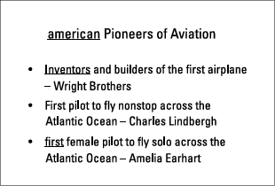 

Click to reveal answer

797.
**Capitalize American, no change, capitalize First**
American is part of the title, so it should be capitalized. (It also comes from the name of a country — another reason for a capital letter.) Inventors is fine as written, but First should be capitalized. In a bulleted list not composed of complete sentences, you may choose to capitalize or lowercase the first word of every item, but you must be consis- tent. (Of course, if a bullet begins with a proper name, you should capitalize the name even if other bullets begin with lowercase letters.) In this slide, the first two bullets are capitalized, so the third one must be also.

- 
798.  

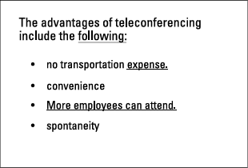   

Click to reveal answer

798.
**No change, delete period after expense, change to better attendance**
The introduction to this list is a complete sentence, so a colon (:) is perfect after fol- lowing. Drop the period after expense because items in a list generally don’t end with periods unless the items are complete sentences. More employees can attend must change because the other items in the list aren’t complete sentences, so this one doesn’t match. A good choice is better attendance, but any noun and attached descrip- tion (increased attendance), for example, would work.

- 
799. 	 

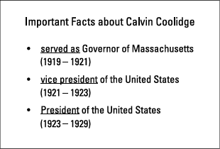

Click to reveal answer

799.
**Delete served as, capitalize Vice President, no change**
Two of the three items in the list are nouns, but the first item adds a verb (served). Because all the items should match, delete served as. The position titles (Governor, Vice President, President) are all important, and all should be capitalized, including both halves of the title Vice President.

- 
800.	 

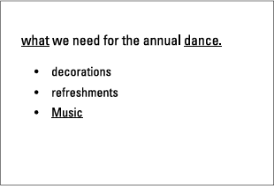

Click to reveal answer

800.
**Capitalize What, change the period to a colon after dance, lowercase music**
The first word of an introductory phrase (in this slide, What) should be capitalized. As an introduction to the list, What we need for the annual dance should be followed by a colon, not a period, because the bullet points don’t complete the sentence started by the introduction. The items in the list aren’t complete sentences, and the first two items in the list are in lowercase, so music shouldn’t be capitalized.

- 
801.	 

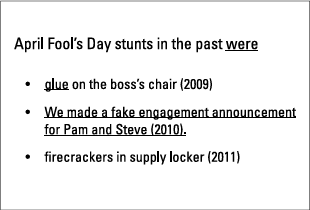

Click to reveal answer

801.
**No change, no change, change to fake engagement announcement for Pam and Steve (2010)**
When an introductory line ends with a linking verb (a form of the verb to be), don’t place any punctuation after the verb. Items in a bulleted list, unless they are complete sentences, generally aren’t capitalized, so glue is fine. The second bullet point is a com- plete sentence, but the first and third points aren’t. All bullet points should match, so change the complete sentence to a noun and its attached descriptions — fake engage- ment announcement for Pam and Steve (2010).

- 
802.	 

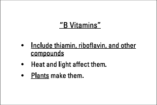

Click to reveal answer

802.
**Delete quotation marks, change to Thiamin, riboflavin, and other compounds are B vita-**
mins, no change Don’t place a centered title in quotation marks. The first item in this list, unlike the second and third items, begins with a verb but has no subject. Any change that includes a subject-verb combination (so long as it expresses the same meaning) is fine; one possible choice is Thiamin, riboflavin, and other compounds are B vitamins. The third bullet point is correct.

- 

803.	 

Click to reveal answer

803.
**No change, change the comma after following to a colon, change to to hire**
The first word of an introduction should be capitalized, so Goals is correct. Delete the comma after following and replace it with a colon. The first two bullet points are infini- tives (to + the verb), so the third bullet point should be an infinitive (to hire) also.

- 
804.	 

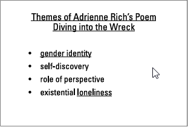

Click to reveal answer

804.
**Enclose Diving into the Wreck in quotation marks, no change, no change**
The title of a slide generally contains no quotation marks, unless something in the title needs quotation marks for another reason. In this slide, the poem title requires quota- tion marks. The bullet points are all nouns with attached descriptions, and none are capitalized. All are fine as written.

- 
805.	 
. 
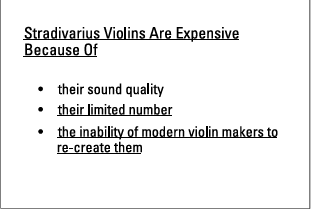

Click to reveal answer

805.
**Change to Stradivarius violins are expensive because of, no change, no change**
In this slide you don’t have a title; you have an introductory statement. Only the first word (and proper names) are capitalized in this sort of situation. No punctuation fol- lows because of, given that the sentence isn’t complete. The bullet points complete the sentence, so they must begin with lowercase letters. Each point must make sense when it is inserted into the introductory statement. All the bullet points meet this standard. Here’s one example: Stradivarius violins are expensive because of their limited numbers.

- 
806.	 

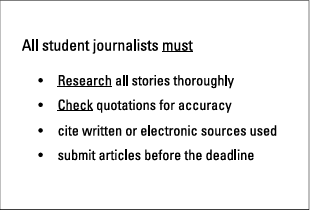

Click to reveal answer

806.
**No change, lowercase research, lowercase check**
You don’t have a title for this slide, only an introductory statement. No punctuation fol- lows must, because you haven’t finished the sentence. The bullet points complete the sentence, so they must begin with lowercase letters (research, check). Each point must make sense when it is inserted into the introductory statement. Note: Super-strict grammarians punctuate bullet points that complete the introductory statement with semicolons after every item except the last one, which ends with a period. Many modern style manuals ignore this practice and omit the semicolons and period.

- 
807.	

 

Click to reveal answer

807.
**Add these features and a colon after features, no change, change to More than 90% of**
users approve of the app. The introductory statement isn’t a complete sentence, but two of the bullet points are. Mismatch! Change the introductory statement to a complete sentence, and you’re fine. You may choose to add these features, but any similar expression would do. Because you have a complete introductory sentence, you need a colon before the list. The third item changes, because in the original slide, it’s incomplete. This answer is just one way to create a complete sentence. If you were thinking of a different sentence expressing the same idea, no problem!

- 
808.	 image

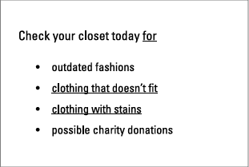

Click to reveal answer

808.
**No changes to underlined material**
Shocked? This is a correct slide, just to keep you on your toes. The introductory state- ment isn’t a complete sentence, so you need no punctuation after for. The bullet points are all nouns and attached descriptions, and all begin with lowercase letters. Yup, everything here is correct.

- 
809.	 i 

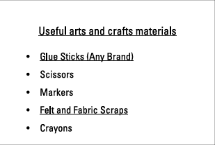

Click to reveal answer

809.
**Change to Useful Arts and Crafts Materials, change to Glue sticks (any brand), change**
to Felt and fabric scraps The centered title should be in “headline style,” with all the important words capital- ized. You don’t have to capitalize items in a bulleted list, but if you capitalize some, you have to capitalize all. Therefore, Glue and Felt are fine. These bullet points aren’t titles, though, so the words inside each item should be lowercase, except, of course, for proper nouns.

- 
810.	 i 

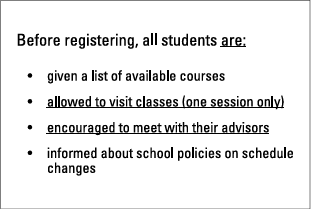

Click to reveal answer

810.
**Delete colon after are, no change, no change**
The introductory statement isn’t a complete sentence, and it ends with a linking verb. Don’t use any punctuation after a linking verb — ever! The other bullet points are fine, because each completes the thought the introductory statement begins. Note: Super- strict grammarians punctuate bullet points that complete the introductory statement with semicolons after every item except the last one, which ends with a period. Many modern style manuals ignore this practice and omit the semicolons and period.

- 
811.	 i

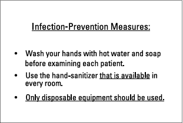

Click to reveal answer

811.
**Delete colon after Measures, no change, change to Use only disposable equipment.**
Punctuation follows a centered title only in rare instances, such as when the title is a question and you need a question mark. The first two items in the bulleted list are commands (Wash, Use), so the third item should be a command also (Use).

- 
812.	 i

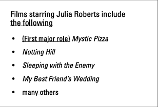

Click to reveal answer

812.
**Insert a colon after following, place the parentheses after Mystic Pizza, delete the last**
bullet point The introductory statement is a complete sentence, so you need a colon after follow- ing. The second, third, and fourth bullet points are film titles; don’t break the pattern with the first bullet point. If you move the parenthetical information after the title, the list is more uniform. (You can also delete it entirely.) The last bullet point is unneces- sary, because the introductory statement says include and doesn’t pretend to offer a complete list.

- 
813.	 -

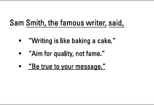

Click to reveal answer

813.
**No changes to underlined material**
The phrase “the famous writer” is surrounded by commas because it adds information about Sam Smith. When the bullet points are quotations, the speaker tag (said) in the introductory statement is followed by a comma. All the bullet points are properly capi- talized and punctuated.

- 
814.	

 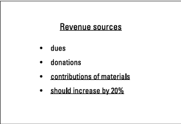

Click to reveal answer

814.
**Capitalize Sources, no change, delete the last bullet point**
The two little words here don’t make sense as an introductory statement, but they work as a title. Capitalize both words (Revenue Sources). The first three bullet points match; they’re all nouns with attached descriptions. The fourth bullet point is a sen- tence and therefore a mismatch. (In grammar terms, it’s not parallel.) If you delete the last bullet point, all the remaining bullet points are nouns. What about the 20% increase? If you truly needed that information in the slide, you could place it in paren- theses after the noun, making the last bullet point more specific by specifying the reve- nue source (alumni gifts, for example) and adding 20% increase in parentheses after the source of additional funds.

- 

## Composing E-Mails, Instant Messages, and Texts
### 815–826 Which of these, if any, are acceptable electronic communications? Note: Because some informality is accepted in electronic media, the “situation” information explains the context and medium.

  
815.	 Situation: Instant message, Jean asks her friend whether he wants to go for a walk with her.

I.

walk today

II.

walk?

III.

Want to walk

Click to reveal answer

815.
**II.**
The key rule of writing — in any medium — is clarity. Only Option II (walk?) is clearly a request. Options I (walk today) and III (Want to walk) may be read as commands or statements about the message writer — not the intended meaning. Did the lowercase w and the absence of a subject bother you? Because this is a message between friends, the rules of capitalization and complete sentences can be ignored.

- 
816.	 Situation: Text, a parent asks a teacher whether his child’s grades are good.

I.

grades good

II.

Grades?

III.

grades good?

Click to reveal answer

816.
**III.**
Okay, most teachers would prefer a text saying Please let me know how Susie’s grades turned out this semester. Most teachers would also like to win the lottery. Because texts are hard on your thumbs and everyone is busy, broken grammar rules are fine as long as the person receiving the text understands what the sender is saying. Option I (grades good) may be a statement of the parent’s opinion. Option II (Grades?) may be an inquiry about a missing report card. Only Option III (grades good?) lets the teacher know what the parent wants — the teacher’s opinion on the child’s performance.

- 

  
817.	 Situation: E-mail from business to customer, announcing a sale.
 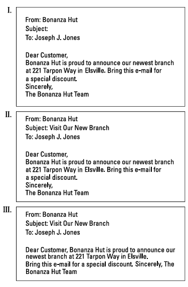

Click to reveal answer

817.
**II.**
In Option I, the subject line is blank. The subject line of an e-mail should communicate the topic of the message; otherwise, the person who receives the message will proba- bly delete it unread. Option III has no spacing between Dear Customer and the message or between Sincerely and the message. Nor is there a space between Sincerely and the sender’s identification. Option II properly spaces the parts of the message and includes a subject line.

- 

818.	 Situation: Excerpt from a blog post from a food writer hoping for a book contract.

I.

This recipe for tomato stew needs a hint of dates.

II.

This recipe 4 tomato stew needs a hint of d8s.

III.

Add a hint of dates to this tomato stew and wow!

Click to reveal answer

818.
**I. and III.**
If you want a book contract, you have to show that you can write. Option I (This recipe for tomato stew needs a hint of dates) is formal and correct. Option III (Add a hint of dates to this tomato stew and wow!) is informal but also acceptable. Option II (This recipe 4 tomato stew needs a hint of d8s) substitutes numbers for sounds (4 instead of for, d8s instead of dates). Nope. In a blog, let real words rule.

- 
819.	 Situation: Instant message, history teacher to guidance counselor, in response to a question about the possibility that a student will plagiarize a paper.

I.

no   writing paper by herself

II.

no, writing paper by herself

III.

No. Writing paper by herself

Click to reveal answer

819.
**II. and III.**
Option I (no writing paper by herself) is unclear. The history teacher may be saying that he’s seen no writing by herself (by the student in question) or answering no, [she’s] writing the paper by herself. The extra space between no and the rest of the message isn’t enough to clarify the meaning. Option II (no, writing paper by herself) includes a comma, and Option III (No. Writing paper by herself) a period. These punctuation marks separate the no and clarify the important point — that the student is doing her own work. True, Options II and III don’t follow all the grammar rules, but the teacher and counselor are equals. Bending the rules a bit when you’re writing to someone of the same rank is acceptable in instant messages, as long as the meaning is clear.

- 
820.	 Situation: Text from Bill to his grandfather.

I.

G2G Gramps ttyl

II.

Gotta go Gramps ttyl

III.

I have to go, Gramps. I’ll talk to you later.

Click to reveal answer

820.
**III.**
You can argue on this one, because out there somewhere is a grandfather who under- stands texting abbreviations such as (G2G – got to go and ttyl – talk to you later). However, those grandfathers are pretty rare. When you text to someone who outranks you in age or status (and a grandfather fits both categories), use Standard English, as Option III (I have to go, Gramps. I’ll talk to you later) does.

- 
821.	 Situation: E-mail from client to architect, giving an opinion on preliminary plans  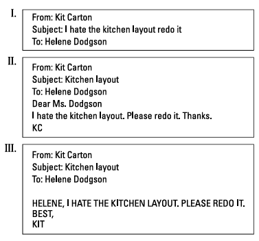

Click to reveal answer

821.
**II.**
Option I assumes that the person who receives the message will realize that the sub- ject line is the entire message. Option III is annoying. Capital letters are useful, but an entire message in capital letters comes across as a shout — a bad-mannered, hard-to- read shout. Stick with Option II, which could perhaps be more diplomatic but is funda- mentally correct.

- 
822.	 Situation: Excerpt from a film review on a website for general readers.

I.

gr8 CGI in the crashing planet sequence

II.

great CGI in the crashing planet sequence

III.

great special effects in the crashing planet sequence

Click to reveal answer

822.
**III.**
If you want readers to take you seriously, you have to take yourself seriously — and follow at least some of the rules for Standard English. In Standard English, gr8 isn’t a proper substitute for great, so Option I (gr8 CGI in the crashing planet sequence) is out. Option II (great CGI in the crashing planet sequence) is better, but because the website is for general readers, not film buffs, the abbreviation for computer generated imagery (CGI) may be confusing. Option III (great special effects in the crashing planet sequence) substitutes special effects — much more comprehensible and therefore the best choice.

- 

823.	 Situation: E-mail to a potential employer from a job applicant.
  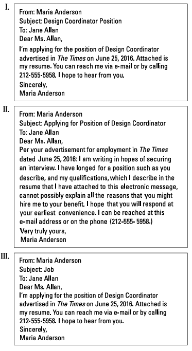

Click to reveal answer

823.
**I.**
Option I has an informative subject line, a respectful message, and an appropriate clos- ing (Sincerely). It’s a winner! Option II sounds as if it comes from the 19th century. It’s too long and flowery for a busy employer. Option III almost, but not quite, makes the grade. The subject line is far too vague. Is it a job the company is doing for Maria Anderson, or one of perhaps several job openings at the firm? Don’t gamble that the recipient will understand what your message is about!

- 
824.	 Situation: Instant message from Jack to Jill, best friends and constant companions, about Henry’s claim that he’s dating a supermodel.

I.

omg i cant believe it

II.

idnbi

III.

lol your joking

Click to reveal answer

824.
**I. and III.**
Yes, you can — with your bff (best friend forever) — use shorthand when you text or send an instant message. You can also break the rules of capitalization, spelling (your instead of you’re), and punctuation. As always, the only nonnegotiable quality is clar- ity. Option I (omg I cant believe it) employs a common abbreviation (omg = oh my God or oh my goodness). Lol, from Option III (lol your joking), is also a commonly accepted way to say laughing out loud. You may have been tricked by Option II (idnbi), which uses a made-up abbreviation (idnbi means I do not believe it).

- 
825.	 Situation: Excerpt from a reader comment on an article in an online newspaper.

I.

Mr. Smith’s position, that the waste disposal factory should be relocated, is impractical, as no other sites have been identified.

II.

You’re an idiot, Smith! Nobody else will take that factory.

III.

Smith – I hate you and everything you say.

Click to reveal answer

825.
**I.**
Presumably Mr. Smith worked hard on his article, so he deserves a courteous reply. Only Option I falls into that category. Besides, other readers disregard rants and look for comments with an actual point.

- 
826.	 Situation: Text from boss to employee about a change in policy.

I.

FYI: Breaks can be 10 minutes tops.

II.

breaks now 10 mins long and no more

III.

10 min breaks only

Click to reveal answer

826.
**All of the options**
If you’re the boss, you have the freedom to be informal. Option I (FYI: Breaks can be 10 minutes tops) uses a commonly accepted abbreviation, FYI (For Your Information). Options II (breaks now 10 mins long and no more) and III (10 min breaks only) break the rules of Standard English, but they’re clear and therefore okay — for the boss! If your writing will travel up the power ladder, be more cautious.

- 

# Chapter 19
## Choosing Language to Suit Your Audienc
When people find out that I write grammar books, some go into “gotcha” mode. They scrutinize everything I say, hoping to catch a mistake. And they do! In fact, they should. Why? Because formal, totally proper English isn’t appropriate for all situations. When you’re at a party, you probably employ what I call “conversational English” — a less formal version of the language that features shortened or dropped words, incomplete sentences, and similar elements. Conversational English makes you more approachable. One level down is even less formal, what I call “friendspeak.” On this level you make some mistakes on purpose, using slang and throwing in me instead of I or who instead of whom. Of course, in school or on the job, proper English is generally the goal. In this chapter you practice moving from level to level of correctness, depending upon the situation you’re in. These questions check your ability to adapt your oral or ­written expression as needed.

## The Questions You’ll Work On
In this chapter, you work on questions that test these skills:
✓	Identifying levels of formality
✓	Suiting your words to a particular situation

## What to Watch Out For 
Keep these points in mind when you’re answering the questions in this chapter:
✓	If you’re speaking or writing to someone with more power than you, formal English is
best. However, no one likes to hear stiff, old-fashioned, or flowery expressions. Even in
formal English, strive for direct and clear expression.
✓	When communicating with peers, let the relationship and situation guide you. A friend
in the office may be comfortable with conversational English while you’re gossiping at
the coffee machine but not when you’re writing a business memo. On Friday night away
from the office, friends may “kick off their grammar shoes” and break every rule in the
book.
122
✓	Slang works only when everyone who’s supposed to be part of the conver-
sation understands what you’re saying. By its nature, slang excludes some
people, usually on purpose. Teenagers invent terms all the time specifically to
mystify adults — and succeed beautifully!
✓	Jargon — specialized terms, abbreviations, and acronyms — is fine only if the
intended audience comprehends. Acronyms are formed from the first letter of
each word in a name (NATO for North Atlantic Treaty Organization, for example).
✓	Electronic communication (text or instant messages, blogs, e-mails) sometimes
relax the usual grammar rules, but even there, take care if you’re writing to
someone of higher status in a given situation.

## Identifying Levels of Formality
### 827–836 Place these expressions in order of formality, moving from the most formal to the least. **Note**: Two expressions may “tie.” For example, your answer may be **1 and 2, 3**. In that answer, the first and second statements have the same level of formality, and the third statement is less formal than the first two.

827.	 

1.
You just don’t get it.
2.
You do not comprehend the situation.
3.
You don’t understand what happened.

Click to reveal answer

827.
**2, 3, 1 (2. You do not comprehend the situation. 3. You don’t understand what happened.**
1. You just don’t get it.) Expression 2 is the most formal, with no contractions (such as don’t, which you see in Expression 3) and the somewhat sophisticated word comprehend. Expression 3 is cor- rect but a little more relaxed, with the contraction don’t and what happened instead of the situation. Expression 1 includes slang: to get it means to understand. Slang is always very informal.

- 
828.	 1.
I provide herein
2.
I enclose
3.
Here’s

Click to reveal answer

828.
**1, 2, 3 (1. I provide herein; 2. I enclose; 3. Here’s)**
Expression 1 uses an old-fashioned, totally formal word, herein. Expression 2 is more modern and less formal. Expression 3 is a contraction (here’s is short for here is). The contraction makes this expression the least formal of the three.

- 
829.	 
1.
Don’t worry about that issue.
2.
Hey, don’t flip out!
3.
Forget it, please.

Click to reveal answer

829.
**1, 3, 2 (1. Don’t worry about that issue. 3. Forget it, please. 2. Hey, don’t flip out!)**
All three of these statements attempt to reassure the listener or reader. Expression 1 is the most formal, with a complete sentence including a dignified phrase, that issue. Expression 2 employs slang (flip out = get upset), as well as the informal greeting, hey. Somewhere in the middle is Expression 3, which attaches please to a complete sentence.

- 
830.	 1.
does not exercise
2.
total couch potato
3.
never exercises

Click to reveal answer

830.
**1 and 3, 2 (1. does not exercise; 3. never exercises; 2. total couch potato)**
Expressions 1 and 3 are Standard English, on the same level of formality. Expression 2 is slang. (A total couch potato is someone who never gets off the couch.) Expression 2 is the least formal.

- 
831.	 1.
C U L8R
2.
See you later.
3.
I will meet you later today.

Click to reveal answer

831.
**3, 2, 1 (3. I will meet you later today. 2. See you later. 1. C U L8R)**
Expression 1 uses texting abbreviations (C = see, U = you, L8R = later) and is the least formal writing possible. Expression 2 is closer to proper English, but the subject and part of the verb (I will) are implied rather than stated. Expression 3 is correct and com- plete — the most formal of the three.

- 
832.	 1.
My bad.
2.
Oops! Sorry.
3.
I apologize.
124

Click to reveal answer

832.
**3, 1 and 2 (3. I apologize. 1. My bad. 2. Oops! Sorry.)**
I apologize is grammatically correct and proper for all occasions. Expressions 1 and 2 are less formal because they include slang (my bad = my mistake, understood as an apology, and oops, an expression admitting an accident or error).

- 
833.	 1.
Does this interest you?
2.
r u in?
3.
Are you in?

Click to reveal answer

833.
**1, 3, 2 (1. Does this interest you? 3. Are you in? 2. r u in?)**
Expression 1 has no contractions or slang, so it’s formal. Expression 3, on the other hand, uses a shortened form of the expression — close to slang. Are you in? means Are you interested? and is conversational. The least formal is Expression 2, which uses texting abbreviations, r (are) and u (you).

- 
834.	 1.
about your request
2.
in reference to your request
3.
pursuant to your request

Click to reveal answer

834.
**3, 2, 1 (3. pursuant to your request; 2. in reference to your request; 1. about your request)**
Pursuant to your request begins with an unusual word. (Pursuant comes from the same root as pursue, which means follow.) Because Expression 3 is probably familiar only to the read-the-dictionary-for-fun types, it’s the most formal. Expression 2 takes it down a notch, because in reference to is more common (though still correct). Expression 1 is the least formal.

- 
835.	 1.
You had to ask!
2.
In response to your question
3.
To answer your question

Click to reveal answer

835.
**2 and 3, 1 (2. In response to your question; 3. To answer your question; 1. You had to ask!)**
Expression 1 is obviously the least formal, with a slightly joking tone. Expressions 2 and 3 are formal without being stuffy.

- 
836.	 1.
the child under discussion
2.
the kid we’re talking about
3.
the child we are discussing

Click to reveal answer

836.
**1 and 3, 2 (1. the child under discussion; 3. the child we are discussing; 2. the kid we’re**
talking about) Expressions 1 and 3 are grammatically correct and have no contractions or slang. They’re on the same level of formality. Expression 2 includes kid, a slang term for child, as well as the contraction we’re. It’s the least formal of the three.

- 
## The Right Words for the Right Time
### 837–851 Which of these statements, if any, are suitable in the specified situation? Note: The statement may be excerpted from a longer conversation or piece of writing.
  
837.	 Situation: Student’s e-mail to a teacher asking for a letter of recommendation.

I.

Would you please write a letter of recommendation?

II.

You get me. Wanna write for me?

III.

r u ok to write 4 me?

Click to reveal answer

837.
**I. (Would you please write a letter of recommendation?)**
A teacher has more power than a student, and so does anyone who’s doing you a favor. Statement II (You get me. Wanna write for me? — which a student actually sent!) is too informal. Statement III (r u ok to write 4 me?) is never acceptable in an e-mail, text, or instant message to anyone other than a close friend.

- 

838.	 Situation: Letter of complaint from a customer to a company about a recent purchase.

I.

Your vacuum stinks. I want my money back now!

II.

The vacuum doesn’t work, so I want a refund.

III.

Vacuum = busted. Refund = mine.

Click to reveal answer

838.
**I. and II. (I. Your vacuum stinks. I want my money back now! II. The vacuum doesn’t work,**
so I want a refund.) Statement I is rude, but it does get the point across. (Courtesy, of course, is always best, but grammatically this one works.) Statement II conveys the message more politely. It too is fine. Statement III (Vacuum = busted. Refund = mine) probably won’t be taken seriously by a manufacturer. (Would you send money to someone who uses this sort of language?)

- 
839.	 Situation: Text message from Lily, who has known Anthony since preschool, com- menting on a mutual friend’s unexpected offer to help with a school project.

I.

2G2BT

II.

rly? r u sure?

III.

4 real?

Click to reveal answer

839.
**All of the statements**
Because Lily and Anthony are close friends, they probably text each other often and understand these abbreviations. Grammarians usually hate such shortcuts, but realists know abbreviations and shortened words convey meaning — and they aren’t going away anytime soon. For those who don’t text, 2G2BT means too good to be true, rly means really, r u sure means are you sure, and 4 real means for real.

- 
840.	 Situation: Co-worker speaking to a peer at a committee meeting chaired by their supervisor.

I.

The marketing stuff’s epic, but the neighborhood’s sketchy.

II.

Whassup with the neighborhood? The marketing’s okay.

III.

The marketing is fine, but the neigh- borhood is questionable.

Click to reveal answer

840.
**III. (The marketing is fine, but the neighborhood is questionable.)**
Because the supervisor is present, the speaker should steer clear of slang such as epic (impressive, great), sketchy (borderline, not quite safe or correct) and whassup (a short form of What’s up? or What’s going on?). The third statement is fine.

- 
841.	 Situation: Phone call from a parent to another parent about a play date for their children.

I.

Saturday okay with you? Maybe the beach? Or the playground? Could be fun.

II.

How about I take the kids to the beach or the playground on Saturday for a fun afternoon?

III.

Would it be permissible for me to take our children on an excursion this Saturday, perhaps to the beach or to the playground, so that they can amuse each other for a while?

Click to reveal answer

841.
**I. and II. (I. Saturday okay with you? Maybe the beach? Or the playground? Could be fun.**
II. How about I take the kids to the beach or the playground on Saturday for a fun afternoon?) Parents are peers, so conversational English, which you see in Statements I and II, is fine. Statement III (Would it be permissible for me to take our children on an excursion this Saturday, perhaps to the beach or to the playground, so that they can amuse each other for a while?) is far too formal and stiff. A parent on the receiving end of Statement III would dress the kid in a tuxedo and send him out in a limo — if the parent let him go at all! Inappropriately formal language sometimes masks intention or meaning and may raise suspicions, even though none are warranted.

- 
842.	 Situation: Alice speaks with a traffic patrol officer who has pulled her over to the side of the road.

I.

You gotta problem?

II.

What’s the problem, Officer?

III.

Is there a problem?

Click to reveal answer

842.
**II. and III. (II. What’s the problem, Officer? III. Is there a problem?)**
When a cop is ordering you around, he or she has more power. Statement I (You gotta problem?) is for peers, not the traffic patrol. Statements II and III are sufficiently formal for the situation.

- 
843.	 Situation: Instant message from a boss to an assistant, requesting a file they’ve been working on.

I.

get me file asap

II.

need file now

III.

file - now

Click to reveal answer

843.
**I. and II. (I. get me file asap; II. need file now)**
When a boss speaks to an assistant, the boss has more power and can break the rules of conventional grammar, as long as the intended meaning is clear. The first and second statements are okay, assuming the assistant knows which file the boss wants. (ASAP is a common acronym meaning as soon as possible. It’s safe to assume that most people understand it.) Statement III (file – now) doesn’t have enough information. Does the boss want the assistant to file something away for the boss, work on the file, or bring it to the boss? More than one meaning is possible, so Statement III isn’t acceptable.

- 
844.	 Situation: Comment to a citizen from a clerk in a government agency.

I.

What’s your DOB and SSN?

II.

Tell me your date of birth and social security number.

III.

When were you born, and what’s your social?

Click to reveal answer

844.
**II. (Tell me your date of birth and social security number.)**
The acronyms DOB and SSN aren’t universally understood. Similarly, your social may be mystifying. Only Statement II is completely clear.

- 
845.	 Situation: Text from daughter to mother about a cash-flow problem.

I.

ATM card no good. What to do?

II.

ATM no good. ??

III.

ATM?

Click to reveal answer

845.
**I. (ATM card no good. What to do?)**
Daughters and mothers are in the same family, so informality is fine, as long as the mother understands the daughter’s message. ATM – short for Automated Teller Machine — is a commonly used acronym and more likely to be comprehensible than the long ver- sion. Statement I works, as it explains the situation. Statement II (ATM no good. ??), however, is vague. Is one particular machine broken, or is the card faulty? Two different possibilities exist, with two different remedies — go to a different ATM or call the bank and find out what’s wrong with the card. Statement III (ATM?) is even foggier. The question may be Can I go to an ATM? Where is an ATM? How do I use an ATM? or something else.

- 
846.	 Situation: Class notes for future study.

I.

war b/c border wasn’t where it s/b

II.

They went to war because the border was drawn where it should not have been.

III.

border wrong, so war

Click to reveal answer

846.
**I. and III. (I. war b/c border wasn’t where it s/b; III. border wrong, so war)**
Class notes are personal. The person who takes the notes has to understand what they mean. Class notes are also fast, because you’re trying to capture speech, and speech is always faster than writing or typing. If you don’t develop a system of abbreviations (b/c for because and s/b for should be are useful ones), you’ll miss the teacher’s next point while you’re recording the previous statement. That’s why Statement II (They went to war because the border was drawn where it should not have been) is wrong; it’s just too wordy and inefficient.

- 

847.	 Situation: Letter to client from an insur- ance agent.

I.

Don’t expect us to file Form 

Click to reveal answer

847.
**II. (We will file Form 112 after you send the “Explanation of Benefits” statement you**
received from your Primary Care Physician (your doctor).) Many fields create specialized terms, particularly the military and the insurance industry. That’s fine if you’re an insider, but if you’re not, good luck understanding what they’re trying to tell you. Statement I (Don’t expect us to file Form

- 
112.	 You didn’t supply a copy of the EOB from your PCP.

II.

We will file Form 112 after you send the “Explanation of Benefits” state- ment you received from your Primary Care Physician (your doctor).

III.

No 112 until we get the EOB from PCP.

Click to reveal answer

112.
**could have jumped (Margaret could have jumped over the fence easily, but instead she**
waited patiently for the guard to open the gate.) The helping verb could expresses ability, and have moves the action of jumping into the past.

- 
848.	 Situation: Comment from a tourist to the tour guide, whose English is minimal and who is speaking in a low voice.

I.

Speak louder, please.

II.

Sound off!

III.

Kick it up a notch.

Click to reveal answer

848.
**I. (Speak louder, please.)**
When you’re dealing with people whose English is minimal, stay away from expres- sions that use language creatively, not literally. Statements II and III don’t work in this situation because sound off and kick it up a notch (which both request an increase in volume) fall into the “creative” or “figurative” category. (Can you imagine a guide won- dering where to kick?) Also, the speaker doesn’t know the tour guide, presumably, and Statements II and III may be interpreted as rude; neither includes please. Statement I is clear and polite, a good combination for any tourist and, in fact, for any person.

- 
849.	 Situation: Text from son to parents after he proposed to his girlfriend.

I.

she said yes

II.

she said yes wedding in july

III.

Wedding in July   
850.	 Situation: E-mail from broker to customer, who asked for information quickly.

I.

Spoke with Jacobs. Deal’s OK with him.

II.

I had a chance to speak with Mr. Jacobs, as you asked. I called him immediately, as you were in a rush. He indicated that the deal is fine with him.

III.

Re Jacobs: deal’s okay with him.

Click to reveal answer

849.
**II. (she said yes wedding in july)**
Parents usually know their children well, and the vast majority don’t care about format or grammar when they’re receiving important news. However, unless they’re mind readers or have advance knowledge of the proposed proposal, Statements I (she said yes) and III (Wedding in July) are too vague. She said yes to what? Dinner? A visit with the parents? Wedding in July is better, but even this one could be clearer. Statement II gets the job done nicely.

- 
851.	 Situation: E-mail to co-workers from their union representative about a possible job action. It’s illegal for the union members to strike.

I.

Tomorrow we should all call in “sick,” if that’s how the vote turns out at the meeting tonight.

II.

Important vote at tonight’s meeting.
Please attend.

III.

We’re getting the flu tomorrow, depending on tonight’s vote.

Click to reveal answer

851.
**II. (Important vote at tonight’s meeting. Please attend.)**
E-mail should never be used for communications you would like to keep private. In Statements I (Tomorrow we should all call in “sick,” if that’s how the vote turns out at the meeting tonight) and III (We’re getting the flu tomorrow, depending on tonight’s vote), the union representative hints at a planned strike. Those e-mails could lead to a court case. Statement II is more neutral and less likely to appear as evidence.

- 
# Chapter 20
## Tricky Word Traps
T he road to proper English is full of potholes, including words with vastly different mean- ings that resemble each other in spelling or sound and words that many people use interchangeably — and incorrectly. In this chapter you perfect your ability to tell these “twins” apart and smooth the highway to better speech and writing. 

## The Questions You’ll Work On
In this chapter, you work on these types of questions:
✓	Distinguishing between words such as passed and past that sound nearly the same
✓	Using almost-look-alikes such as farther and further correctly
✓	Selecting possessives and contractions (their and they’re, its and it’s) as needed
✓	Placing commonly misused words (if and whether, like and as) in their proper context

## What to Watch Out For
Keep these points in mind when you’re answering the questions in this chapter:
✓	Accept means “to agree or to take”; except means “other than.” Related forms are
­acceptance and exception.
✓	In common usage, affect is a verb meaning “to influence,” and effect is a noun meaning
“a result.” Effect is sometimes used as a verb meaning “to bring about,” as in to effect
change.
✓	Farther measures distance; further means “additional.”
✓	As a noun, principal is the head of a school or one of the most important people in a
given situation; as an adjective it also means “most important.” A principle is a “rule or
standard.”
✓	Stationary refers to something that’s fixed in one place; stationery is school or office
supplies, especially paper and envelopes.
✓	To compliment is “to praise,” and to complement is “to complete, to bring to a better
level.” Related forms are complimentary (which may mean either “praising” or “free”)
and complementary.
128
✓	A historic event is an important moment in history, the record or study of the
past. Historical refers to anything related to the past. The noun past refers to
everything up until the present moment; past as an adverb means “in front
of” or “by.” Passed is a verb meaning “moved by or along” in time or space.
✓	A capitol is a building where government meets; the capital is the city where
the government is located. Capital also refers to money for investing and
may, as an adjective, mean “chief, most important.”
✓	There refers to a place, their shows possession, and they’re means “they are.”
✓	To is a preposition, two is a number, and too means “also” or “excessive.”
✓	Since refers to time, and because to a reason. If begins a statement about a
condition or possibility, and whether presents two alternatives (whether or
not).
✓	Unique means “one of a kind” and is an absolute term. Unusual or rare are
better words when something is odd, but not unique.
✓	Disinterested means “fair and impartial,” and uninterested means
“not interested.”
✓	Like may be a verb (meaning “to appreciate or enjoy”) or a preposition. It
may not introduce a subject-verb statement; to introduce subject-verb pairs,
use as or as though.
✓	Try and works only when you’re discussing two actions; otherwise, use try to.
✓	You emigrate when you leave a country and immigrate when you enter a
country. Related words are emigrant, emigration, immigrant, and immigration.
✓	A number of means “some,” but the number usually refers to a specific
­quantity.
✓	When you hint at something, you imply; when you figure out what the hint
means, you infer.
✓	Kind of or sort of means “type of.” Don’t use these expressions as substitutes
for rather, somewhat, or a bit.

## Distinguishing between Words Resembling Each Other
### 852–881 Which of the underlined words, if any, are used correctly in these expressions?

852.	 I.

moving **to** a new house

II.

putting on **there** shoes

III.

**it’s** a shame

Click to reveal answer

852.
**I. and III. (I. moving to a new house; III. it’s a shame)**
The preposition to in Expression I correctly tells you where the moving is headed (to a new house). There indicates place, not ownership, so Expression II (putting on there shoes) should say their shoes, not there. The contraction it’s means it is, so Expression III is correct.

- 
853.	 I.

taking **you’re** time

II.

thinks **two** much

III.

**accept** the offer

Click to reveal answer

853.
**III. (accept the offer)**
Expression I (taking you’re time) is incorrect because you’re means “you are.” Here you need the possessive, your. Expression II (thinks two much) should be too much, to show excessive thinking. (Two is a number.) Only Expression III is correct, because accept means “agree.”

- 
854.	 I.

**you’re** right, not wrong

II.

a dog and **it’s** bone

III.

everyone **except** Tom

Click to reveal answer

854.
**I. and III. (I. you’re right, not wrong; III. everyone except Tom)**
You’re means “you are,” which fits nicely into Expression I. The contraction it’s means “it is,” but you want the possessive its in Expression II (a dog and it’s bone). Expression III excludes Tom, a proper meaning of the preposition except.

- 
855.	 I.

**too** books, one on the shelf and one on the desk

II.

**you’re** right foot

III.

**it’s** raining

Click to reveal answer

855.
**III. (it’s raining)**
Expression I (too books, one on the shelf and one on the desk) is wrong because you need the number, two. Expression II (you’re right foot) is also incorrect; you’re means “you are,” but here you need the possessive your. Expression III is right because it’s is short for “it is.”

- 
856.	 I.

no one **except** for Henry

II.

**there** meeting us later

III.

**too** the mall

Click to reveal answer

856.
**I. (no one except for Henry)**
Expression I properly uses except to remove Henry from the group defined as no one. Expression II (there meeting us later) requires they’re, short for “they are,” not there (“a place”). Also incorrect is Expression III (too the mall), which should read to the mall, indicating direction.

- 
857.	 I.

me **too**

II.

**it’s** my turn

III.

every activity **accept** swimming

Click to reveal answer

857.
**I. and II. (I. me too; II. it’s my turn)**
Expression I correctly includes too, which in this case means “also.” Expression II is right as well, because it’s is short for “it is.” Expression III (every activity accept swim- ming) doesn’t work because the appropriate word is except, which separates swimming from a group of other activities.

- 
858.	 I.

**you’re** wallet

II.

bicycle losing **its** wheel

III.

**to** people who form a lovely couple

Click to reveal answer

858.
**II. (bicycle losing its wheel)**
Expression I (you’re wallet) requires a possessive, your, not a contraction (you’re, short for “you are”). Expression II also requires a possessive, but this time you have one: its. Expression III (to people who form a lovely couple) refers to a number, so the word you want is two.

- 
859.	 I.

styling **your** hair

II.

in **their** neighborhood

III.

**to** young for that toy 130

Click to reveal answer

859.
**I. and II. (I. styling your hair; II. in their neighborhood)**
Expressions I and II appropriately use the possessive forms your and their. Expression III (to young for that toy) mistakenly substitutes a preposition, to, for too, which means “overly.”

- 

860.	 I.

sitting over **their**

II.

**your** first job

III.

whether **its** true or not

Click to reveal answer

860.
**II. (your first job)**
Expression I (sitting over their) should include there, a place, instead of their, a posses- sive. Expression II properly employs the possessive your. Expression III (whether its true or not) needs the contraction it’s (it is), not the possessive its.

- 
861.	 I.

**exception** to the rule

II.

college **acceptance**

III.

the car over **they’re**

Click to reveal answer

861.
**I. and II. (I. exception to the rule; II. college acceptance)**
An exception to the rule, Expression I, refers to a time when the rule is not enforced. This one’s right. Expression II is also correct, because the college agrees to take the applicant and sends an acceptance letter. The only wrong one here is Expression III (the car over they’re), which needs there, a place, not the contraction they’re (“they are”).

- 
862.	 I.

cause and **affect**

II.

walking **passed** the bank

III.

our school **principal**

Click to reveal answer

862.
**III. (our school principal)**
For Expression I (cause and affect) you want cause and effect, because effect means “result.” Expression II (walking passed the bank) is also wrong; passed is a verb, but here you need past. Expression III is right; the principal is the head of the school. Tip: Remember that the principal is your pal.

- 
863.	 I.

historians studying the **past**

II.

**principals** of fair play

III.

special **effects**

Click to reveal answer

863.
**I. and III. (I. historians studying the past; III. special effects)**
The past (“events prior to the present time”) is what historians study, so Expression I is correct. Expression II (principals of fair play) isn’t correct because here you need principles, or “rules.” (Tip: Notice that both principle and rule end in le.) Expression III is fine, as it refers to exploding buildings, ghosts, aliens, and whatever else Hollywood experts create under the title of special effects.

- 
864.	 I.

time **passed** slowly

II.

illness that **effected** her

III.

when **principles** scold students

Click to reveal answer

864.
**I. (time passed slowly)**
Time moves along, so the verb passed is appropriate for Expression I. Expression II ­(illness that effected her) needs affected (“influenced”), so it’s incorrect. So is Expression III (when principles scold students), where principals (“school officials”) scold, not principles (“rules or standards”).

- 
865.	 I.

**past** over when promotions were announced

II.

**principal** reason to sign the treaty

III.

the **affect** of the drought on crops

Click to reveal answer

865.
**II. (principal reason to sign the treaty)**
Expression I (past over when promotions were announced) should say passed, as a verb of movement fits the meaning here. (The boss looked at everyone and passed over an employee.) Expression II is correct, because here you need an adjective (a descrip- tion). As an adjective, principal means “most important.” Expression III (the affect of the drought on crops) is wrong; the correct version is effect (“result”) of the drought.

- 
866.	 I.

the parade moved **passed**

II.

the **effect** of Barbara’s actions

III.

the dome of the **capital** building

Click to reveal answer

866.
**II. (the effect of Barbara’s actions)**
Expression I (the parade moved passed) already has a verb (moved), so moved passed (passed is also a verb) doesn’t make sense. The word you want is past (“in front of, by”). Expression I is wrong. Expression II is correct, as effect (“result”) works nicely here. Expression III (the dome of the capital building) improperly substitutes the city (capital) for the building (capitol).

- 
867.	 I.

heat **affects** the players

II.

**capitol** to invest

III.

**principles** of sportsmanship

Click to reveal answer

867.
**I. and III. (I. heat affects the players; III. principles of sportsmanship)**
The heat “influences” (affects) the players, so Expression I is right. Expression II (capitol to invest) should be capital, because you’re talking about money. Expression III refers to “rules or standards,” so principles is correct.

- 
868.	 I.

**principal** talking to the first graders

II.

spending interest income, not **capitol**

III.

has an **affect** on Max’s mood 
869. 

I.

meeting of the **principle** signers of the treaty

II.

visiting the freshly painted and renovated **capitol**

III.

factors that **affect** you

Click to reveal answer

868.
**I. (principal talking to the first graders)**
Expression I is correct because the school head, principal, is referred to here. Expression II (spending interest income, not capitol), though, should say capital (“money”), not capitol (“government building”). Expression III (has an affect on Max’s mood) is also wrong because you want the noun effect (“result”), not the verb affect (“to influence”).

- 
870.	 I.

Paris, the **capitol** of France

II.

the **principles** of investing

III.

side **effects** of this medicine

Click to reveal answer

870.
**II. and III. (II. the principles of investing; III. side effects of this medicine)**
Paris is a city, so Expression I (Paris, the capitol of France) should say capital (“the seat of government”), not capitol, which is a building. In Expression II principles properly refers to “rules or standards.” The unintended “results” (effects) mentioned in Expression III are also right.

- 
871.	 I.

**principles’** educational conference

II.

**capital** letters

III.

**passed** tense verb

Click to reveal answer

871.
**II. (capital letters)**
Who has an educational conference? Principals (“school officials”) do. Expression I (principles’ educational conference) incorrectly substitutes principles (“rules”). Important letters are capital letters, so Expression II is fine. Expression III (passed tense verb) should be past tense verb — a verb that refers to events before the present moment.

- 
872.	 I.

to **effect** change

II.

upon **further** consideration

III.

not the **principle** reason

Click to reveal answer

872.
**I. and II. (I. to effect change; II. upon further consideration)**
Surprised? Effect is usually a noun meaning “result,” but it can, on rare occasions, be a verb meaning “to bring about.” Expression I is correct. So is Expression II, because you want a word meaning “additional,” and further is perfect. Expression III (not the princi- ple reason) is wrong, though; you need principal (“most important”) here. Principle is a noun meaning “rule or standard.”

- 
873.	 I.

ran **farther** than a marathoner

II.

**complements** to the chef on a great meal

III.

**historic** novels, including those with little readership or influence

Click to reveal answer

873.
**I. (ran farther than a marathoner)**
Farther is the word you want for distance, so Expression I is right. Expression II (com- plements to the chef on a great meal) should be compliments (“praise”), not comple- ments (“what completes or makes better”). Expression III (historic novels, including those with little readership or influence) improperly substitutes historic (“of major importance”) for historical (“referring to history”).

- 
874.	 I.

**stationary** for class, including an extra package of paper

II.

**historical** documents

III.

**complimentary** tickets

Click to reveal answer

874.
**II. and III. (II. historical documents; III. complimentary tickets)**
You buy stationery (“office supplies”), not stationary (“fixed, unmoving”), so Expression I (stationary for class, including an extra package of paper) is wrong. Expression II works because documents created in the past are historical — “a record of history.” Expression III is a winner because the tickets are “free,” or complimentary.

- 
875.	 I.

**stationary** bicycle at the health club

II.

no **further** trouble

III.

all in the **passed**

Click to reveal answer

875.
**I. and II. (I. stationary bicycle at the health club; II. no further trouble)**
Expression I is right; a stationary bicycle doesn’t move. Expression II is also a winner because further means “additional.” However, Expression III (all in the passed) fails; passed is a verb meaning “gone by.” The word you want here is past.

- 
876.	 I.

curtains in **complimentary** colors

II.

**stationery** store having a back-to- school sale

III.

the **principals** of good writing

Click to reveal answer

876.
**II. (stationery store having a back-to-school sale)**
Expression I (curtains in complimentary colors) is wrong; it should say complementary colors — colors that go well with other items in the room and improve the overall look. Expression II is perfect, because a stationery store sells school and office supplies. Expression III (the principals of good writing) fails because principals are school officials or important participants in a situation. Principles (“rules”) is what you want here. Expression III is incorrect.

- 
877.	 I.

shoes that **complement** your outfit

II.

**historic** treaty that ended the war

III.

**principal** dancers, who enact the lead roles

Click to reveal answer

877.
**All of the expressions**
The shoes blend perfectly with whatever you’re wearing; that is, they complement your outfit. A treaty is important, especially when it ends a war, so historic is also properly placed. Principal is correct, too, as the dancers are important, those who take the lead roles.

- 
878.	 I.

buying **historical** textbooks for class

II.

vacationing **further** from home

III.

monogrammed **stationary**

Click to reveal answer

878.
**None of the expressions**
You’re buying history textbooks, not books that are remnants of the past. You travel far- ther in distance, and the paper you write on is stationery. All these expressions are wrong.

- 
879.	 I.

shopping for wedding invitations at a **stationary** store

II.

**complementary** gift when you spend more than $500 on merchandise

III.

needing **further** study

Click to reveal answer

879.
**III. (needing further study)**
Paper goods, including wedding invitations, are sold in stationery stores, so Expression I (shopping for wedding invitations at a stationary store) is faulty. Expression II (comple- mentary gift when you spend more than $500 on merchandise) also fails because compli- mentary (“free”) is the word you want here. Only Expression III makes the grade, because further means “additional.”

- 
880.	 I.

**compliments** for the hero

II.

**further** south along this road

III.

**historical** first human step on the moon

Click to reveal answer

880.
**I. (compliments for the hero)**
Expression I is correct; a compliment is a bit of praise, something a hero should receive. Expression II (further south along this road) isn’t, because farther is the word you want for distance. Expression III (historical first human step on the moon) is also problematic, because the first human step on the moon was extremely important in history — in other words, historic.

- 
881.	 I.

**farther** reading

II.

**complements** on her fine performance

III.

what the **historical** records show

Click to reveal answer

881.
**III. (what the historical records show)**
Expression I (farther reading) should be further (“additional”) reading. Expression II (complements on her fine performance) requires a word meaning “praise,” such as ­compliments. Both I and II are wrong. Expression III is fine because historical refers to ­anything that comes from the past, such as records.

- 
## Words Incorrectly Seen as Synonyms
### 882–906 How should the underlined words be changed, if at all, to create a correct sentence?

882.	 **Like** I said, I agreed to direct this play **since** it’s very **unique**.

Click to reveal answer

882.
**As, because, unusual (As I said, I agreed to direct this play because it’s very unusual.)**
The word as introduces subject-verb statements such as I said. Since is a time word, not a synonym for because. Unique means “one of a kind,” an absolute concept. Therefore, the play can be very unusual but not very unique.

- 
883.	 Elena wonders **if** George **likes** the subject, **because** he seldom mentions it.

Click to reveal answer

883.
**whether, no change, no change (Elena wonders whether George likes the subject, because**
he seldom mentions it.) When or not is implied, the word you need is whether, not if. Here Elena wonders whether or not George likes the subject. The verb likes is proper, as is because.

- 
884.	 **Since** birds can fly, they see the world from an** extremely unique **point of view, one that humans achieve only if they’re in an airplane.

Click to reveal answer

884.
**Because, unusual, no change (Because birds can fly, they see the world from an unusual**
point of view, one that humans achieve only if they’re in an airplane.) Since is a time word, but the meaning you want here is because. Unique is an ­absolute — a one-of-a-kind. The sentence mentions that humans can attain a bird’s point of view from airplane windows, so unusual (or rare or a similar word) is ­appropriate, not unique. If is fine in this sentence because it introduces a condition.

- 
885.	 **Since** yesterday, Alex has phoned me five times, asking me if I’ll sell him the **unusual** vase — quite rare — I found during my trip to Mexico.

Click to reveal answer

885.
**No change, whether, no change (Since yesterday, Alex has phoned me five times, asking me**
whether I’ll sell him the unusual vase — quite rare — I found during my trip to Mexico.) You need a time word in this sentence, and since fits nicely. Because the sentence pres- ents two alternatives (selling or not), whether works better than if. Quite rare tells you that the vase is unusual, but not unique (the only one of its kind).

- 
886.	 **Since** the concert is sold out, Kira asked **whether** it would be broadcast, **as** she’d love to see the event.

Click to reveal answer

886.
**Because, no change, no change (Because the concert is sold out, Kira asked whether it**
would be broadcast, as she’d love to see the event.) The sentence needs because to introduce a reason, not the time word since. Whether or not it would be broadcast is the implied meaning. As properly introduces a subject-verb statement (she’d love).

- 
887.	 Joe is **like**, trustworthy, so if he says he’s been ill **since** Monday, he’s telling the truth.

Click to reveal answer

887.
**Delete like and the comma after like, no change, no change (Joe is trustworthy, so if he**
says he’s been ill since Monday, he’s telling the truth.) Most grammarians dislike this use of like — even in speech. If introduces a condition in this sentence, a perfect job for that word. Since is a time word, also perfect for express- ing the time period since Monday.

- 
888.	 **Whether** you **like** the role or not, I expect you to do **like** we agreed and go on stage.

Click to reveal answer

888.
**No change, no change, as (Whether you like the role or not, I expect you to do as we**
agreed and go on stage.) When you see or not, you know that whether is a good choice. The verb like fits well in this sentence, but the second like doesn’t. Because you’re introducing a subject-verb statement (we agreed), use as, not like.

- 
889.	 Zina will **try to** wrap **a number of** presents, **because** she’s always willing to help.

Click to reveal answer

889.
**No changes**
Everything works in this sentence: try to means “attempt to,” a number of means “some,” and because introduces a reason.

- 
890.	 **Because the number of** lions in the zoo is **kind of **hard to estimate, Jana will have to guess.
132

Click to reveal answer

890.
**No change, no change, rather (Because the number of lions in the zoo is rather hard to**
estimate, Jana will have to guess.) Because introduces a reason, so it’s proper in this sentence. The number of refers to a specific number (even when you don’t know how many!), so that expression works also. Kind of means “type of.” Substitute rather (or somewhat or a similar expression).

- 
891.	 This **kind of **plant and** the number of** others need little water, **since** they are native to the desert.

Click to reveal answer

891.
**No change, a number of, because (This kind of plant and a number of others need little**
water, because they are native to the desert.) Kind of means “type of,” so the first underlined expression is correct. A number of means “some,” the intended meaning of the second underlined expression, so you have to make a change there. Since is a time word; use because to introduce a reason.

- 
892.	 **Since** Miranda **emigrated** from South Africa last year, she’s been **sort of** busy establish- ing her business.

Click to reveal answer

892.
**No change, no change, rather (Since Miranda emigrated from South Africa last year, she’s**
been rather busy establishing her business.) The time word since makes sense in the context of this sentence, as does the verb emi- grated, because Miranda left South Africa. Sort of is not a substitute for rather — a better choice. (You may think of other correct alternatives, such as somewhat, a bit, or a similar phrase.)

- 
893.	 **If** he plays **like** I know he can, that pianist will be welcomed as an **immigrant** in dozens of countries.

Click to reveal answer

893.
**No change, as, no change (If he plays as I know he can, that pianist will be welcomed as an**
immigrant in dozens of countries.) If is correct because it introduces a condition. Change like to as because you have a subject-verb statement (I know) following. Immigrant is correct because the countries will welcome the pianist into their societies.

- 
894.	 **Since** he **emigrated** from France, Louis has resided in a **unique** house in Tunisia, one that architectural students often examine.

Click to reveal answer

894.
**No changes**
Since is a time word, totally justified by the context of this sentence. Louis left France, so emigrated is also correct. If architectural students are checking out your house, chances are you’re in a unique (one-of-a-kind) structure. Everything in the original sentence is correct.

- 
895.	 Jacqueline will **try and** calm down, but she’s **sort of** upset **because** she has to pay overdue fees for her library books.

Click to reveal answer

895.
**try to, rather, no change (Jacqueline will try to calm down, but she’s rather upset because**
she has to pay overdue fees for her library books.) Jacqueline won’t do two things (try and calm down); she’ll try to calm down. Sort of, which means “type of,” isn’t appropriate here; substitute rather (or somewhat or a similar expression). Because introduces a reason, so it’s correct.

- 
896.	 After **immigrating** to New York City, Ellen **tried and** immediately liked hot dogs, the **sort of** food you can eat while you walk.

Click to reveal answer

896.
**No changes**
Because she was going into the city, immigrating is correct. Ellen is the subject of two verbs, each of which expresses a different action (tried, as in tasted, and liked). Tried and is therefore a good fit for this sentence. Finally, sort of in this sentence means “type of” — also a good use of language. Everything is correct!

- 
897.	 **Try and** look **like** you were born here; don’t let the tourists know you’re a recent **immigrant** to this country.

Click to reveal answer

897.
**Try to, as if, no change (Try to look as if you were born here; don’t let the tourists know**
you’re a recent immigrant to this country.) One action is the point here, so the proper expression is try to. Like shouldn’t intro- duce a subject-verb expression (you were born), so as if is better. Immigrant works because the person being ordered around in this sentence came to this country.

- 

898.	 **Like** my mom, I **try and** sometimes fail, but at least I make **a number of** attempts!

Click to reveal answer

898.
**No changes**
Like is proper here because it doesn’t introduce a subject-verb expression. Try and is also okay, as you’re talking about two actions (trying and failing). A number of means “some,” a meaning that fits the context here. All okay in this sentence!

- 
899.	 If Judge James Smith is disinterested, the trial will be fair and he’ll try to reach a proper verdict.

Click to reveal answer

899.
**No changes**
You should begin this sentence with if, not whether, because you’re talking about a pos- sibility. Disinterested means “fair” — the meaning you want here. Try to means “attempt to” — also a suitable expression for this sentence.

- 
900.	 Robbie **implied** that the phone bill was **two** high **as** he remarked, “I could fly there and talk in person for less!”

Click to reveal answer

900.
**No change, too, no change (Robbie implied that the phone bill was too high as he**
remarked, “I could fly there and talk in person for less!”) To imply is “to hint,” as Robbie’s remark does. Two is a number, and the sentence calls for too, which means “overly.” As properly introduces the subject-verb statement (he remarked).

- 
901.	 Yawning to show that she was **disinterested**, Jasmine made **a number of **attempts to be excused from the meeting, which was **sort of **boring.

Click to reveal answer

901.
**uninterested, no change, rather (Yawning to show that she was uninterested, Jasmine**
made a number of attempts to be excused from the meeting, which was rather boring.) Disinterested means “fair,” and in this sentence you need uninterested. A number of means “some,” a good fit here. Sort of, which means “type of,” isn’t properly placed here; substitute rather (or somewhat or a similar expression).

- 
902.	 Deciding **whether** to **immigrate** from the country where he was born, Andreas considered **the number of** visas issued each year and calculated his chances of receiving one.

Click to reveal answer

902.
**No change, emigrate, no change (Deciding whether to emigrate from the country where he**
was born, Andreas considered the number of visas issued each year and calculated his chances of receiving one.) Two alternatives (to leave or not to leave) appear here, so whether works well in this sentence. Emigrate is “to leave one’s country,” so immigrate is misused in this sen- tence. The number of refers to a specific (though unspecified) number of visas, so that expression is correct in this context.

- 
903.	 In this **sort of** mystery novel, the detective often **implies** the identity of the murderer after gathering **the number of** clues.

904.	 **Uninterested** in human activity, the bear took a **number of** steps toward the picnic basket to **try to** locate some food.

Click to reveal answer

903.
**No change, infers, a number of (In this sort of mystery novel, the detective often infers the**
identity of the murderer after gathering a number of clues.) Sort of is appropriate in this sentence because the intended meaning is “type of.” The detective, however, infers the identity of the murderer. To imply is “to hint.” To infer is “to deduce,” what you do when you figure out a mystery. A number of means “some” — the meaning you want in this sentence.

- 
905.	 Mark was **kind of **happy when the **disinterested** professor left the university too weeks before Mark was scheduled to be her student, because he liked to be entertained as much as enlightened by his teachers.

Click to reveal answer

905.
**rather, uninteresting, two (Mark was rather happy when the uninteresting professor left**
the university two weeks before Mark was scheduled to be her student, because he liked to be entertained as much as enlightened by his teachers.) Kind of means “type of,” not the meaning you want here. Substitute rather, an expres- sion that limits Mark’s happiness. (You can also choose somewhat.) Disinterested is “fair,” but the sentence calls for uninteresting. (You can also substitute any synonym for boring.) Finally, you need a number (two), not too, which means “overly.”

- 
906.	 The program will **try and** assist new **immigrants** in their adjustment to a new country.

Click to reveal answer

906.
**try to, no change, no change (The program will try to assist new immigrants in their**
adjustment to a new country.) Only one action (assist) is in this sentence, so try to is the expression you want. Immigrants are people who have come into the country, so it’s the correct term in the context of this sentence. The possessive their is also correct.

- 

# Chapter 21
## Seeing Double: Confusing Word Pairs
You can’t always trust your eyes and ears to help you select the right word or phrase. Sometimes a single space or letter changes the meaning altogether. That word, which means “completely,” proves my point because it resembles all together, which refers to a group acting “in unison.” To make your life even more difficult, some expressions that you see everywhere, such as alot and could of, don’t exist in Standard English. In this chapter you sharpen your English skills by concentrating on spacing and spelling, so that your word choices will always be correct.

## The Questions You’ll Work On
In this chapter, you work on these skills:
✓	Selecting the proper word or phrase for a particular context
✓	Eliminating words that aren’t correct in Standard English

## What to Watch Out For 
Keep these points in mind when you’re answering the questions in this chapter:
✓	Altogether means “completely”; all together means “in unison” or “gathered in the same
place.”
✓	Some time refers to a period of time; sometime means “at some point in the future”;
sometimes means “occasionally.” Someday and anytime are adverbs referring to an
unspecified time in the future. Some day is a noun (day) with a description (some). It
means “an unnamed day”; any time (also a noun + a description) means “any amount of
time.” Someplace is an adverb meaning “somewhere”; some place is a noun-description
combo that refers to an unspecified location.
✓	Every day means “each day”; everyday means “ordinary or common.”
✓	Already means “so soon” or “by this time”; all ready means “completely prepared.”
✓	These words, though common, aren’t Standard English expressions: alright, alot, might
of, could of, would of, should of, might could, eachother, hisself, theyselves, theirselves,
anywheres, nowheres, and etc., had of, had ought, this here, that there.

## Selecting the Correct One- or Two-Word Expression
### 907–923 Which of the underlined expressions, if any, are correct?

907.	 I.

**already** finished, and it’s only 9 o’clock

II.

thinking about you **every day**

III.

the choir, **altogether** in the rehearsal hall, waiting to perform

Click to reveal answer

907.
**I. and II. (I. already finished, and it’s only 9 o’clock; II. thinking about you every day)**
Already means “so soon” or “by this time.” It’s used correctly in Expression I. Expression II is right, too, as every day refers to today, tomorrow, the day after that — in other words, every single day. Altogether as one word means “completely,” so it’s 901–1,001 misused in Expression III (the choir, altogether in the rehearsal hall, waiting to perform). There you need all together, that is, the entire group in one spot.

- 
908.	 I.

to meet again **someday**

II.

**every body** in the morgue

III.

seven snacks, **already** for the chil- dren’s lunchboxes

Click to reveal answer

908.
**I. and II. (I. to meet again someday; II. every body in the morgue)**
An adverb referring to an unspecified time, someday, fits nicely in Expression I. Every body is the right term for Expression II, because you’re talking about bodies. (If you want to write about an entire group of people, use the single word, everybody.) Expression III (seven snacks, already for the children’s lunchboxes) is wrong; it works better with all ready — the entire group of snacks prepared, no further work required.

- 
909.	 I.

visits his uncle **some times**

II.

not hungry because she’s eaten **already**

III.

the entire jury, **altogether** in the courtroom

Click to reveal answer

909.
**II. (not hungry because she’s eaten already)**
Expression I (visits his uncle some times) is faulty because the intended meaning is “occasionally,” so sometimes is the proper word. Expression II correctly explains that she’s eaten before this time, a definition of already. Expression III (the entire jury, alto- gether in the courtroom) is wrong; when a group is assembled in one spot, they’re all together. The single word, altogether, means “completely” — not the meaning you need for this statement.

- 
910.	 I.

**altogether** corrupt, not a shred of honesty left

II.

**everyday** dishes, not the ones for special guests

III.

spending **sometime** on exam prep

Click to reveal answer

910.
**I. and II. (I. altogether corrupt, not a shred of honesty left; II. everyday dishes, not the**
ones for special guests) Expression I works well with altogether, which means “completely.” Expression II is another winner, as everyday means “ordinary.” Expression III (spending sometime on exam prep) falls short because sometime as one word means “at an unspecified time.” Here you want some time, a period of time — say, an hour — for exam prep.

- 
911.	 I.

**some times** sings professionally

II.

to be a star **some day**

III.

**everybody** on the staff, with no exceptions

Click to reveal answer

911.
**III. (everybody on the staff, with no exceptions)**
The intended meaning of Expression I (some times sings professionally) is “occasion- ally,” so the adverb needed here is sometimes. Expression II (to be a star some day) is incorrect, too, because some day as two words refers to a particular day (Tuesday, for example) that isn’t named. As a single word, someday means “at an unspecified time.” Expression III is fine, as everybody refers to the whole group.

- 
912.	 I.

the family, **altogether** on holidays and birthdays

II.

**everyday** chores, but nothing extra

III.

buying **some place** on 16th Street

Click to reveal answer

912.
**II. and III. (II. everyday chores, but nothing extra; III. buying some place on 16th Street)**
Expression I (the family, altogether) refers to the family gathered as a group, so all together is appropriate, not the single word altogether, which means “completely.” Expression II properly uses everyday to mean “common or ordinary.” Expression III is correct as well, as some place means “a place.”

- 
913.	 I.

a fitness plan for **every body** with a few extra pounds on it

II.

to meet **someday** next week, but not Monday

III.

books Maxine read **all ready** but would like to read again

Click to reveal answer

913.
**I. (a fitness plan for every body with a few extra pounds on it)**
In the context of Expression I, every body makes sense, because you’re talking about physical bodies. Expression II (to meet someday next week, but not Monday) is wrong because the context (but not Monday) emphasizes a day. Therefore, some day is a better choice. Expression III (books Maxine read all ready but would like to read again) needs already, because the context requires “by this time” or “before this point in time.” 901–1,001

- 
914.	 I.

**someplace** to relax, such as a spa

II.

a document that is **altogether** mean- ingless, as if it were written by a two-year-old

III.

calling **any time**

Click to reveal answer

914.
**I. and II. (I. someplace to relax, such as a spa; II. a document that is altogether meaning-**
less, as if it were written by a two-year-old) Expression I is fine, because the sentence requires an adverb (someplace) to describe relax. Expression II properly inserts altogether (“completely”) to explain exactly how meaningless the document is. Expression III (calling any time) mistakenly uses a noun (time) and a description (any) where you need an adverb, anytime.

- 
915.	 I.

**all ready** for the trip — bags packed and passport renewed

II.

**every day** negotiations, nothing historic

III.

if the boss has **anytime** this week

Click to reveal answer

915.
**I. (all ready for the trip — bags packed and passport renewed)**
Expression I is a winner because all ready means “completely prepared,” which describes the situation here. Expression II (every day negotiations, nothing historic) fails because you’re not talking about a day; instead you need a word meaning “ordinary,” and everyday fits perfectly. Expression III (if the boss has anytime this week) wrongly places the adverb anytime where you need a noun (time) and a description (any). The intended meaning is “a period of time.”

- 
916.	 I.

lifting weights **every day**

II.

hoping to run for office **sometime**

III.

planning to meet Helen **someday**

Click to reveal answer

916.
**All of the expressions**
The fitness fanatic in Expression I (lifting weights every day) doesn’t take a break from lifting weights day after day. Therefore, every day works here. Expressions II and III (hoping to run for office sometime and planning to meet Helen someday) correctly rely on the adverbs sometime and someday to refer to an unspecified time in the future.

- 
917.	 I.

dressed-up seniors, **already** for the prom

II.

permission to log on to the computer **sometimes**

III.

going home in one car, **altogether**

Click to reveal answer

917.
**II. (permission to log on to the computer sometimes)**
Expression I (dressed-up seniors, already for the prom) fails because the seniors are pre- pared, or all ready, for their big celebration. Expression II works, because sometimes means “occasionally.” Expression III (going home in one car, altogether) errs by substi- tuting altogether (“completely”) for all together (“gathered in the same place”).

- 
918.	 I.

getting revenge **someday**

II.

a plan that is **all together** ambitious and inspiring

III.

devoting **anytime** to volunteer work

Click to reveal answer

918.
**I. (getting revenge someday)**
Expression I correctly points to an unspecified time in the future with the adverb some- day. Altogether (“completely”) makes more sense in Expression II (a plan that is all together ambitious and inspiring) than all together, which means “in unison.” Expression III (devoting anytime to volunteer work) is also wrong, as it requires any time to refer to a period of time.

- 
919.	 I.

finding **some place** in the orchestra, perhaps in the string section

II.

**everyday** challenges for elderly residents

III.

going out because I **all ready** did my homework

Click to reveal answer

919.
**I. and II. (I. finding some place in the orchestra, perhaps in the string section; II. everyday**
challenges for elderly residents) The noun-description combo, some place, is perfect here, because you’re talking about a spot in the orchestra. Therefore, Expression I is correct. Expression II also works, because everyday means “ordinary,” the sort of challenges any elderly person might encounter. Expression III (going out because I all ready did my homework) is wrong, as already (“by this time”) is the word you want. 901–1,001

- 

920.	 I.

sheltering from the storm, **altogether** under the awning

II.

asking for **sometime** off from work

III.

call **anytime**, day or night

Click to reveal answer

920.
**III. (call anytime, day or night)**
The group huddled under the awning is all together, or “gathered,” so Expression I (sheltering from the storm, altogether under the awning) is wrong. (Altogether means “completely.”) Expression II (asking for sometime off from work) wrongly puts an adverb, sometime, where you need a noun and a description (some time). Anytime, in Expression III, is a winner; in this context the adverb means “at all times.”

- 

921.	 I.

my **sometime** friend, now my enemy

II.

**Everyday** of the week

III.

**all together majestic** and inspiring

Click to reveal answer

921.
**I. (my sometime friend, now my enemy)**
Expression I relies on a rare, older meaning of sometime, “once.” This expression talks about someone who was once a friend but now isn’t. Expression II (Everyday of the week) is wrong because you’re talking about days, which is a noun. Therefore you need a noun-description combo, every day. Expression III (all together majestic and inspiring) is wrong because the context requires a word meaning “completely” (altogether).

- 
922.	 I.

vampires, not **altogether** dead

II.

film making its debut **someday** next month

III.

nine months old and walking **already**

Click to reveal answer

922.
**I. and III. (I. vampires, not altogether dead; III. nine months old and walking already)**
Vampires in films and novels aren’t completely, or altogether, dead. Therefore, Expression I is correct. Expression II (film making its debut someday next month) is wrong because it requires a noun and a description (some day), not the adverb, some- day. The debut will be on a particular day. Expression III is a winner, because already may mean “so soon.”

- 
923.	 I.

may burst out laughing at **any time**

II.

has **sometimes** acted on Broadway

III.

danced, **altogether**, in the chorus line

Click to reveal answer

923.
**I. and II. (I. may burst out laughing at any time; II. has sometimes acted on Broadway)**
Expression I is right because you need a noun (time) to act as the object of the prepo- sition at. Expression II is also fine because sometimes means “occasionally.” Expression III (danced, altogether, in the chorus line) is wrong; altogether means “completely,” but here you need all together (“in unison”).

- 

## Eliminating Words that Don’t Exist
### 924–951 How should the underlined expressions be changed, if at all, to correct the sentence?
 
924.	 Greg has **alot** of friends who **would of** taken care of him if they **had of** known he was ill.

Click to reveal answer

924.
**a lot, would’ve, had (Greg has a lot of friends who would’ve taken care of him if they had**
known he was ill.) Written as two words, the expression a lot is acceptable in informal writing. (If you’re aiming for the most formal level of expression, use many.) Would of is never accept- able. Substitute the contraction would’ve. The long form, would have, is also correct. Had of isn’t Standard English. Go for had all by itself.

- 
925.	 If **it’s all** right with Mike, Tracy and he **might** **could** help **eachother** with their physics homework.

Click to reveal answer

925.
**No change, could, each other (If it’s all right with Mike, Tracy and he could help each**
other with their physics homework.) All right is always two words in Standard English. Might could isn’t correct; use one or the other, but not both together. Each other should never be written as one word.

- 
926.	 “I **might of** known!” shouted the detective, who added that she had never believed the murder weapon could be **anywheres** near **that there** crime scene.

Click to reveal answer

926.
**might’ve, anywhere, that (“I might’ve known!” shouted the detective, who added that she**
had never believed the murder weapon could be anywhere near that crime scene.) Might’ve is the contraction of might have; either one can replace might of, which is never correct. Anywheres and that there aren’t Standard English expressions. Use anywhere and that. 901–1,001

- 
927.	 **This here** notebook he bought **hisself**, but Isabel purchased **that** one for him.

Click to reveal answer

927.
**This, himself, no change (This notebook he bought himself, but Isabel purchased that one**
for him.) This here and hisself aren’t Standard English; use this and himself. That, as used in this sentence, is correct.

- 
928.	 The rowers reassured **theyselves** that if they **had of** won, they **would’ve** treated the losing team more politely.

Click to reveal answer

928.
**themselves, had, no change (The rowers reassured themselves that if they had won, they**
would’ve treated the losing team more politely.) Theyselves and had of aren’t correct in Standard English; use themselves and had. Would’ve is a contraction of would have. Both are proper English expressions.

- 
929.	 Betsy **should of** watered the plants yester- day; now **this here** garden has **a lot** of dead plants.

Click to reveal answer

929.
**should’ve, this, no change (Betsy should’ve watered the plants yesterday; now this garden**
has a lot of dead plants.) Should of and this here aren’t Standard English expressions. Substitute the contraction should’ve (or the long form, should have) and this. A lot is correct in informal writing, as long as you write it as two words. As a single word it’s always incorrect. (If you’re aiming for the most formal level of expression, use many in this sentence instead of a lot of.)

- 
930.	 Sam is **nowheres** to be found; he **could of** told me his location when we spoke with **each other**.

Click to reveal answer

930.
**nowhere, could’ve, no change (Sam is nowhere to be found; he could’ve told me his loca-**
tion when we spoke with each other.) Nowheres isn’t Standard English; substitute nowhere. Could’ve is a contraction of could have. Both expressions are correct, but could of is never acceptable in proper English. Each other should always be written as two words.

- 
931.	 After falling, the skater checked **hisself** for a minute and then said he was **all right**, though he **could’ve** been lying.

Click to reveal answer

931.
**himself, no change, no change (After falling, the skater checked himself for a minute and**
then said he was all right, though he could’ve been lying.) Hisself is not correct in Standard English. Substitute himself. All right is proper English; the single word, alright, isn’t. Could’ve is a contraction of could have. Both expressions are fine, but could of isn’t Standard English.

- 
932.	 **A lot** of work went into **that there** art exhibit, the best examples of Picasso’s work **anywheres**.

Click to reveal answer

932.
**No change, that, anywhere (A lot of work went into that art exhibit, the best examples of**
Picasso’s work anywhere.) The two-word expression, a lot, is acceptable in informal English. (The most formal level of expression would require much instead of a lot of.) That there and anywheres aren’t proper. Substitute that and anywhere.

- 
933.	 **This here** janitor was assigned alot of ­mopping, painting, **and etc**.

Click to reveal answer

933.
**This, a lot, etc. (This janitor was assigned a lot of mopping, painting, etc.)**
This here and and etc. aren’t correct in Standard English. The proper expressions are this and etc. alone. A lot is informal but acceptable, as long as it’s written as two words. (If you’re aiming for the most formal level of expression, use much in this sentence and substitute and so forth or a similar phrase for the abbreviation etc.) 901–1,001

- 

934.	 The shoppers **theirselves** packed their pur- chases (groceries, clothing, dishes, **etc.**), but the clerk **should of** taken care of that chore.

Click to reveal answer

934.
**themselves, no change, should’ve (The shoppers themselves packed their purchases (gro-**
ceries, clothing, dishes, etc.), but the clerk should’ve taken care of that chore.) Theirselves isn’t correct in Standard English. The right word is themselves. Etc. is fine in informal writing. (If you’re aiming for the most formal level of expression, use and so forth or and other items.) Should of is never correct. What you want is should’ve, a con- traction of should have. Both expressions are right for this sentence.

- 
935.	 James and Matt comforted **eachother**, reminding **theirselves** that they **would’ve** won the spelling bee had it not been canceled.

Click to reveal answer

935.
**each other, themselves, no change (James and Matt comforted each other, reminding**
themselves that they would’ve won the spelling bee had it not been canceled.) Each other is never correct as one word. Theirselves isn’t Standard English; substitute themselves. The contraction would’ve (short for would have) is correct. Never write would of, an incorrect expression.

- 
936.	 Shelly was frantic because she couldn’t find her pet bird **anywheres**, but the parrot was **all right**, hiding in **that there** closet.

Click to reveal answer

936.
**anywhere, no change, that (Shelly was frantic because she couldn’t find her pet bird any-**
where, but the parrot was all right, hiding in that closet.) Anywheres isn’t Standard English; drop the letter s, and you’re fine. All right is appropri- ately written as two words. That there is nonstandard; use that by itself.

- 
937.	 With **nowheres** to go, Aaron and Betsy **should of** stayed home, but instead they drove around nearby suburbs, including Babylon, Massapequa, Bayshore, **and etc**.

Click to reveal answer

937.
**nowhere, should’ve, etc. (With nowhere to go, Aaron and Betsy should’ve stayed home,**
but instead they drove around nearby suburbs, including Babylon, Massapequa, Bayshore, etc.) Nowheres is never correct. The proper word is nowhere. Should of doesn’t exist in Standard English either. You want the contraction should’ve or the long form should have. And etc. is overkill; end with the abbreviation etc. or, more formally, with and so forth or and other towns.

- 
938.	 Winnie **might of** chosen **this here** blue sweater if she **had** known it was available.

Click to reveal answer

938.
**might’ve, this, no change (Winnie might’ve chosen this blue sweater if she had known it**
was available.) Might of isn’t Standard English. Go for the contraction might’ve or the long form, might have. This here is also nonstandard. Drop the here and you’re fine. The last underlined word, had, is just what you need here.

- 
939.	 The boys upset **themselves** when they spoke with **each other** about the math test, which **should’ve** been easier than it was, in their opinion.

Click to reveal answer

939.
**No changes (The boys upset themselves when they spoke with each other about the math**
test, which should’ve been easier than it was, in their opinion.) Themselves, each other, and should’ve are all correct in Standard English.

- 

940.	 Max and his friends, who **could not of been** more bored, entertained **theirselves** by naming the Presidents — Washington, Lincoln, Kennedy, **etc., etc., etc.**

Click to reveal answer

940.
**could not have been, themselves, etc. (Max and his friends, who could not have been more**
bored, entertained themselves by naming the Presidents — Washington, Lincoln, Kennedy, etc.) Could of isn’t Standard English. You can’t make a contraction out of a negative, so ­substitute could not have been. Theirselves is also nonstandard; try themselves. One etc. is enough! Or, if you’re being strictly formal, drop the abbreviation altogether and plug in and others or a similar expression. 901–1,001

- 
941.	 If I **had of** written **that there** anonymous letter, the grammar **would of** been correct!

Click to reveal answer

941.
**had, that, would’ve (If I had written that anonymous letter, the grammar would’ve been**
correct!) Had of and that there both contain extra words. Drop of and there and you’re fine. Would of isn’t Standard English. Go for the contraction, would’ve, or the long form, would have.

- 
942.	 They sold similar cars **everywheres**, but in **this** dealership the owner **might of** given you a better price.

Click to reveal answer

942.
**everywhere, no change, might’ve (They sold similar cars everywhere, but in this dealer-**
ship the owner might’ve given you a better price.) Everywhere never includes the letter s. This is correctly placed in this sentence. Might of is nonstandard. Try the contraction might’ve or the long form, might have.

- 
943.	 Yang **had ought** to apply for **that there** scholarship, because then he can achieve admission **anywheres**.

Click to reveal answer

943.
**ought, that, anywhere (Yang ought to apply for that scholarship, because then he can**
achieve admission anywhere.) Everything underlined in this question has something extra — and wrong. Had ought should be ought, that there should be that, and anywhere (without the letter s) is Standard English.

- 
944.	 If Mr. Mellon **hadn’t of** tried to satisfy his curiosity by looking **everywheres** for clues, his neighbors **might of** avoided calling the police.

Click to reveal answer

944.
**hadn’t, everywhere, might’ve (If Mr. Mellon hadn’t tried to satisfy his curiosity by looking**
everywhere for clues, his neighbors might’ve avoided calling the police.) Hadn’t of is never correct. Drop the of and you’re fine. Everywheres is also nonstandard. Delete the letter s for the correct version, everywhere. Might of is wrong. Try the con- traction might’ve or its long form, might have.

- 
945.	 Ms. Johnson, who **ought** to know where the photos **could’ve been** stored, asked Annie and Sascha to help **each other** figure out where their work was.

Click to reveal answer

945.
**No changes (Ms. Johnson, who ought to know where the photos could’ve been stored,**
asked Annie and Sascha to help each other figure out where their work was.) Ought properly stands alone; it should never be paired with had. Could’ve is the correct contraction of could have. Each other should always be written as two words.

- 

946.	 Wendy **would of** given Jim a ride, if she **had** **of** seen him waiting for the train all by **himself**.

Click to reveal answer

946.
**would’ve, had, no change (Wendy would’ve given Jim a ride, if she had seen him waiting**
for the train all by himself.) The contraction of would have is would’ve. Either expression is correct, but would of is nonstandard. So is had of; drop of and you’re fine. Himself is correct in Standard English.

- 
947.	 Johnny **had ought** to be more careful with **hisself**, because he **could have** pulled a muscle by exercising too much.

Click to reveal answer

947.
**ought, himself, no change (Johnny ought to be more careful with himself, because he**
could have pulled a muscle by exercising too much.) Never use had with ought. Hisself is nonstandard; the correct word is himself. Could have (or its contraction, could’ve) is correct.

- 
948.	 Eloise **her self** told me that she **would of** spoken more candidly if she **could of**.

Click to reveal answer

948.
**herself, would’ve, could’ve (Eloise herself told me that she would’ve spoken more can-**
didly if she could’ve.) Herself is always written as one word. The contractions would’ve and could’ve are proper English, as are their long forms, would have and could have. 901–1,001

- 
949.	 Darius **hadn’t ought** to complain about his score on the test because he **could not of** done better on algebra, geometry, **and etc.**

Click to reveal answer

949.
**ought not, could not have, etc. (Darius ought not to complain about his score on the test**
because he could not have done better on algebra, geometry, etc.) Had never accompanies ought or ought not in Standard English. Could not of is never correct. The proper expression is could not have or the contraction couldn’t have. And etc. doubles up where a simple etc. is what you need. (To be more formal, substitute and so forth or a similar expression.)

- 
950.	 **“Alright**, sit down **anywhere**,” declared Miss Echeva, “and help **eachother** with your grammar homework.”

Click to reveal answer

950.
**All right, no change, each other (“All right, sit down anywhere,” declared Miss Echeva,**
“and help each other with your grammar homework.”) Alright is nonstandard; the correct spelling is all right (two words). Anywhere is Standard English for “any place” and is correct here. Each other should always be ­written as two words.

- 
951.	 Finding **himself** in a difficult situation, the spy **had ought** to give up on his mission, and everything will turn out **all right**.

Click to reveal answer

951.
**No change, ought, no change (Finding himself in a difficult situation, the spy ought to give**
up on his mission, and everything will turn out all right.) Himself is the proper pronoun for this situation. Had should never be paired with ought. All right should always be written as two words, not as alright.

- 

# Chapter 22
## Steering Clear of Incorrect Expressions
I’m the first to admit that some grammar rules make no sense. When my students ask why they have to place a comma in a certain spot or change a word, sometimes my only answer is because you do. End of story! Occasionally, though, grammar rests on a logical framework. In this chapter you tackle a few rules in that category, as well as a couple that represent nothing more than tradition.

## The Questions You’ll Work On
In this chapter, you work on questions that focus on the following skills:
✓	Selecting expressions that are correct in Standard English
✓	Avoiding double negatives
✓	Distinguishing between the verbs rise and raise, sit and set, and lie and lay

## Watch to Watch Out For
Keep these points in mind when you’re answering the questions in this chapter:
✓	Different than isn’t generally accepted in formal usage. Use different from, followed by a noun.
✓	The reason is because is incorrect in Standard English. Use the reason is that or simply
state the reason, introduced by because.
✓	Irregardless and being that aren’t Standard English expressions. Try regardless, despite,
or because.
✓	In some languages, the more negatives you include, the more emphatically you’re deny-
ing the point. In English, though, double negatives are a no-no because the two nega-
tives equal a positive statement. Avoid can’t hardly, can’t scarcely, can’t help but, and
can’t but. Go for can hardly, can scarcely, can’t help (plus the -ing form of a verb, as in
can’t help snooping), and can only.
✓	The English language distinguishes between what you measure (sugar, for example, or
loyalty) and what you count (shoes or years, perhaps). Measuring words include amount,
less, little, and much. To count, select number of, fewer, few, and many. A few words
(more, all, any, no, and some) work for both measuring and counting. Between and among
are prepositions; use between when you have two people or things (between home and
school) and among when you have more than two (among 50 musicians).
140
✓	Rise means “to get up, to lift oneself.” Use raise when you’re lifting something (or some-
one!) else. Rise is an irregular verb: rise, rose, rising, risen. Raise is regular: raise, raising,
raised.
✓	Sit is what you do when you place yourself in a chair or another surface. Set means
“to place,” and it refers to an action you perform on something else. Sit is irregular: sit,
­sitting, sat. Set is also irregular: set, setting, set.
✓	Lie means “to rest or recline.” Lay is “to place, to put down.” These verbs are devilish
because the past tense of lie is lay. The past participle is lain. The past tense of lay is
laid, which is also the past participle.

## Avoiding Double Negatives and Other Errors
### 952–971 How should the underlined words be changed, if at all, to create a correct sentence?

952.	 **Don’t** not mix business with pleasure, **being that** you’re **not on** duty now.

Click to reveal answer

952.
**Do, because, no change (Do not mix business with pleasure, because you’re not on duty**
now.) Don’t (short for do not) is negative and shouldn’t precede not. Otherwise your sentence says, “Do not not . . . .” Being that is not Standard English. Change it to because, as, or a similar word. (Don’t substitute since. Although many people equate since and because, since is actually a time word.) You’re is positive, so you’re not presents no problems.

- 
953.	 May didn’t know **nothing** about spelling, and her handwriting was different **from** ours because she never attended **no school**.

Click to reveal answer

953.
**anything, no change, school (May didn’t know anything about spelling, and her handwrit-**
ing was different from ours because she never attended school.) The contraction didn’t (short for did not) is already negative, so nothing creates a double negative. Change it to anything. Different from is correct. Never is negative, so no school also creates a double negative. Drop no and the problem is solved.

- 
954.	 **Being that** it’s summer, you **can’t** expect no freezing rain or **different** weather.

Click to reveal answer

954.
**Because, can, no change (Because it’s summer, you can expect no freezing rain or differ-**
ent weather.) Being that isn’t Standard English; you can substitute because or as or considering that. (Don’t use since, which is a time word.) Can’t is negative, but the sentence already mentions no freezing, so change can’t to can. Different, in this sentence, is fine all by itself.

- 
955.	 Greta **didn’t know** nothing, wouldn’t do **nothing**, and **refused any** help.

Click to reveal answer

955.
**knew, anything, no change (Greta knew nothing, wouldn’t do anything, and refused any**
help.) Didn’t is negative, and so is nothing. To eliminate the double negative, change didn’t know to knew. The next verb, wouldn’t do, is also negative and shouldn’t pair with the negative word nothing. Change nothing to anything, and you’re fine. Refused means “said no to,” but any isn’t negative, so no double negative pops up here. 901–1,001

- 
956.	 Mick **can’t get** no satisfaction when he com- plains to Customer Service that he hasn’t received **any new guitars**, although he **has paid** for three.

Click to reveal answer

956.
**can get, no change, no change (Mick can get no satisfaction when he complains to**
Customer Service that he hasn’t received any new guitars, although he has paid for three.) Can’t is a negative (short for cannot), so no creates a double negative. Insert can get in place of can’t get and the double negative disappears. Hasn’t (short for has not) is nega- tive, but here it’s properly followed by any. No change is needed. Nor do you have to change has paid, which is simply a positive statement.

- 
957.	 Zach won’t tell **no lies**, **irregardless** of who’s asking for information, so do not explain **nothing** to him.

Click to reveal answer

957.
**any lies, regardless, anything (Zach won’t tell any lies, regardless of who’s asking for**
information, so do not explain anything to him.) Won’t (short for will not) is negative, but so is no. Change no lies to lies to eliminate the double negative. Irregardless isn’t correct in Standard English; substitute regardless. Do not is negative, and nothing creates a double negative. Change nothing to anything to correct the sentence.

- 
958.	 The dog **should give** you no trouble, **being** a gentle animal, unless you **do not** feed him.

Click to reveal answer

958.
**No changes (The dog should give you no trouble, being a gentle animal, unless you do not**
feed him.) Should give is positive, so it doesn’t conflict with no trouble. Being is a fine word when it doesn’t pair up with that to form being that, a nonstandard expression. The next verb is negative, but it’s not a double. All is correct in this sentence.

- 
959.	 **No**, Ellie **did not tell** her aunt that Karl **had completed** nothing.

Click to reveal answer

959.
**No changes (No, Ellie did not tell her aunt that Karl had completed nothing.)**
The first no is separated from the sentence by a comma, so it functions as an introduc- tion to the sentence and doesn’t create a double negative. The other two verbs are correct.

- 
960.	 Jacques **can’t help but think** that, **regardless** of salary, his work is no **different than** his boss’s.

Click to reveal answer

960.
**can’t help thinking, no change, different from (Jacques can’t help thinking that, regard-**
less of salary, his work is no different from his boss’s.) Can’t help but think is a double negative; change it to can’t help thinking. Regardless is correct, but different than is nonstandard. Substitute different from.

- 
961.	 **Irregardless** of what he says, the reason I changed jobs is **because** I **didn’t** feel respected.

Click to reveal answer

961.
**Regardless, that, no change (Regardless of what he says, the reason I changed jobs is that I**
didn’t feel respected.) Irregardless isn’t Standard English; substitute regardless. The reason is . . . because is also nonstandard. Go for the reason is . . . that. Didn’t is negative, but it’s not a double negative — no problems there!

- 
962.	 **Being that** Katie is dieting, she **shouldn’t** **have** no candy, **never**.

Click to reveal answer

962.
**Because, should have, ever (Because Katie is dieting, she should have no candy, ever.)**
Being that isn’t correct in Standard English. Substitute because or as or a similar word. (Don’t use since, which is a time word.) Shouldn’t is negative, so it can’t pair with no candy. Change it to should have. Never also creates a double negative (actually, the original is a triple negative!). Substituting ever solves the problem. 901–1,001

- 
963.	 Steve claimed that he had not done **nothing**; **irregardless**, the district attorney **couldn’t** **help but charge** him with burglary.

Click to reveal answer

963.
**anything, regardless, couldn’t help charging (Steve claimed that he had not done any-**
thing; regardless, the district attorney couldn’t help charging him with burglary.) The expression had not done is negative, so nothing creates a double negative. Change nothing to anything and the problem is solved. Irregardless is nonstandard; substitute regardless. Couldn’t is a negative word, and so is but. Together they make another double negative. Use couldn’t help charging instead.

- 
964.	 Walter’s approach to the problem was **different** **from** Hannah’s, **but** he **hadn’t** expected no criticism from her.

Click to reveal answer

964.
**No change, no change, had (Walter’s approach to the problem was different from**
Hannah’s, but he had expected no criticism from her.) Different from is Standard English, as is the use of but as a conjunction. No changes for these two! However, hadn’t (short for had not) is negative, and so is no criticism. To eliminate the double negative, use had instead of hadn’t.

- 
965.	 Don’t you know **no** better, **regardless** of the fact that you **haven’t** been taught manners in a formal way?

Click to reveal answer

965.
**any, no change, no change (Don’t you know any better, regardless of the fact that you**
haven’t been taught manners in a formal way?) Don’t (short for do not) is negative, so it makes a poor pair with no better. Substitute any better for no better and the sentence is, well, better! Regardless and haven’t are cor- rect here.

- 
966.	 The reason Nick moved is **because** he **couldn’t** hardly stand his supervisor’s denial of **any** guilt.

Click to reveal answer

966.
**that, could, no change (The reason Nick moved is that he could hardly stand his supervi-**
sor’s denial of any guilt.) The reason is . . . that is correct, not the reason is . . . because. Couldn’t hardly is a double negative, which you correct by changing couldn’t to could. Any is fine in the context of this sentence.

- 
967.	 **No engineer** **but** Martin has **ever** stepped in that room, and you **can hardly** blame him for bragging about his courage.

Click to reveal answer

967.
**No changes (No engineer but Martin has ever stepped in that room, and you can hardly**
blame him for bragging about his courage.) Everything works in this sentence. The first no establishes a group, and the preposi- tion but properly removes Martin from that group. The adverb ever, which means “at any time,” properly describes the verb has stepped. Can hardly is a proper English expression.

- 
968.	 Charlotte **couldn’t help but weave** a ­beautiful web; the reason was **because** she **was not** an ordinary spider.

Click to reveal answer

968.
**couldn’t help weaving, that, no change (Charlotte couldn’t help weaving a beautiful web;**
the reason was that she was not an ordinary spider.) Couldn’t help but weave is a double negative; change it to couldn’t help weaving. The reason is . . . that is correct, not the reason is . . . because. The single not in the last portion of the sentence is fine.

- 
969.	 Judy **could scarcely** believe her eyes; the reason is **that** a flying saucer **hadn’t ever** landed on her lawn before!

Click to reveal answer

969.
**No changes (Judy could scarcely believe her eyes; the reason is that a flying saucer hadn’t**
ever landed on her lawn before!) Everything is fine in this sentence. Could scarcely and hadn’t ever aren’t double nega- tives, and the reason is that is the correct expression. 901–1,001

- 
970.	 Do you know **neither** Latin **nor** Greek, or haven’t you **never** studied an ancient language?

Click to reveal answer

970.
**No change, no change, ever (Do you know neither Latin nor Greek, or haven’t you ever**
studied an ancient language?) Neither/nor is a paired conjunction, so these words don’t count as a double negative. Haven’t (a contraction of have not) is negative, so never creates a double negative. Substitute ever and the error vanishes.

- 
971.	 King Leo **hadn’t but** five knights, and ­winning the war was something he **couldn’t** **hardly** imagine, except under **different** and unlikely circumstances.

Click to reveal answer

971.
**had only, could hardly, no change (King Leo had only five knights, and winning the war**
was something he could hardly imagine, except under different and unlikely circumstances.) Hadn’t but is a double negative; go for had only or had but instead. Couldn’t hardly is also a double negative that should be changed to could hardly. (Another way to correct this expression is to delete hardly.) In the context of this sentence, different is fine as written.

- 
## Counting and Measuring Words
### 972–986 How should the underlined words be changed, if at all, to create a correct sentence?

972.	 Imelda has **much** shoes, **far more than** Jessie, but **less** time to shop.

Click to reveal answer

972.
**many, no change, no change (Imelda has many shoes, far more than Jessie, but less time**
to shop.) You can count shoes, so many is the word you want here. (Much is for things you mea- sure, such as much salt.) More both counts and measures; in this sentence, it’s a count- ing word. Less is a measuring word, so less time makes sense.

- 
973.	 **Much** time has passed since Ellery noticed that many trees had **some** buds on their branches.

Click to reveal answer

973.
**No changes (Much time has passed since Ellery noticed that many trees had some buds on**
their branches.) You measure time, so much is correct here. Trees are counted, so many is the proper word. Some works for both counting and measuring. Everything’s right in this sentence.

- 
974.	 Put **less** books on that shelf, which appears **less** sturdy than the one over there, which holds **much** thick volumes.

Click to reveal answer

974.
**fewer, no change, many (Put fewer books on that shelf, which appears less sturdy than the**
one over there, which holds many thick volumes.) You count books, so fewer is better than less, which is a measuring word. Less pairs nicely with sturdy, a quality you measure. Many, a counting word, should attach to volumes, which may be counted.

- 
975.	 The soup needs **a little** pepper to spice it up; be sure to prepare **less** than you did last time, as we expect **less** guests.

Click to reveal answer

975.
**No change, no change, fewer (The soup needs a little pepper to spice it up; be sure to pre-**
pare less than you did last time, as we expect fewer guests.) A little and less are measuring words, so they’re properly applied to pepper and soup in this sentence. For guests, which you can count, you need fewer.

- 
976.	 Let’s keep the secret **between** the three of us, because if **more** people know, our error will attract **many** attention.

Click to reveal answer

976.
**among, no change, much (Let’s keep the secret among the three of us, because if more**
people know, our error will attract much attention.) Between is appropriate when you have two elements, but here you have the three of us, so among is the correct preposition. More is a great, all-purpose word, proper for both counting (the situation here) and measuring. Because you measure, not count, atten- tion, you need much, not many. 901–1,001

- 
977.	 Considering the **amount** of hours I spent adding **much** vocabulary words to my flash cards, I should have scored **much** higher on the test.

Click to reveal answer

977.
**number, more, no change (Considering the number of hours I spent adding more vocabu-**
lary words to my flash cards, I should have scored much higher on the test.) Generally you measure time, but here time is broken into hours, which you count. Therefore, number is better than amount. Much doesn’t work with vocabulary words, because you count them. More or many is a better choice. Did you stumble over the last underlined word? True, you count points to figure out a score, but here you’re dealing with the abstract concept higher, so much is better. Tip: Never attach more to a comparative term such as higher.

- 
978.	 When Jack is **among** friends, he is **less** ner- vous than when the conversation is **among** him and only one other person.

Click to reveal answer

978.
**No change, no change, between (When Jack is among friends, he is less nervous than**
when the conversation is between him and only one other person.) Among is the preposition for groups of three or more; between is the preposition for a pair. In this sentence, the first underlined word applies to friends, and the third applies to him and only one other person. Therefore, you want among friends and between him and only one other person. The middle part of this question correctly attaches less to nervous. Less and least create negative comparisons — less for a comparison between two elements and least for three or more.

- 
979.	 This dial shows the **amount** of electricity consumed, which is **lesser** than last year but much **more than** the goal we set.

Click to reveal answer

979.
**No change, less, no change (This dial shows the amount of electricity consumed, which is**
less than last year but much more than the goal we set.) Electricity is measured, so amount is properly placed here. Less, an adjective, is cor- rectly used after the linking verb is. Lesser is a noun, as in the lesser of two evils, and doesn’t fit this context. The third underlined expression is tricky. More adapts to both measured and counted elements, so more electricity (the implied meaning) is correct. Much is an adverb, intensifying the abstract quality more. It, too, is correct in this sentence.

- 
980.	 **Between** your options are law, banking, and education. The first two guarantee **many** salary increases, but the last may give you **more** success.

Click to reveal answer

980.
**Among, no change, no change (Among your options are law, banking, and education. The**
first two guarantee many salary increases, but the last may give you more success.) Three options appear, so among, a preposition for a group of three or more, is proper. Many is correct because it applies to increases, not to salary. More is one of those won- derful words that work for both counting and measuring.

- 
981.	 Dr. Henry pays **much** attention to his stu- dents, though he gives **many more** home- work assignments and **fewer** extra credit work than other teachers.

Click to reveal answer

981.
**No change, no change, less (Dr. Henry pays much attention to his students, though he**
gives many more homework assignments and less extra credit work than other teachers.) You can’t count attention, so much (a measuring word) is fine here. You can count assignments, so many more works well. Fewer is incorrect, though, because work isn’t something you count. Less is the word that should attach to extra credit work.

- 
982.	 Charlie and Rose have **many fewer** money **between** them than they’d like, but it is as **much** as they need.

Click to reveal answer

982.
**much less, no change, no change (Charlie and Rose have much less money between them**
than they’d like, but it is as much as they need.) In theory you count money, so many fewer seems correct. However, the singular word money is more abstract than, say, dollars, so it merits the measuring words much less. Between is correct because you’re talking about two people. Much is a pronoun here, referring to the money. 901–1,001

- 
983.	 **Many** have complained that the rugs have **less** natural fibers and soil **more** easily than they used to.

Click to reveal answer

983.
**No change, fewer, no change (Many have complained that the rugs have fewer natural**
fibers and soil more easily than they used to.) The pronoun many represents people, so this counting word is correct. You can count fibers, so fewer is proper and less isn’t. More creates a comparison with the word it’s attached to (easily) and is also correct. The two-word comparative forms of adjectives and adverbs always rely on more and less.

- 
984.	 The card read, **“Much** love to my **many** fans who give me so **many** applause.”

Click to reveal answer

984.
**No change, no change, much (The card read, “Much love to my many fans who give me so**
much applause.”) Love can’t be counted, so much is the proper word. You can count fans, so many also works. Applause, on the other hand, is something you measure, so much is the word you need.

- 
985.	 **Much more** quilts are **much better** than **fewer** on a cold night like this!

Click to reveal answer

985.
**Many more, no change, no change (Many more quilts are much better than fewer on a**
cold night like this!) The counting words many more and fewer should attach to quilts, which can be counted. Better is an abstract quality — nothing you can count! — so much works well with it.

- 
986.	 Sayed had **much** to be thankful for, such as **much** friends, **few** enemies, and a loving family.

Click to reveal answer

986.
**No change, many, no change (Sayed had much to be thankful for, such as many friends,**
few enemies, and a loving family.) Much is generally a measuring word, but friends, enemies, and family appear to be things you count. However, much in this sentence applies to the idea of thankfulness, even though that word doesn’t appear in the sentence. The second underlined word should be many, as it’s attached to friends — definitely something you count. You can also count enemies, so few works fine with that noun.

- 
## Strange Verb Pairs
### 987–1,001 Which of these expressions, if any, is grammatically correct?

987.	 I.

raise the flag

II.

lay down for a nap now

III.

setting on the chair

Click to reveal answer

987.
**I. (raise the flag)**
To raise is “to lift,” and when you raise the flag, you lift it on the flagpole. Expression I is correct. Expression II (lay down for a nap now) is wrong because to lay is “to place, to put down.” Here you want lie, which means “to rest or recline.” Expression III (setting on the chair) fails because sitting is what you’re doing when you’re plopped on a chair. To set is “to place.”

- 
988.	 I.

sit the fragile antique desk in the corner

II.

the sun, which rose at 5 a.m.

III.

has laid in bed for ten hours

Click to reveal answer

988.
**II. (the sun, which rose at 5 a.m.)**
To set is “to place,” the meaning you need in Expression I (sit the fragile antique desk in the corner). Sit, in this context, is wrong. Expression II is correct because the sun rose (“lifted itself”). Expression III (has laid in bed for ten hours) should be has lain, because that’s the present perfect form of the verb to lie, which means “to rest or recline.”

- 
989.	 I.

the audience, raising for a standing ovation

II.

who had sat in the shade on a blanket

III.

laid railroad tracks near the station

Click to reveal answer

989.
**II. and III. (II. who had sat in the shade on a blanket; III. laid railroad tracks near the**
station) The audience members lift themselves to a standing position, so rising (“lifting oneself”) is the proper verb for Expression I (the audience, raising for a standing ovation), not raising. Had sat, in Expression II, is correct. The past perfect form of to sit is had sat. Expression III is fine as well, because someone placed railroad tracks, and laid is the past-tense form of to lay. 901–1,001

- 
990.	 I.

because yesterday he sat the bird- cage near a window

II.

has lain the picnic basket on the ground

III.

raised the shelf two inches higher

Click to reveal answer

990.
**III. (raised the shelf two inches higher)**
To set is “to place,” so in Expression I (because yesterday he sat the birdcage near a window) you need that verb, not to sit. The proper form here is he set the birdcage. Has lain, in Expression II (has lain the picnic basket on the ground), is also wrong, because you need the present perfect form of to lay (“to place”), which is has laid. Expression III is a winner: to raise is “to lift,” and here someone raised (“lifted”) the shelf.

- 
991.	 I.

setting a spell, to relax

II.

rise for the singing of the national anthem

III.

lay down for a nap about an hour ago

Click to reveal answer

991.
**II. and III. (II. rise for the singing of the national anthem; III. lay down for a nap about an**
hour ago) An informal expression often used in the South, to set a spell isn’t correct in formal English. Use it in conversation if you want, but in formal writing, you need sitting for a while or a similar phrase. Therefore, Expression I (setting a spell, to relax) is wrong. Rise is correct in Expression II, because people lift themselves to their feet for the anthem, and to rise is “to lift oneself.” Expression III employs lay, the past-tense form of to lie (“to rest or recline”).

- 
992.	 I.

peasants rose in rebellion

II.

laid flowers in front of the shrine

III.

has set still for the photographer

Click to reveal answer

992.
**I. and II. (I. peasants rose in rebellion; II. laid flowers in front of the shrine)**
The peasants “lifted themselves up” to oppose the rulers, so rose, the past tense of to rise, is correct in Expression I. Expression II is right because laid is the past tense of to lay, which means “to place.” Expression III (has set still for the photographer) is wrong; has sat is the present perfect form of to sit, and you sit still when your picture is being taken.

- 
993.	 I.

lay the suitcase on the bench and left it there

II.

raises an important point at the meeting

III.

the diamond, set in a gold ring

Click to reveal answer

993.
**II. and III. (II. raises an important point at the meeting; III. the diamond, set in a gold ring)**
You know you need past tense in Expression I (lay the suitcase on the bench and left it there) because one of the verbs, left, is in that tense. The past tense of to lay (“to put or place”) is laid, not lay, which is the past tense of to lie (“to rest or recline”). Therefore, Expression I is incorrect. Expression II properly includes the verb raises, because when you raise a point, you bring it up. (Of course, in this context the movement isn’t physi- cal.) Expression III is right because the diamond was placed, or set, in a gold ring.

- 
994.	 I.

lying carpet on the floor

II.

sitting in the principal’s office, wait- ing for an appointment

III.

Raise and shine! It’s time to get out of bed!

Click to reveal answer

994.
**II. (sitting in the principal’s office, waiting for an appointment)**
You place carpet on a floor, so the verb form you need in Expression I (lying carpet on the floor) is laying (“putting or placing”), not lying. Expression II is fine; you’re in a chair, waiting, so you’re sitting. Expression III (Raise and shine! It’s time to get out of bed!) refers to getting up in the morning, so you want rise, not raise.

- 
995.	 I.

robbers lying in wait for a victim

II.

has laid on the sofa, pretending to sleep

III.

sitted on the window ledge

Click to reveal answer

995.
**I. (robbers lying in wait for a victim)**
The robbers are resting, as they wait for a victim. They are, as Expression I says, lying. Expression II (has laid on the sofa, pretending to sleep) should read has lain, as that’s the present perfect form of to lie (“to rest or recline”). Expression III (sitted on the window ledge) has the right verb (to sit) but the wrong form. The past tense of to sit is sat. 901–1,001

- 
996.	 I.

will sit the decorations in the carton, ready for storage

II.

was lain to rest in the town cemetery

III.

his rising hope, as he listened to those encouraging words

Click to reveal answer

996.
**III. (his rising hope, as he listened to those encouraging words)**
You place, or set decorations in the carton, so Expression I (will sit the decorations in the carton, ready for storage) doesn’t work. Was lain in Expression II (was lain to rest in the town cemetery) is incorrect. After death, the body is laid to rest, or “placed” in the cem- etery. Expression III properly uses rising, as hope increases, or lifts, by itself, even if encouraging words are a motivating factor.

- 
997.	 I.

set aside funds for college tuition

II.

stirring yeast into the mixture and waiting for the bread to raise

III.

laying eggs

Click to reveal answer

997.
**I. and III. (I. set aside funds for college tuition; III. laying eggs)**
Expression I refers to placing money in a special account in order to pay for college tuition. Therefore, set, or “place,” is correct. Expression II (stirring yeast into the mixture and waiting for the bread to raise) is wrong because the bread rises, or “lifts,” by itself, once the yeast is present. Expression III is correct. The hen doesn’t appear in this phrase, but she’s “placing” her eggs in the nest, or laying them.

- 
998.	 I.

laying still, not moving a muscle

II.

sat on a jury

III.

rising your expectations and doing better work as a result

Click to reveal answer

998.
**II. (sat on a jury)**
If you’re not moving a muscle, as Expression I (laying still, not moving a muscle) says, you’re lying (“resting”), not laying (“placing”). Expression II is a little strange, but it’s correct. You must sit down in the jury box during a trial, so sat (the past tense of to sit), is the right verb. You lift your own expectations to a higher level, according to Expression III (rising your expectations and doing better work as a result), so raising is proper here.

- 
999.	 I.

raise money for the homeless

II.

had set goals for himself

III.

plants laying dormant for the winter 1

Click to reveal answer

999.
**I. and II. (I. raise money for the homeless; II. had set goals for himself)**
When a charity asks for money, it’s trying to raise, or “lift” the amount available. Expression I is correct. So is Expression II, which talks about a man who had set, or “had put in place,” goals for himself. Expression III (plants laying dormant for the winter) is wrong; it should read lying dormant, as the plants are “resting” for the winter. 1,

- 
1000. 

I.

a position on the issue that laid her open to defeat in the next election

II.

raising a fuss

III.

sat down on paper a record of all that had happened

Click to reveal answer

Your answer here

- 
1001. 

I.

set the story in the Victorian era

II.

will rise the stakes

III.

yesterday lay claim to
