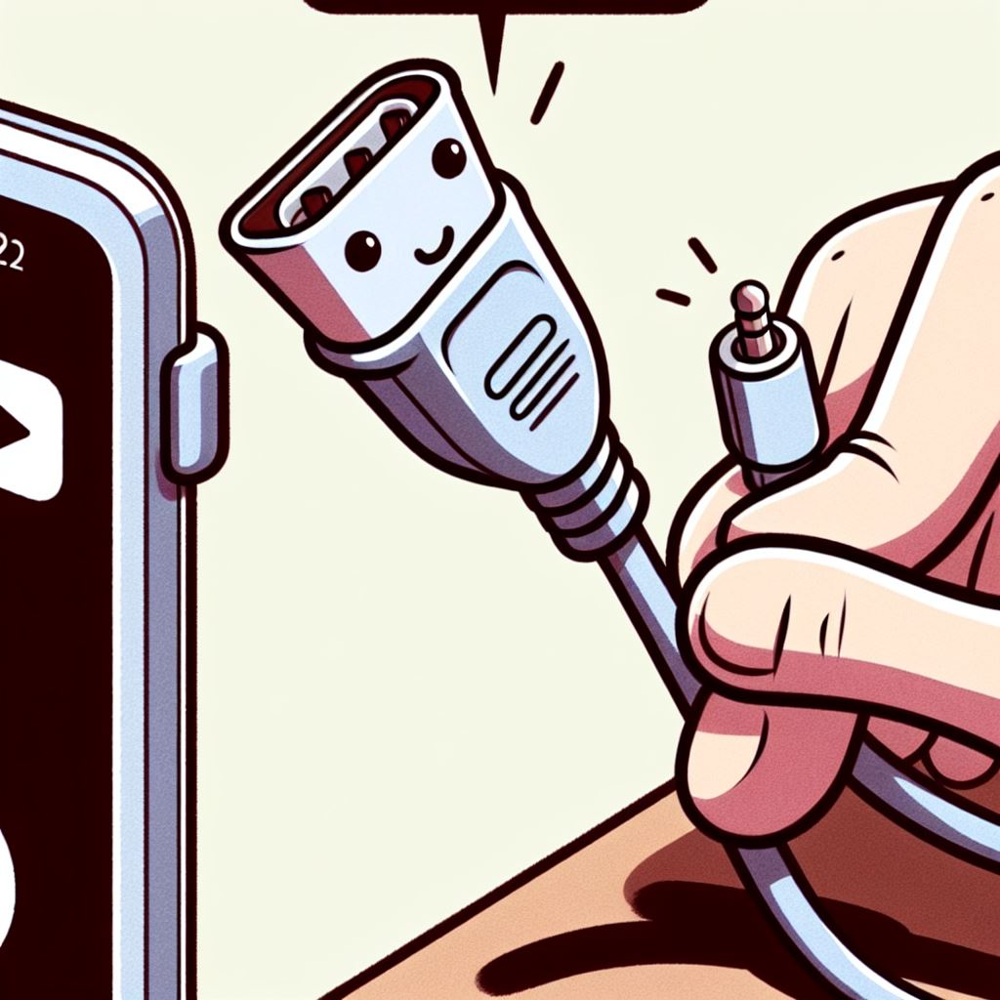

# Auxiliary Verbs

## What are Auxiliary Verbs?
Auxiliary verbs (also called **helping verbs**) combine with a main verb to show tense, voice, or emphasis.

---

## Examples
- Glenn **has carried** the pizza. (`has` = auxiliary, `carried` = main verb)

auxiliary verb "**has**" and the past participle "**carried**." The main verb is "carried," which shows the action being performed.

---

Aux verbs - assist the verb - helping verbs 

## Related Rules
- 
---

## See in Action
- Q7

## Tags
#find-the-verb #auxiliary #adverb #status/unfinished