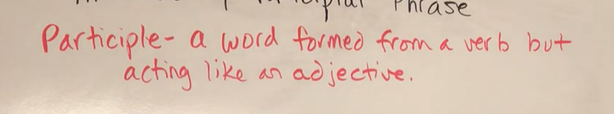
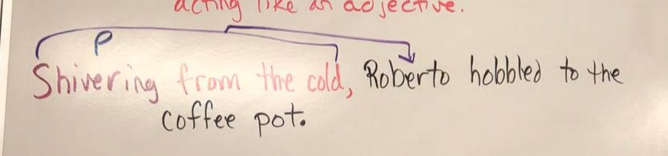

# Introductory Participle

An introductory participial phrase is a participial phrase that is positioned at the start of a sentence. 

It introduces and provides context for the main clause of the sentence, which will follow the introductory participial phrase (e.g., “Typing quickly, she misspelled her own name”)

First part introduces the second - and the second makes sense without the participle phrase. 

# Participle 
Is a word formed from a verb but acting like an adjective. 

# See it in action 
Q15 

note: You know it doesn’t function as a verb because it doesn’t follow a conjunction such as **while, after, before**, or a similar word.